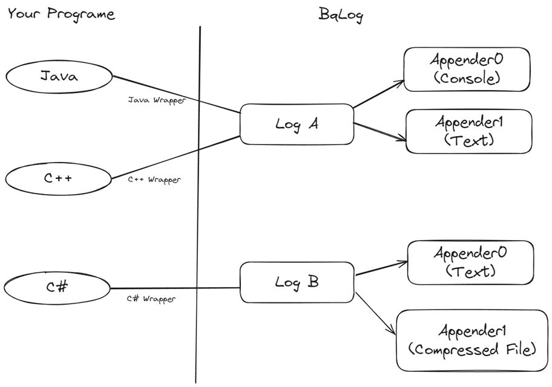
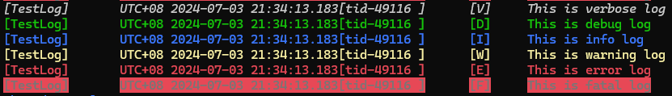
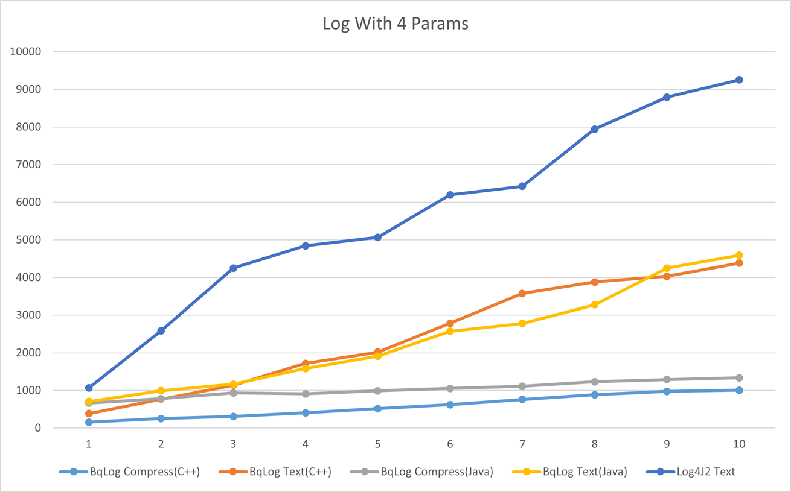
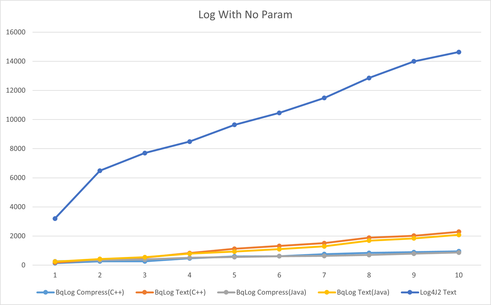

# BqLog(扁鹊日志)(V 1.4.3)  
[](https://github.com/Tencent/BqLog/blob/main/LICENSE.txt)
[](https://github.com/Tencent/BqLog/releases)  
> [中文文档](./README_CHS.md)  
> BqLog is a lightweight, high-performance logging system used in projects such as "Honor of Kings," and it has been successfully deployed and is running smoothly.

## Supported Platforms
- Windows 64 bit
- MacOS
- Linux
- iOS
- Android(X86_64, arm64-v8a、armeabi-v7a)
- Unix(Pass the test on FreeBSD)

## Supported Languages
 - C++
 - Java
 - Kotlin
 - C#

## Features
- Compared to existing open-source logging libraries, BqLog offers significant performance advantages (see [Benchmark](#5-benchmark-results)). It is not only suitable for servers and clients but also highly compatible with mobile devices.
- With low memory consumption, in the [Benchmark](#benchmark) case of 10 threads and 20,000,000 log entries, BqLog itself consumes less than 1 MB of memory.
- Provides a high-performance, high-compression real-time log format
- Can be used normally in game engines (`Unity`, `Unreal`), with [support for common types provided for Unreal](#6-using-bqlog-in-unreal).
- Supports `UTF-8`, `UTF-16`, `UTF-32` characters and strings, as well as common parameter types like bool, float, double, and various lengths and types of integers
- Supports `C++20` `format specifications`
- Asynchronous logging supports crash review to avoid data loss (inspired by XLog)
- Extremely small size, with the dynamic library being only about 200k after Android compilation
- Does not generate additional heap allocations in Java and C#, avoiding constant new object creation during runtime
- Only depends on the standard C language library and platform APIs, and can be compiled in Android's `ANDROID_STL = none` mode
- Supports `C++11` and later compilation standards, and can be compiled under strict requirements of -Wall -Wextra -pedantic -Werror
- Compilation module is based on `CMake` and provides compilation scripts for different platforms, making it easy to use
- Supports custom parameter types
- Very friendly to code suggestions


## Menu
**[Integrating BqLog into Your Project](#integrating-bqlog-into-your-project)**  
**[Simple Demo](#simple-demo)**  
**[Architecture Overview](#architecture-overview)**  
**[Main Process API Usage Instructions](#main-process-api-usage-instructions)**  
[&nbsp;&nbsp;&nbsp;&nbsp;1-Creating a Log Object](#1-creating-a-log-object)  
[&nbsp;&nbsp;&nbsp;&nbsp;2-Retrieving a Log Object](#2-retrieving-a-log-object)  
[&nbsp;&nbsp;&nbsp;&nbsp;3-Logging Messages](#3-logging-messages)  
[&nbsp;&nbsp;&nbsp;&nbsp;4-Other APIs](#4-other-apis)  
**[Synchronous and Asynchronous Logging](#synchronous-and-asynchronous-logging)**  
[&nbsp;&nbsp;&nbsp;&nbsp;1. Thread safety of asynchronous logging](#thread-safety-of-asynchronous-logging)  
**[Introduction to Appenders](#introduction-to-appenders)**  
[&nbsp;&nbsp;&nbsp;&nbsp;1. ConsoleAppender](#consoleappender)  
[&nbsp;&nbsp;&nbsp;&nbsp;2. TextFileAppender](#textfileappender)  
[&nbsp;&nbsp;&nbsp;&nbsp;3. CompressedFileAppender(Highly Recommended)](#compressedfileappender)  
[&nbsp;&nbsp;&nbsp;&nbsp;4. RawFileAppender](#rawfileappender)  
**[Configuration Instructions](#configuration-instructions)**  
[&nbsp;&nbsp;&nbsp;&nbsp;1. Complete Example](#1-complete-example)  
[&nbsp;&nbsp;&nbsp;&nbsp;2. Detailed Explanation](#2-detailed-explanation)  
**[Offline Decoding of Binary Format Appenders](#offline-decoding-of-binary-format-appenders)**  
**[Build Instructions](#build-instructions)**  
[&nbsp;&nbsp;&nbsp;&nbsp;1. Library Build](#1-library-build)  
[&nbsp;&nbsp;&nbsp;&nbsp;2. Demo Build and Run](#2-demo-build-and-run)  
[&nbsp;&nbsp;&nbsp;&nbsp;3. Automated Test Run Instructions](#3-automated-test-run-instructions)  
[&nbsp;&nbsp;&nbsp;&nbsp;4. Benchmark Run Instructions](#4-benchmark-run-instructions)  
**[Advanced Usage Topics](#advanced-usage-topics)**  
[&nbsp;&nbsp;&nbsp;&nbsp;1. No Heap Allocation](#1-no-heap-allocation)  
[&nbsp;&nbsp;&nbsp;&nbsp;2. Log Objects with Category Support](#2-log-objects-with-category-support)  
[&nbsp;&nbsp;&nbsp;&nbsp;3. Data Protection on Program Abnormal Exit](#3-data-protection-on-program-abnormal-exit)  
[&nbsp;&nbsp;&nbsp;&nbsp;4. About NDK and ANDROID_STL = none](#4-about-ndk-and-android_stlnone)  
[&nbsp;&nbsp;&nbsp;&nbsp;5. Custom Parameter Types](#5-custom-parameter-types)  
[&nbsp;&nbsp;&nbsp;&nbsp;6. Using BqLog in Unreal Engine](#6-using-bqlog-in-unreal)  
**[Benchmark](#benchmark)**  
[&nbsp;&nbsp;&nbsp;&nbsp;1. Benchmark Description](#1-benchmark-description)  
[&nbsp;&nbsp;&nbsp;&nbsp;2. BqLog C++ Benchmark Code](#2-bqlog-c-benchmark-code)  
[&nbsp;&nbsp;&nbsp;&nbsp;3. BqLog Java Benchmark Code](#3-bqlog-java-benchmark-code)  
[&nbsp;&nbsp;&nbsp;&nbsp;4. Log4j Benchmark Code](#4-log4j-benchmark-code)  
[&nbsp;&nbsp;&nbsp;&nbsp;5. Benchmark Results](#5-benchmark-results)  


## Integrating BqLog into Your Project
BqLog can be integrated into your project in various forms. For C++, it supports dynamic libraries, static libraries, and source files. For Java and C#, it supports dynamic libraries with wrapper source code. Below are the methods to include BqLog:

### C++ (Dynamic Library)
The code repository includes precompiled dynamic library files located in /dist/dynamic_lib/. To integrate BqLog into your project using the library files, you need to do the following:
- Select the dynamic library file corresponding to your platform and add it to your project's build system.
- Copy the /dist/dynamic_lib/include directory into your project and add it to the include directory list. (If you are using XCode's .framework library, you can skip this step as the .framework file already includes the header files).

### C++ (Static Library)
The code repository includes precompiled static library files located in /dist/static_lib/. To integrate BqLog into your project using the library files, you need to do the following:
- Select the static library file corresponding to your platform and add it to your project's build system.
- Copy the /dist/static_lib/include directory into your project and add it to the include directory list. (If you are using XCode's .framework library, you can skip this step as the .framework file already includes the header files).

### C++ (Source Code)
BqLog also supports direct inclusion of source code into your project for compilation. To integrate BqLog using the source code, follow these steps:
- Copy the /src directory into your project as a source code reference.
- Copy the /include directory into your project and add it to the include directory list.
- If compiling the Windows version in Visual Studio, add /Zc:__cplusplus to the compilation options to ensure the current C++ compiler standard support is correctly determined.
- If using the source code in Android's NDK, please refer to [4. About NDK and ANDROID_STL = none](#4-about-ndk-and-android_stlnone) for important considerations.

### C#
In C#, BqLog can be used via a native dynamic library and a C# Wrapper, supporting Mono, Microsoft CLR, and Unity engines. Unity is compatible with both Mono and IL2CPP modes. To use BqLog in C#, follow these steps:
- Select the dynamic library file corresponding to your platform from /dist/dynamic_lib/ and add it to your project (for Unity, refer to [ Unity Import and configure plug-ins](https://docs.unity3d.com/Manual/PluginInspector.html)). 
- Copy the source code files from /wrapper/csharp/src into your project.

### Java
In Java, BqLog can be used via a native dynamic library and a Java Wrapper, supporting common JVM environments and Android. To integrate BqLog into a JVM, follow these steps:
- Select the dynamic library file corresponding to your platform from /dist/dynamic_lib/ and add it to your project.
- Copy the source code files from /wrapper/java/src into your project.
- (Optional) Copy the /dist/dynamic_lib/include directory into your project and add it to the include directory list if you intend to call BqLog from the NDK.

<br><br>

## Simple Demo
The following code will output over 1000 logs to your console (or ADB Logcat if on Android)
### C++
```cpp
#if defined(WIN32)
#include <windows.h>
#endif
#include <string>
#include <bq_log/bq_log.h>
int main()
{
#if defined(WIN32)
    // Switch Windows command line to UTF-8 because BqLog outputs all final text in UTF-8 encoding to avoid display issues
    SetConsoleOutputCP(CP_UTF8);
    SetConsoleCP(CP_UTF8);
#endif
    // This string is the log configuration. Here it configures a logger with one appender (output target) named appender_0, which outputs to the console.
    std::string config = R"(
            # This appender's output target is the console
            appenders_config.appender_0.type=console           
            # This appender uses local time for timestamps
            appenders_config.appender_0.time_zone=default local time   
            # This appender outputs logs of these 6 levels (no spaces in between)
            appenders_config.appender_0.levels=[verbose,debug,info,warning,error,fatal] 
        )";
    bq::log log = bq::log::create_log("my_first_log", config);   // Create a log object using the config
    for(int i = 0; i < 1024; ++i)
    {
        log.info("This is an info test log, the format string is UTF-8, param int:{}, param bool :{}, param string8:{}, param string16:{}, param string32:{}, param float:{}", i, true, "utf8-string", u"utf16-string", U"utf32-string", 4.3464f);  
    }
    log.error(U"This is an error test log, the format string is UTF-32");  
    bq::log::force_flush_all_logs();   // BqLog defaults to asynchronous output. To ensure logs are visible before program exit, force flush to sync output once.
    return 0;
}
```

### C#
```csharp
using System.Text;
using System;

public class demo_main {

    public static void Main(string[] args) {
        Console.OutputEncoding = Encoding.UTF8;
        Console.InputEncoding = Encoding.UTF8;
        string config = @"
            # This appender's output target is the console
            appenders_config.appender_0.type=console           
            # This appender uses local time for timestamps
            ppenders_config.appender_0.time_zone=default local time   
            # This appender outputs logs of these 6 levels (no spaces in between)
            appenders_config.appender_0.levels=[verbose,debug,info,warning,error,fatal] 
        ";
        bq.log log = bq.log.create_log("my_first_log", config);   // Create a log object using the config
        for (int i = 0; i < 1024; ++i)
        {
            log.info("This is an info test log, the format string is UTF-16, param int:{}, param bool :{}, param string:{}, param float:{}", i, true, "String Text", 4.3464f);
        }


        bq.log.force_flush_all_logs();
        Console.ReadKey();
    }

}
```

### Java#
```java
public class demo_main {

    public static void main(String[] args) {
        // TODO Auto-generated method stub
        String config = """
            # This appender's output target is the console
            appenders_config.appender_0.type=console           
            # This appender uses local time for timestamps
            appenders_config.appender_0.time_zone=default local time   
            # This appender outputs logs of these 6 levels (no spaces in between)
            appenders_config.appender_0.levels=[verbose,debug,info,warning,error,fatal] 
        """;
        bq.log log = bq.log.create_log("my_first_log", config);   // Create a log object using the config
        for (int i = 0; i < 1024; ++i)
        {
            log.info("This is an info test log, the format string is UTF-16, param int:{}, param bool :{}, param string:{}, param float:{}", i, true, "String Text", 4.3464f);
        }
        bq.log.force_flush_all_logs();
    }
}

```

<br><br>


## Architecture Overview

  
  

The diagram above clearly illustrates the basic structure of BqLog. On the right side of the diagram is the internal implementation of the BqLog library, while on the left side is your program and code. Your program can call BqLog using the provided wrappers (object-oriented APIs for different languages).
In the diagram, two Logs are created: one named "Log A" and the other named "Log B." Each Log is attached to one or more Appenders. An Appender can be understood as the output target of the log content. This can be the console (ADB Logcat logs for Android), text files, or even specialized formats like compressed log files or regular binary log format files.

**Within the same process, wrappers for different languages can access the same Log object. For example, if a Log object named Log A is created in Java, it can also be accessed and used from the C++ side by the name Log A.**  
In extreme cases, such as a Unity-developed game running on the Android system, you might involve Java, Kotlin, C#, and C++ languages within the same app. They can all share the same Log object. You can create the Log on the Java side using create_log, and then access it in other languages using get_log_by_name.


<br><br>

## Main Process API Usage Instructions

**Note: The following APIs are declared in the bq::log (or bq.log) class. To save space, only the C++ APIs are listed. The APIs in Java and C# are identical and will not be repeated here.**  
**In C++, `bq::string` is the UTF-8 string type in the BqLog library. You can also pass in c-style strings like char or `std::string` or `std::string_view`, which will be automatically and implicitly converted.**

### 1. Creating a Log Object
A log object can be created using the create_log static function. Its declaration is as follows:

```cpp
//C++ API
    /// <summary>
    /// Create a log object
    /// </summary>
    /// <param name="log_name">If the log name is an empty string, bqLog will automatically assign you a unique log name. If the log name already exists, it will return the previously existing log object and overwrite the previous configuration with the new config.</param>
    /// <param name="config_content">Log config string</param>
    /// <returns>A log object, if create failed, the is_valid() method of it will return false</returns>
    static log create_log(const bq::string& log_name, const bq::string& config_content);
```

The code creates a log object by passing in the name of the log object and a configuration string. The log configuration can be referenced in the [Configuration Instructions](#configuration-instructions).
Here are a few key points to note:
1. Regardless of whether it is C# or Java, the returned log object will never be null. However, due to configuration errors or other reasons, an invalid log object might be created. Therefore, you should use the is_valid() function to check the returned object. Performing operations on an invalid object may cause the program to crash.
2. If an empty string is passed as the log name, bqLog will automatically generate a unique log name, such as "AutoBqLog_1."
3. Calling create_log on an already existing log object with the same name will not create a new log object but will overwrite the previous configuration with the new one. However, some parameters cannot be modified in this process; see [Configuration Instructions](#configuration-instructions) for details.
4. Except when using in the NDK (refer to [4. About NDK and ANDROID_STL = none](#4-about-ndk-and-android_stlnone)), you can initialize the log object directly in global or static variables using this API in other situations.


### 2. Retrieving a Log Object
If a log object has already been created elsewhere, you can obtain the created log object directly using the get_log_by_name function.
```cpp
//C++ API
    /// <summary>
    /// Get a log object by it's name
    /// </summary>
    /// <param name="log_name">Name of the log object you want to find</param>
    /// <returns>A log object, if the log object with specific name was not found, the is_valid() method of it will return false</returns>
    static log get_log_by_name(const bq::string& log_name);
```
You can also use this function to initialize a log object in global variables or static functions. However, note that you must ensure the log object with the specified name already exists. Otherwise, the returned log object will be unusable, and its is_valid() method will return false.


### 3. Logging Messages
```cpp
    ///Core log functions, there are 6 log levels:
    ///verbose, debug, info, warning, error, fatal
    template<typename STR>
    bq::enable_if_t<is_bq_log_str<STR>::value, bool> verbose(const STR& log_content) const;
    template<typename STR, typename...Args>
    bq::enable_if_t<is_bq_log_str<STR>::value, bool> verbose(const STR& log_format_content, const Args&... args) const;
    template<typename STR>
    bq::enable_if_t<is_bq_log_str<STR>::value, bool> debug(const STR& log_content) const;
    template<typename STR, typename...Args>
    bq::enable_if_t<is_bq_log_str<STR>::value, bool> debug(const STR& log_format_content, const Args&... args) const;
    template<typename STR>
    bq::enable_if_t<is_bq_log_str<STR>::value, bool> info(const STR& log_content) const;
    template<typename STR, typename...Args>
    bq::enable_if_t<is_bq_log_str<STR>::value, bool> info(const STR& log_format_content, const Args&... args) const;
    template<typename STR>
    bq::enable_if_t<is_bq_log_str<STR>::value, bool> warning(const STR& log_content) const;
    template<typename STR, typename...Args>
    bq::enable_if_t<is_bq_log_str<STR>::value, bool> warning(const STR& log_format_content, const Args&... args) const;
    template<typename STR>
    bq::enable_if_t<is_bq_log_str<STR>::value, bool> error(const STR& log_content) const;
    template<typename STR, typename...Args>
    bq::enable_if_t<is_bq_log_str<STR>::value, bool> error(const STR& log_format_content, const Args&... args) const;
    template<typename STR>
    bq::enable_if_t<is_bq_log_str<STR>::value, bool> fatal(const STR& log_content) const;
    template<typename STR, typename...Args>
    bq::enable_if_t<is_bq_log_str<STR>::value, bool> fatal(const STR& log_format_content, const Args&... args) const;
```
When logging messages, pay attention to three key points:
#### 1. Log Levels  
As you can see, our logs are divided into six levels: verbose, debug, info, warning, error, and fatal, consistent with Android. Their importance increases sequentially. When output to the console, they will appear in different colors.
  
#### 2. Format String (STR Parameter)
The STR parameter is similar to the first parameter of printf and can be various common string types, including:
- Java's java.lang.String
- C#'s string
- Various encodings of C++'s C-style strings and `std::string` (`char*`, `char16_t*`, `char32_t*`, `wchar_t*`, `std::string`, `std::u8string`, `std::u16string`, `std::u32string`, `std::wstring`, `std::string_view`, `std::u16string_view`, `std::u32string_view`, `std::wstring_view` and even custom string types, which you can refer to in[Custom Parameter Types](#5-custom-parameter-types) )

#### 3. format parameters 
You can add various parameters after the STR parameter. These parameters will be formatted into the specified places in the STR, following rules similar to C++20's std::format (except for the lack of support for positional arguments). For example, using a single {} represents a default formatting of a parameter, and {:.2f} specifies the precision for formatting a floating-point number.
**Try to use formatted parameters to output logs rather than concatenating strings manually. This approach is optimal for performance and compressed format storage.**  
Currently supported parameter types include:
- Null pointers (output as null)
- Pointers (output as a hexadecimal address starting with 0x)
- bool
- Single-byte characters (char)
- Double-byte characters (char16_t, wchar_t, C#'s char, Java's char)
- Four-byte characters (char32_t or wchar_t)
- 8-bit integers
- 8-bit unsigned integers
- 16-bit integers
- 16-bit unsigned integers
- 32-bit integers
- 32-bit unsigned integers
- 64-bit integers
- 64-bit unsigned integers
- 32-bit floating-point numbers
- 64-bit floating-point numbers
- Other unknown POD types in C++ (limited to sizes 1, 2, 4, or 8 bytes, treated as int8, int16, int32, and int64 respectively)
- Strings, including all string types mentioned in [STR Parameter](#2-format-string-str-parameter)
- Any class or object in C# and Java (outputting their ToString() string)
- Custom parameter types, as detailed in Custom Parameter Types

### 4. Other APIs  
There are additional commonly used APIs that can accomplish specific tasks. For detailed API descriptions, refer to bq_log/bq_log.h, as well as the bq.log class in Java and C#. Here are some key APIs that need to be highlighted:  

#### Uninitialize BqLog
```cpp
    /// <summary>
    /// Uninitialize BqLog, please invoke this function before your program exist.
    /// </summary>
    static void uninit();
```
It is recommended to execute `uninit()` before exiting the program or uninstalling the self-implemented dynamic library that uses BqLog, otherwise the program may get stuck when exiting under certain specific circumstances.

#### Crash Protection
```cpp
    /// <summary>
    /// If bqLog is asynchronous, a crash in the program may cause the logs in the buffer not to be persisted to disk. 
    /// If this feature is enabled, bqLog will attempt to perform a forced flush of the logs in the buffer in the event of a crash. However, 
    /// this functionality does not guarantee success, and only support POSIX systems.
    /// </summary>
    static void enable_auto_crash_handle();
```
For a detailed introduction, see[Data Protection on Program Abnormal Exit](#3-data-protection-on-program-abnormal-exit)  
  
#### Force Flush Asynchronous Buffer Synchronously
```cpp
    /// <summary>
    /// Synchronously flush the buffer of all log objects
    /// to ensure that all data in the buffer is processed after the call.
    /// </summary>
    static void force_flush_all_logs();
    /// <summary>
    /// Synchronously flush the buffer of this log object
    /// to ensure that all data in the buffer is processed after the call.
    /// </summary>
    void force_flush();
```
Since bqLog uses asynchronous logging by default, there are times when you might want to immediately synchronize and output all logs. In such cases, you need to forcefully call force_flush().
  
#### Intercepting Console Output
```cpp
    /// <summary>
    /// Register a callback that will be invoked whenever a console log message is output. 
    /// This can be used for an external system to monitor console log output.
    /// </summary>
    /// <param name="callback"></param>
    static void register_console_callback(bq::type_func_ptr_console_callback callback);

    /// <summary>
    /// Unregister a console callback.
    /// </summary>
    /// <param name="callback"></param>
    static void unregister_console_callback(bq::type_func_ptr_console_callback callback);
```
The output of[ConsoleAppender](#consoleappender) goes to the console or ADB Logcat logs on Android, but this may not cover all situations. For instance, in custom game engines or custom IDEs, a mechanism is provided to call a callback function for each console log output. This allows you to reprocess and output the console log anywhere in your program.  
**Additional Caution:** Do not output any synchronized BQ logs within the console callback as it may easily lead to deadlocks.  


#### Actively Fetching Console Output
```cpp
    /// <summary>
    /// Enable or disable the console appender buffer.
    /// Since our wrapper may run in both C# and Java virtual machines, and we do not want to directly invoke callbacks from a native thread,
    /// we can enable this option. This way, all console outputs will be saved in the buffer until we fetch them.
    /// </summary>
    /// <param name="enable"></param>
    /// <returns></returns>
    static void set_console_buffer_enable(bool enable);

    /// <summary>
    /// Fetch and remove a log entry from the console appender buffer in a thread-safe manner.
    /// If the console appender buffer is not empty, the on_console_callback function will be invoked for this log entry.
    /// Please ensure not to output synchronized BQ logs within the callback function.
    /// </summary>
    /// <param name="on_console_callback">A callback function to be invoked for the fetched log entry if the console appender buffer is not empty</param>
    /// <returns>True if the console appender buffer is not empty and a log entry is fetched; otherwise False is returned.</returns>
    static bool fetch_and_remove_console_buffer(bq::type_func_ptr_console_callback on_console_callback);
```
In addition to intercepting console output through a console callback, you can actively fetch console log outputs. Sometimes, we may not want the console log output to come through a callback because you do not know which thread the callback will come from (for example, in some C# virtual machines, or JVMs, the VM might be performing garbage collection when the console callback is called, which could potentially lead to hangs or crashes).

The method used here involves enabling the console buffer through `set_console_buffer_enable`. This causes every console log output to be stored in memory until we actively call `fetch_and_remove_console_buffer` to retrieve it. Therefore, if you choose to use this method, remember to promptly fetch and clear logs to avoid unreleased memory.  
**Additional Caution:** Do not output any synchronized BQ logs within the console callback as it may easily lead to deadlocks.  
**Additional Caution:** If you are using this code in an IL2CPP environment, please make sure that the on_console_callback is marked as static unsafe and is decorated with the [MonoPInvokeCallback(typeof(type_console_callback))] attribute.  


  
#### Modifying Log Configuration
```cpp
    /// <summary>
    /// Modify the log configuration, but some fields, such as buffer_size, cannot be modified.
    /// </summary>
    /// <param name="config_content"></param>
    /// <returns></returns>
    bool reset_config(const bq::string& config_content);
```
Sometimes you may want to modify the configuration of a log within your program. In addition to recreating the log object to overwrite the configuration(See[Creating a Log Object](#1-creating-a-log-object))，you can also use the reset interface. However, note that not all configuration items can be modified this way. For details, refer to the [Configuration Instructions](#configuration-instructions)
  
#### Temporarily Disabling and Enabling Certain Appenders
```cpp
    /// <summary>
    /// Temporarily disable or enable a specific Appender.
    /// </summary>
    /// <param name="appender_name"></param>
    /// <param name="enable"></param>
    void set_appenders_enable(const bq::string& appender_name, bool enable);
```
By default, the Appenders in the configuration are active, but a mechanism is provided here to temporarily disable and re-enable them. 
  
#### Snapshot Output
```cpp
    /// <summary>
    /// Enable snapshot capability. Once enabled, the log object will continuously retain a copy of the buffer data, 
    /// containing the latest buffer data. This is used for generating a log snapshot string with the take_snapshot() function.
    /// </summary>
    /// <param name="snapshot_buffer_size">size of snapshot buffer</param>
    void enable_snapshot(uint32_t snapshot_buffer_size) const;

    /// <summary>
    /// Works only when enable_snapshot(true) is called.
    /// It will decode the snapshot buffer to text.
    /// </summary>
    /// <param name="use_gmt_time">whether the timestamp of each log is GMT time or local time</param>
    /// <returns>the decoded snapshot buffer</returns>
    bq::string take_snapshot(bool use_gmt_time) const;
```
Sometimes, certain special features require outputting the last part of the logs, which can be done using the snapshot feature.
To enable this feature, you need to call the enable_snapshot() method on the log object and set the maximum buffer size in bytes.
When a snapshot is needed, calling take_snapshot() will return the formatted string containing the most recent log entries stored in the snapshot buffer. In C++, the type is `bq::string`, which can be implicitly converted to `std::string`.

#### Decoding Binary Log Files
```cpp
namespace bq{
    namespace tools {
        //This is a utility class for decoding binary log formats. 
        //To use it, first create a log_decoder object, 
        //then call its decode function to decode. 
        //After each successful call, 
        //you can use get_last_decoded_log_entry() to retrieve the decoded result. 
        //Each call decodes one log entry.
        struct log_decoder
        {
        private:
            bq::string decode_text_;
            bq::appender_decode_result result_ = bq::appender_decode_result::success;
            uint32_t handle_ = 0;
        public:
            /// <summary>
            /// Create a log_decoder object, with each log_decoder object corresponding to a binary log file.
            /// </summary>
            /// <param name="log_file_path">the path of a binary log file, is can be relative path or absolute path</param>
            log_decoder(const bq::string& log_file_path);
            ~log_decoder();
            /// <summary>
            /// Decode a log entry. each call of this function will decode only 1 log entry
            /// </summary>
            /// <returns>decode result, appender_decode_result::eof means the whole log file was decoded</returns>
            bq::appender_decode_result decode();
            /// <summary>
            /// get the last decode result
            /// </summary>
            /// <returns></returns>
            bq::appender_decode_result get_last_decode_result() const;
            /// <summary>
            /// get the last decode log entry content
            /// </summary>
            /// <returns></returns>
            const bq::string& get_last_decoded_log_entry() const;
        };
    }
}
```
This is a utility class that can decode log files output by binary-type Appenders at runtime, such as [CompressedFileAppender](#compressedfileappender) and [RawFileAppender](#rawfileappender)。  
To use it, first create a log_decoder object. Then, each time you call the decode() function, it decodes one log entry in sequence. If the result returned is bq::appender_decode_result::success, you can call get_last_decoded_log_entry() to get the formatted text content of the last decoded log entry.
If the result is bq::appender_decode_result::eof, it means all logs have been read completely.
  
<br><br>

## Synchronous and Asynchronous Logging

BqLog allows you to configure whether a log object is synchronous or asynchronous through the [thread_mode](#logthread_mode) setting. The key differences between these two modes are as follows:

|                 | Synchronous Logging                                                | Asynchronous Logging                                              |
|-----------------|--------------------------------------------------------------------|-------------------------------------------------------------------|
|     Behavior    | After calling the logging function, the log is immediately written to the corresponding appender. | After calling the logging function, the log is not immediately written; instead, it is handed off to a worker thread for periodic processing. |
|     Performance | Low, as the thread writing the log needs to block and wait for the log to be written to the corresponding appender before returning from the logging function. | High, as the thread writing the log does not need to wait for the actual output and can return immediately after logging. |
| Thread Safety   | High, but it requires that the log parameters are not modified during the execution of the logging function. | High, but it requires that the log parameters are not modified during the execution of the logging function. |

### Thread Safety of Asynchronous Logging

A common misconception about asynchronous logging is that it is less thread-safe, with users concerned that the parameters may be reclaimed by the time the worker thread processes the log. For example:

```cpp
{
    const char str_array[5] = {'T', 'E', 'S', 'T', '\0'};
    const char* str_ptr = str_array;
    log_obj.info("This is test param: {}, {}", str_array, str_ptr);
}
```

In the above example, `str_array` is stored on the stack, and once the scope is exited, its memory is no longer valid. Users might worry that if asynchronous logging is used, by the time the worker thread processes the log, `str_array` and `str_ptr` will be invalid variables.

However, such a situation will not occur because BqLog copies all parameter contents into its internal `ring_buffer` during the execution of the `info` function. Once the `info` function returns, the external variables like `str_array` or `str_ptr` are no longer needed. Moreover, the `ring_buffer` will not store a `const char*` pointer address but will always store the entire string.

The real potential issue arises in the following scenario:

```cpp
static std::string global_str = "hello world";   // This is a global variable modified by multiple threads.

void thread_a()
{
    log_obj.info("This is test param: {}", global_str);
}
```

If the content of `global_str` changes during the execution of the `info` function, it may lead to undefined behavior. BqLog will do its best to prevent a crash, but the correctness of the final output cannot be guaranteed.

<br><br>

## Introduction to Appenders
An Appender represents the log output target. The concept of Appenders in bqLog is basically the same as in Log4j. Currently, bqLog provides the following types of Appenders:
### ConsoleAppender
The output target of this Appender is the console, including Android's ADB and the corresponding console on iOS. The text encoding is UTF-8.
### TextFileAppender
This Appender outputs log files directly in UTF-8 text format.
### CompressedFileAppender
This Appender outputs log files in a compressed format, which is the `highly recommended format by bqLog`. It has the highest performance among all Appenders and produces the smallest output file. However, the final file needs to be decoded. Decoding can be done at [runtime decoding](#decoding-binary-log-files)，or [offline decoding](#offline-decoding-of-binary-format-appenders)。
### RawFileAppender
This Appender outputs the binary log content from memory directly to a file. Its performance is higher than that of TextFileAppender, but it consumes more storage space. The final file needs to be decoded. Decoding can be done at [runtime decoding](#decoding-binary-log-files)，or [offline decoding](#offline-decoding-of-binary-format-appenders)。This Appender is not recommended for use.
  
Below is a comprehensive comparison of the various Appenders:

| Name                    | Output Target | Directly Readable | Output Performance | Output Size |
|-------------------------|---------------|-------------------|--------------------|-------------|
| ConsoleAppender         | Console       | ✔                 | Low                | -           |
| TextFileAppender        | File          | ✔                 | Low                | Large       |
| CompressedFileAppender  | File          | ✘                 | High               | Small       |
| RawFileAppender         | File          | ✘                 | Medium             | Large       |


<br><br>

## Configuration Instructions

Configuration refers to the config string in the create_log and reset_config functions. This string uses the properties file format and supports # comments (but remember to start a new line with # for comments).

### 1. Complete Example
Below is a complete example:
```ini
# This configuration sets up a log object with a total of 5 Appenders, including two TextFileAppenders that output to two different files.

# The first Appender is named appender_0 and its type is ConsoleAppender
appenders_config.appender_0.type=console
# The time zone for appender_0 is the system's local time
appenders_config.appender_0.time_zone=default local time
# appender_0 will output all 6 levels of logs (note: there should be no spaces between log levels, or it will fail to parse)
appenders_config.appender_0.levels=[verbose,debug,info,warning,error,fatal]

# The second Appender is named appender_1 and its type is TextFileAppender
appenders_config.appender_1.type=text_file
# The time zone for appender_1 is GMT, which is UTC+0
appenders_config.appender_1.time_zone=gmt
# appender_1 only outputs logs of level info and above, others will be ignored
appenders_config.appender_1.levels=[info,warning,error,fatal]
# The path for appender_1 will be in the relative bqLog directory of the program, with filenames starting with normal, followed by the date and .log extension
# On iOS, it will be saved in /var/mobile/Containers/Data/Application/[APP]/Library/Caches/bqLog
# On Android, it will be saved in [android.content.Context.getExternalFilesDir()]/bqLog
appenders_config.appender_1.file_name=bqLog/normal
# The maximum file size is 10,000,000 bytes; if exceeded, a new file will be created
appenders_config.appender_1.max_file_size=10000000
# Files older than ten days will be cleaned up
appenders_config.appender_1.expire_time_days=10
# If the total size of output exceeds 100,000,000 bytes, files will be cleaned up starting from the oldest
appenders_config.appender_1.capacity_limit=100000000

# The third Appender is named appender_2 and its type is TextFileAppender
appenders_config.appender_2.type=text_file
# appender_2 will output all levels of logs
appenders_config.appender_2.levels=[all]
# The path for appender_2 will be in the relative bqLog directory of the program, with filenames starting with new_normal, followed by the date and .log extension
appenders_config.appender_2.file_name=bqLog/new_normal
# This option is only effective on Android, saving logs in the internal storage directory, which is [android.content.Context.getFilesDir()]/bqLog
appenders_config.appender_2.is_in_sandbox=true

# The fourth Appender is named appender_3 and its type is CompressedFileAppender
appenders_config.appender_3.type=compressed_file
# appender_3 will output all levels of logs
appenders_config.appender_3.levels=[all]
# The path for appender_3 will be in the absolute path ~/bqLog directory of the program, with filenames starting with compress_log, followed by the date and .logcompr extension
appenders_config.appender_3.file_name=~/bqLog/compress_log

# The fifth Appender is named appender_4 and its type is RawFileAppender
appenders_config.appender_4.type=raw_file
# appender_4 is disabled by default and can be enabled later using set_appenders_enable
appenders_config.appender_4.enable=false
# appender_4 will output all levels of logs
appenders_config.appender_4.levels=[all]
# The path for appender_4 will be in the relative bqLog directory of the program, with filenames starting with raw_log, followed by the date and .lograw extension
appenders_config.appender_4.file_name=bqLog/raw_log
# Logs will only be processed if their category starts with ModuleA, ModuleB.SystemC, otherwise all will be ignored (the concept of Category is explained in detail in the advanced usage topics later)
appenders_config.appender_4.categories_mask=[ModuleA,ModuleB.SystemC]

# The total asynchronous buffer size is 65535 bytes; the specific meaning is explained later
log.buffer_size=65535
# The reliability level of the log is normal; the specific meaning is explained later
log.reliable_level=normal
# Logs will only be processed if their category matches the following three wildcards, otherwise all will be ignored (the concept of Category is explained in detail in the advanced usage topics later)
log.categories_mask=[*default,ModuleA,ModuleB.SystemC]
# This is an asynchronous log; asynchronous logs are the highest performing and recommended log type
log.thread_mode=async
# If the log level is error or fatal, include call stack information with each log entry
log.print_stack_levels=[error,fatal]
```


### 2. Detailed Explanation

### appenders_config
The `appenders_config` is a set of configurations for Appenders. The first parameter following `appenders_config` is the name of the Appender, and all Appenders with the same name share the same configuration.

| Name               | Required | Configurable Values                                          | Default       | Applicable to ConsoleAppender | Applicable to TextFileAppender | Applicable to CompressedFileAppender | Applicable to RawFileAppender |
|--------------------|----------|-------------------------------------------------------------|---------------|------------------------------|-------------------------------|-------------------------------------|------------------------------|
| type               | ✔        | console, text_file, compressed_file, raw_file               |               | ✔                            | ✔                             | ✔                                   | ✔                            |
| enable             | ✘        | Whether the Appender is enabled by default                  | true          | ✔                            | ✔                             | ✔                                   | ✔                            |
| levels             | ✔        | Array of log levels                                         |               | ✔                            | ✔                             | ✔                                   | ✔                            |
| time_zone          | ✘        | gmt or any other string                                     | Local time    | ✔                            | ✔                             | ✔                                   | ✔                            |
| file_name          | ✔        | Relative or absolute path                                   |               | ✘                            | ✔                             | ✔                                   | ✔                            |
| is_in_sandbox      | ✘        | true, false                                                 | false         | ✘                            | ✔                             | ✔                                   | ✔                            |
| max_file_size      | ✘        | Positive integer or 0                                       | 0             | ✘                            | ✔                             | ✔                                   | ✔                            |
| expire_time_days   | ✘        | Positive integer or 0                                       | 0             | ✘                            | ✔                             | ✔                                   | ✔                            |
| capacity_limit     | ✘        | Positive integer or 0                                       | 0             | ✘                            | ✔                             | ✔                                   | ✔                            |
| categories_mask    | ✘        | Array of strings enclosed in []                             | Empty         | ✔                            | ✔                             | ✔                                   | ✔                            |

#### appenders_config.xxx.type
Specifies the type of the Appender.
- `console`: Represents [ConsoleAppender](#consoleappender)
- `text_file`: Represents [TextFileAppender](#textfileappender)
- `compressed_file`: Represents [CompressedFileAppender](#compressedfileappender)
- `raw_file`: Represents [RawFileAppender](#rawfileappender)

#### appenders_config.xxx.enable
Defaults to `true`. If set to `false`, the Appender will be disabled by default and can be enabled later using `set_appenders_enable`.

#### appenders_config.xxx.levels
An array enclosed in `[]`, containing any combination of `verbose`, `debug`, `info`, `warning`, `error`, `fatal`, or `[all]` to accept all levels. **Note: Do not include spaces between levels, or it will fail to parse.**

#### appenders_config.xxx.time_zone
Specifies the time zone of the logs. `gmt` represents Greenwich Mean Time (UTC+0), and any other string or leaving it empty will use the local time zone. The time zone affects two things:
- The timestamp of formatted text logs (applicable to ConsoleAppender and TextFileAppender)
- A new log file will be created when midnight is crossed in the specified time zone (applicable to TextFileAppender, CompressedFileAppender, and RawFileAppender).

#### appenders_config.xxx.file_name
The path and filename prefix for saving files. The path can be absolute (not recommended for Android and iOS) or relative. The final output filename will be this path and name, followed by the date, file number, and the Appender's extension.

#### appenders_config.xxx.is_in_sandbox
Only meaningful on Android:
- `true`: Files are stored in the Internal Storage directory (android.content.Context.getFilesDir()). If not available, they are stored in the External Storage directory (android.content.Context.getExternalFilesDir()). If that is also not available, they are stored in the Cache directory (android.content.Context.getCacheDir()).
- `false`: Files are stored in the External Storage directory by default. If not available, they are stored in the Internal Storage directory. If that is also not available, they are stored in the Cache directory.

#### appenders_config.xxx.max_file_size
The maximum file size in bytes. When the saved file exceeds this size, a new log file is created, with file numbers incrementing sequentially. `0` disables this feature.

#### appenders_config.xxx.expire_time_days
The maximum number of days to keep files. Files older than this will be automatically deleted. `0` disables this feature.

#### appenders_config.xxx.capacity_limit
The maximum total size of files output by this Appender in the output directory. If this limit is exceeded, files are deleted starting from the oldest until the total size is within the limit. `0` disables this feature.

#### appenders_config.xxx.categories_mask
If the log object is a [Log object that supports categories](#2-log-objects-with-category-support), this can be used to filter a tree-like list of categories. When the array is not empty, this feature is active. For example, `[*default,ModuleA,ModuleB.SystemC]` means that logs with the default category (logs without a category parameter) and logs under the categories ModuleA and ModuleB.SystemC will be processed by this Appender. Other categories will be ignored. The effective range of an Appender's categories_mask is the intersection of the Appender's categories_mask and the global [log.categories_mask](#logcategories_mask) on the log object. If your log is in asynchronous mode (see [log.thread_mode](#logthread_mode)), this option will have a slight delay in effect.

### log
Log configuration applies to the entire log object. The following configurations are available:

| Name              | Required | Configurable Values               | Default  | Can be modified in reset_config |
|-------------------|----------|-----------------------------------|----------|---------------------------------|
| thread_mode       | ✘        | sync, async, independent          | async    | ✘                               |
| buffer_size       | ✘        | 32-bit positive integer           | 65536    | ✘                               |
| reliable_level    | ✘        | low, normal, high                 | normal   | ✔                               |
| categories_mask   | ✘        | Array of strings enclosed in []   | Empty    | ✔                               |
| print_stack_levels| ✘        | Array of log levels               | Empty    | ✔                               |

#### log.thread_mode
The threading mode of the log. When writing logs, the log data is first written to a log buffer. This setting specifies which thread processes the buffered data.
- `sync`: Data is processed synchronously in the current logging thread. When you call a logging function like `info`, the log data is processed when the function returns.
- `async` (default): The logging thread returns immediately, and the buffered log data is processed by a worker thread. The entire process has only one worker thread responsible for handling all asynchronous logs.
- `independent`: The logging thread returns immediately, and a dedicated thread processes the log data for this log object. This option can be used to offload the worker thread's burden when there are many log objects with large log volumes.

#### log.buffer_size
The size of the log buffer in bytes.

#### log.reliable_level
Mainly for asynchronous log mode. Can be set to:
- `low`: If the log buffer is full, log data in asynchronous mode is discarded immediately to avoid blocking the program.
- `normal`: If the log buffer is full, the logging thread waits until there is enough space to write the log data before returning. (The worker thread periodically processes the buffer. If the buffer fills up quickly, the worker thread reduces its sleep time to process logs faster, so there is no need to worry about excessive waiting).
- `high`: In addition to the `normal` mode, it also has the ability to recover unprocessed log data on program restart after an abnormal exit (crash, power outage, process kill, etc.). This feature is based on mmap-like capabilities and is supported on Windows, Linux, Android, macOS, iOS, etc. However, it can cause performance degradation under high concurrency and high load conditions.

#### log.categories_mask
The logic is the same as the [appenders_config.xxx.categories_mask](#appenders_configxxxcategories_mask) on the Appender, but it applies to the entire log object. If your log is in asynchronous mode (see [log.thread_mode](#logthread_mode)), this option will have a slight delay in effect.

#### log.print_stack_levels
The configuration method is the same as in [appenders_config.levels](#appenders_configxxxlevels). For each log entry that matches the level, the call stack information will be appended. However, please note that this feature should ideally only be used in a Debug environment. In a production environment, enable it only for error and fatal logs because it will significantly degrade performance and cause garbage collection (GC) in Java and C#. Currently, stack information is clearly and friendly displayed on `Java`, `C#`, and `Win64`. On other platforms, it is relatively difficult to read, providing only address information without symbol tables.
<br><br>

## Offline Decoding of Binary Format Appenders
Outside of program execution, bqLog also provides precompiled binary file decoding command-line tools. The directory paths are as follows:

| Platform | Path              | Executable Name                 |
|----------|-------------------|---------------------------------|
| mac      | /bin/tools/mac    | BqLog_LogDecoder                |
| windows  | /bin/tools/win64  | BqLog_LogDecoder.exe            |
| linux    | /bin/tools/linux  | BqLog_LogDecoder                |
| unix     | /build/tools      | Need to manually build binaries |

Usage:
```bash
./BqLog_LogDecoder <file_to_decode> [output_file]
```
If the output file path is not provided, the decoded text will be printed directly in the current command-line window.  （**standard output stream**)
**Note: Binary files from different versions of bqLog may not be compatible.**

<br><br>

## Build Instructions
For users who need to make modifications and compile:

All build scripts for BqLog are located in the /build directory and are categorized as follows:
```
/build  
├── demo    // Demo builds  
├── lib     // Native static and dynamic library builds  
├── test    // Test project builds  
├── tools   // Tools project builds  
└── wrapper // Wrappers projects for Java and C#  
```

### 1. Library Build
The scripts for building libraries on different platforms are located here. Before running them, set the following environment variables (depending on your build environment, these may be necessary):
- `ANDROID_NDK_ROOT`: Path to the Android NDK, required for building Android libraries.
- `VS_PATH`: Path to Visual Studio, which must include the "devenv.com" executable (needed for Windows libraries).
- `JAVA_HOME`: Path to the JDK, required for almost all platforms (if you do not need the Java Wrapper, you can remove the -DJAVA_SUPPORT=ON configuration from the relevant scripts).

### 2. Demo Build and Run
For C# and Java demos, you need to place the relevant platform's dynamic libraries in a path that the program can load.

### 3. Automated Test Run Instructions
The test cases have scripts for generating the project and corresponding scripts for direct generation and execution.

### 4. Benchmark Run Instructions
Benchmark has scripts for generating the project and corresponding scripts for direct generation and execution.

<br><br>

## Advanced Usage Topics

### 1. No Heap Allocation

In runtime environments like Java and C#, typical logging libraries may generate small heap allocations with each log entry, eventually leading to garbage collection (GC) and performance degradation. BqLog minimizes this issue in both C# and Java. Heap allocations generally come from two sources:
- **Internal object creation within functions**  
  Typical functions may create objects and process strings, but such operations are absent in BqLog.
- **Boxing and unboxing operations**  
  These operations occur when passing primitive type parameters (like int, float) for log formatting. In BqLog's C# Wrapper, there are no boxing and unboxing operations if the number of parameters is 12 or fewer; only when exceeding this number will such operations occur. In BqLog's Java Wrapper, there is no 12-parameter limit, but you need to use specific code to avoid boxing and unboxing, for example:
  ```java
  // Java
  // Using bq.utils.param.no_boxing to wrap the boolean variable false avoids boxing and unboxing,
  // whereas passing the primitive type parameter 5.3245f directly causes boxing, leading to GC.
  import static bq.utils.param.no_boxing;
  my_demo_log.info(my_demo_log.cat.node_2.node_5, "Demo Log Test Log, {}, {}", no_boxing(false), 5.3245f);
  ```

### 2. Log Objects with Category Support

#### Category Logging Concept and Usage

In the Unreal Engine, logs have a Category concept, but it's not very code-friendly. In BqLog, Category represents the concept of categorization, used to differentiate which module or functionality a log belongs to. Categories are hierarchical, and each Category can have subcategories. For example, below is a typical Category hierarchy:

```cpp
/*default  
├── Shop 
    ├── Manager 
    ├── Seller 
├── Factory
    ├── People 
        ├── Manager 
        ├── Worker 
    ├── Machine 
    ├── House 
├── Transport 
    ├── Vehicles
        ├── Driver
        ├── Maintenance
    ├── Trains
```

This is a log object related to sales, with many log categories. Here's an example of how to use such a logging system:

```cpp
my_category_log.info("Log0");  // The Category of this log is the default category, *default
my_category_log.info(my_category_log.cat.Shop, "Log1");  // The Category of this log is Shop
my_category_log.info(my_category_log.cat.Shop.Seller, "Log2"); // The Category of this log is Shop.Seller
my_category_log.info(my_category_log.cat.Transport.Vehicles.Driver, "Log3"); // The Category of this log is Transport.Vehicles.Driver
my_category_log.info(my_category_log.cat.Factory, "Log4"); // The Category of this log is Factory
my_category_log.info(my_category_log.cat.Factory.People, "Log5"); // The Category of this log is Factory.People
```

The final output will be:
```cpp
[CategoryDemoLog]   UTC+08 2024-07-04 17:35:14.144[tid-54912 ]      [I]     Log0
[CategoryDemoLog]   UTC+08 2024-07-04 17:35:14.144[tid-54912 ]      [I]     [Shop] Log1
[CategoryDemoLog]   UTC+08 2024-07-04 17:35:14.144[tid-54912 ]      [I]     [Shop.Seller] Log2
[CategoryDemoLog]   UTC+08 2024-07-04 17:35:14.144[tid-54912 ]      [I]     [Transport.Vehicles.Driver] Log3
[CategoryDemoLog]   UTC+08 2024-07-04 17:35:14.144[tid-54912 ]      [I]     [Factory] Log4
[CategoryDemoLog]   UTC+08 2024-07-04 17:35:14.144[tid-54912 ]      [I]     [Factory.People] Log5
```

Using the [category_mask](#logcategories_mask) from the previous configuration section, you can filter output. Additionally, if you use the [ConsoleCallback interception](#intercepting-console-output), the callback will have the Category Index of the log. You can use this parameter with the log object's functions:
```cpp
/// <summary>
/// Get log categories count
/// </summary>
/// <returns></returns>
decltype(categories_name_array_)::size_type get_categories_count() const;

/// <summary>
/// Get names of all categories
/// </summary>
/// <returns></returns>
const bq::array<bq::string>& get_categories_name_array() const;
```
These functions allow you to get the corresponding Category content, enabling complex filtering functionalities in custom interfaces.

#### Generating Category Log Classes
Log classes that support categories are not the default `bq::log` or `bq.log`; they need to be generated. This is done using a tool provided by bqLog.

First, you need to prepare a text file that contains all your category configurations, for example:
##### BussinessCategories.txt
```
// This configuration file supports comments using double slashes
Shop.Manager  // You don't need to list Shop separately; this will automatically generate both Shop and Shop.Manager categories
Shop.Seller
Factory.People.Manager
Factory.People.Worker
Factory.Machine
Factory.House
Transport.Vehicles.Driver
Transport.Vehicles.Maintenance
Transport.Trains
```

Next, use the BqLog command-line tool to generate the corresponding category-supported log class. The tool can be found at:
| Platform | Path            | Executable Name                |
|----------|-----------------|--------------------------------|
| mac      | /bin/tools/mac  | BqLog_CategoryLogGenerator     |
| windows  | /bin/tools/win64| BqLog_CategoryLogGenerator.exe |
| linux    | /bin/tools/linux| BqLog_CategoryLogGenerator     |
| unix like| /build/tools    | Need to manually build binaries|

Usage:
```bash
./BqLog_CategoryLogGenerator <class_name> <config_file> [output_directory]
```
In this example, if you run:
```bash
./BqLog_CategoryLogGenerator business_log /your_dir/BussinessCategories.txt ./
```
It will generate three files in the current directory:
- business_log.h
- business_log.java
- business_log.cs

These files are wrappers for C++, Java, and C#, respectively. Include them in your project to create the corresponding log objects. For example, in C++:
```cpp
bq::business_log my_log = bq::business_log::create_log("MyLog", config);
```
Or retrieve an already created object:
```cpp
bq::business_log my_log = bq::business_log::get_log_by_name("MyLog");
```

When you type `my_log.cat` followed by a dot (`.`), if your IDE has code completion, it will show the predefined categories for selection. Alternatively, you can omit this parameter, and the log will be output with the default empty category.

### 3. Data Protection on Program Abnormal Exit
If BqLog is used for asynchronous logging, there may be cases where the program exits abnormally, leaving the in-memory data not yet written to the log file. BqLog provides two mechanisms to minimize the loss caused by such abnormal exits.

#### Abnormal Signal Handling Mechanism
```cpp
    /// <summary>
    /// If bqLog is asynchronous, a crash in the program may cause the logs in the buffer not to be persisted to disk. 
    /// If this feature is enabled, bqLog will attempt to perform a forced flush of the logs in the buffer in the event of a crash. However, 
    /// this functionality does not guarantee success, and only support POSIX systems.
    /// </summary>
    static void enable_auto_crash_handle();
```
Calling this API of `bq::Log` enables the mechanism. However, this mechanism is only supported on non-Windows platforms. When the program encounters abnormal signals such as SIGABORT, SIGSEGV, or SIGBUS, this API forces the log buffer data to be flushed before the program exits.

Key points:
- This mechanism uses `sigaction` internally. If your program also uses `sigaction`, do not worry. BqLog records the previous signal handler before registering its own, and after processing the signal, it will call the previous handler, avoiding overwriting it. You should be concerned about your `sigaction` mechanism overwriting BqLog's exception handler.
- This is an emergency handling mechanism and does not guarantee 100% success, as memory or other areas might already be corrupted when the issue occurs.

#### Recovery Mechanism
Refer to the configuration section [log.reliable_level](#logreliable_level). When this configuration is set to `high`, supported systems will try to ensure that the log buffer data is archived on the disk. The next time the log system starts, it will prioritize recovering the unprocessed archive content from the disk. This mechanism also relies on the operating system and does not guarantee 100% success.
  

### 4. About NDK and ANDROID_STL=none

If you are using BqLog within the NDK, there are three key points to note:

- **Explicitly Call bq.log or Load the Dynamic Library in Java or Kotlin**:  
  You must explicitly call `bq.log` or the generated category-supported log class in Java or Kotlin, or explicitly call `System.loadLibrary` to load the dynamic library before using BqLog features in C++. This is because Android needs to obtain various storage paths, which can only be retrieved after `JNI_OnLoad` is triggered. `JNI_OnLoad` relies on loading the dynamic library from the Java side. If you are using BqLog's dynamic library directly, simply referencing `bq.log` or the generated category-supported log class in Java or Kotlin will trigger this operation within the static block of `bq.log`. However, if you integrate BqLog's C++ code into your own dynamic library for compilation, you must explicitly call `System.loadLibrary` in Java or Kotlin to load the dynamic library first. Then you can use BqLog features in Java, Kotlin, and C++.

- **Avoid Initializing Log Objects in Global or Static Variables in C++**:  
  If you compile BqLog's C++ source code with your NDK code, do not initialize log objects in C++ global or static variables. For the same reason as above, global and static variable initialization occurs before `JNI_OnLoad` is triggered. Accessing some BqLog APIs at this point will cause the program to crash. However, if your library is a standalone `.so`, ensure that BqLog's library is loaded on the Java or Kotlin side before loading your library. Refer to the previous point.

- **About ANDROID_STL = none**:  
  If you compile BqLog's C++ source code with your NDK code and need to set `ANDROID_STL = none`, there are two scenarios:
  1. **You do not use `new` or `scoped static` features**: In this case, add the `BQ_NO_LIBCPP` macro to your compilation options.
  2. **You use `new` or `scoped static` features**: If you have your own implementation of these features, search for `BQ_NO_LIBCPP` in the code and comment out any conflicting implementations.
  

### 5. Custom Parameter Types

In the [format parameters](#3-format-parameters) section, the supported parameter types were mentioned. It is evident that C++ by default only supports common parameter types. However, BqLog also supports two methods to implement custom parameter types.

___________________________________________________________________________________________________________________
*Important Note: Please ensure you include your relevant custom class and function declarations before `bq_log.h` or the generated category header file to ensure compatibility with various compilers. Failure to do so may result in compilation issues, particularly with Method 2 when using clang if the order is incorrect.*
___________________________________________________________________________________________________________________

#### Method 1: Implement bq_log_format_str_size() and bq_log_format_str_chars in the Class

```cpp
// "custom_bq_log_type.h"
class A {
private:
    bool value_;

public:
    A(bool value): value_(value) {}

    // This returns the number of characters, not the number of bytes. Ensure the return type is size_t.
    size_t bq_log_format_str_size() const
    {
        if (value_) {
            return strlen("true");
        } else {
            return strlen("false");
        }
    }

    // Returns the address of the first character of the actual string, which can be char*, char16_t*, char32_t*, or wchar_t*.
    const char* bq_log_format_str_chars() const
    {
        if (value_) {
            return "true";
        } else {
            return "false";
        }
    }
};
```

```cpp
#include "custom_bq_log_type.h"
#include "bq_log/bq_log.h"

void output(const bq::log& log_obj)
{
    log_obj.info("This should be Class A1:{}, A2:{}", A(true), A(false));
}
```

#### Method 2: Implement Global bq_log_format_str_size() and bq_log_format_str_chars() Functions
Sometimes, you may need to customize parameters for types you cannot modify (e.g., Unreal's `FString` and `FName`) or for unsupported primitive types. In such cases, you can use global functions for customization. Ensure the following function declarations are included before you use the parameter type.

Since custom types take precedence over built-in types, you can even use this method to override BqLog's output for standard types. For example, you can make `int32_t` types output "PLUS" for positive values, "MINUS" for negative values, and "ZERO" for zero.

```cpp
// custom_bq_log_type.h
#pragma once
#include <map>
#include <cinttypes>

// Override the default output for int32_t parameters
size_t bq_log_format_str_size(const int32_t& param);
const char* bq_log_format_str_chars(const int32_t& param);

// Allow std::map to be used as a parameter
template <typename KEY, typename VALUE>
size_t bq_log_format_str_size(const std::map<KEY, VALUE>& param);
template <typename KEY, typename VALUE>
const char16_t* bq_log_format_str_chars(const std::map<KEY, VALUE>& param);

template <typename KEY, typename VALUE>
size_t bq_log_format_str_size(const std::map<KEY, VALUE>& param)
{
    if (param.size() == 0) {
        return strlen("empty");
    } else {
        return strlen("full");
    }
}

// This version can use UTF-16 encoding
template <typename KEY, typename VALUE>
const char16_t* bq_log_format_str_chars(const std::map<KEY, VALUE>& param)
{
    if (param.size() == 0) {
        return u"empty";
    } else {
        return u"full";
    }
}
```

```cpp
// custom_bq_log_type.cpp
#include "custom_bq_log_type.h"

size_t bq_log_format_str_size(const int32_t& param)
{
    if (param > 0) {
        return strlen("PLUS");
    } else if(param < 0){
        return strlen("MINUS");
    } else {
        return strlen("ZERO");
    }
}

const char* bq_log_format_str_chars(const int32_t& param)
{
    if (param > 0) {
        return "PLUS";
    } else if (param < 0) {
        return "MINUS";
    } else {
        return "ZERO";
    }
}
```

```cpp
#include "custom_bq_log_type.h"
// Ensure the custom global functions appear before bq_log.h
#include "bq_log/bq_log.h"

void output(const bq::log& log_obj)
{
    std::map<int, bool> param0;
    std::map<int, bool> param1;
    param0[5] = false;
    log_obj.info("This should be full:{}", param0); // Outputs: This should be full:full
    log_obj.info("This should be empty:{}", param1); // Outputs: This should be empty:empty
    log_obj.info("This should be PLUS:{}", 5); // Outputs: This should be PLUS:PLUS
    log_obj.info("This should be MINUS:{}", -1); // Outputs: This should be MINUS:MINUS
    log_obj.info(param0); // Outputs: Full
}
```

### 6. Using BqLog in Unreal
#### 1. Support for FName, FString, FText
`FString`, `FName`, and `FText` are common string types in Unreal. BqLog includes adapters that automatically work in the Unreal environment, compatible with both Unreal 4 and Unreal 5. You can use the following code directly:

```cpp
bq::log log_my = bq::log::create_log("AAA", config);   // config omitted
FString fstring_1 = TEXT("This is a test FString {}");
FString fstring_2 = TEXT("This is also a test FString");
log_my.error(fstring_1, fstring_2);

FText text1 = FText::FromString(TEXT("This is a FText!"));
FName name1 = FName(TEXT("This is a FName"));
log_my.error(fstring_1, text1);
log_my.error(fstring_1, name1);
```

As shown, `FString`, `FName`, and `FText` can be used directly as format parameters or as variadic arguments. If you wish to define your own adapter versions, define the global macro `BQ_LOG_DISABLE_ADAPTER_FOR_UE` in your project. This will disable the built-in adapters, allowing you to define your own version. For detailed instructions, see [Method 2: Implement Global bq_log_format_str_size() and bq_log_format_str_chars() Functions](#method-2-implement-global-bq_log_format_str_size-and-bq_log_format_str_chars-functions).

#### 2. Redirecting BqLog Output to Unreal's Log Output Panel
BqLog includes a Console Appender that targets the system's standard output stream. In environments like Unreal, this output is not visible, so you need to redirect Console output to UE's log output using the [intercepting Console output](#intercepting-console-output) method. Here's an example:

```cpp
// You can use category_idx, log_id to get the corresponding log object name and category name (see previous API), and output to different CategoryNames in UE_LOG.
static void on_bq_log(uint64_t log_id, int32_t category_idx, int32_t log_level, const char* content, int32_t length)
{
    switch (log_level)
    {
    case (int32_t)bq::log_level::verbose:
        UE_LOG(LogTemp, VeryVerbose, TEXT("%s"), UTF8_TO_TCHAR(content));
        break;
    case (int32_t)bq::log_level::debug:
        UE_LOG(LogTemp, Verbose, TEXT("%s"), UTF8_TO_TCHAR(content));
        break;
    case (int32_t)bq::log_level::info:
        UE_LOG(LogTemp, Log, TEXT("%s"), UTF8_TO_TCHAR(content));
        break;
    case (int32_t)bq::log_level::warning:
        UE_LOG(LogTemp, Warning, TEXT("%s"), UTF8_TO_TCHAR(content));
        break;
    case (int32_t)bq::log_level::error:
        UE_LOG(LogTemp, Error, TEXT("%s"), UTF8_TO_TCHAR(content));
        break;
    case (int32_t)bq::log_level::fatal:
        UE_LOG(LogTemp, Fatal, TEXT("%s"), UTF8_TO_TCHAR(content));
        break;
    default:
        break;
    }
}

void call_this_on_your_game_start()
{
    bq::log::register_console_callback(&on_bq_log);
}
```

This code demonstrates how to intercept BqLog's console output and redirect it to Unreal Engine's logging system, making the log messages visible in the Unreal log output panel.

## Benchmark

### 1. Benchmark Description
The testing environment is as follows:
- **CPU**: 13th Gen Intel(R) Core(TM) i9-13900K 3.00 GHz
- **Memory**: 128 GB
- **OS**: Windows 11

The test case involves writing logs simultaneously using 1 to 10 threads, with each thread writing 2,000,000 logs. There are versions with four parameters and versions without parameters. The total time taken is calculated after synchronously waiting for all logs to be written to the hard drive. We only compare against Log4j because other log libraries, including any well-known open-source Java logging library, C++'s spdlog, and C#'s Log4net, do not match the performance of Log4j combined with LMAX Disruptor.

### 2. BqLog C++ Benchmark Code
```cpp
#if defined(WIN32)
#include <windows.h>
#endif
#include "bq_log/bq_log.h"
#include <stdio.h>
#include <thread>
#include <chrono>
#include <string>
#include <iostream>
#include <vector>


void test_compress_multi_param(int32_t thread_count)
{
    std::cout << "============================================================" << std::endl;
    std::cout << "=========Begin Compressed File Log Test 1, 4 params=========" << std::endl;
    bq::log log_obj = bq::log::get_log_by_name("compress");
    std::vector<std::thread*> threads;
    threads.resize(thread_count);
    uint64_t start_time =
        std::chrono::system_clock::now().time_since_epoch() /
        std::chrono::milliseconds(1);
    std::cout << "Now Begin, each thread will write 2000000 log entries, please wait the result..." << std::endl;
    for (int32_t idx = 0; idx < thread_count; ++idx)
    {
        std::thread* st = new std::thread([idx, &log_obj]() {
            for (int i = 0; i < 2000000; ++i)
            {
                log_obj.info("idx:{}, num:{}, This test, {}, {}", idx
                    , i
                    , 2.4232f
                    , true);
            }
            });
        threads[idx] = st;
    }
    for (int32_t idx = 0; idx < thread_count; ++idx)
    {
        threads[idx]->join();
        delete threads[idx];
    }
    bq::log::force_flush_all_logs();
    uint64_t flush_time =
        std::chrono::system_clock::now().time_since_epoch() /
        std::chrono::milliseconds(1);
    std::cout << "Time Cost:" << (uint64_t)(flush_time - start_time) << std::endl;
    std::cout << "============================================================" << std::endl << std::endl;
}

void test_text_multi_param(int32_t thread_count)
{
    std::cout << "============================================================" << std::endl;
    std::cout << "============Begin Text File Log Test 2, 4 params============" << std::endl;
    bq::log log_obj = bq::log::get_log_by_name("text");
    std::vector<std::thread*> threads;
    threads.resize(thread_count);
    uint64_t start_time =
        std::chrono::system_clock::now().time_since_epoch() /
        std::chrono::milliseconds(1);
    std::cout << "Now Begin, each thread will write 2000000 log entries, please wait the result..." << std::endl;
    for (int32_t idx = 0; idx < thread_count; ++idx)
    {
        std::thread* st = new std::thread([idx, &log_obj]() {
            for (int i = 0; i < 2000000; ++i)
            {
                log_obj.info("idx:{}, num:{}, This test, {}, {}", idx
                    , i
                    , 2.4232f
                    , true);
            }
            });
        threads[idx] = st;
    }
    for (int32_t idx = 0; idx < thread_count; ++idx)
    {
        threads[idx]->join();
        delete threads[idx];
    }
    bq::log::force_flush_all_logs();
    uint64_t flush_time =
        std::chrono::system_clock::now().time_since_epoch() /
        std::chrono::milliseconds(1);
    std::cout << "Time Cost:" << (uint64_t)(flush_time - start_time) << std::endl;
    std::cout << "============================================================" << std::endl << std::endl;
}

void test_compress_no_param(int32_t thread_count)
{
    std::cout << "============================================================" << std::endl;
    std::cout << "=========Begin Compressed File Log Test 3, no param=========" << std::endl;
    bq::log log_obj = bq::log::get_log_by_name("compress");
    std::vector<std::thread*> threads;
    threads.resize(thread_count);
    bq::platform::atomic<int32_t> count(thread_count);
    uint64_t start_time =
        std::chrono::system_clock::now().time_since_epoch() /
        std::chrono::milliseconds(1);
    std::cout << "Now Begin, each thread will write 2000000 log entries, please wait the result..." << std::endl;
    for (int32_t idx = 0; idx < thread_count; ++idx)
    {
        std::thread* st = new std::thread([idx, &log_obj]() {
            for (int i = 0; i < 2000000; ++i)
            {
                log_obj.info("Empty Log, No Param");
            }
            });
        threads[idx] = st;
    }
    for (int32_t idx = 0; idx < thread_count; ++idx)
    {
        threads[idx]->join();
        delete threads[idx];
    }
    bq::log::force_flush_all_logs();
    uint64_t flush_time =
        std::chrono::system_clock::now().time_since_epoch() /
        std::chrono::milliseconds(1);
    std::cout << "Time Cost:" << (uint64_t)(flush_time - start_time) << std::endl;
    std::cout << "============================================================" << std::endl << std::endl;
}

void test_text_no_param(int32_t thread_count)
{
    std::cout << "============================================================" << std::endl;
    std::cout << "============Begin Text File Log Test 4, no param============" << std::endl;
    bq::log log_obj = bq::log::get_log_by_name("text");
    std::vector<std::thread*> threads;
    threads.resize(thread_count);
    bq::platform::atomic<int32_t> count(thread_count);
    uint64_t start_time =
        std::chrono::system_clock::now().time_since_epoch() /
        std::chrono::milliseconds(1);
    std::cout << "Now Begin, each thread will write 2000000 log entries, please wait the result..." << std::endl;
    for (int32_t idx = 0; idx < thread_count; ++idx)
    {
        std::thread* st = new std::thread([idx, &log_obj]() {
            for (int i = 0; i < 2000000; ++i)
            {
                log_obj.info("Empty Log, No Param");
            }
            });
        threads[idx] = st;
    }
    for (int32_t idx = 0; idx < thread_count; ++idx)
    {
        threads[idx]->join();
        delete threads[idx];
    }
    bq::log::force_flush_all_logs();
    uint64_t flush_time =
        std::chrono::system_clock::now().time_since_epoch() /
        std::chrono::milliseconds(1);
    std::cout << "Time Cost:" << (uint64_t)(flush_time - start_time) << std::endl;
    std::cout << "============================================================" << std::endl << std::endl;
}


int main()
{
#ifdef BQ_WIN
    SetConsoleOutputCP(CP_UTF8);
    SetConsoleCP(CP_UTF8);
#endif
    bq::log compressed_log = bq::log::create_log("compress", R"(
        appenders_config.appender_3.type=compressed_file
        appenders_config.appender_3.levels=[all]
        appenders_config.appender_3.file_name= benchmark_output/compress_
        appenders_config.appender_3.capacity_limit= 1
    )");
    bq::log text_log = bq::log::create_log("text", R"(
        appenders_config.appender_3.type=text_file
        appenders_config.appender_3.levels=[all]
        appenders_config.appender_3.file_name= benchmark_output/text_
        appenders_config.appender_3.capacity_limit= 1
    )");
    std::cout << "Please input the number of threads which will write log simultaneously:" << std::endl;
    int32_t thread_count;
    std::cin >> thread_count;

    compressed_log.verbose("use this log to trigger capacity_limit make sure old log files is deleted");
    text_log.verbose("use this log to trigger capacity_limit make sure old log files is deleted");
    bq::log::force_flush_all_logs();
    
    test_compress_multi_param(thread_count);
    test_text_multi_param(thread_count);
    test_compress_no_param(thread_count);
    test_text_no_param(thread_count);

    return 0;
}

```

### 3. BqLog Java benchmark Code
```java
import java.io.IOException;
import java.util.*;

/**
 * @author pippocao
 *
 *    Please copy dynamic native library to your classpath before you run this benchmark.
 *  Or set the Native Library Location to the directory of the dynamic libraries for the current platform under `(ProjectRoot)/dist`. 
 *  Otherwise, you may encounter an `UnsatisfiedLinkError`.
 */
public class benchmark_main {
    
    static abstract class benchmark_thread implements Runnable
    {
        protected int idx;
        public benchmark_thread(int idx)
        {
            this.idx = idx;
        }
    }
    
    private static void test_compress_multi_param(int thread_count) throws Exception
    {
        System.out.println("============================================================");
        System.out.println("=========Begin Compressed File Log Test 1, 4 params=========");
        bq.log log_obj = bq.log.get_log_by_name("compress");
        Thread[] threads = new Thread[thread_count];

        long start_time = System.currentTimeMillis();
        System.out.println("Now Begin, each thread will write 2000000 log entries, please wait the result...");
        for (int idx = 0; idx < thread_count; ++idx)
        {
            Runnable r = new benchmark_thread(idx) {
                @Override
                public void run()
                {
                    for (int i = 0; i < 2000000; ++i)
                    {
                        log_obj.info("idx:{}, num:{}, This test, {}, {}", bq.utils.param.no_boxing(idx)
                            , bq.utils.param.no_boxing(i)
                            , bq.utils.param.no_boxing(2.4232f)
                            , bq.utils.param.no_boxing(true));
                    }
                }
            };
            threads[idx] = new Thread(r);
            threads[idx].start();
        }
        for (int idx = 0; idx < thread_count; ++idx)
        {
            threads[idx].join();
        }
        bq.log.force_flush_all_logs();
        long flush_time = System.currentTimeMillis();
        System.out.println("\"Time Cost:" + (flush_time - start_time));
        System.out.println("============================================================");
        System.out.println("");
    }

    private static void test_text_multi_param(int thread_count) throws Exception
    {
        System.out.println("============================================================");
        System.out.println("============Begin Text File Log Test 2, 4 params============");
        bq.log log_obj = bq.log.get_log_by_name("text");
        Thread[] threads = new Thread[thread_count];

        long start_time = System.currentTimeMillis();
        System.out.println("Now Begin, each thread will write 2000000 log entries, please wait the result...");
        for (int idx = 0; idx < thread_count; ++idx)
        {
            Runnable r = new benchmark_thread(idx) {
                @Override
                public void run()
                {
                    for (int i = 0; i < 2000000; ++i)
                    {
                        log_obj.info("idx:{}, num:{}, This test, {}, {}", bq.utils.param.no_boxing(idx)
                            , bq.utils.param.no_boxing(i)
                            , bq.utils.param.no_boxing(2.4232f)
                            , bq.utils.param.no_boxing(true));
                    }
                }
            };
            threads[idx] = new Thread(r);
            threads[idx].start();
        }
        for (int idx = 0; idx < thread_count; ++idx)
        {
            threads[idx].join();
        }
        bq.log.force_flush_all_logs();
        long flush_time = System.currentTimeMillis();
        System.out.println("\"Time Cost:" + (flush_time - start_time));
        System.out.println("============================================================");
        System.out.println("");
    }

    private static void test_compress_no_param(int thread_count) throws Exception
    {
        System.out.println("============================================================");
        System.out.println("=========Begin Compressed File Log Test 3, no param=========");
        bq.log log_obj = bq.log.get_log_by_name("compress");
        Thread[] threads = new Thread[thread_count];

        long start_time = System.currentTimeMillis();
        System.out.println("Now Begin, each thread will write 2000000 log entries, please wait the result...");
        for (int idx = 0; idx < thread_count; ++idx)
        {
            Runnable r = new benchmark_thread(idx) {
                @Override
                public void run()
                {
                    for (int i = 0; i < 2000000; ++i)
                    {
                        log_obj.info("Empty Log, No Param");
                    }
                }
            };
            threads[idx] = new Thread(r);
            threads[idx].start();
        }
        for (int idx = 0; idx < thread_count; ++idx)
        {
            threads[idx].join();
        }
        bq.log.force_flush_all_logs();
        long flush_time = System.currentTimeMillis();
        System.out.println("\"Time Cost:" + (flush_time - start_time));
        System.out.println("============================================================");
        System.out.println("");
    }

    private static void test_text_no_param(int thread_count) throws Exception
    {
        System.out.println("============================================================");
        System.out.println("============Begin Text File Log Test 4, no param============");
        bq.log log_obj = bq.log.get_log_by_name("text");
        Thread[] threads = new Thread[thread_count];

        long start_time = System.currentTimeMillis();
        System.out.println("Now Begin, each thread will write 2000000 log entries, please wait the result...");
        for (int idx = 0; idx < thread_count; ++idx)
        {
            Runnable r = new benchmark_thread(idx) {
                @Override
                public void run()
                {
                    for (int i = 0; i < 2000000; ++i)
                    {
                        log_obj.info("Empty Log, No Param");
                    }
                }
            };
            threads[idx] = new Thread(r);
            threads[idx].start();
        }
        for (int idx = 0; idx < thread_count; ++idx)
        {
            threads[idx].join();
        }
        bq.log.force_flush_all_logs();
        long flush_time = System.currentTimeMillis();
        System.out.println("\"Time Cost:" + (flush_time - start_time));
        System.out.println("============================================================");
        System.out.println("");
    }
    

    public static void main(String[] args) throws Exception {
        // TODO Auto-generated method stub
        bq.log compressed_log =  bq.log.create_log("compress", """
                appenders_config.appender_3.type=compressed_file
                appenders_config.appender_3.levels=[all]
                appenders_config.appender_3.file_name= benchmark_output/compress_
                appenders_config.appender_3.capacity_limit= 1
            """);

        bq.log text_log =  bq.log.create_log("text", """
                appenders_config.appender_3.type=text_file
                appenders_config.appender_3.levels=[all]
                appenders_config.appender_3.file_name= benchmark_output/text_
                appenders_config.appender_3.capacity_limit= 1
            """);
        

        System.out.println("Please input the number of threads which will write log simultaneously:");
        int thread_count = 0;
        Scanner scanner = new Scanner(System.in);
        try {
            thread_count = scanner.nextInt();
        } catch (Exception e) {
            // TODO Auto-generated catch block
            e.printStackTrace();
            return;
        }finally {
            scanner.close();
        }

        compressed_log.verbose("use this log to trigger capacity_limit make sure old log files is deleted");
        text_log.verbose("use this log to trigger capacity_limit make sure old log files is deleted");
        bq.log.force_flush_all_logs();

        test_compress_multi_param(thread_count);
        test_text_multi_param(thread_count);
        test_compress_no_param(thread_count);
        test_text_no_param(thread_count);
    }

}
```


### 4. Log4j benchmark Code

Log4j only tested the text format because its gzip compression is reapplied during the rolling process, adding extra performance overhead and making it incomparable to BqLog's CompressedFileAppender.

Here is the relevant Log4j2 configuration:
```xml
  <!-- pom.xml -->
  <dependency>
    <groupId>org.apache.logging.log4j</groupId>
    <artifactId>log4j-api</artifactId>
    <version>2.23.1</version>
  </dependency>
  <dependency>
    <groupId>org.apache.logging.log4j</groupId>
    <artifactId>log4j-core</artifactId>
    <version>2.23.1</version>
  </dependency>
  <dependency>
    <groupId>com.lmax</groupId>
    <artifactId>disruptor</artifactId>
    <version>3.4.2</version>
  </dependency>
```

```cpp
#log4j2.component.properties
log4j2.contextSelector=org.apache.logging.log4j.core.async.AsyncLoggerContextSelector
```

```xml
<!-- log4j2.xml -->
<?xml version="1.0" encoding="UTF-8"?>
<Configuration status="WARN">
    <Appenders>
        <Console name="Console" target="SYSTEM_OUT">
            <PatternLayout pattern="%d{HH:mm:ss.SSS} [%t] %-5level %logger{36} - %msg%n"/>
        </Console>
        <!-- RollingFile Appender for gzip compressed files -->
        <RollingRandomAccessFile  name="my_appender" fileName="logs/compress.log" filePattern="logs/compress-%d{yyyy-MM-dd}-%i.log" immediateFlush="false">
            <PatternLayout>
                <Pattern>%d{yyyy-MM-dd HH:mm:ss} [%t] %-5level %logger{36} - %msg%n</Pattern>
            </PatternLayout>
            <Policies>
                <TimeBasedTriggeringPolicy interval="1" modulate="true"/>
            </Policies>
            <DefaultRolloverStrategy max="5"/>
        </RollingRandomAccessFile >

        <!-- Async Appender wrapping the other appenders -->
        <Async name="Async" includeLocation="false" bufferSize="262144">
            <!-- <AppenderRef ref="Console"/>-->
            <AppenderRef ref="my_appender"/>
        </Async>
    </Appenders>

    <Loggers>
        <Root level="info">
            <AppenderRef ref="Async"/>
        </Root>
    </Loggers>
</Configuration>

```

Here is the source code.

```java
package bq.benchmark.log4j;

import java.util.*;
import org.apache.logging.log4j.Logger;
import org.apache.logging.log4j.core.async.AsyncLoggerContextSelector;
import org.apache.logging.log4j.LogManager;
import static org.apache.logging.log4j.util.Unbox.box;

public class main {
    public static final Logger log_obj = LogManager.getLogger(main.class);
    
    static abstract class benchmark_thread implements Runnable
    {
        protected int idx;
        protected Logger log_obj;
        public benchmark_thread(int idx, Logger log_obj)
        {
            this.idx = idx;
            this.log_obj = log_obj;
        }
    }

    private static void test_text_multi_param(int thread_count) throws Exception
    {
        System.out.println("============================================================");
        System.out.println("============Begin Text File Log Test 1, 4 params============");
        Thread[] threads = new Thread[thread_count];

        long start_time = System.currentTimeMillis();
        System.out.println("Now Begin, each thread will write 2000000 log entries, please wait the result...");
        for (int idx = 0; idx < thread_count; ++idx)
        {
            Runnable r = new benchmark_thread(idx, log_obj) {
                @Override
                public void run()
                {
                    for (int i = 0; i < 2000000; ++i)
                    {
                        log_obj.info("idx:{}, num:{}, This test, {}, {}", box(idx)
                            , box(i)
                            , box(2.4232f)
                            , box(true));
                    }
                }
            };
            threads[idx] = new Thread(r);
            threads[idx].start();
        }
        for (int idx = 0; idx < thread_count; ++idx)
        {
            threads[idx].join();
        }
        org.apache.logging.log4j.core.LoggerContext context = (org.apache.logging.log4j.core.LoggerContext) LogManager.getContext(false);
        context.stop();
        LogManager.shutdown();
        long flush_time = System.currentTimeMillis();
        System.out.println("Time Cost:" + (flush_time - start_time));
        System.out.println("============================================================");
        System.out.println("");
    }

    private static void test_text_no_param(int thread_count) throws Exception
    {
        System.out.println("============================================================");
        System.out.println("============Begin Text File Log Test 1, no param============");
        Thread[] threads = new Thread[thread_count];

        long start_time = System.currentTimeMillis();
        System.out.println("Now Begin, each thread will write 2000000 log entries, please wait the result...");
        for (int idx = 0; idx < thread_count; ++idx)
        {
            Runnable r = new benchmark_thread(idx, log_obj) {
                @Override
                public void run()
                {
                    for (int i = 0; i < 2000000; ++i)
                    {
                        log_obj.info("Empty Log, No Param");
                    }
                }
            };
            threads[idx] = new Thread(r);
            threads[idx].start();
        }
        for (int idx = 0; idx < thread_count; ++idx)
        {
            threads[idx].join();
        }
        org.apache.logging.log4j.core.LoggerContext context = (org.apache.logging.log4j.core.LoggerContext) LogManager.getContext(false);
        context.stop();
        LogManager.shutdown();
        long flush_time = System.currentTimeMillis();
        System.out.println("Time Cost:" + (flush_time - start_time));
        System.out.println("============================================================");
        System.out.println("");
    }

    public static void main(String[] args) throws Exception {
        System.out.println("Please input the number of threads which will write log simultaneously:");
        int thread_count = 0;
        Scanner scanner = new Scanner(System.in);
        try {
            thread_count = scanner.nextInt();
        } catch (Exception e) {
            // TODO Auto-generated catch block
            e.printStackTrace();
            return;
        }finally {
            scanner.close();
        }
        System.out.println("Is Aysnc:" + AsyncLoggerContextSelector.isSelected());

        //这两个函数只能分别测试,因为Log4j2的强制刷新之后，整个日志对象就失效了。要测试一个的时候，就注释掉另外一个
        test_text_multi_param(thread_count);
        //test_text_no_param(thread_count);
    }

}

```

### 5. Benchmark Results

Values are in milliseconds; the lower the value, the less time taken, indicating higher performance. As observed, BqLog's TextFileAppender format shows an average improvement of around 300% compared to Log4j2. The CompressedFileAppender format shows an improvement of about 800% compared to Log4j2, indicating a significant performance difference.

#### Total Time Cost with 4 Parameters (in milliseconds)

|                         | 1 Thread | 2 Threads | 3 Threads | 4 Threads | 5 Threads | 6 Threads | 7 Threads | 8 Threads | 9 Threads | 10 Threads |
|-------------------------|----------|-----------|-----------|-----------|-----------|-----------|-----------|-----------|-----------|------------|
| BqLog Compress (C++)    | 155      | 250       | 310       | 406       | 515       | 622       | 761       | 885       | 972       | 1007       |
| BqLog Text (C++)        | 384      | 768       | 1136      | 1716      | 2020      | 2783      | 3578      | 3883      | 4032      | 4383       |
| BqLog Compress (Java)   | 664      | 782       | 931       | 911       | 989       | 1055      | 1107      | 1229      | 1288      | 1336       |
| BqLog Text (Java)       | 706      | 993       | 1165      | 1582      | 1912      | 2572      | 2779      | 3275      | 4249      | 4591       |
| Log4J2 Text             | 1065     | 2583      | 4249      | 4843      | 5068      | 6195      | 6424      | 7943      | 8794      | 9254       |



#### Total Time Cost without Parameters (in milliseconds)

Interestingly, in the case of no parameters, Log4j shows lower performance overhead compared to when parameters are present.

| Subject                 | 1 Thread | 2 Threads | 3 Threads | 4 Threads | 5 Threads | 6 Threads | 7 Threads | 8 Threads | 9 Threads | 10 Threads |
|-------------------------|----------|-----------|-----------|-----------|-----------|-----------|-----------|-----------|-----------|------------|
| BqLog Compress (C++)    | 137      | 263       | 262       | 467       | 606       | 617       | 758       | 842       | 892       | 951        |
| BqLog Text (C++)        | 183      | 384       | 526       | 830       | 1129      | 1323      | 1512      | 1883      | 2020      | 2291       |
| BqLog Compress (Java)   | 262      | 341       | 393       | 510       | 559       | 618       | 640       | 703       | 792       | 869        |
| BqLog Text (Java)       | 247      | 422       | 544       | 794       | 933       | 1104      | 1297      | 1686      | 1843      | 2082       |
| Log4J2 Text             | 3204     | 6489      | 7702      | 8485      | 9640      | 10458     | 11483     | 12853     | 13995     | 14633      |


