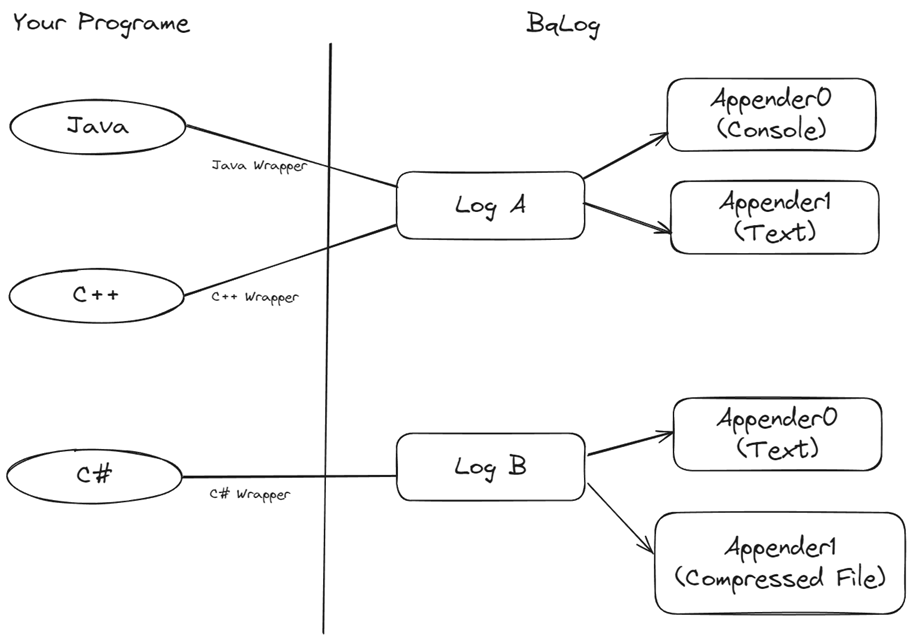

<p align="center">
  
</p>

# BqLog (BianQue Log) V 2.4.1

**English** | [简体中文](./README_CHS.md)

[](LICENSE.txt)
[](https://github.com/Tencent/BqLog/releases)
[](CHANGELOG.md)
[](https://github.com/Tencent/BqLog/stargazers)
[](https://github.com/Tencent/BqLog/network/members)
[](https://github.com/Tencent/BqLog/issues)
[]()
[]()

> BqLog is a lightweight, high-performance, industrial-grade logging system that has been widely used in online projects such as "Honor of Kings".
> **BqLog 2.x is officially released!** With native `HarmonyOS NEXT`, `Python` and `Node.js` support, and asymmetric hybrid encryption.
>
> 🚀 In [Benchmarks](#-benchmark-results), BqLog's compressed log mode is **2–3x faster than fmtlog**, **3–6x faster than quill**, **3–16x faster than spdlog**, **10–12x faster than Log4j2**, and **25–60x faster than glog**; plain text mode also outperforms all of them.

---

[](https://github.com/Tencent/BqLog/releases/tag/Release_2.4.1)

## 📋 What's New in v2.4.1

- **Performance — Raising the bar once again** — Typical workloads see an approximately **10%–20% performance improvement**. Actual gains vary with thread count, log format, argument types, and output mode.
- **Compatibility** — [Fixed Linux artifacts requiring glibc 2.38+ (#72)](https://github.com/Tencent/BqLog/issues/72): everything is now built on Ubuntu 22.04 (glibc 2.35), Windows Server 2022, and the lowest supported BSD releases, so older distros and BSD systems work out of the box.
- **Build/CI** — BSD build-time dependencies are now served from self-hosted, immutable snapshots, making releases reproducible and immune to upstream package removal.

**v2.4.0 highlights:**

- **Bug fix** — [Completely resolved the issue where memory usage could keep growing in certain cases when logging with compressed file Appenders (#70)](https://github.com/Tencent/BqLog/issues/70).
- **Bug fix** — Fixed `log.buffer_policy_when_full` parsing so `discard`, `block`, and `expand` are applied correctly.
- **Configuration** — Added the `write_cache_size` option for tuning each file Appender's write cache from 64 KiB to 4 MiB.

> Full changelog → [CHANGELOG.md](CHANGELOG.md)

---

## 💡 If you have the following pain points, try BqLog

- If your client product (especially games) wants to satisfy this "impossible triangle" at the same time:
  - Easy troubleshooting (log as much as possible)
  - Good performance (log as little as possible)
  - Save storage space (better not log at all)
- If you are a backend service developer and your current logging library cannot handle **high-concurrency scenarios**, causing log loss or application stalls.
- If your programming language is one of C++, Java, C#, Kotlin, TypeScript, JavaScript, Python, or you use multiple languages at the same time and want a **unified cross-language logging solution**.

---

## ✨ Highlights

- Significant performance advantage over common open-source logging libraries (see [Benchmark](#-benchmark-results)); suitable for server, client, and mobile.
- Low memory usage: in the Benchmark case (10 threads, 20,000,000 log entries), BqLog itself uses about 2-3 MB of memory. And in mobile platform scenarios, it's generally around 1 MB.
- Provides a high-performance, high-compression real-time compressed log format.
- Supports strong hybrid encryption (asymmetric + symmetric) for log content protection with nearly zero performance overhead (optional).
- Works well inside game engines (`Unity`, `Unreal`, etc.), with UE Blueprint and builtin data type support.
- Supports `utf8`, `utf16`, `utf32` characters and strings, as well as bool, float, double, and integer types of various sizes.
- Supports `C++20` `std::format` style format strings (without positional index and time formatting).
- Asynchronous logging supports crash recovery and tries to avoid data loss.
- On Java, C#, TypeScript wrappers, it can achieve "zero extra heap alloc" (or very close), avoiding continuous object allocations.
- Depends only on the standard C library and platform APIs; can be compiled with Android `ANDROID_STL = none`.
- Supports `C++11` and later standards and works under very strict compiler options.
- Build system is based on `CMake` and provides multi-platform scripts, easy to integrate.
- Supports custom parameter types.
- Very friendly for code completion and IDE hints.

---

## 🖥️ Supported platforms & languages

| Platforms | Languages |
|-----------|-----------|
| Windows 64-bit, macOS, Linux (incl. embedded), iOS, Android, HarmonyOS, OpenHarmony, Unix (FreeBSD, NetBSD, OpenBSD, Solaris, etc.), PS5, Nintendo Switch (devkitPro & official SDK) | C++ (C++11+), Java / Kotlin, C# (Unity, .NET), ArkTS / C++ (HarmonyOS & OpenHarmony share the same package), JavaScript / TypeScript (Node.js), Python 3.7+, Unreal Engine (UE4, UE5 & UE6 development builds) |

**Hardware architectures**: x86, x86_64, ARM32, ARM64
**Integration methods**: Dynamic library, Static library, Source code

---

## 🏗️ Architecture



Your program accesses the core engine through `BqLog Wrapper` (C++, Java, C#, TypeScript, Python, etc.). Each Log object can mount one or more Appenders (Console / Text File / Compressed File). **Within the same process, Wrappers of different languages can access the same Log object.**

| Appender | Output | Readable | Performance | Size | Encryption |
|----------|--------|----------|-------------|------|------------|
| ConsoleAppender | Console | Yes | Low | - | No |
| TextFileAppender | File | Yes | Low | Large | No |
| CompressedFileAppender | File | No | High | Small | Yes |

---

## 🚀 Quick Start

> Before calling any API, you need to integrate BqLog into your project first:
> - **Standard environments** (C++, Java, C#, Python, Node.js, etc.) → [Integration Guide](docs/INTEGRATION_GUIDE.md)
> - **Game engines** (Unity, Tuanjie Engine, Unreal Engine) → [Game Engine Integration Guide](docs/ENGINE_INTEGRATION.md)

### C++

```cpp
#include <string>
#include <bq_log/bq_log.h>

int main() {
    std::string config = R"(
        appenders_config.appender_console.type=console
        appenders_config.appender_console.levels=[all]
    )";
    auto log = bq::log::create_log("main_log", config);
    log.info("Hello BqLog 2.0! int:{}, float:{}", 123, 3.14f);
    log.force_flush();
    return 0;
}
```

### Java

```java
String config = """
    appenders_config.console.type=console
    appenders_config.console.levels=[all]
""";
bq.log.Log log = bq.log.Log.createLog("java_log", config);
log.info("Hello Java! value: {}", 3.14);
```

### C#

```csharp
string config = @"
    appenders_config.console.type=console
    appenders_config.console.levels=[all]
";
var log = bq.log.create_log("cs_log", config);
log.info("Hello C#! value:{}", 42);
```

### TypeScript (Node.js)

```typescript
import { bq } from "@pippocao/bqlog";
const config = `
    appenders_config.console.type=console
    appenders_config.console.levels=[all]
`;
const log = bq.log.create_log("node_log", config);
log.info("Hello from Node.js! params: {}, {}", "text", 123);
bq.log.force_flush_all_logs();
```

### Python

```python
from bq.log import log
config = """
    appenders_config.console.type=console
    appenders_config.console.levels=[all]
"""
my_log = log.create_log("python_log", config)
my_log.info("Hello from Python! params: {}, {}", "text", 123)
log.force_flush_all_logs()
```

### TypeScript (HarmonyOS / OpenHarmony ArkTS)

> The same `bqlog` package on ohpm works for both **HarmonyOS** (NEXT) and **OpenHarmony** (4.1+ / API 11+). Same install, same import, same code.

```typescript
import { bq } from "bqlog";
const config = `
    appenders_config.console.type=console
    appenders_config.console.levels=[all]
`;
const log = bq.log.create_log("ohos_log", config);
log.info("Hello from HarmonyOS / OpenHarmony! params: {}, {}", "text", 123);
bq.log.force_flush_all_logs();
```

> For full integration steps for all platforms, see [Integration Guide](docs/INTEGRATION_GUIDE.md) and [Game Engine Integration Guide](docs/ENGINE_INTEGRATION.md).

---

## 📊 Benchmark results

Test: 1–10 threads, each writing 2,000,000 log entries. Environment: MacBook Pro, Apple M4 Pro (14-core: 10P + 4E), 48 GB, macOS.

Comparison: BqLog (Text / Compress / Compress+Encrypt) vs spdlog 1.17.0, glog 0.7.1, fmtlog, quill 11.1.0, Log4j2 2.23.1.

#### Throughput — Total Time Cost with 4 parameters (ms)

|                              | 1 Thread | 2 Threads | 3 Threads | 4 Threads | 5 Threads | 6 Threads | 7 Threads | 8 Threads | 9 Threads | 10 Threads |
|------------------------------|----------|-----------|-----------|-----------|-----------|-----------|-----------|-----------|-----------|------------|
| BqLog Compress (C++)         | 79       | 99        | 115       | 170       | 222       | 311       | 324       | 372       | 484       | 759        |
| BqLog Compress+Encrypt (C++) | 83       | 106       | 134       | 189       | 223       | 328       | 337       | 390       | 532       | 995        |
| BqLog Text (C++)             | 202      | 417       | 648       | 910       | 1167      | 1425      | 1718      | 1969      | 2281      | 2718       |
| fmtlog                       | 248      | 489       | 765       | 1059      | 1341      | 1588      | 1906      | 2234      | 2379      | 2818       |
| quill                        | 425      | 805       | 1222      | 1700      | 2108      | 2592      | 2951      | 3458      | 3957      | 4316       |
| spdlog                       | 434      | 1366      | 3133      | 4779      | 6228      | 9241      | 10829     | 11348     | 11197     | 12003      |
| Log4j2 (Java)                | 946      | 1841      | 2422      | 3685      | 5542      | 5245      | 5775      | 5786      | 8048      | 8752       |
| glog                         | 2138     | 3812      | 7144      | 10446     | 13552     | 21695     | 28806     | 35153     | 40397     | 45162      |

#### Peak Memory Usage (MB)

|                              | 1 Thread | 4 Threads | 10 Threads |
|------------------------------|----------|-----------|------------|
| BqLog Compress (C++)         | 2.7      | 3.0       | 3.9        |
| BqLog Compress+Encrypt (C++) | 2.8      | 3.2       | 4.2        |
| BqLog Text (C++)             | 2.7      | 3.5       | 4.4        |
| spdlog                       | 2.1      | 2.2       | 2.4        |
| glog                         | 2.1      | 2.5       | 3.2        |
| fmtlog                       | 3.9      | 6.1       | 12.7       |
| quill                        | 272.9    | 1058.5    | 2746.6     |

#### Output File Size (1 thread, 4M log entries)

| Library | Format | Size | Compression Ratio |
|---------|--------|------|-------------------|
| BqLog Compress | Binary | 45 MB | **6.7x** smaller |
| BqLog Compress+Encrypt | Encrypted | 45 MB | **6.7x** smaller |
| BqLog Text | Text | 302 MB | — |
| spdlog | Text | 293 MB | — |
| quill | Text | 255 MB | — |
| fmtlog | Text | 285 MB | — |
| glog | Text | 348 MB | — |

- BqLog Compress: **2–3x faster** than fmtlog, **3–16x** than spdlog, **25–60x** than glog
- Encryption adds **near-zero overhead**
- Compressed format is **6.7x smaller** than text
- BqLog uses only **2.7–4.4 MB** memory across all modes and thread counts

> For full benchmark code, methodology, and feature comparison, see [Benchmark](docs/BENCHMARK.md).

---

## 🔄 Changes from 1.x to 2.x

1. Added HarmonyOS support, including ArkTS and C++.
2. Added Node.js support (CJS and ESM).
3. Improved cross-platform compatibility, stability and generality; supports more Unix systems.
4. Average performance improved by ~80% for UTF-8, and by >500% for UTF-16 environments (C#, Unreal, Unity).
5. Android no longer must be used together with Java.
6. Removed the `is_in_sandbox` config and replaced it with `base_dir_type`; added filters for snapshots and support for opening a new log file on each startup. See [Configuration](docs/CONFIGURATION.md).
7. Added high-performance hybrid asymmetric encryption, ***almost zero overhead***; see [Advanced Usage — Encryption](docs/ADVANCED_USAGE.md#6-log-encryption-and-decryption).
8. Provides Unity, Tuanjie Engine, and Unreal Engine plugins, making it easy to use in game engines; the Unreal plugin supports UE4, UE5, and current UE6 development builds, with ConsoleAppender redirection and Blueprint support. UE4/UE5 packages are also published on [Fab](https://www.fab.com/listings/386d1c78-e164-4e97-8b3e-e88cbf9b6acf), while UE6 packages are available from GitHub Releases only. See [Game Engine Integration Guide](docs/ENGINE_INTEGRATION.md).
9. The repository no longer ships binaries. From 2.x on, please download platform- and language-specific packages from the [Releases page](https://github.com/Tencent/BqLog/releases).
10. The size of a single log entry is not limited by `log.buffer_size` anymore;
11. The timezone can be specified manually.
12. The `raw_file` appender is deprecated and no longer maintained in 2.x; please use the `compressed_file` appender instead.
13. The Recovery feature's reliability has been improved and it has been promoted from experimental (beta) to stable (release). see [Advanced Usage — Data Protection](docs/ADVANCED_USAGE.md#3-data-protection-on-abnormal-exit).

---

## 📑 Documentation

| Document | Description |
|----------|-------------|
| [Integration Guide](docs/INTEGRATION_GUIDE.md) | Full integration steps for all platforms + all language demos |
| [Game Engine Integration](docs/ENGINE_INTEGRATION.md) | Unity, Tuanjie Engine, Unreal Engine plugins and Blueprint usage |
| [API Reference](docs/API_REFERENCE.md) | Core APIs, sync/async logging, Appender overview, build & tools |
| [Configuration](docs/CONFIGURATION.md) | Full configuration reference (appenders, log, snapshot) |
| [Advanced Usage](docs/ADVANCED_USAGE.md) | No Heap Alloc, Category, crash recovery, custom types, encryption |
| [Benchmark](docs/BENCHMARK.md) | Full benchmark code (C++, Java, Log4j) and results |

---

## 🤝 How to contribute

If you want to contribute code, please make sure your changes can pass the following workflows under GitHub Actions in the repository:

- `AutoTest`
- `Build`

It is recommended to run corresponding scripts locally before submitting to ensure both testing and building pass normally.
