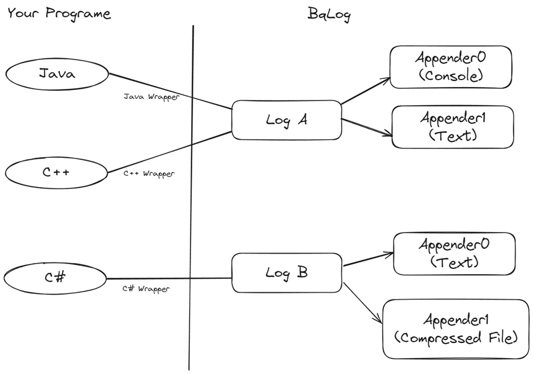

<p align="center">
  
</p>

# BqLog (BianQue Log) V 2.6.0

**English** | [简体中文](./README_CHS.md)

[](LICENSE.txt)
[](https://github.com/Tencent/BqLog/releases)
[](CHANGELOG.md)
[](https://github.com/Tencent/BqLog/stargazers)
[](https://github.com/Tencent/BqLog/network/members)
[](https://github.com/Tencent/BqLog/issues)
[]()
[]()

> BqLog is a lightweight, high-performance, industrial-grade logging system that has been widely used in online projects such as "Honor of Kings".

---
## 💡 If you have the following pain points, try BqLog

- If your client product (especially games) wants to satisfy this "impossible triangle" at the same time:
  - Easy troubleshooting (log as much as possible)
  - Good performance (log as little as possible)
  - Save storage space (better not log at all)
- If you are a backend service developer and your current logging library cannot handle **high-concurrency scenarios**, causing log loss or application stalls.
- If your programming language is one of C++, Java, C#, Kotlin, TypeScript, JavaScript, Python, Go, or you use multiple languages at the same time and want a **unified cross-language logging solution**.

---

## 🎯 What BqLog is for

**Extreme speed is where BqLog starts, not where it stops.** It is a mature, industrial-grade component, built for products that ship:

- **Content to play a supporting role.** On a modern machine a logging system should take as little of the system as it can. The logging threads and the consumer thread alike should use as little CPU, memory and disk I/O as possible. We do not optimize for benchmark scores; every optimization targets real use.
- **Compatible everywhere it runs.** Windows, macOS, Linux, iOS, Android, HarmonyOS, OpenHarmony and the Unix family; C++, Java/Kotlin, C#, Python, TypeScript/ArkTS and Go sharing one core and even one log object; game engines, mobile toolchains without an STL, strict `-Werror` builds.
- **Built for the bad day.** Logs written before a crash are recovered after it; a full disk neither crashes nor hangs the app; corrupted files are recovered as far as possible; log files can be encrypted to protect privacy.
- **Care about the coding experience.** One line to create a log, one line to write; the internals stay as transparent as possible, without complicated configuration; every interface is friendly to IDE code completion; integration tools such as UE Blueprints are provided.

---

[](https://github.com/Tencent/BqLog/releases)

## 📋 What's New in v2.6.0

- **C++ only fast mode**: `BQ_LOG_FAST_INFO(log, ...)` and friends roughly halve the cost on the logging thread, down to a few nanoseconds per call on a busy thread; see [Quick Start](#c) and [API Reference — fast mode](docs/API_REFERENCE.md#fast-mode).
- **Faster normal mode**: `log.info` runs about 16% fewer instructions on the logging thread. End to end against 2.5.0 (macOS, same benchmark), text output is 14–30% faster and compressed output up to about 40% faster.

> Full changelog → [CHANGELOG.md](CHANGELOG.md)

---

## ✨ Highlights

- Significant performance advantage over common open-source logging libraries (see [Benchmark](#-benchmark-results)); suitable for server, client, and mobile.
- Low memory usage: in the Benchmark case (10 threads, 2,000,000 log entries each), the whole benchmark process peaks at no more than 3.1 MB on macOS. On mobile platforms, BqLog itself generally uses around 1 MB.
- Provides a high-performance, high-compression real-time compressed log format.
- Supports strong hybrid encryption (asymmetric + symmetric) for log content protection with nearly zero performance overhead (optional).
- Works well inside game engines (`Unity`, `Unreal`, etc.), with UE Blueprint and builtin data type support.
- Supports `utf8`, `utf16`, `utf32` characters and strings, as well as bool, float, double, and integer types of various sizes.
- Supports `C++20` `std::format` style format strings (without positional index and time formatting).
- Asynchronous logging supports crash recovery and tries to avoid data loss.
- On Java, C#, TypeScript wrappers, it can achieve "zero extra heap alloc" (or very close), avoiding continuous object allocations.
- Depends only on the standard C library and platform APIs; can be compiled with Android `ANDROID_STL = none`.
- Supports `C++11` and later standards and works under very strict compiler options.
- Build system is based on `CMake` and provides multi-platform scripts, easy to integrate.
- Supports custom parameter types.
- Very friendly for code completion and IDE hints.

---

## 🖥️ Supported platforms & languages

| Platforms | Languages |
|-----------|-----------|
| Windows 64-bit, macOS, Linux (incl. embedded), iOS, Android, HarmonyOS, OpenHarmony, Unix (FreeBSD, NetBSD, OpenBSD, Solaris, etc.) | C++ (C++11+), Java / Kotlin, C# (Unity, .NET), ArkTS / C++ (HarmonyOS & OpenHarmony share the same package), JavaScript / TypeScript (Node.js), Python 3.7+, Go, Unreal Engine (UE4, UE5 & UE6 development builds) |

**Hardware architectures**: x86, x86_64, ARM32, ARM64
**Integration methods**: Dynamic library, Static library, Source code

---

## 📖 Why is BqLog so fast? — a three-part series

BqLog's speed is not magic. This series derives the whole design step by step, with diagrams:

1. **[Part 1: High-Performance Realtime Compressed Log Format](<docs/Article 1_Why is BqLog so fast - High Performance Realtime Compressed Log Format.MD>)** — from one line of text to a compressed format: templates, VLQ, UTF-Mixed, segments and encryption
2. **[Part 2: From Ring Buffer to Adaptive Data Bus](<docs/Article 2_Why is BqLog so fast - From Ring Buffer to Adaptive Data Bus.MD>)** — from kFifo and LMAX Disruptor to BqLog's adaptive bus: fetch_add + rollback, MISO/SISO, lock-free thread management and crash recovery
3. **[Part 3: Optimizing the Compressed Log Pipeline](<docs/Article 3_Why is BqLog so fast - Optimizing the Compressed Log Pipeline.MD>)** — how much work can share one memory load: fused copy+hash, template caches, length backfill, batched I/O

All diagrams and the series index live in [Performance Design](docs/PERFORMANCE_DESIGN.md).

---

## 🏗️ Architecture



Your program accesses the core engine through `BqLog Wrapper` (C++, Java, C#, TypeScript, Python, etc.). Each Log object can mount one or more Appenders (Console / Text File / Compressed File). **Within the same process, Wrappers of different languages can access the same Log object.**

| Appender | Output | Readable | Performance | Size | Encryption |
|----------|--------|----------|-------------|------|------------|
| ConsoleAppender | Console | Yes | Low | - | No |
| TextFileAppender | File | Yes | Low | Large | No |
| CompressedFileAppender | File | No | High | Small | Yes |

---

## 🚀 Quick Start

> Before calling any API, you need to integrate BqLog into your project first:
> - **Standard environments** (C++, Java, C#, Python, Node.js, etc.) → [Integration Guide](docs/INTEGRATION_GUIDE.md)
> - **Game engines** (Unity, Tuanjie Engine, Unreal Engine) → [Game Engine Integration Guide](docs/ENGINE_INTEGRATION.md)
> - **Anything else** → [FAQ](docs/FAQ.md)

### C++

```cpp
#include <string>
#include <bq_log/bq_log.h>

int main() {
    std::string config = R"(
        appenders_config.appender_console.type=console
        appenders_config.appender_console.levels=[all]
    )";
    auto log = bq::log::create_log("main_log", config);
    log.info("Hello BqLog 2.0! int:{}, float:{}", 123, 3.14f);
    log.force_flush();
    return 0;
}
```

**C++ only fast mode.** On the hottest C++ paths, the `BQ_LOG_FAST_*` macros write the same log entry for a fraction of the cost on the calling thread:

```cpp
BQ_LOG_FAST_INFO(log, "Hello BqLog fast mode! int:{}, float:{}", 123, 3.14f);
```

The output is identical to `log.info`. The price: a little more memory, weaker IDE hints than a plain member function (it is a macro), and each call site binds the log object and format string of its first call — use one log object and a fixed format string per call site. Details in [API Reference — fast mode](docs/API_REFERENCE.md#fast-mode).

### Java

```java
String config = """
    appenders_config.console.type=console
    appenders_config.console.levels=[all]
""";
bq.log.Log log = bq.log.Log.createLog("java_log", config);
log.info("Hello Java! value: {}", 3.14);
```

### C#

```csharp
string config = @"
    appenders_config.console.type=console
    appenders_config.console.levels=[all]
";
var log = bq.log.create_log("cs_log", config);
log.info("Hello C#! value:{}", 42);
```

### TypeScript (Node.js)

```typescript
import { bq } from "@pippocao/bqlog";
const config = `
    appenders_config.console.type=console
    appenders_config.console.levels=[all]
`;
const log = bq.log.create_log("node_log", config);
log.info("Hello from Node.js! params: {}, {}", "text", 123);
bq.log.force_flush_all_logs();
```

### Python

```python
from bq.log import log
config = """
    appenders_config.console.type=console
    appenders_config.console.levels=[all]
"""
my_log = log.create_log("python_log", config)
my_log.info("Hello from Python! params: {}, {}", "text", 123)
log.force_flush_all_logs()
```

### Go

```go
package main

import bq "github.com/Tencent/BqLog/go/v2"

func main() {
    config := `
appenders_config.console.type=console
appenders_config.console.levels=[all]
`
    log := bq.Create_log("go_log", config, nil)
    if !log.Is_valid() {
        panic("invalid log config")
    }
    defer log.Force_flush()

    log.Info("Hello from Go! params: {}, {}", "text", 123)
}
```

### TypeScript (HarmonyOS / OpenHarmony ArkTS)

> The same `bqlog` package on ohpm works for both **HarmonyOS** (NEXT) and **OpenHarmony** (4.1+ / API 11+). Same install, same import, same code.

```typescript
import { bq } from "bqlog";
const config = `
    appenders_config.console.type=console
    appenders_config.console.levels=[all]
`;
const log = bq.log.create_log("ohos_log", config);
log.info("Hello from HarmonyOS / OpenHarmony! params: {}, {}", "text", 123);
bq.log.force_flush_all_logs();
```

> For full integration steps for all platforms, see [Integration Guide](docs/INTEGRATION_GUIDE.md) and [Game Engine Integration Guide](docs/ENGINE_INTEGRATION.md).

---

## 📊 Benchmark results

Logging is not the core of an application, and a logger that takes a lot of CPU or memory is not good enough. So the benchmark measures the total cost on realistic workloads: the time to get every entry onto disk, together with the CPU and memory spent on it; it also measures the latency of a single call on the logging thread. Test cases and full data: [Benchmark](docs/BENCHMARK.md).

**Throughput, 4 parameters, macOS (Apple M4 Pro).** 2,000,000 entries per thread, timed until everything is on disk; every library uses fixed size buffers that block when full; BqLog in C++ fast mode:

| | 1 Thread | 4 Threads | 10 Threads |
|---|---:|---:|---:|
| BqLog, compressed | 39 ms / CPU 76 ms | 148 ms / CPU 734 ms | 375 ms / CPU 3984 ms |
| BqLog, text | 152 ms / CPU 303 ms | 617 ms / CPU 3047 ms | 1548 ms / CPU 16307 ms |
| quill | 331 ms / CPU 493 ms | 1517 ms / CPU 4697 ms | 4338 ms / CPU 29048 ms |
| fmtlog | 254 ms / CPU 475 ms | 1089 ms / CPU 5310 ms | 2982 ms / CPU 32093 ms |
| Log4j2 (Java) | 665 ms / CPU 2810 ms | 1872 ms / CPU 9206 ms | 3754 ms / CPU 19383 ms |
| spdlog (async) | 535 ms / CPU 966 ms | 6758 ms / CPU 20142 ms | - |
| glog (synchronous) | 2322 ms / CPU 2318 ms | 9929 ms / CPU 30661 ms | - |

- BqLog's compressed format takes several times less total time and CPU than every other logging library of its kind.
- Peak memory: BqLog stays within 3.1 MB at 10 threads.
- With growing buffers, against a queue that grows as well, BqLog is 2 to 8 times faster, with less CPU time and about half the peak memory.
- Latency of a single call on the logging thread: BqLog is in the lowest tier of the libraries measured (1 thread: p50 4 ns, p99 29 ns).

---

## 🔄 Changes from 1.x to 2.x

1. Added HarmonyOS support, including ArkTS and C++.
2. Added Node.js support (CJS and ESM).
3. Improved cross-platform compatibility, stability and generality; supports more Unix systems.
4. Average performance improved by ~80% for UTF-8, and by >500% for UTF-16 environments (C#, Unreal, Unity).
5. Android no longer must be used together with Java.
6. Removed the `is_in_sandbox` config and replaced it with `base_dir_type`; added filters for snapshots and support for opening a new log file on each startup. See [Configuration](docs/CONFIGURATION.md).
7. Added high-performance hybrid asymmetric encryption, ***almost zero overhead***; see [Advanced Usage — Encryption](docs/ADVANCED_USAGE.md#6-log-encryption-and-decryption).
8. Provides Unity, Tuanjie Engine, and Unreal Engine plugins, making it easy to use in game engines; the Unreal plugin supports UE4, UE5, and current UE6 development builds, with ConsoleAppender redirection and Blueprint support. UE4/UE5 packages are also published on [Fab](https://www.fab.com/listings/386d1c78-e164-4e97-8b3e-e88cbf9b6acf), while UE6 packages are available from GitHub Releases only. See [Game Engine Integration Guide](docs/ENGINE_INTEGRATION.md).
9. The repository no longer ships binaries. From 2.x on, please download platform- and language-specific packages from the [Releases page](https://github.com/Tencent/BqLog/releases).
10. The size of a single log entry is not limited by `log.buffer_size` anymore;
11. The timezone can be specified manually.
12. The `raw_file` appender has been removed. An appender configured with `type=raw_file` is ignored with a warning; please use the `compressed_file` appender instead.
13. The Recovery feature's reliability has been improved and it has been promoted from experimental (beta) to stable (release). see [Advanced Usage — Data Protection](docs/ADVANCED_USAGE.md#3-data-protection-on-abnormal-exit).

---

## 📑 Documentation

| Document | Description |
|----------|-------------|
| [FAQ](docs/FAQ.md) | Common questions: comparisons, platforms, distribution channels, crash recovery |
| [Integration Guide](docs/INTEGRATION_GUIDE.md) | Full integration steps for all platforms + all language demos |
| [Game Engine Integration](docs/ENGINE_INTEGRATION.md) | Unity, Tuanjie Engine, Unreal Engine plugins and Blueprint usage |
| [API Reference](docs/API_REFERENCE.md) | Core APIs, sync/async logging, Appender overview, build & tools |
| [Configuration](docs/CONFIGURATION.md) | Full configuration reference (appenders, log, snapshot) |
| [Advanced Usage](docs/ADVANCED_USAGE.md) | No Heap Alloc, Category, crash recovery, custom types, encryption |
| [Benchmark](docs/BENCHMARK.md) | Benchmark code, methodology, and results |
| [Performance Design](docs/PERFORMANCE_DESIGN.md) | Compressed file format, adaptive data bus, and write-path optimizations |

---

## 🤝 How to contribute

If you want to contribute code, please make sure your changes can pass the following workflows under GitHub Actions in the repository:

- `AutoTest`
- `Build`

It is recommended to run corresponding scripts locally before submitting to ensure both testing and building pass normally.
