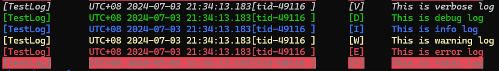

# API Reference

[← Back to Home](../README.md) | [简体中文](./API_REFERENCE_CHS.md)

All language Wrappers share consistent API naming and semantics. Each API below shows all supported languages.

---

## 1. Create a Log object

Create a Log through the `create_log` static function. If the name already exists, the existing object is returned and its configuration is updated (some fields like `buffer_size` cannot be changed, see [Configuration](./CONFIGURATION.md)).

<details open>
<summary><b>C++</b></summary>

```cpp
#include <bq_log/bq_log.h>
// bq::string accepts char*, std::string, std::string_view implicitly
static bq::log bq::log::create_log(const bq::string& log_name, const bq::string& config_content);
```
</details>

<details>
<summary><b>Java / Kotlin</b></summary>

```java
import bq.log;
bq.log logObj = bq.log.create_log("my_log", config);
```
</details>

<details>
<summary><b>C#</b></summary>

```csharp
using bq;
bq.log logObj = bq.log.create_log("my_log", config);
```
</details>

<details>
<summary><b>TypeScript (Node.js / HarmonyOS ArkTS)</b></summary>

```typescript
import { bq } from "@pippocao/bqlog";  // Node.js ESM
// import { bq } from "bqlog";          // HarmonyOS ArkTS
const logObj = bq.log.create_log("my_log", config);
```
</details>

<details>
<summary><b>Python</b></summary>

```python
from bq.log import log
log_obj = log.create_log("my_log", config)
```
</details>

Key points:

1. The return value will **never be null** in any language. If creation fails, check via `is_valid()`.
2. If `log_name` is empty, BqLog auto-assigns a unique name like `"AutoBqLog_1"`.
3. Calling `create_log` with an existing name reuses the object and updates its config.
4. Safe to call in global / static initializers — no Static Initialization Order issues.

---

## 2. Get a Log object

Retrieve an already-created Log object by name:

<details open>
<summary><b>C++</b></summary>

```cpp
static bq::log bq::log::get_log_by_name(const bq::string& log_name);
```
</details>

<details>
<summary><b>Java / Kotlin</b></summary>

```java
bq.log logObj = bq.log.get_log_by_name("my_log");
```
</details>

<details>
<summary><b>C#</b></summary>

```csharp
bq.log logObj = bq.log.get_log_by_name("my_log");
```
</details>

<details>
<summary><b>TypeScript</b></summary>

```typescript
const logObj = bq.log.get_log_by_name("my_log");
```
</details>

<details>
<summary><b>Python</b></summary>

```python
log_obj = log.get_log_by_name("my_log")
```
</details>

> Note: Ensure the Log has been created via `create_log` first, otherwise `is_valid()` returns false.

---

## 3. Write logs

BqLog provides 6 log levels: `verbose`, `debug`, `info`, `warning`, `error`, `fatal` (importance increasing).

Format parameters use `{}` placeholders following `C++20 std::format` rules (no positional index or time formatting). **Strongly recommend using format parameters instead of string concatenation** for best performance and compression.

<details open>
<summary><b>C++</b></summary>

```cpp
log_obj.info("Hello {}, count={}", "world", 42);
log_obj.error("Error code: {}", err_code);
// All levels: verbose, debug, info, warning, error, fatal
```

Supported `STR` types: `char*`, `char16_t*`, `char32_t*`, `wchar_t*`, `std::string`, `std::u16string`, `std::wstring`, Unreal `FString` / `FName` / `FText`, etc.

<a id="fast-mode"></a>

#### C++ only fast mode

Besides the normal mode (`log_obj.info(...)` and the other level functions), C++ has a fast mode: six macros that write exactly the same log entry while costing the calling thread much less.

```cpp
BQ_LOG_FAST_INFO(log_obj, "Hello {}, count={}", "world", 42);
BQ_LOG_FAST_ERROR(log_obj, "Error code: {}", err_code);
// BQ_LOG_FAST_VERBOSE, BQ_LOG_FAST_DEBUG, BQ_LOG_FAST_INFO, BQ_LOG_FAST_WARNING, BQ_LOG_FAST_ERROR, BQ_LOG_FAST_FATAL

// A generated category log: the same macro, with the category before the format string, as in info(cat, ...)
BQ_LOG_FAST_INFO(my_category_log, my_category_log.cat.Shop.Seller, "order {} paid", order_id);
```

The first call at each call site registers its format string once; after that, the thread only checks the level, stores the timestamp and the raw arguments into its own buffer, and returns. The format string is not copied or hashed again, and nothing goes through a library function call.

Use it on hot paths. For everything else, the normal mode is the better default, because fast mode has a price:

- **Fixed log object, category and format string per call site.** A call site binds the log object and format string of its first call (the category is a compile-time type, so it is fixed anyway). Passing a different log object or a different format string to the same call site later (for example through a helper function that forwards its arguments into one `BQ_LOG_FAST_*` line) is not supported: the entry still goes to the first log object with the first format string. Configuration changes (`reset_config`, levels, category masks) do apply.
- **Slightly more memory.** Each registered format string is kept once in the log's metadata area for its lifetime, and every thread that uses fast mode keeps one 128-byte thread local slot.
- **Weaker IDE hints.** These are macros, so code completion and parameter hints are not as helpful as with the member functions of the normal mode. Argument types are still checked at compile time.

[Categories](./ADVANCED_USAGE.md#2-log-objects-with-category-support) are supported: when the second argument is `log.cat.xxx` the entry goes to that category, when it is the format string the default category is used. Which one is decided at compile time, so a call with a category is as fast as one without. Supported arguments are the same as in the normal mode. When a level is configured to print a stack trace (`log.print_stack_levels`) or the log runs in sync mode, a fast mode call quietly falls back to the normal mode, so the output stays correct; it is just not faster in that case.
</details>

<details>
<summary><b>Java / Kotlin</b></summary>

```java
import static bq.utils.param.no_boxing;

logObj.info("Hello {}, count={}", "world", no_boxing(42));
logObj.error("Error code: {}", no_boxing(errCode));
// All levels: verbose, debug, info, warning, error, fatal
```

> **Important:** Use `bq.utils.param.no_boxing()` to wrap primitive types (`int`, `float`, `boolean`, etc.) to avoid boxing and GC pressure. Without `no_boxing`, primitives will be auto-boxed.
</details>

<details>
<summary><b>C#</b></summary>

```csharp
logObj.info("Hello {}, count={}", "world", 42);
logObj.error("Error code: {}", errCode);
// All levels: verbose, debug, info, warning, error, fatal
```

> When parameter count ≤ 12, **zero boxing/unboxing** occurs. Beyond 12 parameters, boxing degrades gracefully.
</details>

<details>
<summary><b>TypeScript</b></summary>

```typescript
logObj.info("Hello {}, count={}", "world", 42);
logObj.error("Error code: {}", errCode);
// All levels: verbose, debug, info, warning, error, fatal
```

> Parameters are passed directly via NAPI — no extra boxing.
</details>

<details>
<summary><b>Python</b></summary>

```python
log_obj.info("Hello {}, count={}", "world", 42)
log_obj.error("Error code: {}", err_code)
# All levels: verbose, debug, info, warning, error, fatal
```
</details>

### Supported parameter types

- Null pointer → `null`
- Pointer → `0x` hex address
- `bool`, single/double/four-byte characters
- 8/16/32/64-bit integers and unsigned integers
- 32-bit and 64-bit floating point numbers
- All string types in each language
- C# / Java: any object (via `ToString()`)
- C++: POD types (1/2/4/8 bytes), custom types (see [Advanced Usage — Custom parameter types](./ADVANCED_USAGE.md#4-custom-parameter-types))



---

## 4. Force flush

Ensure all buffered logs are written to disk. Call before program exit or at critical checkpoints.

<details open>
<summary><b>C++</b></summary>

```cpp
bq::log::force_flush_all_logs();  // flush all log objects
log_obj.force_flush();             // flush single log object
```
</details>

<details>
<summary><b>Java / Kotlin</b></summary>

```java
bq.log.force_flush_all_logs();
logObj.force_flush();
```
</details>

<details>
<summary><b>C#</b></summary>

```csharp
bq.log.force_flush_all_logs();
logObj.force_flush();
```
</details>

<details>
<summary><b>TypeScript</b></summary>

```typescript
bq.log.force_flush_all_logs();
logObj.force_flush();
```
</details>

<details>
<summary><b>Python</b></summary>

```python
log.force_flush_all_logs()
log_obj.force_flush()
```
</details>

---

## 5. Crash protection

Enable automatic buffer flush on abnormal exit (POSIX only):

<details open>
<summary><b>C++</b></summary>

```cpp
bq::log::enable_auto_crash_handle();
```
</details>

<details>
<summary><b>Java / Kotlin</b></summary>

```java
bq.log.enable_auto_crash_handle();
```
</details>

<details>
<summary><b>C#</b></summary>

```csharp
bq.log.enable_auto_crash_handle();
```
</details>

<details>
<summary><b>TypeScript</b></summary>

```typescript
bq.log.enable_auto_crash_handle();
```
</details>

<details>
<summary><b>Python</b></summary>

```python
log.enable_auto_crash_handle()
```
</details>

See also: [Advanced Usage — Data protection on abnormal exit](./ADVANCED_USAGE.md#3-data-protection-on-abnormal-exit) and [`log.recovery` config](./CONFIGURATION.md).

---

## 6. Intercept / fetch Console Output

### Register callback

<details open>
<summary><b>C++</b></summary>

```cpp
static void bq::log::register_console_callback(bq::type_func_ptr_console_callback callback);
static void bq::log::unregister_console_callback(bq::type_func_ptr_console_callback callback);
```
</details>

<details>
<summary><b>Java / Kotlin</b></summary>

```java
bq.log.register_console_callback(callback);
bq.log.unregister_console_callback(callback);
```
</details>

<details>
<summary><b>C#</b></summary>

```csharp
bq.log.register_console_callback(callback);
bq.log.unregister_console_callback(callback);
```
</details>

<details>
<summary><b>TypeScript</b></summary>

```typescript
bq.log.register_console_callback(callback);
bq.log.unregister_console_callback(callback);
```
</details>

<details>
<summary><b>Python</b></summary>

```python
log.register_console_callback(callback)
log.unregister_console_callback(callback)
```
</details>

**Note:**
1. Do **not** call any synchronous BqLog flush functions inside the callback — this will deadlock.
2. Unity / Tuanjie / Unreal plugins already redirect ConsoleAppender to the editor log window automatically.

### Actively fetch (for VM environments)

When direct native-thread callbacks are not suitable (C#, Java, IL2CPP, Node.js), use buffered fetch mode:

```cpp
// Enable buffering (disables register_console_callback and default console output)
bq::log::set_console_buffer_enable(true);

// Poll from your logic thread — MUST call continuously to avoid unbounded memory growth
bq::log::fetch_and_remove_console_buffer(on_console_callback);
```

> **IL2CPP:** Ensure callback is `static unsafe` with `[MonoPInvokeCallback(typeof(type_console_callback))]`.

---

## 7. Modify configuration at runtime

<details open>
<summary><b>C++</b></summary>

```cpp
bool success = log_obj.reset_config(new_config);
```
</details>

<details>
<summary><b>Java / Kotlin</b></summary>

```java
boolean success = logObj.reset_config(newConfig);
```
</details>

<details>
<summary><b>C#</b></summary>

```csharp
bool success = logObj.reset_config(newConfig);
```
</details>

<details>
<summary><b>TypeScript</b></summary>

```typescript
const success = logObj.reset_config(newConfig);
```
</details>

<details>
<summary><b>Python</b></summary>

```python
success = log_obj.reset_config(new_config)
```
</details>

Some fields (`buffer_size`, `thread_mode`) cannot be modified at runtime. See [Configuration](./CONFIGURATION.md).

---

## 8. Enable / disable Appenders

<details open>
<summary><b>C++</b></summary>

```cpp
log_obj.set_appender_enable("appender_name", false);  // disable
log_obj.set_appender_enable("appender_name", true);   // re-enable
```
</details>

<details>
<summary><b>Java / Kotlin</b></summary>

```java
logObj.set_appender_enable("appender_name", false);  // disable
logObj.set_appender_enable("appender_name", true);   // re-enable
```
</details>

<details>
<summary><b>C#</b></summary>

```csharp
logObj.set_appender_enable("appender_name", false);
logObj.set_appender_enable("appender_name", true);
```
</details>

<details>
<summary><b>TypeScript</b></summary>

```typescript
logObj.set_appender_enable("appender_name", false);
logObj.set_appender_enable("appender_name", true);
```
</details>

<details>
<summary><b>Python</b></summary>

```python
log_obj.set_appender_enable("appender_name", False)
log_obj.set_appender_enable("appender_name", True)
```
</details>

---

## 9. Snapshot

Capture recent logs for anomaly reporting. Requires `snapshot` to be enabled in [Configuration](./CONFIGURATION.md#snapshot-configuration).

<details open>
<summary><b>C++</b></summary>

```cpp
bq::string snapshot = log_obj.take_snapshot("UTC+8");
// bq::string implicitly converts to std::string
```
</details>

<details>
<summary><b>Java / Kotlin</b></summary>

```java
String snapshot = logObj.take_snapshot("UTC+8");
```
</details>

<details>
<summary><b>C#</b></summary>

```csharp
string snapshot = logObj.take_snapshot("UTC+8");
```
</details>

<details>
<summary><b>TypeScript</b></summary>

```typescript
const snapshot: string = logObj.take_snapshot("UTC+8");
```
</details>

<details>
<summary><b>Python</b></summary>

```python
snapshot = log_obj.take_snapshot("UTC+8")
```
</details>

---

## 10. Decode binary log files

For decoding CompressedFileAppender logs at runtime:

```cpp
// C++ only — other languages use the offline command-line tool
bq::tools::log_decoder decoder("path/to/file.logcompr", "optional_private_key");
while (decoder.decode() == bq::appender_decode_result::success) {
    auto& text = decoder.get_last_decoded_log_entry();
    // process text...
}
// Or decode entire file at once:
bq::tools::log_decoder::decode_file("input.logcompr", "output.txt", "optional_key");
```

### Offline command-line decoder

Download `{os}_{arch}_tools_{version}` from Releases:

```bash
./BqLog_LogDecoder FileToDecode [-o OutputFile] [-k PrivateKeyFile]
```

> **Note:** Binary format may be incompatible between BqLog versions. Use the matching decoder version.
> See also: [Advanced Usage — Log encryption and decryption](./ADVANCED_USAGE.md#6-log-encryption-and-decryption)

---

## Synchronous vs asynchronous logging

Controlled by `log.thread_mode` in [Configuration](./CONFIGURATION.md).

|                    | **Synchronous** (`sync`) | **Asynchronous** (`async` / `independent`) |
|:------------------:|---|---|
| **Behavior** | Log is processed immediately before function returns | Log is written to buffer, worker thread processes later |
| **Performance** | Lower — caller blocks until output completes | Higher — caller returns immediately |
| **Thread Safety** | Safe if parameters aren't modified during the call | Same guarantee; uses high-concurrency ring buffer internally |

### Thread-safety notes

BqLog **copies all parameters to the internal ring buffer during the call**. Once the log function returns, all data is safely stored internally. The worker thread never accesses the caller's stack.

The only unsafe scenario is **other threads modifying a parameter while the log call is in progress**:

```cpp
static std::string global_str = "hello";  // modified by other threads concurrently

void thread_a() {
    log_obj.info("param: {}", global_str);  // undefined if global_str is modified during this call
}
```

**Rule: Ensure parameters are not modified during a single log call**, regardless of sync/async mode.

---

## Appender overview

| Name | Output | Readable | Performance | Size | Encryption |
|------|--------|----------|-------------|------|------------|
| ConsoleAppender | Console / ADB Logcat | Yes | Low | - | No |
| TextFileAppender | UTF-8 text file | Yes | Low | Large | No |
| CompressedFileAppender | Binary compressed file | No | **High** | **Small** | **Yes** (RSA2048 + AES256) |

> **CompressedFileAppender** is the recommended default for file output.

---

## Build

All build scripts are in `/build`:

```text
/build
├── demo       # Demo Build
├── lib        # Native Static / Dynamic Library Build
├── test       # Test Project Build
├── tools      # Tools (LogDecoder, CategoryLogGenerator, etc.)
├── wrapper    # Language Wrapper Projects (Java / C# etc.)
├── benchmark  # Benchmark Project Build
└── plugin     # Game Engine Plugins (Unity / Tuanjie / Unreal)
```

**Required env vars:**
- `ANDROID_NDK_ROOT` — for Android builds
- `JAVA_HOME` — for Java wrapper (most scripts enable it by default)
