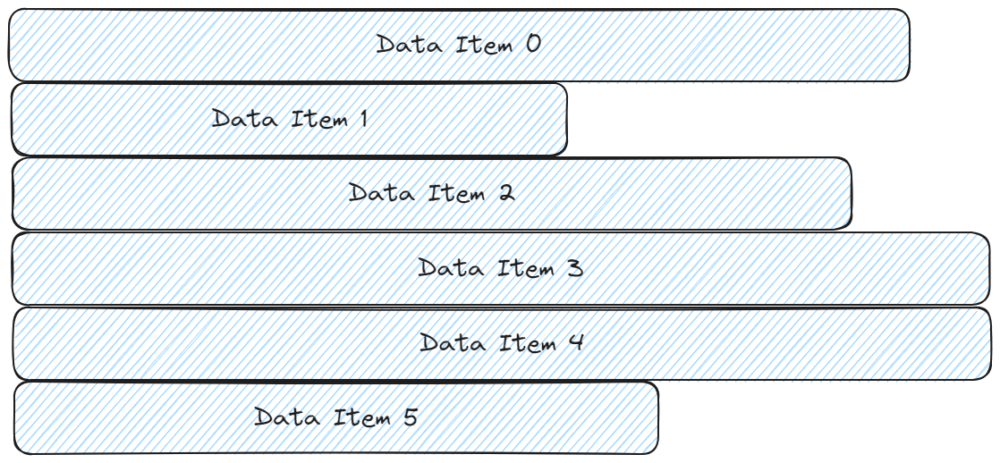
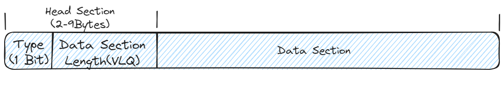
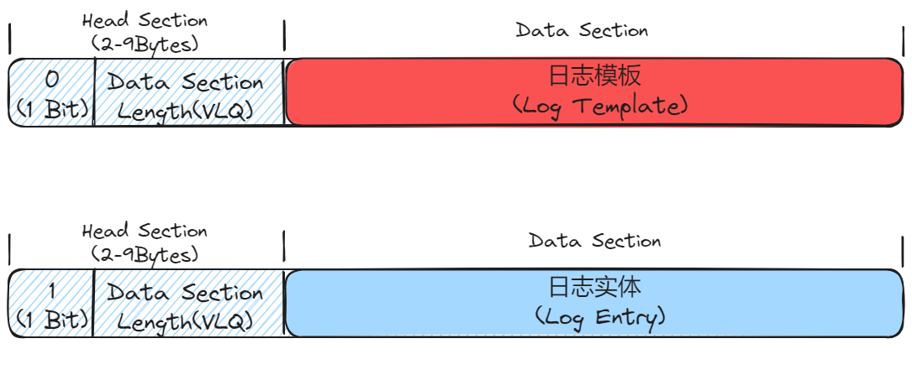
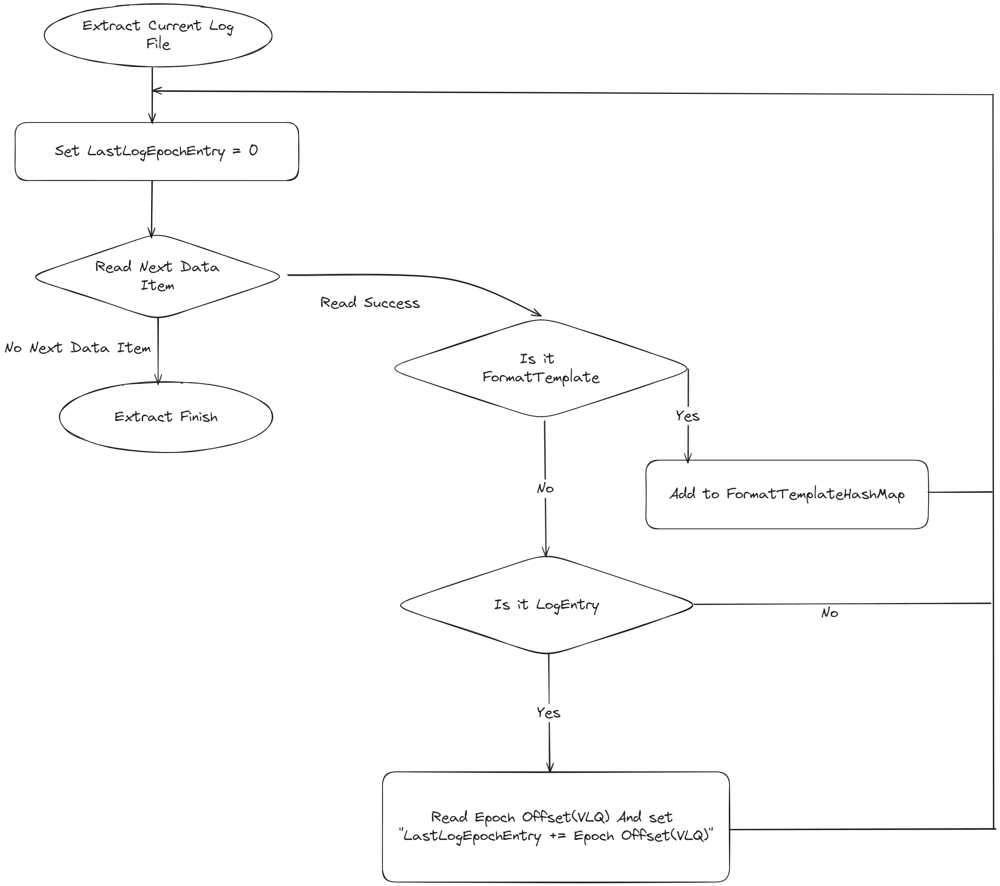
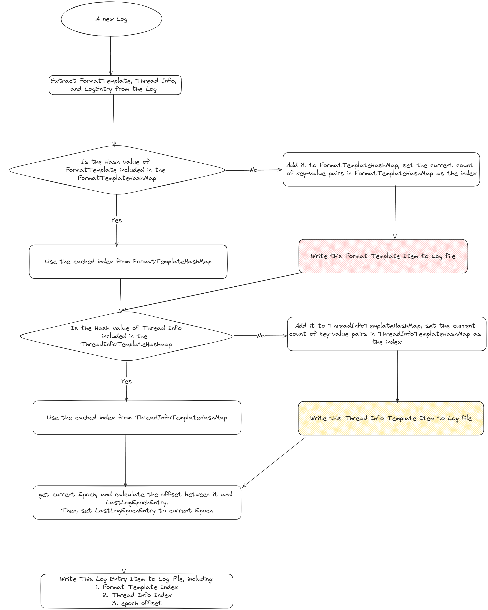
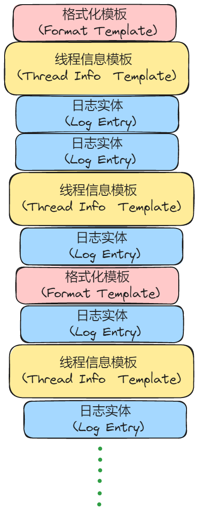
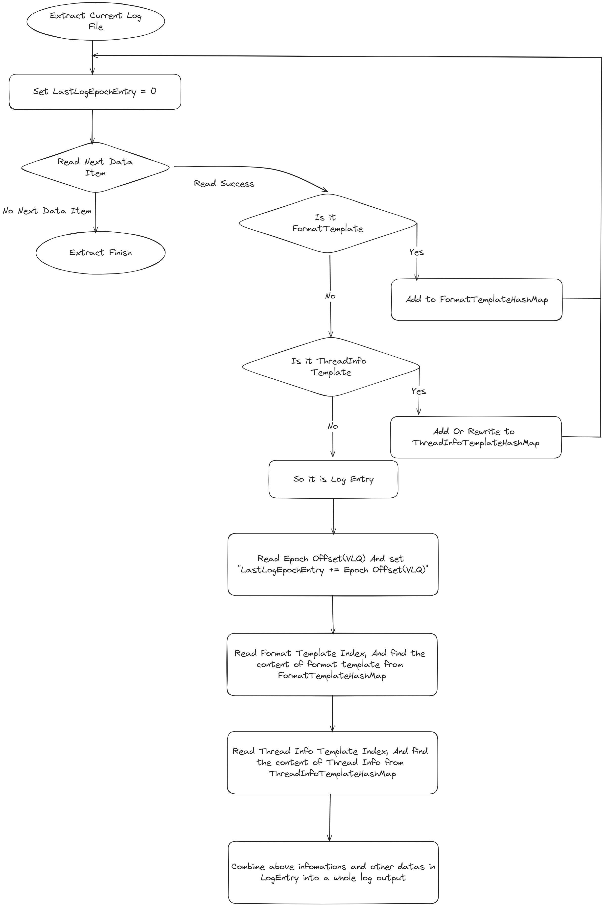

Here is the full translation of your article with "张三" translated as "John" and "李四" as "Mike":

---

## 1. Why Use a Compressed Format

Many logging systems, such as [Log4j2](https://github.com/apache/logging-log4j2), offer compressed logs, but their approach is to compress the logs after writing them using traditional compression algorithms. This method is very unfriendly to performance. BqLog introduces a compressed logging algorithm that compresses the logs in real-time, without any post-processing. Not only does this provide much better performance than text format logs, but the storage space required is also very similar to traditional compression algorithms. This format has already been patented.

### 2. What’s Wrong with the Text Log Format?

Most existing logging systems save logs as text files. Each log entry typically consists of the following:

```c
    Time | LogLevel | ExtraData | LogContent
```

In real-world applications, a large number of logs contain parameterized information. For example, an order log may include the order ID, order price, and the customer's name, like this:

```c
2024-05-29 13:23:56.932 [Info] [Shop.Order] [Tid-2025 Thread Worker25] New order, order ID:32422144, price:324.42, username: John

2024-05-29 13:23:56.972 [Info] [Shop.Order] [Tid-2027 Thread Worker27] New order, order ID:32422145, price:174.45, username: Mike
```

In the above two log entries from an order system, `Info` is the log level (LogLevel), usually ranging from `Verbose`, `Debug`, `Info`, `Warning`, `Error`, to `Fatal`, representing the importance of the log. `Shop.Order` is extra information (ExtraData), indicating the type of log. `Tid-2027 Thread Worker27` represents thread information, while the log content provides the order information, including the order ID, price, and customer name.

As you can see, most of the content in these two log entries is the same, except for the time, order ID, price, and customer name.

This presents two issues:

1. **Performance Issue**: Each log entry involves string concatenation or formatting. Concatenation refers to combining strings like "New order, order ID:", the order ID, ", price:", the price, ", username:", and the customer's name into one. Formatting is when a string like "New order, order ID:{}, price:{}, username:{}" has the placeholders `{}` replaced with actual values. This process can consume system resources and impact performance.
   
2. **Storage Issue**: Each log entry stores the entire string, resulting in a lot of repeated text such as "Shop.Order New order, order ID". This wastes storage space.

### 3. Detailed Analysis of the BqLog Compression Scheme

#### 3.1 Data Item

The log file in this compressed format consists of compactly packed data items (Data Items), as shown below:



_**Figure 1: Structure of the Compressed Log File Format**_  

As shown in Figure 1, each Data Item is tightly packed. The newlines in the diagram are only for illustration; there are no actual newlines or spaces between the items.

The structure of each data item is shown in Figure 2:



_**Figure 2: Structure of a Data Item**_

The first 2-9 bytes represent the header section (Data Section) of the Data Item, which records the type of the data section and its actual length (in bytes). This uses a special data compression technique invented by BqLog.

The data type (Type) uses the first bit. A `0` indicates that it is a Log Template data item, while a `1` indicates that it is a Log Entry data item. The two types are explained in detail later, and a simple illustration is provided in Figure 3:



_**Figure 3: Two Types of Data Items**_

In the header section, apart from the Type bit, the remaining bits store the actual length of the data section. BqLog uses a specific encoding method based on the VLQ algorithm for encoding positive integers. The encoding is as follows:

1 byte: 1XXXXXXX represents a value in the range [0, 2^7^)

2 bytes: 01XXXXXX XXXXXXXX represents a value in the range [2^7^, 2^7^ + 2^14^)

3 bytes: 001XXXXX XXXXXXXX XXXXXXXX represents a value in the range [2^7^ + 2^14^, 2^7^ + 2^14^ + 2^21^)

When the actual data length is less than 128 (within [0, 2^7^]), the first bit of the VLQ-encoded data is 1, which conflicts with using the first bit for the data type. Therefore, we set the first byte (except for the Type bit) to 0, and store the number in the second byte.

For larger lengths (greater than or equal to 2^7^), we use the extra bits in the first byte to store the Type bit, thus saving space.

The decoding process is as follows (pseudocode):

```c
If (the last 7 bits of the first byte are 0) {
    The value is in the range [0, 2^7^], and the length is stored in the second byte.
} else {
    Data Type = first bit of the first byte.
    Set the first bit of the first byte to 0.
    Decode the length using VLQ starting from the first byte.
}
```

This approach saves 1 byte when encoding lengths greater than or equal to 2^7^.

Once the header section (Data Section) is encoded, the rest of the data is stored sequentially.

When reading the logs, after decoding the header section, the following data section is read according to the decoded length.

#### 3.2 Log Template

When the first bit of the Data Item is 0, its data section is called a Log Template. A log template extracts commonly occurring, unchanging parts of the logs to save space. For example, in the logs shown earlier:

```c
2024-05-29 13:23:56.932 [Info] [Shop.Order] [Tid-2025 Thread Worker25] New order, order ID:32422144, price:324.42, username: John

2024-05-29 13:23:56.972 [Info] [Shop.Order] [Tid-2027 Thread Worker27] New order, order ID:32422145, price:174.45, username: Mike
```

The format template for these logs is:

_**Info New order, order ID:{}, price:{}, username:{}**_

Where `Info` is the log level (Log Level), `Shop.Order` is the extra information (Extra Data), and the rest is the format string (Format String).

The log template is divided into two types: Format Template and Thread Info Template, as shown in Figures 4 and 5.


_**Figure 4: Format Template**_


_**Figure 5: Thread Info Template**_

The first byte of the data section indicates the template type (Template Type). A value of 0 represents a Format Template, while a value of 1 represents a Thread Info Template.

A Format Template stores repeated log information, such as:

_**Info New order, order ID:{}, price:{}, username:{}**_

The log level (LogLevel) is stored in 1 byte, with the following possible values:

1. `Verbose` (Lowest log level, typically lots of unnecessary output)
2. `Debug` (Debugging information)
3. `Info` (General log information)
4. `Warning` (Warning log information, needs attention)
5. `Error` (Error log information, cannot be ignored)
6. `Fatal` (Critical error log information)

Extra data (Extra Data) is stored in two parts: the VLQ-encoded length of the extra data, followed by the actual extra data. The format string (Format String) occupies the remaining space in the data section.

In typical usage, these three pieces of information often appear together, so storing them together makes it easier to reuse the information later without duplicating it. Each log template is assigned an index, which is its order of appearance in the log file. The first template has an index of 0, and subsequent templates are indexed as 1, 2, 3, etc. Later log entries (Log Entry) can reference these templates using the index.

The Thread Info Template stores the thread information, such as `Tid-2025 Thread Worker25`. This template is divided into three parts: Thread Info Index, Thread ID, and Thread Name. Both the Thread ID and Thread Info Index are numbers stored using VLQ encoding to save space.

The Thread Info Index is a self-incrementing number starting from 0. If a process restarts but continues logging to the same file, the index resets to 0 for each restart. For example, the first time thread A logs, its index is 0. The first time thread B logs, its index is 1. Unlike Format Templates, Thread Info Index resets after each process restart, so previously recorded thread information becomes irrelevant to subsequent logs

. Later Log Entries reference the Thread Info Index to retrieve specific thread information.

#### 3.3 Log Entry

A Log Entry records the actual log data, along with references to a Format Template and a Thread Info Template. For example, the log entry:

```c
2024-05-29 13:23:56.932 [Info] [Shop.Order] [Tid-2025 Thread Worker25] New order, order ID:32422144, price:324.42, username: John
```

Its Log Entry includes a timestamp, references to the Format Template and Thread Info Template, and three parameters: `32422144`, `324.42`, and `John`.


_**Figure 6: Log Entry Structure**_

As shown in Figure 6, the first field is the time. Traditional methods store epoch time in milliseconds (64-bit integer, 8 bytes) or seconds (32-bit integer, 4 bytes). BqLog stores epoch time offsets using VLQ encoding. For example, the first log entry stores the raw epoch time as `T`. The second log entry stores the offset `(T1 - T)`, the third log stores `(T2 - T1)`, and so on. This takes advantage of the fact that log timestamps are sequential and often very close together, resulting in smaller values and less storage space (often just 1 byte).

The second and third fields are the indices for the Format Template and Thread Info Template, encoded using VLQ. Since both indices start at 0, they typically require very little storage space.

The fourth field contains the log’s parameters. If there are no parameters, this field is absent. The structure of each parameter is shown in Figure 7:


_**Figure 7: Log Entry Parameter Structure**_

Different parameter types have different data formats and sizes (examples, customizable based on actual needs):

| **Param Type** | **Description** | **Storage Method** | **Param Data Size (Bytes)** |
|---------------|-----------------|--------------------|----------------------------|
| **1**         | Null pointer    | No data            | 0                          |
| **2**         | Pointer address | 8-byte storage     | 8                          |
| **3**         | Boolean         | 1 byte (0 or 1)    | 1                          |
| **4**         | Character       | 1 byte             | 1                          |
| **5**         | Wide character  | 2 bytes            | 2                          |
| **6**         | Integer         | VLQ encoding       | 1-9 bytes                  |
| **7**         | Single-precision float | Direct storage | 4 bytes              |
| **8**         | Double-precision float | Direct storage | 8 bytes              |
| **9**         | Utf8 string     | VLQ length + content | Content + VLQ storage |
| **10**        | Utf16 string    | VLQ length + content | Content + VLQ storage |

#### 3.4 Log Writing Process

Before writing logs, we define the following variables:

- `FormatTemplateHashMap<HashCode, FormatTemplateIndex>`: A hash map for Format Templates. The key is the hash of the template content, and the value is the index.
- `ThreadInfoTemplateHashMap<ThreadId, ThreadInfoTemplateIndex>`: A hash map for Thread Info Templates. The key is the thread ID, and the value is the index of the Thread Info Template.
- `LastLogEntryEpoch`: The epoch time of the last log entry.

Before writing new logs, we may be appending to an existing log file, so we need to parse the previous content to gather key information:

- Which thread info templates (Thread Info Template) have already been recorded for reuse.
- The epoch time of the last log entry (Log Entry) to ensure that subsequent logs use the correct time offset.

The specific process is shown in Figure 8:



_**Figure 8: Parsing the Existing Log File Before Writing**_

Figure 9 shows the process for writing a new log entry:



_**Figure 9: Writing a New Log Entry**_

The resulting log file might look like Figure 10, showing the structure of the Data Items:



_**Figure 10: Log File Structure**_

#### 3.5 Log Reading Solution

Before decoding the logs, we define the following variables:

- `FormatTemplateHashMap<Index, FormatTemplateContent>`: A hash map for Format Templates. The key is the index of the Format Template, and the value is the actual content.
- `ThreadInfoTemplateHashMap<Index, ThreadInfoTemplateContent>`: A hash map for Thread Info Templates. The key is the index of the Thread Info Template, and the value is the actual content.
- `LastLogEntryEpoch`: The epoch time of the last log entry.



_**Figure 11: Log File Parsing Process**_

### 4. Conclusion

In theory, this section should include an evaluation of the compression ratio. However, after understanding how this format works, you can see that the compression ratio varies significantly depending on the log content. In scenarios with highly repetitive logs, such as server or network logs, the file size is usually around 10% of the original text log size. Based on HOK's external network experience, game client logs are typically around 20% of the size of the original text logs.

For write performance, you can refer to the benchmarks on GitHub. Its performance is about 3-4 times better than text log formats.

--- 

Let me know if you need any changes!