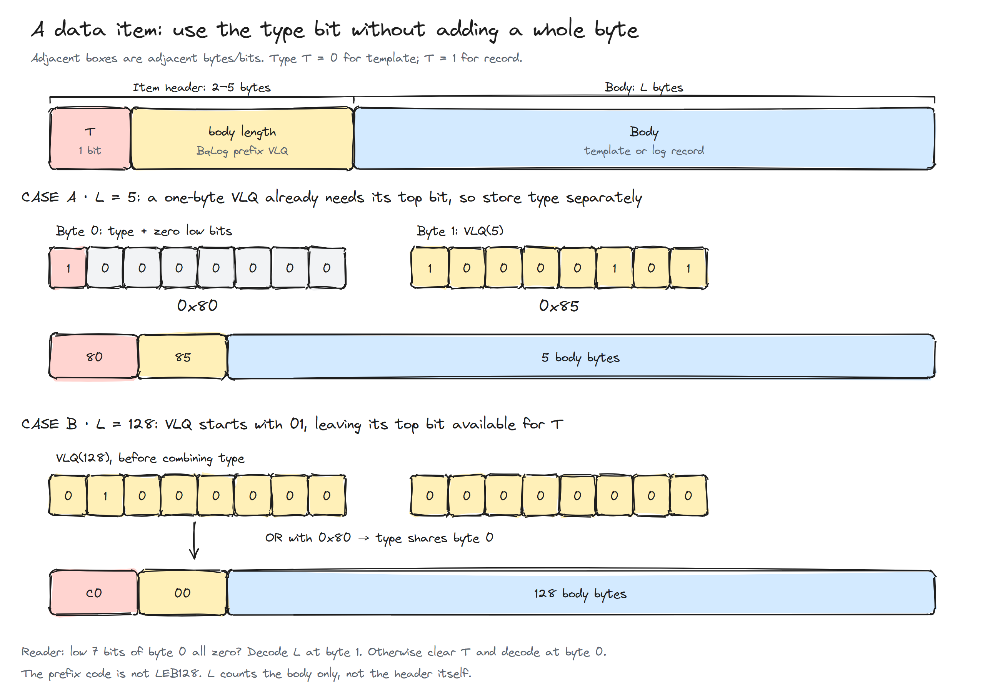
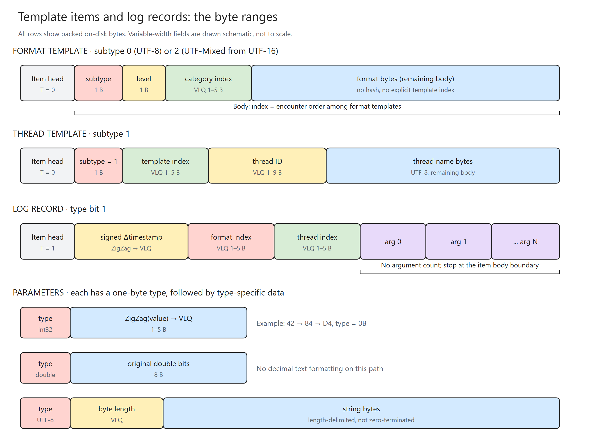
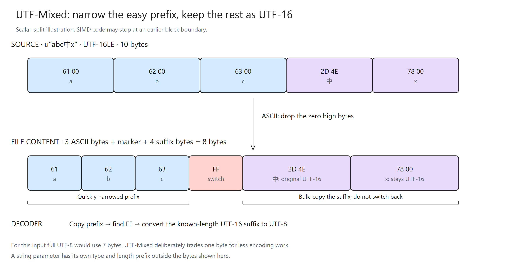
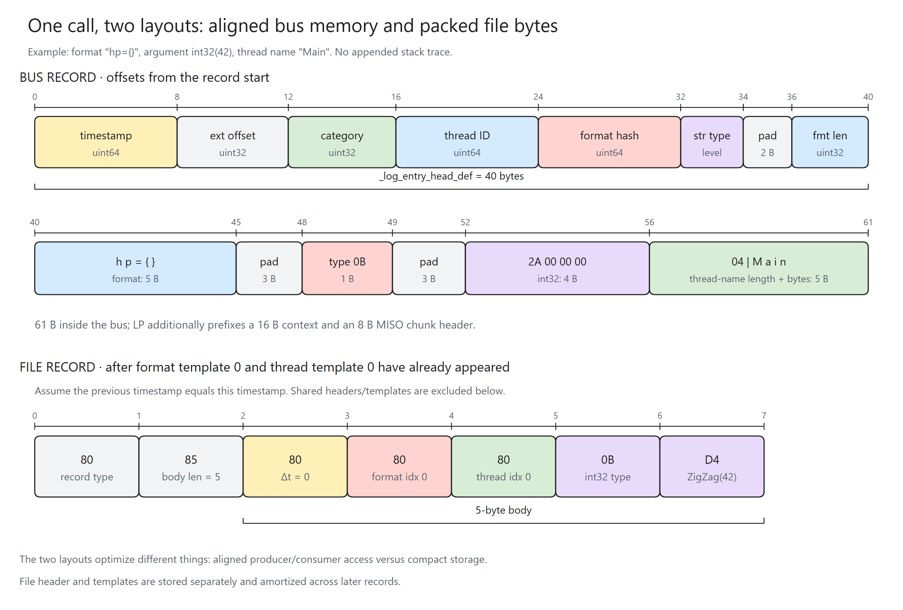
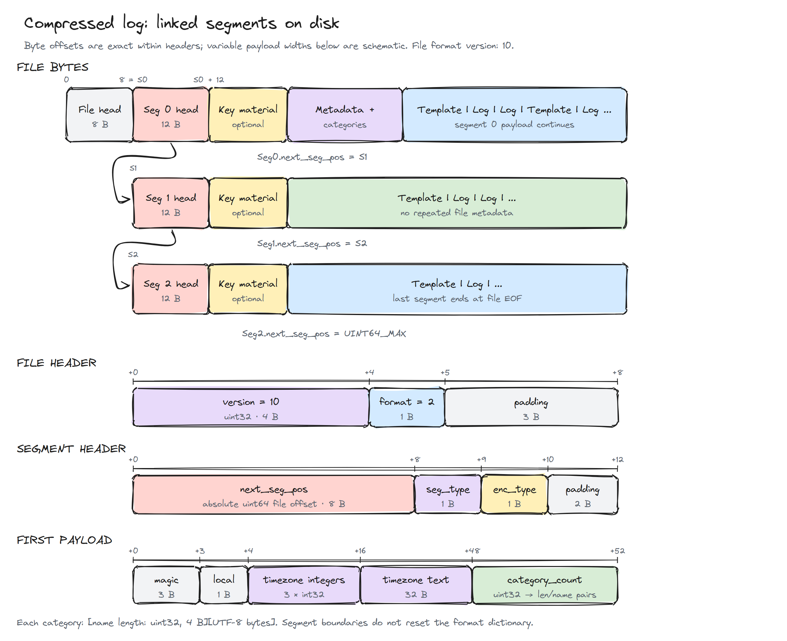
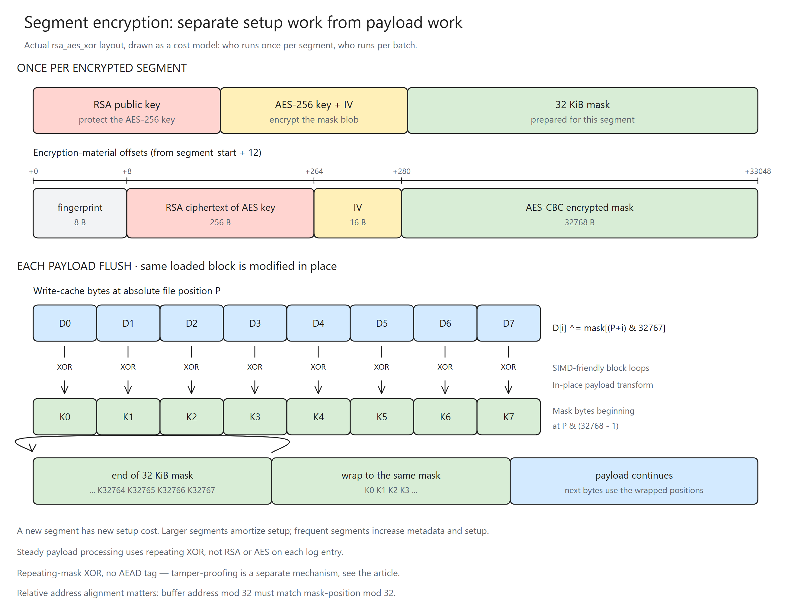

# Why is BqLog so fast? Part 1: Deriving a compressed log format from a line of text

[简体中文](<文章1_为何BqLog如此快 - 高性能实时压缩日志格式.MD>) · [Series](PERFORMANCE_DESIGN.md) · [Next: the data bus](<Article 2_Why is BqLog so fast - High Concurrency Ring Buffer.MD>)

For production logging, we want to have our cake and eat it too: complete information, tiny runtime cost, and small files. On mobile devices these three goals fight each other — log too little and you can't chase online issues; log too much and you eat into an already tight performance and storage budget.

Some logging systems push this conflict to post-processing: write plain text first, then compress the file with a general-purpose algorithm after it's closed. That saves archival space, but the formatting, string copying, and the first write to disk all happen anyway — and compression has to read the whole file one more time. If our goal is not "cheap archiving" but "detailed logs that are cheap to write in the first place", we need to take one more step forward.

In this article we start from the most ordinary line of log and derive BqLog's compressed file format step by step: what really deserves to be written, and what only needs to be written once. Multi-segment structure, encryption and recovery are covered along the way, because they all have a real impact on write cost.

This article is written against BqLog 2.5.0.

## 1. What does a text log actually do?

Take an order system as an example. The business code might be:

```cpp
log.info("New order, order ID:{}, price:{}, username:{}",
         32422144, 324.42, "Zhang San");
```

And what lands in the file looks like this:

```text
2026-09-25 12:00:00.001 [Info] [Shop.Order] [Tid-2025 Worker25]
New order, order ID:32422144, price:324.42, username:Zhang San
```

To produce this single line, the logging system has to convert a timestamp into a date string, turn an integer and a floating-point number into characters, concatenate several fixed pieces of text with the arguments, and finally write to the file. If the string encodings differ, there's an extra encoding conversion in between. Whether this work happens on the calling thread or a background thread only decides who pays the bill — the work itself doesn't shrink at all.

Then the next order arrives:

```text
2026-09-25 12:00:00.002 [Info] [Shop.Order] [Tid-2025 Worker25]
New order, order ID:32422145, price:174.45, username:Li Si
```

The problem is obvious at a glance: except for the timestamp and three arguments, not a single character changed — yet we organized the whole thing again and wrote it out again.

With ten million such logs a day, even if only 50 bytes per entry are repeated fixed content, that's about 500 MB written for nothing. Worse, those 500 MB don't just occupy space — every byte went through formatting, copying and I/O.

So the first step is not hunting for a fancier compression algorithm. It's exploiting the structure the business already told us: **the format string is fixed; the arguments are what change.**

## 2. Don't store the final sentence — store how to assemble it

The most straightforward approach: the first time we see a format string, save it once and assign it a number. Every later occurrence only writes the number plus the arguments:

```text
Template 0: New order, order ID:{}, price:{}, username:{}

Log A: Template 0, 32422144, 324.42, Zhang San
Log B: Template 0, 32422145, 174.45, Li Si
```

You might ask: doesn't this just postpone formatting to read time? Exactly — and that's the point. A huge portion of diagnostic logs are written, kept for a while, and then cleaned up when they expire, without anyone ever reading them. For those logs, the cost of assembling the full text up front is eliminated entirely.

Even when someone finally does read them, formatting can happen on a developer's machine or in an analysis environment. The player's device doesn't have to do all the work. This is a shift of when and where work runs, and it's the first performance win of compressed logging.

But extracting the format string alone is not enough. Log level, category, thread ID and thread name repeat constantly too. Stuffing all of them into one big template looks simpler, but it creates a new problem: if the same business log is emitted by ten threads, do we store ten identical copies of the format string?

So BqLog splits the stable information into two kinds of templates:

- **Format template**: log level, category index, format string.
- **Thread info template**: thread ID and thread name.

Each log entry references the two templates separately. When the thread changes, the format is still reused; when the business format changes, the thread info is still reused.

The category names can be lifted out one more level. For a Log object, the category list is fixed at creation, so we store a category table once at the start of the file, and format templates only record a category index. Pushed to its conclusion, the idea is one sentence: **the less frequently something appears and the longer it lives, the further out it belongs.**

## 3. Templates and logs are mixed together — how does the reader tell them apart?

Now we have three kinds of things: format templates, thread templates, and log entries. The order in which they appear is not fixed: we may write many entries in a row, then suddenly run into a new thread or a new format.

If we gave each kind its own file just to tell them apart, we'd have to maintain the correspondence between several files, and handle consistency under rotation and abnormal exits. No need to invite that complexity. The current format strings them into one continuous sequence of **Data Items**: each item has a type and a length up front, followed by its data.



<p align="center"><em>Figure 1: an item's head and body, with the exact bit layout in both length cases. Boxes adjacent horizontally are adjacent in the file too.</em></p>

Why do we need a length at all? Because neither the format string nor the argument count is fixed. Without a length, you'd have to scan for some terminator — but binary arguments can contain any byte at all, so the terminator would need escaping. With a length, once you've read the head you know the extent of this item, and where the next one starts.

Just using 4 bytes for the length is certainly the simplest. But log entries tend to be short, and spending a fixed 4 bytes on a body of a few dozen bytes is still wasteful. Enter variable-length integer encoding.

### 3.1 Small numbers use few bytes

BqLog uses a prefixed VLQ encoding. To see it clearly, consider unsigned integers first:

```text
1 byte : 1xxxxxxx
2 bytes: 01xxxxxx xxxxxxxx
3 bytes: 001xxxxx xxxxxxxx xxxxxxxx
...
9 bytes: 00000000 + 8 data bytes
```

The position of the first 1 in the prefix tells the decoder how many bytes the number occupies in total. And once the encoding gets longer, it doesn't re-represent values the previous length already covered — counting starts directly from the beginning of the new range:

| Bytes | Range start | Representable range |
|---|---:|---|
| 1 | 0 | 0–127 |
| 2 | 128 | 128–16511 |
| 3 | 16512 | 16512–2113663 |

For example, 128 is not encoded verbatim in two bytes as 128; it means "the 0th number of the second range" and comes out as `40 00`. 16512 is the 0th number of the third range: `20 00 00`.

A word of caution: this is not LEB128, and you can't decode it with another library just because the name VLQ matches. Range starts, prefix and byte order are defined by [log_utils.h](../src/bq_log/utils/log_utils.h). From a performance point of view, though, the win is already clear: common small numbers cost one byte to read and write, and only big numbers pay for a longer encoding.

### 3.2 The type needs only one bit — why give it a whole byte?

At the top level a Data Item only distinguishes "template" from "log entry"; inside templates we further split format and thread. So the top-level type needs just one bit: 0 for template, 1 for log entry.

The conventional approach — one byte for the type, then the length VLQ — looks a bit wasteful, doesn't it? Look back at the prefix above: whenever the VLQ is longer than one byte, its first bit is always 0. That 0 can be lent to the type.

For example, the encoding of length 128 is `40 00`. If this item is a log entry, set the first bit to 1 and it becomes `C0 00` — type and length together still occupy only two bytes.

The VLQ of length 5 is `85`; its first bit is already taken by the length prefix, so there's nothing to borrow. Only in this case do we write an extra byte: type `80`, length `85`, together `80 85`.

The decoder's flow is equally direct: take the first bit for the type, then check whether the low 7 bits are all zero. If they are, decode the length from the next byte; otherwise clear the type bit and decode starting from the current byte. Bodies of 128 bytes or more reuse the first byte; short bodies take the explicit-length route. Neither side loses.

The body length is currently a uint32, so an item head actually occupies 2–5 bytes. Note that the length does not include the head itself — this has to stay consistent both when backfilling and when decoding.

## 4. Opening up the templates



<p align="center"><em>Figure 2: expanding layer by layer from templates down to a single argument. Colors correspond to content kinds; byte counts in fields match the actual encoding.</em></p>

The body of a format template is, in order:

```text
subtype (1 B) | level (1 B) | category_index (VLQ) | format bytes
```

subtype=0 means the format came from UTF-8, subtype=2 means UTF-16, the latter stored as UTF-Mixed in the file (details in section 6). The format string fills the rest of the body, so there's no need to store a string length, nor a terminating zero.

The format template's index isn't written either. The first format template appearing in the file is number 0, the second is number 1, and so on; writer and decoder simply count in the same order. That saves another field, and the decoder can index into a plain array — no hash table needed.

The thread template is slightly different:

```text
subtype=1 (1 B) | thread_template_index (VLQ) | thread_id (VLQ) | thread_name
```

Here the index is written explicitly, because thread info may be redefined in a new run. A plain-text file can be opened and appended to many times by the same program, but last run's thread-ID-to-name mapping can't just be carried over. A new thread template may redefine an existing index; the decoder updates the mapping in file order, and later entries reference the new info.

One easily confused point: **a template's file index is not the same as its slot in the in-memory cache.** To bound memory usage in long-running processes, the writer's template cache evicts entries. When an evicted format appears again, the writer simply writes another copy of the template and gets a new file index; the old records stay valid. Cache eviction affects the reuse rate and the file size — it never rewrites old file content.

As for the hash, the file doesn't need it either. The hash exists so the writer can quickly decide whether it has seen a format before; the decoder locates templates by file index. Fields that only speed up runtime work have no business being on disk.

## 5. What actually changes per entry can be compressed further

Once templates are extracted, the body of a log entry is just:

```text
time delta | format template index | thread template index | arg0 | arg1 | ...
```

Both indices start from small numbers, so VLQ is natural. The timestamp and the arguments deserve a closer look.

### 5.1 Timestamps are big, time deltas are small

A millisecond Epoch timestamp needs 64 bits — that's 8 bytes per entry. Yet consecutive logs are usually a few milliseconds apart, sometimes several within the same millisecond. If the previous timestamp is known, writing only the delta is enough.

Say three entries are at 1000, 1002 and 1001 ms. The deltas are 1000, 2 and -1. The first one is relative to 0; each later one is relative to its predecessor.

Why can the third be smaller than the second? It's not necessarily a clock reset. Data from multiple producers enters the file as the bus polls each source, so records from different threads can legitimately disagree with wall-clock order (part 2 digs into this). So we can't encode only positive deltas.

ZigZag solves the small-negative problem neatly:

```text
Original:  0  -1   1  -2   2  -3   3
Mapped:    0   1   2   3   4   5   6
```

Map the signed value to unsigned, then VLQ-encode it. Both +1 and -1 stay small — instead of ballooning to 8 or 9 bytes because a negative two's-complement value has all its high bits set.

### 5.2 Integers needn't become characters, and floats needn't be formatted early

Each argument is preceded by a type byte that tells the decoder how many bytes to read next and whether to decode VLQ:

| Argument | Content after the type byte |
|---|---|
| null | no content |
| pointer | always 8 bytes |
| bool, char, int8, uint8 | 1 byte |
| char16, char32, uint16, uint32, uint64 | unsigned VLQ |
| int16, int32, int64 | ZigZag + VLQ |
| float / double | raw 4 / 8 bytes |
| UTF-8 string | byte-length VLQ + content |
| UTF-16 string | converted to UTF-Mixed, then length + content |

Why not turn floats into some variable-length integer too? Because a float's bit pattern and value range are a different beast from integers, and the final text also depends on formatting precision. Storing the raw binary value both skips the decimal formatting now and preserves everything needed to reconstruct the text later.

Then why do small types like bool and int8 stay fixed at one byte? They are one byte to begin with; another encoding scheme wouldn't beat that. Compression design doesn't mean dogmatically applying the same algorithm to everything.

Entries don't store an argument count either. Read one argument according to its type, check whether you've reached the end of the item, and you know whether there's more.

## 6. UTF-16: one more trade-off between speed and size

C#, Java and Unreal often use UTF-16. For ASCII characters the high byte of every character is 0, so spending two bytes on one English letter is indeed wasteful. But unconditionally converting all UTF-16 to UTF-8 means more checks when you hit Chinese characters, surrogate pairs and mixed text — and some characters are longer in UTF-8 anyway.

Can we grab the cheapest win first? That's the idea of UTF-Mixed: narrow the leading ASCII run down to one byte per character, and once the content is no longer suitable for fast processing, insert an `FF` marker and copy the remaining UTF-16 as one block.



<p align="center"><em>Figure 3: in this scalar-split example, the 10 UTF-16 bytes of <code>abc中x</code> become 8 bytes. The trailing x stays inside the UTF-16 suffix.</em></p>

Note that "remaining" includes any English characters appearing later — we don't flip back and forth just to save one more byte. The SIMD path may also stop before a block containing non-ASCII, so equally legal splits of identical content don't have to match exactly.

Fully converted to UTF-8, this example would take only 7 bytes; UTF-Mixed uses 8. So what's the point? The encoding cost. We were never chasing the smallest file alone: trading one extra byte for a bulk copy of the suffix often beats a full character-by-character conversion.

The decoder looks for `FF` within the known length, copies the prefix as-is, and converts the suffix to UTF-8. The FF here is not a string terminator but an explicit encoding-switch marker. How SIMD accelerates the narrowing part is a part-3 topic.

## 7. Why is the same log completely different in memory and in the file?

At this point a tempting thought appears: since the file format is so compact, why not have producers build this compact format directly and hand it to the background?

The problem is that file template indices are allocated by the corresponding Appender, and different outputs may have different template sets. If every producer touched that shared dictionary, the background's state management would leak into the calling threads. And variable-length fields designed to save disk make locating arguments in memory more expensive.

So BqLog's bus records keep a fixed head and proper alignment; the consumer converts them into the compact file representation. A tiny log entry makes it clearest:

```cpp
log.info("hp={}", int32_t(42));
```



<p align="center"><em>Figure 4: format hp={}, thread name Main. The top half is the record inside the bus; the bottom half is the file record when templates already exist and the time delta is 0.</em></p>

The in-memory head is 40 bytes: full timestamp, category, thread ID, format hash and length. The 5-byte format content is aligned up to 8 bytes at a 4-byte boundary, the int32 argument occupies the type area and the value area, and there's thread extension info at the end. The internal record of this example totals 61 bytes; on the LP path there's also a context and the ring's block head on top (the protagonists of part 2).

In the file it can be just:

```text
80 85 | 80 | 80 | 80 | 0B D4
type/len5  Δt=0 fmt0 thread0 int32(42)
```

0B is the int32 type; 42 becomes 84 after ZigZag and is encoded as D4 — the whole item is 7 bytes. The file header and the templates are stored separately, amortized across later records. The division of labor between the two layouts is plain to see: in memory, convenient produce/consume; on disk, as compact as possible.

## 8. Beyond one data stream: why a multi-segment structure?

So far we've described one continuous data stream: the program keeps running, the in-memory template tables and encryption state are all there, and you just keep writing. But what about after a restart?

Let's make one premise clear first: **appending to a compressed log requires knowing what was written before.** That's nothing like opening a text file, seeking to the end and writing another line.

### 8.1 What appending must restore is more than the file position

Suppose the old file already has three format templates, numbered 0, 1, 2. If a new log uses one of those formats, we need to find its original number; if a new format arrives, we need to know the next number starts from 3. Entries store time deltas, so the last entry's timestamp has to be restored too.

If we skipped reading the existing content entirely and restarted template numbering from 0 while the decoder kept using the old dictionary, the same number would have two meanings. Which format the following arguments should be substituted into would be anyone's guess.

For a plain compressed file, the solution is direct: on open, scan the existing items once, restore the format template table, the next template number and the last timestamp, then continue writing. Thread info is rebuilt for the current run. UTF-16 formats are stored as UTF-Mixed in the file, so scanning also has to restore the hash of their original representation before lookups and reuse can continue.

### 8.2 The problem with encrypted files: the writer doesn't hold the private key

In encrypted mode, the client is configured with only the public key. The private key is neither distributed with the client nor stored in the log file. The public key can protect freshly generated encryption material, but it cannot decrypt the old file's content.

So the "scan the old file" step from above hits a wall: **if you can't read the old templates, you don't know which numbers were used; if you can't read the last entry, you can't restore the time baseline.** Likewise, the encryption material used by the old payload can't be recovered with just the public key.

Since the old state can't be recovered, build a new one: templates start from scratch, the time baseline restarts, fresh encryption material is generated, and a new payload is written. The writer never needs the private key, and it certainly doesn't need to decrypt and rewrite the entire old file just to append a few entries.

This means the file must be able to distinguish different encrypted payloads, rather than assuming one shared encryption state from beginning to end. BqLog describes such a data range with a Segment; each segment has its own header and optional encryption material. There are two levels here, don't mix them up: **re-establishing template state starts a new compressed data stream; generating new encryption material starts a new encryption segment.** They often happen together, but during recovery they can also be handled separately.

In the normal restart flow of 2.5.0, the new compressed data stream goes into a newly numbered file, and the template table and timestamp reset accordingly. The multi-segment structure inside an existing file is responsible for connecting recovered data with new data. Let's look at its layout.



<p align="center"><em>Figure 5: the first bar continues into the second and third; line breaks are only for display. S0, S1, S2 are absolute file offsets, not memory pointers.</em></p>

The outer File Header is a fixed 8 bytes: 4 bytes of version, 1 byte of file format, 3 bytes of padding. The compressed format is currently version=10, format=2.

Each segment starts with a 12-byte Segment Header:

```text
next_seg_pos: 8 B | seg_type: 1 B | enc_type: 1 B | padding: 2 B
```

`next_seg_pos` points to the next segment's absolute offset in the file, and the last segment uses UINT64_MAX. This way the decoder doesn't have to scan every item of the current segment to know where it ends; reading the cache by the current segment's range also prevents one read from crossing a segment head or misusing the next segment's encryption state.

`seg_type` distinguishes normal data, Appender cache recovery, and bus recovery. Rather than repeating a source field in every log entry's head, it's recorded once when the whole phase changes. The first segment's payload also stores 52 bytes of metadata and the category definitions; later segments don't repeat this file-level information.

Segment headers neither repeat the file-level category table nor automatically clear the template dictionary. So during recovery, a batch of data can get fresh encryption material while continuing to use templates written earlier.

### 8.3 Append the new segment first, then point the previous one at it

When appending a segment at the end of the file, the current implementation first checks that the segment chain is valid, then writes the new segment header and the necessary encryption material, and only then modifies the old last segment's `next_seg_pos`. The main log data isn't moved around at all — what changes is the linkage.

It's much like linking the tail of a singly linked list, except the nodes are expressed as file offsets. Absolute offsets still make sense after the program is closed and reopened, and don't depend on which virtual address it got mapped to this time.

Appending a segment involves checking the chain, writing the head and key material, and doing the corresponding I/O. That cost is paid once at file creation, recovery or state switch, and amortized by the mass of logs that follow — no per-entry repetition.

### 8.4 Why does recovered data need its own segment?

When the program exits abnormally, logs may be parked at different stages: some are still in the data bus, not yet encoded; some have already become compressed items sitting in the Appender's mapped cache, not yet fully written to the file.

The already-encoded cache contains template numbers and time deltas belonging to the original data stream. To recover those bytes, there's no need to decrypt the old file and re-encode everything: append a recovery segment after the verified original file, generate new encryption material, and write the cache content in. The decoder holds the private key; having read the old segments in order, it has already built the template and time state, and after switching encryption material at the new segment it can keep interpreting those items.

Records still in the bus that were never encoded are different: they retain the raw format and arguments, so they can be handed to a new compressed output to rebuild templates. In the encrypted-restart scenario this path uses a new file; once recovery is done, normal writing resumes.

So a new segment does not necessarily mean a new dictionary. Segmentation spells out the relationship between encryption state, data provenance and template state, so that recovery can directly process the data already in hand — no unnecessary whole-file reads and rewrites.

## 9. How to place encryption so it doesn't spend the time we just saved

With encryption, saying "we use RSA and AES" is not the end of the story, because the two kinds of operations have very different costs and purposes. Running a public-key operation for every small log entry would repeat a fixed cost endlessly; copying out a whole second buffer for encryption would add another full round of memory traffic for free.

The current implementation splits encryption into two layers:

1. At segment creation, generate an AES-256 key and IV, protect the AES key with RSA-2048, and encrypt a 32 KiB mask block with AES-CBC.
2. During steady writing, the payload sits in the Appender's batch cache and is XORed with the mask block cyclically, by file position.



<p align="center"><em>Figure 6: the upper half is the per-segment one-time preparation; the lower half is the routine payload processing. Note how completely different their execution frequencies are.</em></p>

The encryption material occupies 33048 bytes: 8 bytes of public-key fingerprint, 256 bytes of RSA ciphertext, 16 bytes of IV, 32768 bytes of mask ciphertext. If a segment holds only 1 KiB of content, this fixed material is bigger than the payload; with tens of MiB per segment, it amortizes away. So judging the encryption format by per-byte speed alone is wrong — segment creation frequency and data scale are part of the picture.

The payload path is computed from file offsets:

```text
mask_index = file_offset & (32768 - 1)
data[i] ^= mask[(file_offset + i) & (32768 - 1)]
```

32768 is a power of two, so the modulo is a bitwise AND. Each batch starts from its own absolute file position — no implicit "where did we stop in the mask last time" state to thread through. Block-wise processing can use SSE, AVX2 or NEON: load data and mask, XOR, store.

The Appender also adjusts cache padding so that data addresses and mask positions stay relatively aligned, reducing the pain of unaligned handling. When a write is incomplete, the unwritten part of the cache has to be restored to a continuable state — the next flush must not treat already-transformed content as plain text again.

This hot path is cheap because it's a bulk XOR loop. It uses a repeating mask and has no AEAD authentication tag; scenarios needing tamper-proof authentication need a separate mechanism.

## 10. Where the write side and the read side spend their money

Stringing the previous steps together, when a new log arrives at the compressed Appender it roughly goes through:

```text
take format hash, level, category
  → look up format template; on miss, write a new template
  → look up thread template; on miss, write the thread definition
  → time delta ZigZag / VLQ
  → encode template indices and arguments
  → backfill the item length
  → mark this record as completely written into the cache
```

Why is the length backfilled? Because the resulting length of UTF-Mixed and variable-length integers is only known after writing. Measuring everything precisely first and then writing for real would do the work twice; so we estimate the maximum space, write, and backfill. Part 3 shows how this step avoids moving the body that was just written.

Reading runs in reverse: open the container, restore segment state, load the category table; on a format template, append it to the array; on a thread template, update the mapping; on a record, restore the time and arguments, then call the common layout to produce text. Formatting moved here — the frequently-writing side no longer builds the full text entry by entry.

Of course, the cost moved to the reader along with it: binary content can't be viewed with plain text tools, and starting from the middle of a file doesn't necessarily give you a dictionary or a time baseline. The writer's cache has an upper bound, but that doesn't mean the decoder's historical templates have the same bound. File rotation controls disk usage, and it also affects open and decode cost.

## 11. When reading results, count the whole file and the whole pipeline

In the public README's 4-million-entry size case, BqLog text is 302 MB and compressed is 45 MB — about one sixth. That's the result for that particular content, not a fixed ratio the format promises. If every entry's template is different, or the arguments are already high-entropy blobs, the win from template reuse naturally changes.

The same goes for write benchmarks: how many threads, whether the final flush is counted, whether encryption segment initialization is included, and whether the comparison is text or compressed — all of it has to be looked at together. The value of the design is that it removes repeated work; how much is removed is a question for real content and real measurement.

This article covered the on-disk representation. The next one goes back into memory: how do a crowd of producers hand logs to the consumer without turning the formatting cost we just saved into another kind of thread contention?

## Continue with the source

- [appender_file_compressed.cpp](../src/bq_log/log/appender/appender_file_compressed.cpp): templates, time deltas, argument encoding and item backfill.
- [appender_file_binary.h](../src/bq_log/log/appender/appender_file_binary.h), [appender_file_binary.cpp](../src/bq_log/log/appender/appender_file_binary.cpp): file header, segments, encryption material and recovery.
- [appender_decoder_compressed.cpp](../src/bq_log/log/decoder/appender_decoder_compressed.cpp), [appender_decoder_base.cpp](../src/bq_log/log/decoder/appender_decoder_base.cpp): the corresponding decode process.
- [log_utils.h](../src/bq_log/utils/log_utils.h), [util.cpp](../src/bq_common/utils/util.cpp): VLQ, ZigZag and UTF-Mixed.
- [test_log_appender.h](../test/cpp/test_log_appender.h), [test_compressed_cache.h](../test/cpp/test_compressed_cache.h): tests for segmentation, recovery and template cache.
