# Why is BqLog so fast? Part 2: From ring buffer to adaptive data bus

[简体中文](<文章2_为何BqLog如此快 - 从环形队列到自适应数据总线.MD>) · [Series](PERFORMANCE_DESIGN.md) · [Previous: the compressed file](<Article 1_Why is BqLog so fast - High Performance Realtime Compressed Log Format.MD>) · [Next: the execution path](<Article 3_Why is BqLog so fast - Optimizing the Compressed Log Pipeline.MD>)

Part 1 reduced formatting work and file output. Before reaching the file, however, a log must move from an application thread to a background thread. With dozens of producers, a shared queue's write cursor can become a hot spot even when individual records are small.

BqLog's `log_buffer` gives low-frequency threads a shared queue and high-frequency threads dedicated queues. Starting with a basic ring buffer lets us see why concurrent allocation, variable-length records, thread lifecycles and crash recovery need different mechanisms.

> This article describes BqLog 2.5.0. The project calls its multiple-producer, single-consumer queue MISO (Multi In, Single Out), equivalent to MPSC, and its single-producer, single-consumer queue SISO (Single In, Single Out), equivalent to SPSC. Its layout constant `BQ_CACHE_LINE_SIZE` is 128 bytes, abbreviated C below. This is the library's alignment unit, not a universal hardware cache-line size.

## 1. Benchmark and scope

The README compares C++ spdlog, Java Log4j2 and Logback, C# NLog and log4net, and the multi-language mars-xlog. The following five configurations show how write time changes with thread count.

The test uses the same scenario and workload, with each component using its fastest configuration, such as asynchronous mode. Each thread writes two million records with four formatting arguments. The machine is a MacBook Pro with an Apple M4 Pro and 48 GB of memory.

Adding a thread also adds two million records. Ten threads therefore write twenty million records; throughput calculations must use that total.

### Total time for records with four arguments, in milliseconds

|                              | 1 thread | 2 threads | 3 threads | 4 threads | 5 threads | 6 threads | 7 threads | 8 threads | 9 threads | 10 threads |
|------------------------------|-------|-------|-------|-------|-------|-------|-------|-------|-------|--------|
| BqLog Compress(C++)          | 79    | 99    | 115   | 170   | 222   | 311   | 324   | 372   | 484   | 759    |
| BqLog Compress+Encrypt(C++)  | 83    | 106   | 134   | 189   | 223   | 328   | 337   | 390   | 532   | 995    |
| BqLog Text(C++)              | 202   | 417   | 648   | 910   | 1167  | 1425  | 1718  | 1969  | 2281  | 2718   |
| spdlog                       | 434   | 1366  | 3133  | 4779  | 6228  | 9241  | 10829 | 11348 | 11197 | 12003  |
| Log4j2 (Java)                | 946   | 1841  | 2422  | 3685  | 5542  | 5245  | 5775  | 5786  | 8048  | 8752   |

At ten threads, BqLog compressed takes 759 ms and Log4j2 takes 8752 ms, a ratio of about 11.5. Encrypted compressed output takes 995 ms, about 31% more than unencrypted compressed output. These measurements cover the complete write path. Workload and configuration details are in the [benchmark](https://github.com/Tencent/BqLog/blob/main/README_CHS.md#-benchmark-%E7%BB%93%E6%9E%9C).

Formatting, cache access, I/O and communication between threads all contribute. This article examines communication: allocation in the shared MISO queue and the transition to dedicated SISO queues. The related design was submitted for patent protection before BqLog was open-sourced.

## 2. Starting with two ring-buffer designs

Readers familiar with SPSC queues and Disruptor can continue at [section 3](#3-allocating-miso-space-with-fetch_add). We focus on concurrency control rather than presenting the entire memory model.

A queue must answer two questions: where may a producer write, and how far may the consumer read? The first prevents overwriting unread data; the second prevents reading incomplete data. A single producer can coordinate both with two cursors. Multiple producers require reservation and completion to be tracked separately.

### 2.1 Linux kfifo: one producer, one consumer

Linux provides kfifo as a circular FIFO implementation. Consider its single-producer, single-consumer use: one thread writes and another reads.

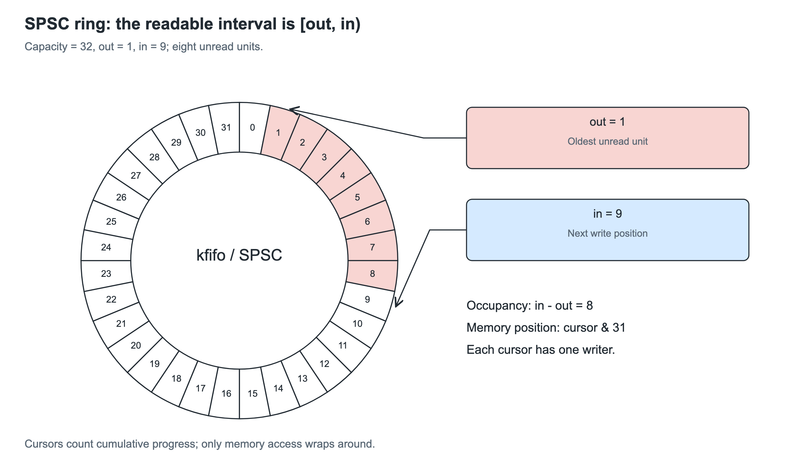

<p align="center"><em>Figure 1: each cursor has one writer. Out identifies the oldest unread unit; In identifies the next write position.</em></p>

The `in` and `out` cursors count cumulative progress. Only memory access maps a cursor onto the ring. With capacity 16, `out=12` and `in=20` mean eight units remain unread; the next write is at `20 % 16 = 4`. Later examples using cursor values such as 1000 and 1030 follow the same convention.

Red cells contain unread data. For a power-of-two capacity, `cursor & (size - 1)` computes the physical position.

Using illustrative acquire/release interfaces:

```c
unsigned int kfifo_in(struct kfifo *fifo, const void *buf, unsigned int len)
{
    unsigned int in = fifo->in.load_relaxed();
    unsigned int out = fifo->out.load_acquire();
    unsigned int n = min(len, fifo->size - (in - out));
    unsigned int offset = in & (fifo->size - 1);
    unsigned int first = min(n, fifo->size - offset);

    memcpy(fifo->buffer + offset, buf, first);
    memcpy(fifo->buffer, (const char*)buf + first, n - first);
    fifo->in.store_release(in + n); // Publish completed writes
    return n;
}

unsigned int kfifo_out(struct kfifo *fifo, void *buf, unsigned int len)
{
    unsigned int out = fifo->out.load_relaxed();
    unsigned int in = fifo->in.load_acquire();
    unsigned int n = min(len, in - out);
    unsigned int offset = out & (fifo->size - 1);
    unsigned int first = min(n, fifo->size - offset);

    memcpy(buf, fifo->buffer + offset, first);
    memcpy((char*)buf + first, fifo->buffer, n - first);
    fifo->out.store_release(out + n); // Return consumed space
    return n;
}
```

The producer alone changes `in`, and the consumer alone changes `out`, so no CAS is needed to claim either cursor. The producer copies bytes before publishing `in` with release semantics. After acquiring that progress, the consumer can also see the preceding writes. Publishing `out` works in the reverse direction: the producer can reuse space after the consumer finishes reading it.

These atomic loads and stores communicate progress. CAS coordinates multiple writers to a shared variable. If two producers used the code above, both could read the same `in` and copy into the same position. They first need distinct reservations.

### 2.2 LMAX Disruptor: reserve, then publish

[LMAX Disruptor](https://github.com/LMAX-Exchange/disruptor) is a concurrency framework also used by Log4j2's asynchronous logging. Its ring uses slots; in this logging illustration each slot holds a reference to a log-entry object.

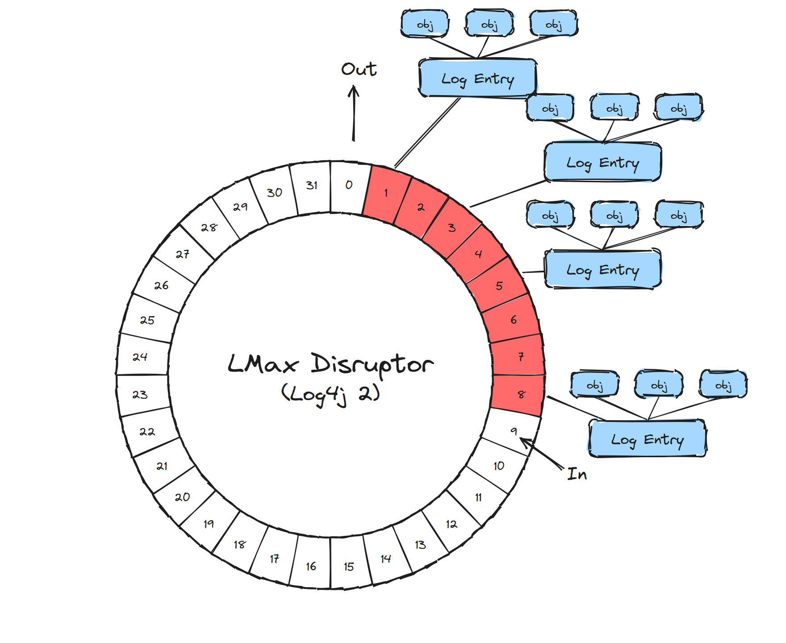

<p align="center"><em>Figure 2: slots hold references; the referenced objects hold the record data.</em></p>

Multiple producers can use compare-and-swap (CAS) to claim a position. A CAS updates the cursor only if it still matches the expected value; on failure, the producer reads it again and retries.

A simplified concurrent reservation based on kfifo looks like this:

```c
unsigned int kfifo_in_concurrent(struct kfifo *fifo, const void *buf, unsigned int len)
{
    unsigned int old_in, new_in, free_space;

    do {

        old_in = fifo->in;

        free_space = fifo->size - (old_in - fifo->out);
        if (len > free_space) {
            return 0;
        }

        new_in = old_in + len;

    } while (!__sync_bool_compare_and_swap(&fifo->in, old_in, new_in));

    // Reservation succeeded; completion still needs separate publication.
    write_data_to(old_in/*to*/, buf/*from*/, len/*size*/);

    return len;
}
```

A successful CAS reserves the interval starting at `old_in`. Failure means another producer advanced the cursor, so the caller recalculates capacity and retries. Distinct reservations solve the overlap problem, but completion still needs publishing.

A reservation cursor cannot be the readable boundary. One producer can finish copying before publishing `in`; multiple producers may complete their copies in a different order from their reservations.

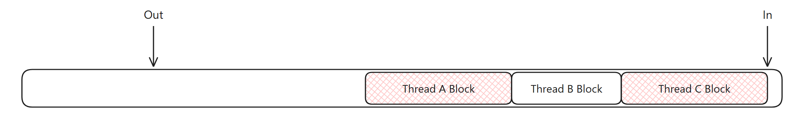

<p align="center"><em>Figure 3: A and C have finished writing, but B has not. In no longer identifies the readable boundary.</em></p>

The consumer must stop at B even if C is ready. Disruptor tracks publication through slot sequences. BqLog stores variable-length data directly in the ring and uses the chunk states described below.

## 3. Allocating MISO space with fetch_add

### 3.1 The cost of CAS retries

When producers repeatedly CAS the same cursor, losers must reload and retry. More contention means more failed attempts. MISO uses `fetch_add` on its common allocation path.

### 3.2 Reserve first, then check capacity

`fetch_add` atomically increments a value and returns its previous value. Updates to that variable still have an order, but every caller receives a distinct starting position without a software compare-and-retry loop.

The reservation alone can be illustrated as:

```c
unsigned int kfifo_in_concurrent(struct kfifo *fifo, const void *buf, unsigned int len)
{

    unsigned int from = __sync_fetch_add(&fifo->in, len);

    // Reservation only; capacity must be checked before writing.
    write_data_to(from/*to*/, buf/*from*/, len/*size*/);
    return len;
}
```

Starting with `in=0`, producers A, B and C request 10, 5 and 15 bytes. One ordering gives A=0, B=10, C=15. Another gives B=0, C=5, A=20. In both cases, the final cursor is 30.

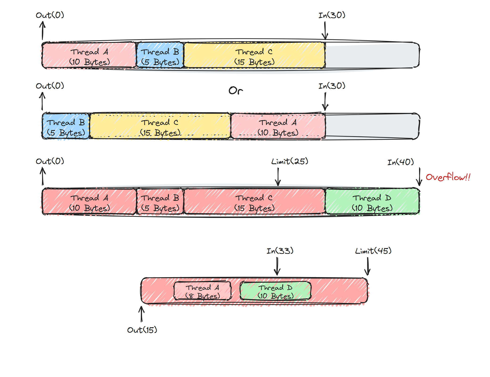

<p align="center"><em>Figure 4: fetch_add assigns disjoint intervals, but capacity must still be checked.</em></p>

CAS checks that nobody has changed the cursor before updating it. `fetch_add` advances it immediately. Its intervals do not overlap logically, but an interval can extend beyond the available ring space.

### 3.3 Rolling back an out-of-capacity reservation

In the example, the writable limit is 25 and reservations advance `In` to 40. Part of C and all of D lie beyond the limit and cannot yet be written.

If the consumer advances `Out` to 15, the writable limit moves to 45. Those intervals may then become usable. Rollback must account for this concurrent progress.

CAS-based reservation checks capacity before committing the cursor update. If another producer moves the cursor, its CAS fails and the check repeats. MISO instead checks after reservation and rolls back if necessary. The pseudocode below omits ring wraparound details; its `in_` and `out_` are the write cursor `write_cursor_` and read cursor `read_cursor_` in the source, and from [§4](#4-the-hardware-cost-of-a-shared-write-cursor) on the text uses the source names:

```c
void* bq::miso_ring_buffer::alloc(size_t len)
{

    size_t in = this->in_.load_relaxed();
    if (in + len - this->out_cache_ > this->size_) {
        this->out_cache_ = this->out_.load_acquire();
        if (in + len - this->out_cache_ > this->size_) {
            return nullptr;
        }
    }

    size_t from = this->in_.fetch_add_relaxed(len);

    while (from + len > this->out_.load_acquire() + this->size_)
    {

        size_t expected_in = from + len;
        if (__sync_bool_compare_and_swap(&this->in_, expected_in, from))
        {

            return nullptr;
        }
    }

    return to_addr(from);
}
```

Rollback still uses CAS and may fail repeatedly. BqLog confines this coordination to reservations beyond the capacity limit. With space available, one `fetch_add` obtains the position; otherwise the producer waits for later reservations to be withdrawn or for the consumer to free enough space. The real implementation treats an exactly-full reservation as out of bounds (the comparison uses ≥). The cursors are 32-bit unsigned integers, and the source comments state the bound themselves: wraparound becomes possible only after cumulative allocations across all threads reach the order of hundreds of GB, far beyond the actual scale of a log buffer.

Why not simply subtract the caller's length with `fetch_add(&in, -len)`? Other reservations may have become valid while the consumer advanced.

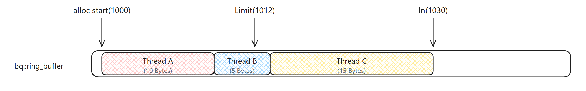

<p align="center"><em>Figure 5: B and C reserve intervals beyond the current writable limit.</em></p>

Initially `in=1000` and the writable limit is 1012. After A, B and C reserve space, `in=1030`. Consider this interleaving:

1. B subtracts 5, moving `in` to 1025.
2. The consumer frees space, moving the writable limit to 1040.
3. B requests 5 bytes again and receives [1025,1030).
4. C sees that its original [1015,1030) now fits and starts writing.

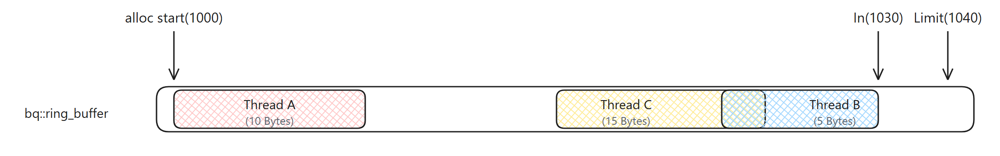

<p align="center"><em>Figure 6: subtracting B's length allows its next reservation to overlap C's valid interval.</em></p>

Rollback must proceed from the reservation tail. A producer cancels only when CAS confirms `in == from + len`, meaning its reservation is still last. Otherwise it waits. If the consumer frees enough space meanwhile, the producer can keep and use its reservation. In the rollback ordering shown, C retreats from 1030 to 1015, then B from 1015 to 1010.

The implementation is in [miso_ring_buffer.cpp](../src/bq_log/types/buffer/miso_ring_buffer.cpp) and [miso_ring_buffer.h](../src/bq_log/types/buffer/miso_ring_buffer.h).

### 3.4 A reservation is not a completed record

A can reserve first and finish after B. The consumer therefore needs a completion state at A's position.

MISO divides the ring into **128-byte ring blocks**. Each variable-length chunk starts with an eight-byte header:

```text
block_num: 3 B | status: 1 B | data_size: 4 B | payload ...
```

`unused` means no readable data, `used` means writing is complete, and `invalid` means skip this interval. After copying, the producer stores `used` with release semantics; the consumer acquires that state before reading the payload. This serves the same publication purpose as `in` in the SPSC example, but records publish completion individually.

Reservation only needs to assign distinct positions, so its `fetch_add` can use relaxed ordering: relaxed guarantees only that the addition itself completes atomically, with no visibility of other memory attached, and that guarantee is all this step needs. Publishing the completed data is a separate operation.

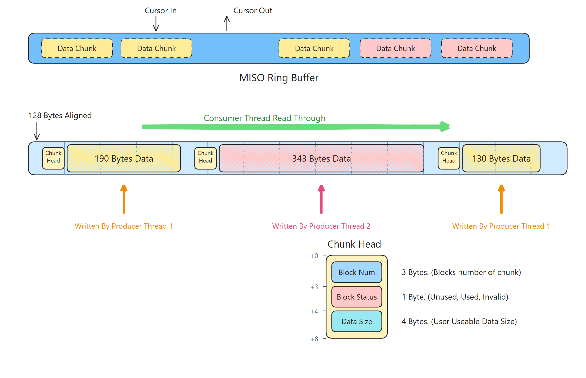

<p align="center"><em>Figure 7: chunks occupy whole 128-byte ring blocks and start with an eight-byte header. The consumer follows cursor order.</em></p>

`invalid` handles reservations crossing the ring's physical end. A byte FIFO can split a copy into two parts, but BqLog cannot: the upper layer takes the address of this region and writes the format and arguments into it directly (part 3, [section 3.1](<Article 3_Why is BqLog so fast - Optimizing the Compressed Log Pipeline.MD#31-java-and-c-write-arguments-into-the-bus>)), and splitting it into two parts would mean copying twice. MISO marks the entire crossing reservation invalid so the consumer can skip it, then allocates another contiguous region.

The 128-byte allocation unit creates internal fragmentation. A 61-byte internal record plus a 16-byte LP context (recording order and thread identity; [section 7](#7-three-scenarios-connecting-the-structures) gives the details) and an eight-byte chunk header needs 85 bytes but occupies a whole block. Separate aligned regions reduce false sharing between producers, at the cost of unused space in small records.

Two more changes reduce cursor synchronization:

- Each producer caches the read cursor in thread-local storage (TLS), where every thread keeps its own copy, which becomes invalid when the thread exits. It refreshes the shared value only when the cached capacity is insufficient. An old read cursor underestimates available space, so it cannot cause unread data to be overwritten.
- The consumer batches resets to `unused` and publication of `read_cursor_`, after consuming a quarter of the ring or reaching an empty queue.

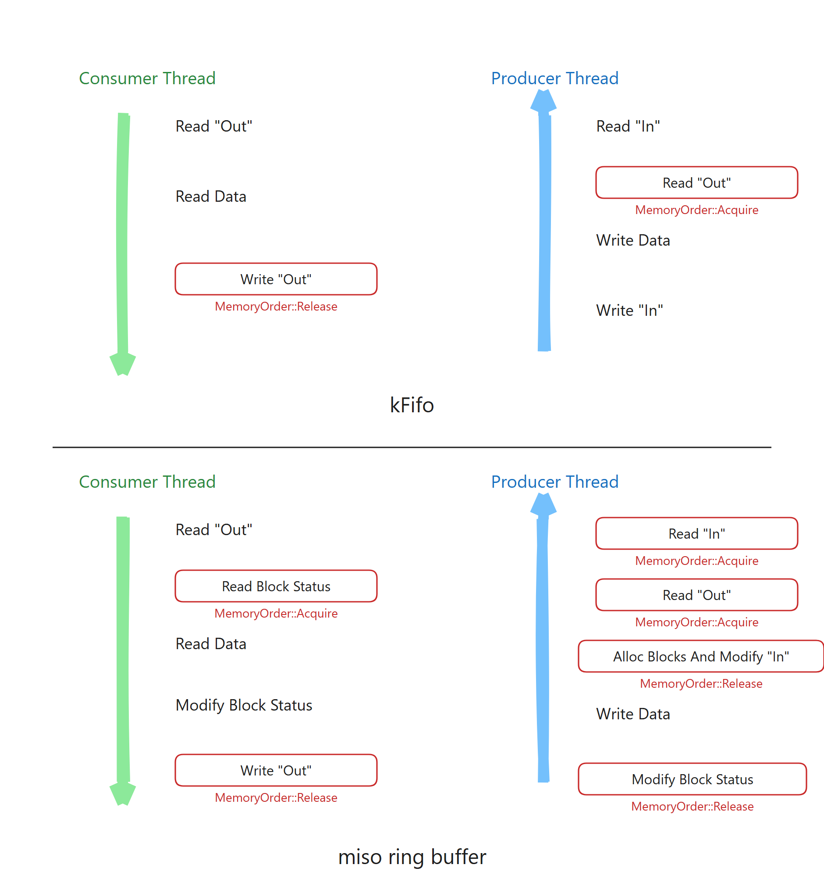

<p align="center"><em>Figure 8: MISO publishes each chunk's completion as well as updating cursors; space is returned in batches.</em></p>

Synchronization occurs during reservation, publication and space return. Copying the payload does not compete for the shared cursor.

## 4. The hardware cost of a shared write cursor

MISO avoids CAS retries when space is available, yet all producers still update `write_cursor_`. What happens when those producers run on different cores?

Suppose cores A and B each have a producer. Before updating the cursor, A needs write ownership of its cache line. When B updates it next, the coherence protocol must grant B write ownership and invalidate other stale copies. Alternating writes repeatedly coordinate access to the same cache line. Atomic `fetch_add` must follow these rules too.

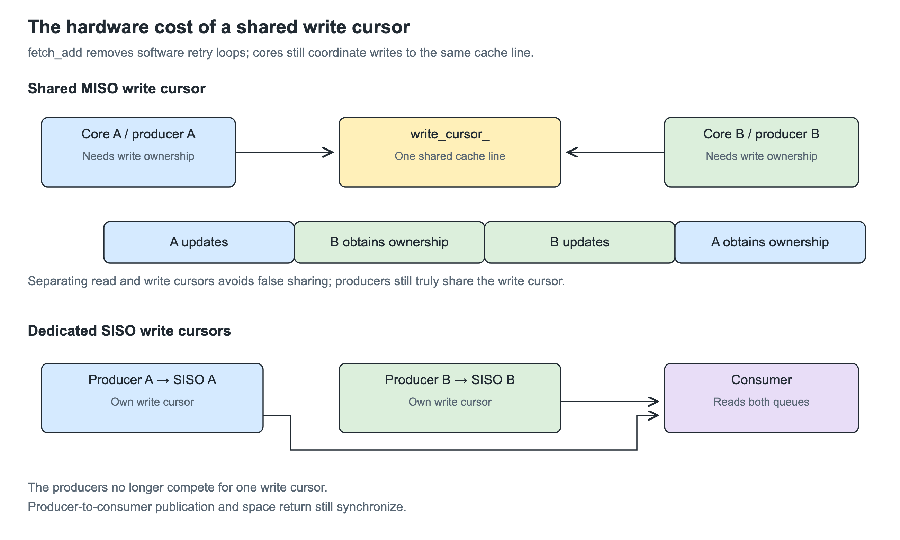

<p align="center"><em>Figure 9: producers on two cores alternate ownership of the shared cursor's cache line. Dedicated SISO queues separate their write cursors.</em></p>

MISO already separates `write_cursor_` from `read_cursor_` to avoid false sharing: unrelated variables interfering because they occupy the same cache line. Multiple producers updating the same variable create true sharing, which padding cannot remove.

Further reducing producer contention requires reducing shared writes. BqLog gives high-frequency producers their own write cursors.

## 5. Dedicated SISO queues for high-frequency threads

### 5.1 One writer per cursor

A `siso_ring_buffer` has one producer and one consumer. The producer owns the write cursor and the consumer owns the read cursor. Giving high-frequency threads separate queues removes competition between producers on each record's write cursor.

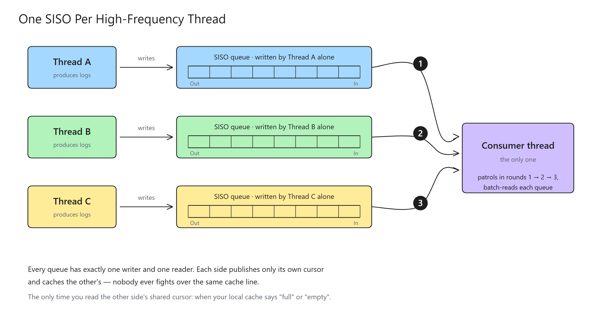

<p align="center"><em>Figure 10: each high-frequency producer writes its own SISO; the consumer visits queues and reads batches.</em></p>

kfifo works with two cursors, one owned by each side, so why does the SISO header occupy four C-byte regions? Because both sides should normally work from their locally cached positions and refresh the other's shared cursor only when space or data runs out: with a local copy next to each shared cursor, most accesses never touch shared memory. The four regions are:

1. Consumer-local state: cached read position, known write position and capacity.
2. Producer-local state: local write position and cached read position.
3. Shared read cursor.
4. Shared write cursor.

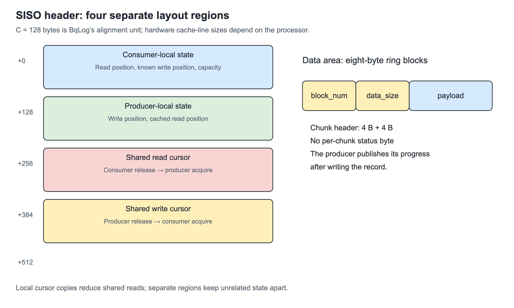

<p align="center"><em>Figure 11: four 128-byte layout regions separate the state; the data area uses eight-byte allocation units.</em></p>

A single producer also does not need MISO's per-chunk state bits: as with the kfifo in [section 2.1](#21-linux-kfifo-one-producer-one-consumer), writing the data before advancing the cursor is enough, with no per-chunk completion to report. Each chunk has an eight-byte header containing four-byte `block_num` and `data_size`, and allocation granularity shrinks to eight bytes.

At the start of a batch, the consumer reads the write cursor and uses it as that batch's endpoint. It returns the consumed space before visiting other queues. This reduces shared-cursor accesses and prevents a continuously active producer from retaining the consumer indefinitely.

### 5.2 Why low-frequency threads share MISO

Giving 1000 threads 64 KiB each would consume 62.5 MiB for data alone. Dedicated buffers are poorly utilized when most threads log infrequently.

BqLog combines the queues:

```text
LP (Low Performance): low-frequency threads share one MISO
HP (High Performance): each thread × Log has its own SISO
```

Each thread's TLS tracks write frequency per Log. The default threshold is 1000 records per second. Reaching it promotes the thread to HP; falling below it returns the thread to LP. This counter decides whether a dedicated buffer is worthwhile without maintaining detailed per-record statistics.

A note on the number of consumers: in the default asynchronous mode, all Logs in the process share one background consumer thread. A Log can also be given its own thread, or use synchronous mode, where the calling thread writes directly without going through the bus. In this article, the consumer refers to that shared thread by default.

## 6. Managing the SISO queues

Dedicated queues introduce lifecycle questions: where does a new thread obtain one, how is it returned, and how does the consumer traverse the collection? Memory usage also needs to follow threads as they join and leave.

### 6.1 Considering an array

An array holding SISO objects directly is straightforward to scan. It works well in a benchmark where threads start and exit together. Real applications may resize thread pools or create short-lived loading threads.

Growing such an array can move objects whose addresses producers still hold. Reserving a large array up front avoids movement but reserves substantial memory.

Registration and removal also overlap the consumer's traversal. A global lock would pause the consumer during these changes. An array of pointers can keep queue addresses stable, but slot publication, reuse and queue lifetime still need coordination.

There is only one consumer. If it stops, all producers may continue filling queues. Local synchronization allows structural changes without stopping consumption of unrelated queues. A linked list can protect individual links and restrict insertion and deletion to a small part of the collection.

### 6.2 Restricting where the list changes

A list node is a **Group**, a contiguous allocation usually backed by one memory-mapped file (mmap): keeping the buffer in file-mapped memory means its contents remain inspectable after a crash, which is the basis of the recovery in [section 7.3](#73-recovery-after-a-crash). A Group contains several blocks. Each block starts with a 128-byte management area for linkage and state, followed by an in-place SISO object and its data area. One block holds a dedicated queue.

A Group block is a queue-management unit containing an entire SISO. The ring blocks in [section 3](#3-allocating-miso-space-with-fetch_add) are allocation units inside a ring. From here, discussion of a Group's blocks refers to the larger management unit.

Allowing producers to remove Groups during consumer traversal would create invalid pointers. BqLog restricts structural changes:

> Producers insert only at the head; only the consumer removes nodes.

A new Group points to the former head. The consumer may discover it this round or the next. Since the consumer alone removes Groups, ordinary data traversal does not need a lock at every node.

Structural operations protect links with read-write spinlocks:

1. Producers searching for a free queue acquire read locks hand over hand: secure the next link before releasing the previous one. The consumer cannot remove a node they are using.
2. Inserting a new Group briefly locks the head link, leaving the middle of the list available to the consumer.
3. Removal holds the predecessor link's write lock and briefly takes the target Group's next-link write lock to wait for traversing readers to leave. An empty Group is then detached and moved to an object pool for later reuse — [section 6.5](#65-free-slots-do-not-necessarily-mean-reclaimable-memory) covers its full lifecycle.

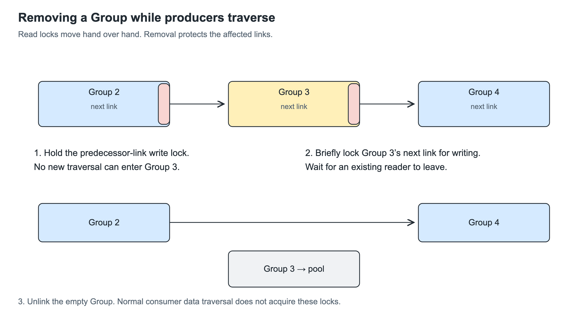

<p align="center"><em>Figure 12: removing Group 3 protects the predecessor link and waits for readers passing through Group 3. Normal consumer data traversal uses neither lock.</em></p>

These locks cover structural changes, not individual record consumption.

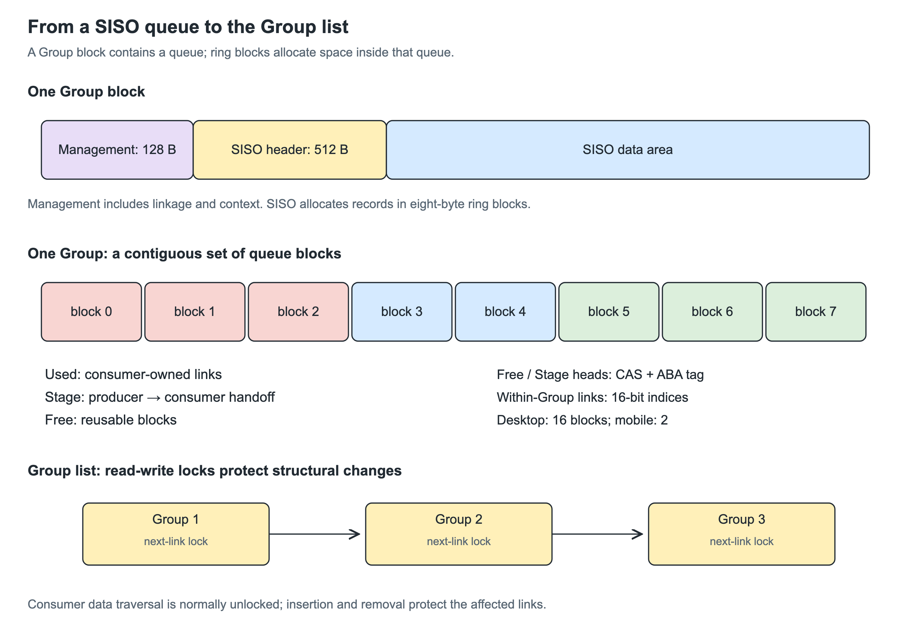

<p align="center"><em>Figure 13: blocks contain SISO queues; Groups contain blocks. Free and Stage use atomic head updates, while Group links use read-write locks.</em></p>

### 6.3 Three lists inside each Group

A single list with busy/free flags would make producers and the consumer scan and modify the same structure. BqLog separates blocks by their lifecycle state:

| List | Producer | Consumer |
|---|---|---|
| **Free** | CAS pop to obtain a block | CAS push to return a block |
| **Stage** | CAS push after initialization | CAS pop during traversal |
| **Used** | Writes its SISO; does not modify list links | Exclusively traverses, links and unlinks |

The consumer owns Used. A producer obtains a Free block, initializes it and publishes it to Stage. Cross-thread list-head updates are confined to Free and Stage during these lifecycle operations.

CAS alone also needs protection against ABA. Suppose Free is A→B→C. Thread P reads head A and next B, then pauses. Other threads take A and B, and return A. P again sees head A, but B is now in use. Comparing only A would let P incorrectly install B as the head.

The 32-bit head combines a 16-bit block index with a 16-bit incrementing tag. When A returns, the changed tag makes P's stale CAS fail. The tag wraps as a 16-bit counter. Used needs ordinary link assignments because it has only one writer.

Stage keeps producers from modifying Used while the consumer traverses it. Producers publish initialized blocks to Stage; the consumer takes them and updates its own Used list.

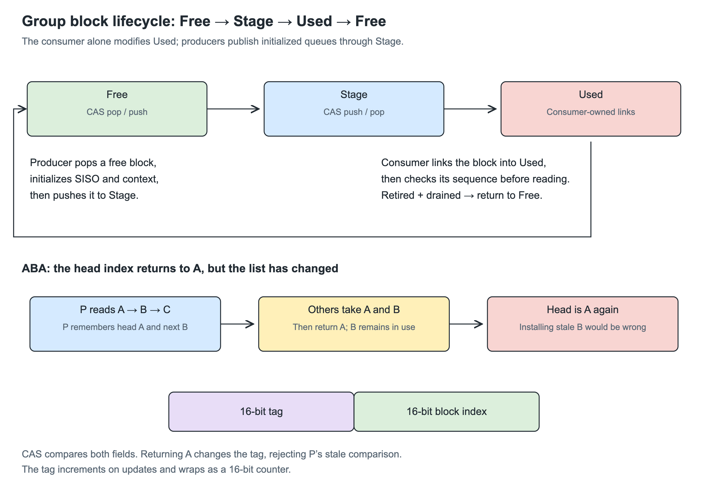

<p align="center"><em>Figure 14: a block moves from Free through Stage to Used, then returns to Free after retirement. Free and Stage heads carry ABA tags.</em></p>

Links store **16-bit block indices**, with `FFFF` meaning empty. Blocks are contiguous within a Group, so an index locates them. After mmap remapping, the base address may change; indices still identify the same blocks. Recovery uses this property.

### 6.4 Choosing the Group size

Putting several queues in one Group has three practical benefits:

- One mmap allocation supplies several queues.
- Each Group has an independent mmap file with configuration checksum information, allowing recovery to validate and discard files individually.
- A detached idle Group waits in the object pool for reuse instead of being destroyed on the spot.

Desktop platforms use 16 blocks per Group; memory-constrained mobile platforms use two.

### 6.5 Free slots do not necessarily mean reclaimable memory

Suppose three Groups each retain one active queue. Most blocks are free, but none of the three Groups can be released. Waiting for those threads to exit may retain the memory for a long time. This is the same problem as memory fragmentation: when live data is scattered, no whole block of resources comes free.

BqLog compacts actively, like memory defragmentation — but classic defragmentation moves live data, while here what moves is the destination of writes: live queues stay put, and only future writes are rerouted into the holes up front. Five steps:

1. While patrolling the list, the consumer counts the free slots in the Groups nearer the head;
2. With holes to spare, it marks live blocks in Groups further back as "needs reallocation";
3. On its next write, the producer sees the mark: the old block is marked removed, and a new block is claimed from the front-most Group with a hole — writing never pauses;
4. New records go to the new queue; the consumer keeps draining the old one, with order guaranteed by seq (see the end of this section);
5. A drained block returns to Free; a fully empty Group is unlinked and moved to the pool.

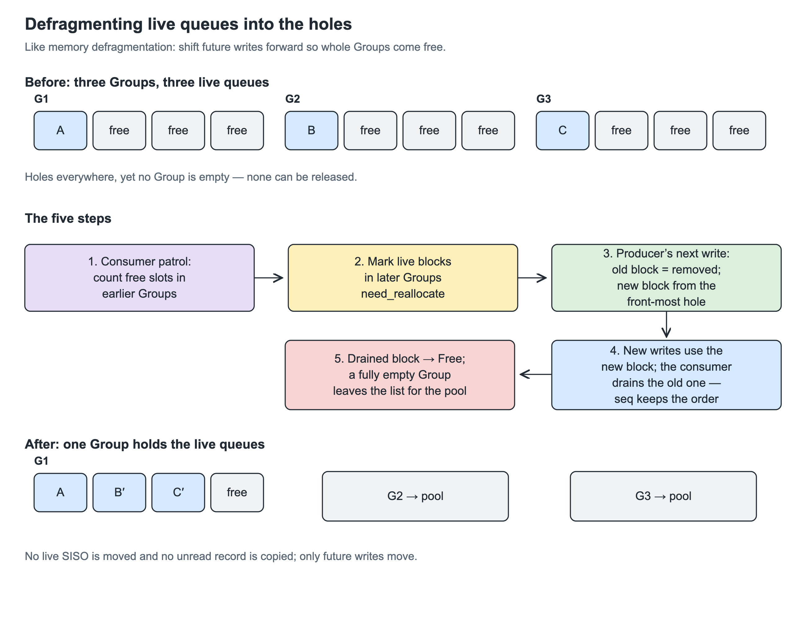

<p align="center"><em>Figure 15: the five steps of compaction. Holes are always filled from the front, so Groups nearer the tail empty out — compaction converges instead of oscillating.</em></p>

Once a Group is completely empty, the consumer unlinks it (the two-write-lock path from [section 6.2](#62-restricting-where-the-list-changes)) and it lands in the object pool, whose policy is "reuse first, release last": building a Group costs an mmap plus initialization, while reusing a pooled one pays neither. The pool pops from its head (last-in-first-out), so the most recently returned Group is the one most likely to still be in the CPU cache.

Can the pool grow without bound? No: a new Group is created only when the pool is empty and every Group is full, so the pool tops out at the most Groups the program has ever had active at once. After the peak they stay cached; when the load returns, they get reused. That is a bounded cache, not a leak.

Destruction happens only when the Log is destroyed (usually process exit): the mapping is released and the file handle closed. The mmap file itself stays on disk — it is exactly what crash recovery in [section 7.3](#73-recovery-after-a-crash) reads (in non-recovery mode, the next startup cleans the Log's mmap folder). The code also keeps a timed-eviction entry point (`garbage_collect`) for unit tests to exercise the destruction path; production never calls it — and with the bound above, it never needs to.

One question remains about switching blocks: one thread's logs are now spread across two queues, so in what order should the consumer read them? No new mechanism is needed: the old and new blocks carry increasing sequence numbers (seq), and the consumer reconnects them in order — compaction reuses the LP/HP ordering rules unchanged ([section 7.2](#72-switching-between-lp-and-hp) has a complete example). The mark also takes effect only on the producer's next write; if the thread demotes or exits first, the old block is drained and returned along the same removal path, so no mark ever hangs forever. Expansion reuses the same block switch: new records go to the new block while old ones drain in place.

### 6.6 When management costs are paid

Promotion, demotion, exit, expansion and compaction require blocks to be obtained or returned. During steady high-frequency logging, the producer writes its existing SISO. Free, Stage and Used are absent from that per-record path. Groups organize allocation and lifetimes; dedicated queues carry the routine data traffic.

## 7. Three scenarios connecting the structures

The following cases connect the lists, cursors and contexts: a new high-frequency thread, a thread switching between LP and HP, and crash recovery.

### 7.1 A new high-frequency thread

A thread reaches `high_frequency_threshold_per_second`, 1000 by default, and needs a dedicated SISO.

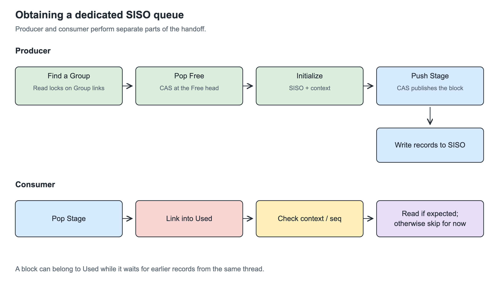

<p align="center"><em>Figure 16: the producer obtains a Free block, initializes it and publishes it to Stage; the consumer links it into Used.</em></p>

The producer:

1. Traverses Groups with hand-over-hand read locks and uses CAS to take a Free block. Only when all Groups are full does it create a new Group and insert it at the head.
2. Initializes the in-place SISO and writes its 16-byte context: version, sequence number and TLS identity.
3. Publishes the block to Stage with CAS.
4. Starts writing records into the SISO.

On reaching that Group, the consumer takes a Stage block, links it into Used, then checks its context. If its sequence number is not yet expected, it skips the block and checks again on a later visit. Membership in Used gives the consumer lifecycle ownership; sequence validation decides when its records may be read.

### 7.2 Switching between LP and HP

A thread writes A to LP, switches to HP and writes B and C, then returns to LP and writes D.

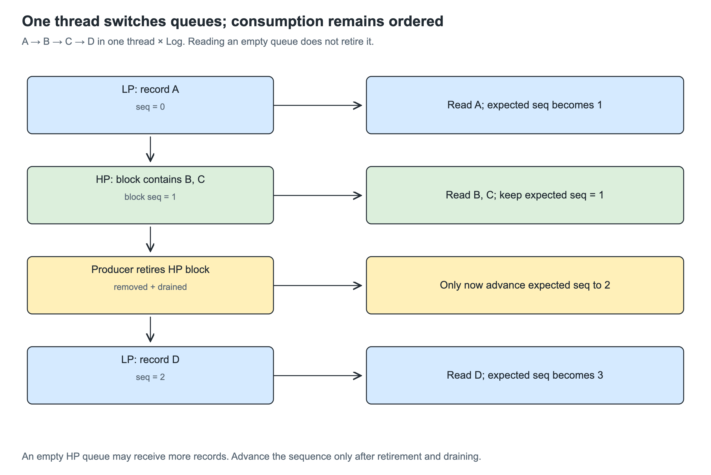

<p align="center"><em>Figure 17: context sequence numbers connect A, B, C and D across the LP and HP queues.</em></p>

Each queue is internally ordered. Yet visiting HP first can put B and C before A, while consuming LP first can put D before B and C. Queue order alone cannot reconstruct this thread's complete write order.

BqLog uses a 16-byte context for version, sequence and thread identity. The sequence increases within one thread × Log: each LP record takes one number, while each newly obtained HP block takes one number shared by its records.

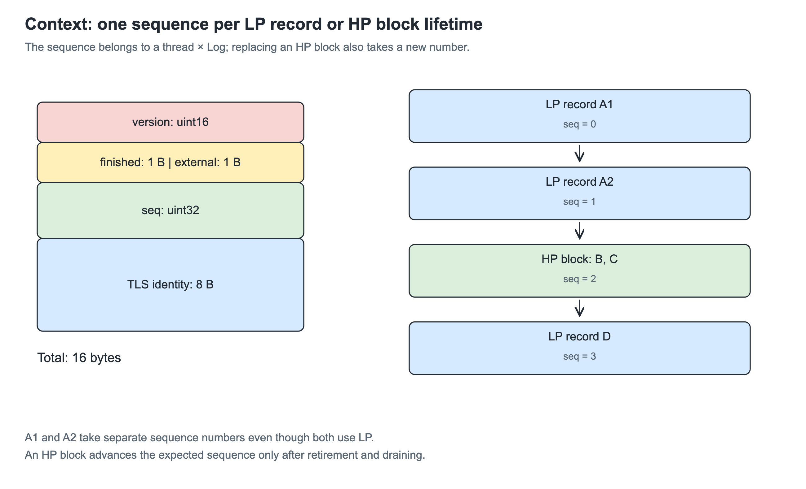

<p align="center"><em>Figure 18: the 16-byte context byte by byte. The right half shows the variant where the LP phase writes two records in a row: each LP record takes one number, and an HP block's lifetime takes one.</em></p>

The context contains a version, thread-finished flag, external-reference flag, seq and TLS identity. LP stores a context with each record; HP stores it once in the block.

Back to the scenario above: the LP record A takes seq=0, the HP block writing B and C takes seq=1, and the later LP record D takes seq=2. If the LP phase writes two records in a row, each takes its own number. Expansion or compaction can also allocate another block during a continuous high-frequency period, consuming another number.

Local sequences are enough to reconnect each thread's queues. A global sequence would make all producers compete for another shared counter.

The consumer maintains an expected sequence number for each TLS identity. Suppose it sees the HP block with seq=1 while expecting 0: it skips the block for now and processes the LP record A first. Once A is processed, the expectation becomes 1, and B and C can be read. The expectation advances to D's number only after the producer no longer uses that block and the consumer has drained it.

An empty queue alone is insufficient: the producer may write again. Demotion marks the block removed; thread exit also sets the finished flag in its context. The consumer reads the remaining records before removing the block from Used and returning it to Free.

A thread that used only LP has no HP block to mark. On exit, it writes a dedicated finish record with a seq to LP. Consuming that record lets the consumer release the thread's ordering state.

The block switches triggered by compaction and expansion in [section 6.5](#65-free-slots-do-not-necessarily-mean-reclaimable-memory) follow the same rules: the old block is marked removed, the new block takes a new seq, and the consumer drains the old block before letting the expected number move past it. The producer takes no extra action when switching queues; the sequence mechanism already covers this kind of switch.

This also connects back to a detail in part 1: when threads interleave, the consumption order of records can differ from the order in which their timestamps were taken. The consumer clamps timestamps to be non-decreasing before encoding, so files generally show no negative deltas. The negative-delta capability kept in part 1's format is used when appending meets a system-clock rollback.

### 7.3 Recovery after a crash

BqLog can back its buffers with memory-mapped files. After an abnormal exit, recovery must recognize surviving blocks and reconnect each thread's records in order.

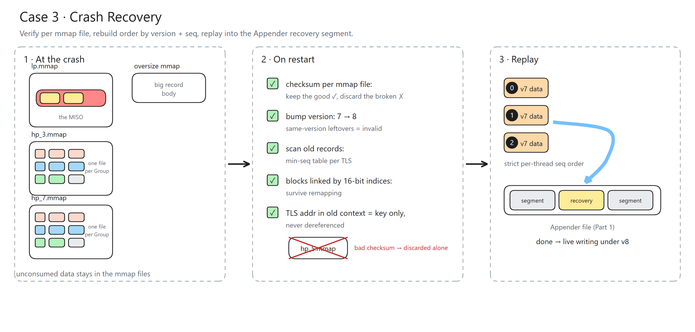

<p align="center"><em>Figure 19: validate mapped files, identify recoverable records and consume them in per-thread sequence order.</em></p>

The shared MISO, individual Groups and oversize records have separate mmap files. They may retain lists, contexts and unconsumed data after a crash.

On restart, BqLog checks file headers, configuration checksum information and internal structure, discarding damaged or incompatible files individually. Completion states identify readable records; versions identify the run to which they belong.

Suppose the current run advances the version from 7 to 8. Recovery collects records from the accepted old versions and finds the minimum seq per TLS identity. If the old mapping turns out to contain a remnant marked with the current version 8 (legitimate old data can only be version 7 or earlier), it is invalidated so it cannot masquerade as a current record. `MAX_RECOVERY_VERSION_RANGE` is two in release builds and five in unit-test builds.

Group links use 16-bit indices because remapping can change the base address. Stored TLS addresses identify old streams but are never dereferenced. Together, identity and seq allow recovery to reconnect a thread's data.

Dirty mmap pages may reach storage out of program order. For example, a block may already appear in Used while its removal from Stage has not persisted. Recovery can then see the same block in both lists and removes the duplicate from Stage.

The consumer processes old versions before the current run's records; producers may already enqueue new records meanwhile. Recovered bus records still contain raw formats and arguments and must pass through Appender encoding. On the encrypted restart path from part 1, they enter a bus-recovery segment in a new file. Already-encoded Appender cache data is recovered separately into the original file.

Separate Group files isolate damaged data. Index links and contexts make surviving queues and their ordering identifiable after remapping. Recovery requirements help shape the structures used during normal operation.

## 8. Oversize records and full buffers

### 8.1 Store occasional large payloads separately

A memory dump can exceed the ordinary ring capacity. Enlarging every resident queue for such rare records would leave much of that space idle.

BqLog stores the payload in a dedicated oversize buffer and places an external-reference parent record in LP. The parent participates in normal sequence ordering.

Commit publishes the external payload before the parent: once the consumer sees the parent, it immediately looks for its payload. Version, TLS identity and seq identify that payload. If allocating it fails, the reserved parent must become skippable and the sequence must be corrected, otherwise later records would wait for a missing predecessor.

### 8.2 When the consumer falls behind

Sustained production above consumption eventually fills any finite buffer. BqLog provides three policies:

- `discard`: fail the new write and drop the record.
- `block`: wake the consumer and wait to retry, extending application-call latency as queues back up.
- `expand`: switch from LP to HP or obtain another HP block, using memory to absorb a burst. Sustained overload still increases memory demand.

Expansion switches queues without reallocating a ring that is in use. `log.buffer_size` therefore controls only part of total memory. HP queue count, Groups, oversize records and Appender caches also contribute.

Producers request a wakeup when space is insufficient or running low. `awake_flag` merges duplicate requests. The consumer keeps working while data is available and waits for notification or timeout when idle.

## 9. Returning to the shared-cursor problem

Each layer removes a specific cost from handing records to the consumer:

- Contiguous rings avoid allocating a node per record.
- Cached cursors and batched space return reduce shared-variable access.
- MISO uses fetch_add without CAS retries while capacity is available.
- Dedicated HP queues separate frequent producer writes.
- Groups and Free/Stage/Used organize handoff, compaction and reclamation while keeping Used under consumer ownership.
- Local context sequences preserve order across queues without a global counter.
- Oversize storage keeps rare large records out of ordinary queue sizing.

The costs remain visible in their respective paths: LP's 128-byte units waste some space, HP needs dedicated memory, Group management uses locks, and full buffers require dropping, waiting or expansion. Write frequency determines which queue a thread uses.

These choices also affect later stages. Reading a SISO batch gives the consumer consecutive records from one thread, letting it reuse the last thread template index. Part 3 follows those records through copying, hashing, lookup and encoding.

## Continue with the source

- [log_buffer.h](../src/bq_log/types/buffer/log_buffer.h), [log_buffer.cpp](../src/bq_log/types/buffer/log_buffer.cpp): TLS, context, switching order, oversize logs and recycling.
- [miso_ring_buffer.cpp](../src/bq_log/types/buffer/miso_ring_buffer.cpp), [siso_ring_buffer.h](../src/bq_log/types/buffer/siso_ring_buffer.h), [siso_ring_buffer.cpp](../src/bq_log/types/buffer/siso_ring_buffer.cpp): reservation, publishing, ring-tail handling, batch reads.
- [group_list.cpp](../src/bq_log/types/buffer/group_list.cpp), [block_list.h](../src/bq_log/types/buffer/block_list.h): contiguous allocation and index lists.
- [bq_log_api.cpp](../src/bq_log/api/bq_log_api.cpp), [log_worker.cpp](../src/bq_log/log/log_worker.cpp): back-pressure and wakeups.
- [test_log_buffer.h](../test/cpp/test_log_buffer.h), [test_miso_ring_buffer.h](../test/cpp/test_miso_ring_buffer.h), [test_siso_ring_buffer.h](../test/cpp/test_siso_ring_buffer.h): the corresponding tests.
