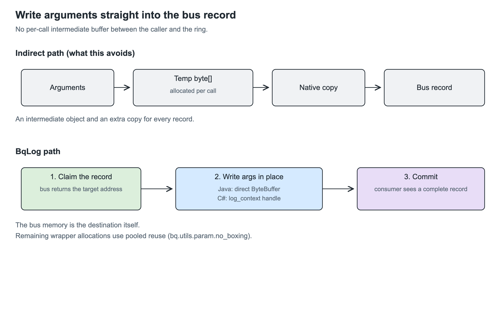
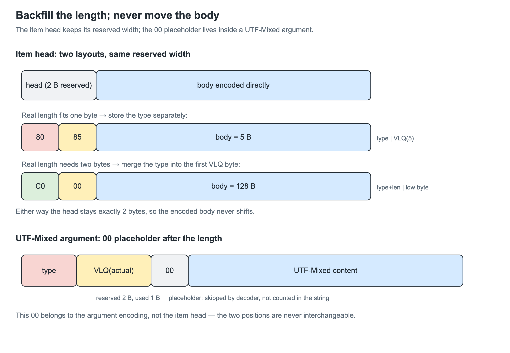

# Why is BqLog so fast? Part 3: How much work can share one memory load?

[简体中文](<文章3_为何BqLog如此快 - 压缩日志执行路径优化.MD>) · [Series](PERFORMANCE_DESIGN.md) · [Previous: the data bus](<Article 2_Why is BqLog so fast - From Ring Buffer to Adaptive Data Bus.MD>)

Parts 1 and 2 described the compressed file and the producer-to-consumer data bus. We can now follow a record through the write path and look for repeated work: scanning its format string again, probing the same hash-table slots twice, or moving encoded content to fit a length field.

Note that none of these three wastes sits inside a single step; each sits at the handoff between two steps, where the next step computes again what the previous step already produced. Small costs accumulate across millions of records. This article follows the application thread into the Appender, examining both work that can be removed and dependencies that make the CPU wait.

> This article describes BqLog 2.5.0. Pseudocode explains the design; the source files listed at the end contain the full branches.

## 1. Following one record

Suppose the application calls:

```cpp
log.info("player {} enters level {}", player_id, level_id);
```

The asynchronous compressed path has two sides:

```text
Application thread:
check level and category
compute storage for the format and arguments
reserve bus memory
copy the format and arguments
commit the record

Consumer thread:
look up format and thread templates
encode time delta, indices and arguments into the write cache
process and write batches
```

Part 2 explained the handoff. The application thread should return quickly, while the consumer must keep up with its queues. The Appender owns the template tables on the consumer side, so producers do not compete to update them.

Copying the format string already loads its characters. Hashing can use those loaded values. A failed template lookup already finds an empty slot; insertion can reuse its position.

Instruction count also leaves part of the cost unexplained. An instruction may wait for the preceding result, or for data to arrive in a CPU cache. CRC (a cyclic redundancy check, detailed in [§4](#4-compute-the-hash-while-copying)) and template lookup illustrate these two sources of waiting.

## 2. Filter before serialization

If a level or category is disabled, calculating lengths and allocating a record only to discard it would waste work.

The C++ wrapper first checks a level bitmap and a category mask. The level bitmap combines the configured Appender levels: a level accepted by none can be skipped immediately. Categories disabled at the Log level are also filtered here. Individual Appender enable states, categories and other conditions are checked later on the consumer side.

C++ evaluates argument expressions before entering a function:

```cpp
log.debug("state={}", build_expensive_state_string());
```

Even if debug is filtered, `build_expensive_state_string()` has already executed. An expensive argument needs a caller-side enabled check before construction. Filtering inside the wrapper saves serialization and submission work after function entry. This is the only step on the whole path where the savings depend on the caller; the savings of every later step are guaranteed by the library itself.

## 3. Carry known lengths into serialization

The sizes of int32, double and bool follow from their types. No content scan is needed.

Strings have several sources: an object may carry its size, a pointer may require scanning to a terminator, and an array may expose its extent to the compiler. Reducing all of these to `strlen` would discard existing information.

For UTF-8 and UTF-16 inputs that need no transcoding, the wrapper can use array or object lengths. A zero-terminated pointer requires a scan. UTF-32 is converted to the bus's UTF-16 representation, so its content must still be examined to determine the output size. A known source character count does not always give the destination byte count.

Reservation needs the total size; writing each argument needs its individual size. `size_seq` (the argument size sequence) combines compile-time sizes with runtime results so both operations can use the same information.

For an int32, a double and a string containing n bytes, the required space is the fixed header, argument areas, n content bytes and alignment padding. The 61-byte record in part 1's figure 4 was added up in exactly this way. The wrapper can write directly into the bus record without assembling a temporary argument array.

These are bus-layout sizes: integers still occupy fixed widths, with suitable alignment. Section 9 concerns lengths after file encoding, where the same integer may occupy fewer bytes as VLQ. Each stage reuses lengths within its own representation.

### 3.1 Java and C# write arguments into the bus

Creating a temporary byte array in Java, filling it, then asking native code to copy it would still allocate objects and intermediate storage per record. BqLog first reserves a bus record, then lets the wrapper fill that memory.

Java accesses the native ring through a direct ByteBuffer, with views reused on the applicable paths. C# keeps the write handle in a value-type `log_context` and fills arguments through the destination address. A final commit makes the complete record available to the consumer.



<p align="center"><em>Figure 1: obtain the destination region, write arguments, then commit; no intermediate serialization buffer is required.</em></p>

Java overloads for fixed argument counts also avoid a varargs array. For primitive values that would otherwise be boxed, `bq.utils.param.no_boxing(...)` borrows a parameter wrapper from a thread-local pool and returns it after serialization. Pool initialization and growth still allocate, and caller-created strings or stack traces have their own costs. Direct writes and object reuse work together to reduce allocation on the routine path.

## 4. Compute the hash while copying

An asynchronous consumer may run after the caller's format storage is gone, so the format must be copied into the bus. The compressed Appender also needs a hash to find matching templates.

A straightforward implementation would be:

```cpp
memcpy(destination, source, length);
hash = hash_bytes(destination, length);
```

Moving hashing to the consumer still reads the string a second time. That pass may hit a CPU cache, but it still issues loads to bring the bytes into registers. Fusing the operations removes that repeated work.

For UTF-8 and UTF-16 format strings with a direct address, `__api_log_write_begin` uses:

```cpp
head->format_hash = bq::util::bq_memcpy_with_hash(
    handle.format_data_addr, format_str_data, format_str_bytes_len);
```

The loop shows how the two operations share data:


<p align="center"><em>Figure 2: the 32-byte main loop loads four 64-bit values for both copying and CRC updates. The lower example shows the tail overlap for length 45.</em></p>

```cpp
// Illustration; production code also handles lengths, hardware and tails.
load_8_bytes(v0, source + 0);
load_8_bytes(v1, source + 8);
load_8_bytes(v2, source + 16);
load_8_bytes(v3, source + 24);

store_8_bytes(destination + 0, v0);
store_8_bytes(destination + 8, v1);
store_8_bytes(destination + 16, v2);
store_8_bytes(destination + 24, v3);

h0 = crc_update(h0, v0);
h1 = crc_update(h1, v1);
h2 = crc_update(h2, v2);
h3 = crc_update(h3, v3);
```

The same `v0..v3` values feed the stores and the CRC states. CRC is originally a cyclic redundancy check; modern CPUs provide a single instruction for it, and BqLog borrows that instruction to compute its hash. One update is one instruction, and its execution characteristics directly determine how fast the hash is, as the next section explains. The hashing part therefore needs no separate set of loads over the whole string. A fixed eight-byte `memcpy` usually compiles into loads and stores while avoiding unaligned typed-pointer dereferences in the source.

### 4.1 Why use four CRC states?

Updating one state for every word gives:

```text
h = crc(h, v0)
h = crc(h, v1)
h = crc(h, v2)
h = crc(h, v3)
```

The second update needs the first result, and the third needs the second. Even an out-of-order CPU must wait until an instruction's inputs are ready.

Instruction latency and throughput are different. A CRC instruction can take several pipeline stages to produce its result while the execution unit accepts another independent CRC before that result is ready.

Suppose latency is three cycles and the pipeline can accept one CRC per cycle. A single state allows four updates to start at cycles 0, 3, 6 and 9. Four independent states can start at 0, 1, 2 and 3. These illustrative numbers show the effect of the dependency.

BqLog splits the long dependency chain into four. Updates within each chain remain dependent, but the chains can advance independently. The out-of-order scheduler can also interleave ready loads and stores. This is instruction-level parallelism on one core and needs no extra threads.

After the loop, rotations and XORs combine the states into a 64-bit hash. This defines BqLog's template-lookup hash; it does not equal the standard CRC of the entire string processed with one accumulator. Fused copying and hash-only processing use the same algorithm and return matching hashes.

### 4.2 A little overlap simplifies the tail

For inputs of at least 32 bytes, the main loop processes 32-byte blocks. A remainder could be handled in 16-, 8-, 4-, 2- and 1-byte pieces, each with another decision. Instead, the implementation processes the final 32 bytes of the input. Shorter inputs have separate paths.

At length 45, the main block is [0,32) and the final block is [13,45), so [13,32) is read again. The repeated stores target the same offsets, leaving the copy unchanged. The hash definition includes this overlap.

The three choices address different costs: fusion removes the extra full traversal, independent CRC chains reduce dependency stalls, and overlapping tail handling reduces branches.

### 4.3 Pass the hash to the consumer

The producer stores the result in the `format_hash` field of the 40-byte record header (the 40-byte memory header in part 1's figure 4), and it travels with the record to the consumer; otherwise the consumer would have to recompute it. The consumer uses a nonzero value directly and computes a hash when it is zero.

Stack-trace concatenation, wrapper-filled formats and some encoding conversions may not provide a format address at the begin call. Go's fused native interface does pass that address; JNI and NAPI coverage depends on how each obtains the string data. A hash that happens to be zero also causes recomputation.

The runtime hash is not stored in the file. The decoder follows file template indices without reproducing the writer's hash.

## 5. Choose the template cache for its access pattern

Part 1 removed repeated formats from file records, leaving each record with an index. The Appender now has to find that index for every format it consumes.

Average O(1) lookup says little about memory latency. A node-based table may load a pointer before it can load the target node; cache misses turn those steps into waits. Fewer probes and a smaller frequently accessed region can shorten the path.

Log formats have temporal locality: the application repeatedly executes the same logging statements. BqLog places a small direct-mapped L1 before the larger table: 256 slots for formats and 64 for threads. Each key has one candidate slot. Comparing the full key yields an index immediately on a hit.

**L1 and L2 here are software caches maintained by the Appender.** With common 64-bit layouts, the format and thread L1 tables occupy about 4 KiB and 1 KiB. Repeated accesses to this small region are more likely to remain in CPU data caches. A software L1 hit avoids the larger table; the names do not bind either table to a specific hardware cache level.

L2 retains more mappings. Two keys mapping to the same L1 slot replace one another there. A subsequent L1 miss checks L2 and fills L1 with the result.

Producers cache thread IDs and names in TLS to reduce repeated system queries. On the consumer side, thread lookup starts with an even shorter check: if the ID matches the preceding record, reuse its template index. SISO batch reads from part 2 produce consecutive records from one thread, making this reuse useful before even consulting L1.

The format key includes category and level:

```cpp
key = format_hash ^ ((uint64_t(category_index) << 32) | level);
```

The same string used with another category or level requires another template, so both fields participate in the key.


<p align="center"><em>Figure 3: L1 hits return immediately. Misses proceed to L2; an empty slot found there can be reused by insertion.</em></p>

## 6. Reduce L2 memory traffic and repeated probes

### 6.1 Separate keys and values

L2 uses open addressing with linear probing. Entries occupy array slots; when the candidate slot belongs to another key, lookup examines the next one. This avoids per-entry node allocations and pointer chasing.

CPUs fetch cache lines containing adjacent bytes. Probing neighboring slots can therefore reuse data loaded by an earlier probe. This spatial locality complements the temporal locality of repeatedly used formats.

Each key occupies eight bytes and each value four. On common 64-bit layouts, a struct containing both occupies 16 bytes because of alignment. Separate `keys[]` and `values[]` arrays need 12 bytes per slot in total, reducing their storage by a quarter. The same amount of CPU cache can hold more table data.

A probe still reads `values[]` to detect an empty slot and `keys[]` to compare the key. The split removes padding and shrinks the table; it does not eliminate one of these reads.

With the default limit of 100000 format entries and roughly 50% load factor, a power-of-two capacity can reach 262144 slots, about 3 MiB for the arrays. L1, allocator overhead, old and new arrays during growth, and other Logs add to total memory.

### 6.2 Keep the empty slot found by a miss

Suppose a lookup starts at slot 3:

```text
slot 3: occupied by another key
slot 4: occupied by another key
slot 5: empty
```

The miss already found an insertion position. Separate `find(key)` and `insert(key, value)` calls could probe 3, 4 and 5 again after the Appender writes the new template.

BqLog's `find` returns an `insert_token` containing the slot and `table_revision`. If the table remains unchanged, insertion reuses that position. A changed revision requires another lookup.

Resizing, for example, can change a key's position and invalidate the token. With a stable table, the token saves the repeated calculations, empty checks and comparisons even when all those slots would hit a CPU cache.

### 6.3 Mix the key again for slot selection

A format hash and a slot-selection hash serve different purposes. A key may contain an aligned thread ID or category bits high in the word. Masking raw low bits can concentrate such keys in a small part of the table.

Concentrated starting positions create long probe runs and more reads and comparisons. BqLog applies a common bit-mixing function (Murmur3's fmix64 finalizer) and selects from the mixed high bits, distributing the effect of the input bits across slot positions.

Different keys choosing the same slot are handled by comparison and probing. Different formats producing the same complete 64-bit key get no re-check against the original strings: if that really happens, the writer treats the two formats as one template. That is the cost of relying entirely on a 64-bit key to distinguish formats.

## 7. Limit replacement when the cache is full

A bounded L2 limits memory, but it must also decide which new formats to admit.

Imagine 101 templates repeatedly passing through a cache that holds 100. Replacing an old entry on every miss can evict the one needed next. A stream of one-off dynamic formats can similarly displace a useful working set.

Once full, L2 admits **one out of every 64 new insertion attempts** and selects a victim with a rotating position. It does not count each format's frequency. Slower replacement reduces disruption from incoming formats and performs fewer eviction and insertion operations.

A rejected admission only means the mapping is not kept in L2. The template and record still enter the file, and L1 may retain the mapping. If a later lookup misses both levels, the writer emits another template and gives the record a new index. Repeated misses can therefore increase file size while records remain decodable. This is exactly the trade-off announced in [section 4](<Article 1_Why is BqLog so fast - High Performance Realtime Compressed Log Format.MD#4-inside-the-templates>) of part 1: cache eviction affects only reuse rate and file size.

When growing the table, the implementation allocates new arrays, migrates entries, then releases the old arrays. Allocation failure leaves the old table in use. Peak-memory estimates must include both arrays during migration.

## 8. Fast conversion of the ASCII prefix

Part 1 introduced UTF-Mixed: narrow the initial ASCII content, then retain a UTF-16 suffix. Here is how the fast portion runs.

ASCII code points lie in `0x0000..0x007F`. Their UTF-16 code units have nine zero high bits, allowing the high byte to be removed.

The scalar implementation loads four UTF-16 code units into a 64-bit value and checks them together:

```text
v & 0xFF80FF80FF80FF80
```

A zero result means all four can be narrowed. The code extracts and packs their low bytes, using the loaded value for both the test and conversion.

SIMD checks larger batches. If an entire block is ASCII, it narrows and stores the block. A block containing non-ASCII ends the fast conversion: the encoder writes `FF` and copies the remaining UTF-16 suffix. It avoids deciding how many UTF-8 bytes each remaining character needs and generating those sequences.

The split may leave a few ASCII characters in that suffix. This slightly larger output avoids searching character by character for the exact boundary.


<p align="center"><em>Figure 4: encoding cost and output size both matter when choosing whether to transcode the entire string.</em></p>

A long ASCII prefix gives this path more content to narrow. An early non-ASCII block leaves a longer UTF-16 suffix. Template hits avoid reconverting the same format; changing string arguments still require their own conversion.

Reopening an existing file requires restoring UTF-Mixed formats to temporary UTF-16 storage before reconstructing their hashes. This extra pass belongs to opening and scanning the file, rather than routine record writes.

## 9. Write the body, then backfill lengths

Bus records identify where arguments reside. Their file sizes change when integers become VLQ and UTF-16 becomes UTF-Mixed. Measuring before encoding would repeat the conversion decisions.

The Appender reserves write-cache space, leaves room for a header, and writes the body. The final pointer difference gives the actual size. Two distinct length fields are involved.

### 9.1 The outer item header

Part 1 showed two layouts: a separate type byte, or a type bit merged into the first byte of a multi-byte VLQ. BqLog uses them to keep the reserved header width fixed. If the encoded length fits the anticipated width, the type stays separate. If the length needs one extra byte, the type shares its first byte. The body stays in place in both cases.

For a two-byte reservation, body length 5 gives `80 85`: one type byte and one length byte. Body length 128 gives `C0 00`: type merged into a two-byte length. Both headers occupy two bytes. Why not always reserve the five-byte maximum? Because short items are the majority, and header width is itself space worth saving. Format templates have a separate reservation check and may cancel and retry with the measured length when it does not fit.

### 9.2 A UTF-Mixed argument's string length

A string argument has its own length field inside the body. If two bytes were reserved but the length only needs one, the encoder leaves a `00` placeholder after the length and keeps the string in place. The placeholder counts toward the outer body size but not the string length. The UTF-Mixed argument decoder skips it.



<p align="center"><em>Figure 5: the outer header keeps its width by sharing a type bit; the lower 00 belongs inside a string argument.</em></p>

The current decoder recognizes the placeholder by checking whether the first byte after the length is `00`. A string whose content really begins with 0x00 would be misread as having a placeholder, so strings beginning with NUL are a boundary that needs separate verification; this rule alone does not establish unambiguous handling of all binary string contents.

Only after a record and its required new templates are encoded does `mark_write_finished()` advance the complete-record boundary. The temporary write position can run ahead, while flush and recovery use only the completed prefix.

## 10. SIMD alignment and batched I/O in the write cache

The next three sections apply one technique in three places: find an operation with a fixed cost and let a batch of data share it. The first is batched output. Writing each small record through a file API would repeatedly pay the call's fixed overhead. The Appender encodes records contiguously in its write cache and writes batches.

The `write_cache_size` target range is 64 KiB–4 MiB, rounded to a power of two. Larger buffers can reduce write calls while increasing memory and queued output. An unusually large record may exceed the target allocation, so it is not an absolute memory ceiling. This buffer is also separate from the LP and HP capacities in part 2.

The Appender write cache is an output buffer, distinct from the CPU caches discussed earlier. Its data address must also work well with the mask address used by SIMD XOR.

For 32-byte alignment, suppose both addresses have remainder 5. Processing 27 bytes brings both to aligned boundaries, after which AVX2 can process full blocks. Different remainders cannot both be corrected by advancing the two addresses equally.

The Appender adjusts leading padding according to file position to maintain this relative alignment. Adjustment may require `memmove`, so it is concentrated at boundaries such as segment creation and flushing. A subsequent batch shares the result.

## 11. Encryption cost depends on segments and batches

Part 1 introduced segmented encryption, the second application of sharing a fixed cost across a batch: RSA and AES preparation happens at segment creation, and the payload is processed in batches. Its cost can be approximated as:

```text
total cost ≈ segment count × setup cost per segment
           + payload bytes × transformation cost per byte
           + batch count × fixed I/O cost per batch
```

Setup uses RSA to protect an AES key and AES to process the 32 KiB mask. Subsequent payload batches undergo repeating XOR in place. Longer segments share setup across more records; short segments pay it more frequently.


<p align="center"><em>Figure 6: separating execution counts explains why segment length and batch size affect total cost.</em></p>

The benchmark in part 2 writes two million records per thread: two million at one thread and twenty million at ten. Compressed and encrypted compressed output take 79 and 83 ms at one thread, and 759 and 995 ms at ten. The difference in total-path time changes with concurrency and workload size.

The format uses RSA, AES and a repeating mask, without an AEAD authentication tag. Applications requiring tamper detection need additional authentication.

## 12. Merge consumer wakeup requests

The third application is the fixed cost of notification. Notifying the consumer after every record would make producers repeatedly contend on notification state and a mutex. A consumer already processing data does not need those notifications.

The API requests a wakeup when capacity is insufficient or running low. Before waiting, the consumer sets `awake_flag` to true. The first request atomically exchanges it to false, then takes the mutex and condition-variable notification path. Later requests see false and return without repeating the notification.

The background thread continues while work is available and waits for notification or timeout when idle. The flag controls notification; queue commit and release/acquire operations still publish the record data.

Fewer notifications help frequent writes, while an infrequent record may wait for the consumer to wake and then for the Appender to flush. Both waits contribute to delivery latency.

## 13. Caching on the text path

The optimizations so far have all been on the compressed path. The text Appender (the BqLog Text row in the benchmark) writes no VLQ and no templates, but it has its own repeated work to save, again through caching:

- Time strings are cached per millisecond: records within the same millisecond memcpy the previously formatted result, and the three digits of the millisecond part are assembled from a 1000-entry lookup table, with no division.
- Thread information is cached per thread ID: once `[tid-xxx name]` has been assembled, later records reuse it directly.

In the ten-thread case, text mode takes 2718 ms, while spdlog with synchronous output takes 12003 ms. The caching on this path is one source of that gap: even without the compressed format, the consumer should not format every log from scratch.

## 14. Measure each change against a specific baseline

A removed traversal or wider SIMD operation does not by itself predict total runtime. A useful comparison changes one factor at a time.

| Change | Comparison | Also check |
|---|---|---|
| Fused copy and hash | Same hash algorithm, fused versus copy followed by hash | Data, lengths, alignment, warm and cold caches |
| Four CRC chains | Same input length and CRC update count, different state dependencies | Assembly and cycles per byte; the two hash definitions differ |
| Software L1 | Same L2 and input, enable versus bypass L1 | Software hit rate, CPU cache misses, lookup time |
| L2 layout | Same capacity, probing and admission policy, struct array versus split arrays | Probe counts, CPU cache misses, memory |
| Insert token | Same miss sequence, reuse versus repeat the lookup | Correct invalidation after table changes |
| UTF-Mixed format | Same UTF-16 input, full UTF-8 conversion versus UTF-Mixed | Time and size for ASCII, Chinese and mixed text; identical decoded content |
| ASCII fast conversion | Scalar versus SIMD on identical input | Conversion time; split positions may differ, decoded content must agree |
| Batch size | Same output and discard policy (part 2, [section 8.2](<Article 2_Why is BqLog so fast - From Ring Buffer to Adaptive Data Bus.MD#82-when-the-consumer-falls-behind>)'s discard, block and expand), vary the write cache | I/O calls, RSS, call latency and final flush time |

End-to-end tests must also count the records successfully decoded. Comparing a dropping configuration's call speed with a blocking configuration can otherwise reward missing output.

`test_utils.h` checks copying and hash consistency across lengths and offsets. `test_bounded_hash_cache.h` covers token invalidation, capacity and allocation failure. `test_compressed_cache.h` checks cache behavior and decodable output. The repository's benchmark also ships with multi-format template cases (`test_compress_multi_format_*` in benchmark/cpp/main.cpp), which can be used directly for comparative measurement of the template cache. Isolating performance contributions requires the comparisons above.

## 15. Carry each result into the next step

Many savings occur between adjacent operations: computed lengths reach serialization, loaded characters feed hashing, a failed lookup supplies the insertion position, and encoding supplies the length to backfill. Batch output shares an I/O call across records.

The remaining work can also be scheduled and stored more effectively. Independent CRC chains keep the pipeline occupied, small tables and contiguous arrays concentrate frequently used data, and SISO batches make the preceding thread index useful again.

The three articles now connect: the format extracts repeated content, the bus assigns shared or dedicated queues according to write frequency, and the execution path reuses data and intermediate results. These specific relationships account for the work BqLog saves.

## Continue with the source

- [Java log_context](../wrapper/java/src/bq/impl/log_context.java), [Java param](../wrapper/java/src/bq/utils/param.java), [C# log_context](../wrapper/csharp/src/bq/impl/log_context.cs): direct bus writes, parameter reuse and commit.

- [bq_log_impl.h](../include/bq_log/misc/bq_log_impl.h), [bq_log_wrapper_tools.h](../include/bq_log/misc/bq_log_wrapper_tools.h): early filtering, length and argument layout.
- [layout.cpp](../src/bq_log/log/layout.cpp), [time_zone.h](../src/bq_log/utils/time_zone.h): time-string and thread-name caching on the text path.
- [util.cpp](../src/bq_common/utils/util.cpp): fused copy-hash, CRC multi-chains and UTF-Mixed.
- [bq_log_api.cpp](../src/bq_log/api/bq_log_api.cpp), [bq_log_go.cpp](../src/bq_log/api/bq_log_go.cpp): format_hash, native calls and bus commit.
- [appender_file_compressed.cpp](../src/bq_log/log/appender/appender_file_compressed.cpp), [bounded_hash_cache.h](../src/bq_log/types/bounded_hash_cache.h): cache, token, encoding and backfill.
- [appender_file_base.cpp](../src/bq_log/log/appender/appender_file_base.cpp), [appender_file_binary.cpp](../src/bq_log/log/appender/appender_file_binary.cpp): write cache, relative alignment, segmentation and encryption.
- [test_utils.h](../test/cpp/bq_common_test/test_utils.h), [test_bounded_hash_cache.h](../test/cpp/test_bounded_hash_cache.h), [test_compressed_cache.h](../test/cpp/test_compressed_cache.h): the corresponding correctness checks.
