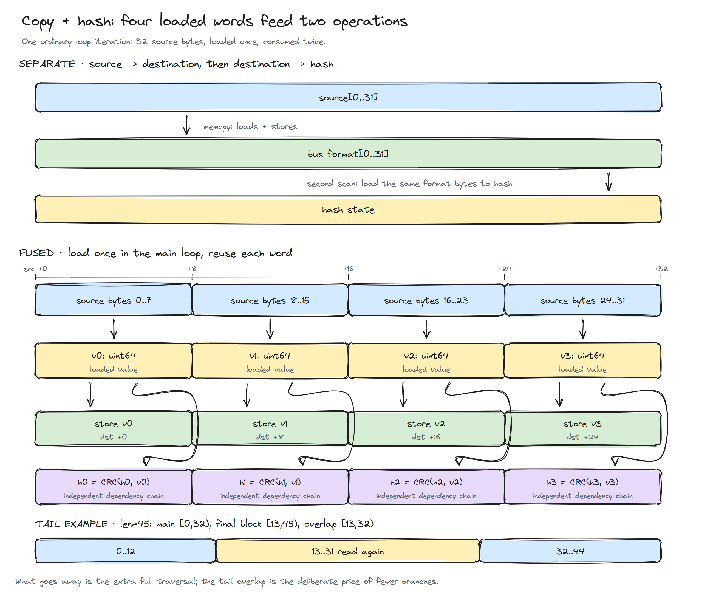
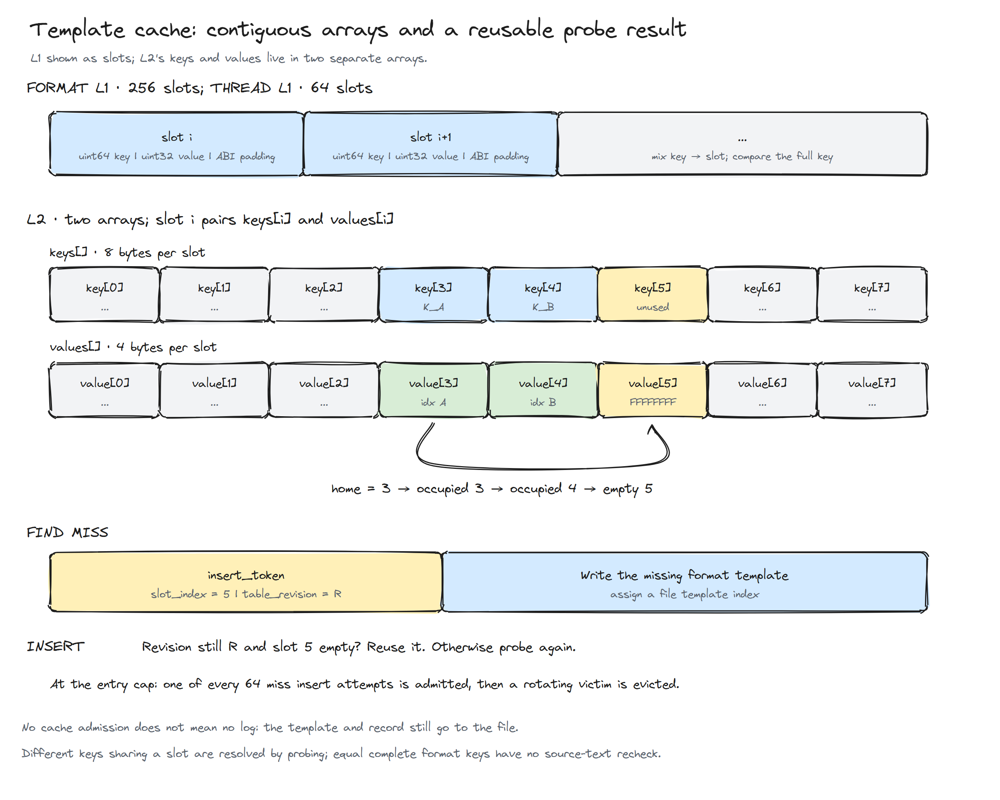
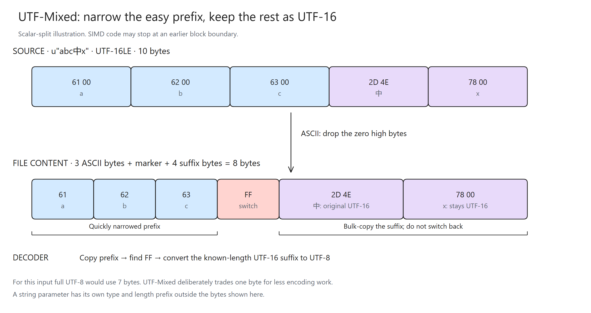
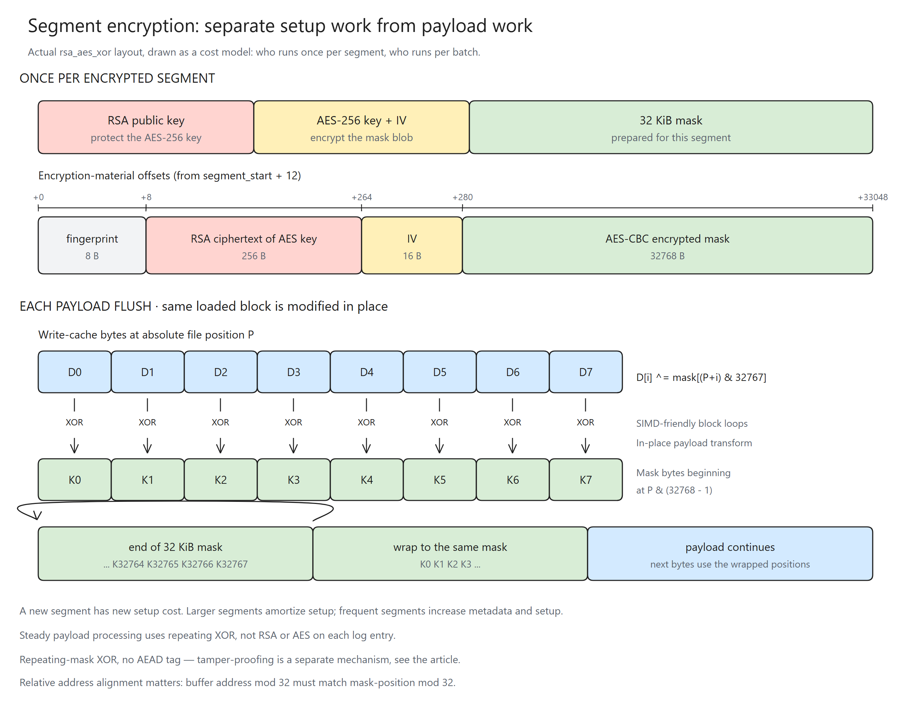

# Why is BqLog so fast? Part 3: How much work can share one memory load?

[简体中文](<文章3_为何BqLog如此快 - 压缩日志执行路径优化.MD>) · [Series](PERFORMANCE_DESIGN.md) · [Previous: the data bus](<Article 2_Why is BqLog so fast - From Ring Buffer to Adaptive Data Bus.MD>)

> Written against BqLog 2.5.0. The simplified pseudocode explains the ideas; the source files listed at the end hold the real branches.

Part 1 settled what a log looks like on disk; part 2 settled how data travels from business threads to the consumer. The road doesn't end there. Once the consumer picks up a record it still has to look up templates, encode, and hit the disk — and on the producer side, copying and hashing happen too. Each of these little jobs is cheap on its own, but every single log entry pays them all. So in this one we follow a log entry down the road and watch where the CPU time actually goes — and which of it can simply not be spent.

Start with a step nobody gets to skip. An async logger lives with a hard constraint: the caller's format string can die at any moment, so it must be copied into the bus. And copying isn't the end of it — the compressed format has to answer "have I seen this format before?", which means hashing the string. The plain way to write it:

```cpp
memcpy(destination, source, length);  // copy from the producer thread into the bus
hash = hash_bytes(destination, length); // consumer reads it back out and hashes it
```

See the problem? The same memory gets read **twice**, front to back. The second pass will probably hit the CPU cache — but a cache hit still issues load instructions and pushes the bytes back into registers. This article starts from "can we skip one of those passes?" and keeps asking from there.

## 1. Hash while you copy

Can the second pass be avoided? Of course: **load once, use twice.** The string's bytes have to pass through registers anyway on their way to the destination — so while they're sitting there, feed them to the hash.

For UTF-8/UTF-16 format strings with a direct address, `__api_log_write_begin` calls exactly that fused function:

```cpp
head->format_hash = bq::util::bq_memcpy_with_hash(
    handle.format_data_addr, format_str_data, format_str_bytes_len);
```

Watch the loads and stores in the loop and you can see the two jobs sharing one piece of data:



<p align="center"><em>Figure 1: the 32-byte main loop gets four 64-bit values per round; each value is both stored to the destination and folded into the CRC. Below: the tail overlap at length 45.</em></p>

The main body boils down to this:

```cpp
// sketch: the real thing has length branches, hardware selection and tail handling
load_8_bytes(v0, source + 0);
load_8_bytes(v1, source + 8);
load_8_bytes(v2, source + 16);
load_8_bytes(v3, source + 24);

store_8_bytes(destination + 0, v0);
store_8_bytes(destination + 8, v1);
store_8_bytes(destination + 16, v2);
store_8_bytes(destination + 24, v3);

h0 = crc_update(h0, v0);
h1 = crc_update(h1, v1);
h2 = crc_update(h2, v2);
h3 = crc_update(h3, v3);
```

The four loaded values `v0..v3` get stored to the destination and folded into CRC state — so the hash side never issues its own round of loads for the string. CRC was born as an error-detecting code, but modern CPUs give it a single instruction, and BqLog borrows that instruction as its hash: one update, one instruction.

A fixed-size 8-byte `memcpy` is usually expanded by the compiler into plain load/store instructions, which also keeps the source from dereferencing unaligned pointers directly.

So the second read is gone. Don't celebrate yet: those eight `crc_update` instructions still take time. The copy came for free; the hash didn't — and how that bill gets paid is the next section.

## 2. Why one CRC accumulator can't keep the CPU fed

The natural way to hash is one accumulator, start to finish:

```text
h = crc(h, v0)
h = crc(h, v1)
h = crc(h, v2)
h = crc(h, v3)
```

The trouble is dependency. The second update needs the new `h` from the first; the third needs the second's. An out-of-order CPU can do many things, but it can't start an instruction whose input doesn't exist yet — the four updates have to queue up single file.

This is where two ideas people constantly mix up need separating: **latency** and **throughput**. A CRC instruction may take several pipeline stages from entry to result — that's latency; say 3 cycles. But the execution unit doesn't wait for the previous instruction to finish before accepting the next one — as long as the new instruction doesn't depend on it, it can accept one every cycle. That's throughput.

Now the arithmetic. One `h`: fire the first update at cycle 0; the second needs its result, so it waits for `h` to come out at (our assumed) cycle 3 — the four updates fire at cycles 0, 3, 6, 9, and every issue slot in between idles. With four independent states `h0..h3`: nobody waits for anybody, and the four updates enter the pipeline at cycles 0, 1, 2, 3. The numbers are made up; the difference is real — and it's why the code in the previous section spells out four variables instead of one: one long dependency chain becomes four short ones. Each chain still has dependencies inside it, but the chains don't slow each other down, and the out-of-order scheduler can slip ready loads and stores into the gaps. Instruction-level parallelism, one core, no extra threads.

After the loop, the four states are combined with rotates and XORs into the 64-bit hash. So this hash is not what a single accumulator running standard CRC over all the bytes would produce — which is fine. It's only an internal key for template lookup, as long as the fused-copy path and the pure-hash path follow the same definition.

One small tail to settle: the main loop eats 32 bytes a round — what about the remainder? You can branch down through 16, 8, 4, 2, 1 bytes, but branches cost money too. The implementation instead takes the last 32 bytes from the end of the string: at length 45, the body covers [0,32), the tail covers [13,45), and [13,32) gets read twice. Same destination offsets, so the copy is identical, and the hash algorithm is defined with that overlap built in. A few re-read bytes in exchange for zero tail branches — same stingy thinking as "a little extra memory for one less load pass". Inputs shorter than 32 bytes take a separate short-string path.

## 3. Who spends the hash: the template table's L1 and L2

The hash is computed — who uses it? First, don't waste it: the producer writes it into the `format_hash` field of the 40-byte log head (the same header from part 1's figure 4), and it rides along with the record to the consumer. A non-zero `format_hash` is used directly; a zero falls back to recomputing on the spot with the pure-hash path (call-stack concatenation, wrapper-filled formats, and other paths that can't offer a string address, plus the unlucky case of a hash that's actually zero) — no log is ever dropped over this. The 64-bit value is a runtime key only and never touches the file.

And what does the consumer need it for? Template lookup. Part 1 pulled repeated formats out into templates so each log only stores a template index — which means every record that arrives asks the same question: **which index does this format map to?**

Pick the data structure after you understand the access pattern. Logging has fierce temporal locality: a program keeps executing the same set of log statements, so a format used a moment ago will probably be used again. That's why the Appender puts a tiny direct-mapped table in front of the big one: 256 slots for formats (about 4 KiB), 64 for threads (about 1 KiB). Each key maps to exactly one candidate slot; compare the full key, and a hit ends the search — not one extra probe.

These **L1 and L2 are two levels of software cache maintained by the Appender itself**, borrowing the idea of CPU cache hierarchies: keep hot data close. A small table's working set stays concentrated, so it's more likely to stay in the CPU's data cache; an L1 hit saves both the big-table lookup and the trip to a larger memory region. The names rhyme with hardware L1/L2, but the two tables are not pinned to any particular level of the processor's cache.

When two keys land on the same L1 slot, the newcomer replaces the old entry; a later miss goes to L2, and the result is refilled into L1. Hot formats take the short path, cold ones still have the big table. The thread template has an even cheaper shortcut: part 2's SISO batch reads make one thread's records arrive back to back, so if this thread ID equals the previous one, last time's template index is reused — even slot selection is skipped.

L2 uses open addressing with linear probing: entries sit in array slots, and an occupied home slot means probing forward. No pointer-chasing between nodes — and since the CPU fetches memory in cache lines, the neighbors of the slot you just read often arrive with it, so probing forward is frequently free. That's spatial locality, teaming up with the temporal kind above. Layout matters too: a key is 8 bytes and a value 4, so a struct would get padded to 16 bytes per entry; split into separate `keys[]` and `values[]` arrays and each slot costs 12 — the whole table shrinks by a quarter and the same cache holds more of it.

One more instruction-saving design in this table: **when a lookup fails, remember where the empty slot was.** Say a key starts probing at slot 3; slots 3 and 4 are taken, slot 5 is empty — the search stops there. But if the interface is just `find` and `insert`, then after the Appender finishes writing the new template, inserting it means probing 3, 4, 5 all over again. Here, a missing `find` returns an `insert_token` holding the slot index and the table's `table_revision`: if the table hasn't changed, `insert` uses that slot directly; if the revision moved (say, a resize relocated everything), it probes honestly from scratch. The re-probe's hashing, emptiness checks and comparisons all get skipped, instructions and all.

One more trap worth naming: picking a slot really means masking off some bits of the key. But the input might be an aligned thread ID (whose low bits are all identical) or carry the category in the high bits (leaving the low bits nearly frozen) — mask the low bits directly and some inputs pile into one small patch of the table, and probe runs get longer and longer. So before choosing a slot, the key goes through a bit mixer (Murmur3's fmix64), and the mixed *high* bits are used — every bit of the original key gets a say in where it starts.

The format key itself stitches the string hash together with category and level:

```cpp
key = format_hash ^ ((uint64_t(category_index) << 32) | level);
```

The same format string under a different category or level is a different template, so the key has to carry all those fields. Two kinds of collision to keep apart: two keys choosing the same slot — just probe on; two different formats producing the exact same 64-bit key — the fast path never re-checks the original string and will treat them as one template. That's the price of letting 64 bits do all the talking. And when the table fills up: L2 admits only 1 in 64 new insertions, so one-off formats can't evict the hot set; a format that isn't admitted is still written to the file — next time it misses, the template is simply written again. The file grows a little; decoding is unaffected.



<p align="center"><em>Figure 2: the 256-slot direct-mapped L1 on top; L2 below with keys and values in two separate contiguous arrays. The empty slot found during a lookup can be handed to the insert that follows.</em></p>

## 4. UTF-Mixed: stop treating every character like the hardest one

Template found; now encode the arguments. The string arguments have their own trick waiting.

Part 1 introduced the UTF-Mixed format: ASCII characters narrow to single bytes, and once content shows up that doesn't suit fast handling, the whole remaining suffix is stored as raw UTF-16. Why not just convert everything to UTF-8 properly? Because a full conversion asks of every character "how many bytes do you need?" and then assembles the multibyte sequences one by one — expensive. UTF-Mixed's bargain: simple characters take the fast lane, complicated content gets packed up wholesale, no questions asked.

The fast lane's key question is "is this character ASCII?" In UTF-16, ASCII values live in `0x0000..0x007F` — the top 9 bits are all zero. The scalar version reads four UTF-16 code units into one 64-bit value and checks all four groups of top-9-bits with a single mask:

```text
v & 0xFF80FF80FF80FF80
```

If the result is zero, all four characters are ASCII — extract the low bytes and pack them. One load, and the checking and encoding finish together. My favorite line in the whole article.

SIMD scales the same idea to whole blocks: once a block is confirmed all-ASCII, narrow and store it in one go; a block containing anything non-ASCII ends the fast conversion — write an `FF` marker and keep the rest as raw UTF-16. Checking by the block means a few ASCII characters right before the boundary may stay in UTF-16 too — a few extra bytes in exchange for never hunting the exact boundary character by character. Same trade as the CRC tail's overlapping re-read; the aesthetic is identical.



<p align="center"><em>Figure 3: <code>u"abc中x"</code> encoded as UTF-Mixed — ASCII narrows to single bytes, an <code>FF</code> marker, then the CJK characters stay as UTF-16. A full UTF-8 conversion would take 7 bytes; UTF-Mixed takes 8, and that extra byte buys freedom from per-character transcoding.</em></p>

Once a template hits, the same format never gets converted again; only the per-call argument strings travel this path. When appending to an old file, the UTF-Mixed content must first be restored into a temporary buffer to recover the original format's hash — but that extra read happens at file-open time, not on the per-record path.

## 5. Amortizing fixed costs: batched writes and segmented encryption

These last two optimizations look different but play the same game: find an operation with a fixed cost, and let a batch of data split the bill.

The first is batched output. One log entry is a few dozen bytes; calling the file-write interface per record pays the syscall's fixed cost every time. So the Appender encodes records into a write cache back to back and flushes in batches. `write_cache_size` targets 64 KiB–4 MiB, rounded to a power of two — a bigger cache means fewer write calls, at the price of more memory and more unflushed data. An oversized record may temporarily exceed the target, so it's not an absolute memory ceiling. The encrypted path's batched XOR adds one more wrinkle: data and mask have to be loaded together, so the two addresses had better cooperate with SIMD. Take 32-byte alignment: if both addresses have the same remainder mod 32, handling the head fragment first brings both onto whole-block boundaries and the AVX2 loop can run flat out; different remainders and they'll never line up. The mask's position is fixed by the absolute file offset, so setting the write cache's leading padding to the matching value keeps the relative alignment for a whole segment. The Appender adjusts that padding once at segment creation or after a flush (which may take a `memmove` of the cached data), and every record in the batch benefits.

The second is segmented encryption. Part 1 covered the structure; here we count costs:

```text
total cost ≈ segments × per-segment init cost
           + payload bytes × steady transform cost
           + batches × per-batch I/O cost
```

Segment init — wrapping the AES key with RSA and processing the 32 KiB mask with AES — happens once per segment; the payload is then XORed in place, batch after batch. The longer the segment, the more logs share that init. Measured on part 2's scenario: one thread writing 2 million entries takes 95 ms compressed and 102 ms compressed+encrypted; ten threads writing 20 million take 507 ms vs 493 ms. So encryption's share of the bill moves with concurrency and volume — it's not a fixed tax. One honest note: this scheme has no AEAD authentication tag, so if you need proof the logs weren't tampered with, that mechanism has to come from elsewhere.



<p align="center"><em>Figure 4: the cost structure of segmented encryption — each segment opens with a one-time RSA key wrap and AES mask generation, then the payload is XORed cyclically by file offset. Longer segments spread the init thinner.</em></p>

## 6. Wrapping up

Taken one by one, none of these tricks is deep magic: hash while you copy, keep a few extra accumulators, remember an empty slot, check four characters with one mask. All small things you could do on any afternoon. But logs come in volume — the same path runs tens of thousands of times a second, and every little saving along it shows up in the performance you measure.

That's the execution path for now. This series isn't finished — when the next good topic shows up, we'll keep going.

## Appendix: how to tell an optimization actually works, instead of just looking clever

These changes reduce work, but you can't extrapolate total time from "one less traversal" or "wider instructions". To measure a single factor's gain, the control group may only change that factor:

| What you want to verify | Control setup | Also check |
|---|---|---|
| Fused copy-hash | Same hash algorithm, fused vs copy-then-hash | Identical data, lengths, alignment, hot/cold cache |
| Four CRC chains | Fixed input length and CRC update count; vary only the state dependency | Inspect assembly and cycles per byte; this is an instruction-dependency experiment and the two hashes differ by definition |
| Software L1 | Same L2 and input; L1 enabled vs bypassed | Software hit rate, CPU cache misses, lookup latency |
| L2 layout and token | Same capacity and admission policy, struct array vs split arrays; same miss sequence, reuse probe position or not | Probe counts, cache misses; token correctly invalidated after resize |
| UTF-Mixed and SIMD | Same UTF-16 input; full UTF-8 vs scalar UTF-Mixed vs SIMD UTF-Mixed | Time and size for mixed EN/CJK content; split points may differ, decoded output must match |
| Batched output | Same output and same full-buffer policy (part 2 [§8.2](<Article 2_Why is BqLog so fast - From Ring Buffer to Adaptive Data Bus.MD#82-when-the-consumer-falls-behind>)); vary cache size | I/O, RSS, call latency and flush time |

End-to-end benchmarks must also count how many logs finally decode. If one configuration drops on a full buffer while another blocks, comparing call speed alone flatters the dropper.

`test_utils.h` checks copy/hash consistency across lengths and offsets; `test_bounded_hash_cache.h` covers token invalidation, capacity and allocation failure; `test_compressed_cache.h` checks cache behavior against decodable output. The repo's benchmark ships multi-format template cases (`test_compress_multi_format_*` in benchmark/cpp/main.cpp), ready to use for template-cache measurements.

## Continue with the source

- [util.cpp](../src/bq_common/utils/util.cpp): fused copy-hash, the CRC chains and UTF-Mixed.
- [bq_log_api.cpp](../src/bq_log/api/bq_log_api.cpp), [bq_log_go.cpp](../src/bq_log/api/bq_log_go.cpp): format_hash, native calls and bus commits.
- [appender_file_compressed.cpp](../src/bq_log/log/appender/appender_file_compressed.cpp), [bounded_hash_cache.h](../src/bq_log/types/bounded_hash_cache.h): template cache, token, encoding.
- [appender_file_base.cpp](../src/bq_log/log/appender/appender_file_base.cpp), [appender_file_binary.cpp](../src/bq_log/log/appender/appender_file_binary.cpp): write cache, relative alignment, segments and encryption.
- [test_utils.h](../test/cpp/bq_common_test/test_utils.h), [test_bounded_hash_cache.h](../test/cpp/test_bounded_hash_cache.h), [test_compressed_cache.h](../test/cpp/test_compressed_cache.h): the corresponding correctness checks.
