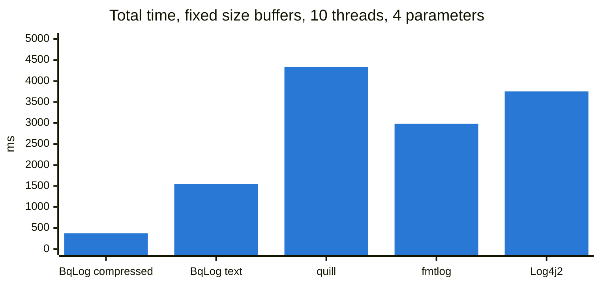
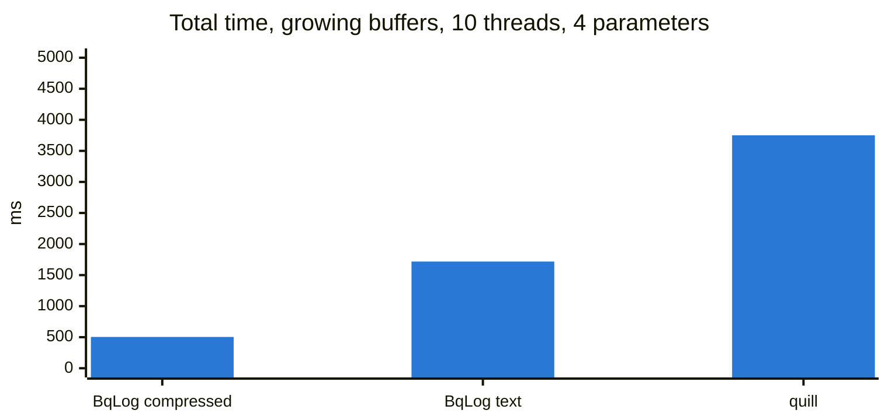
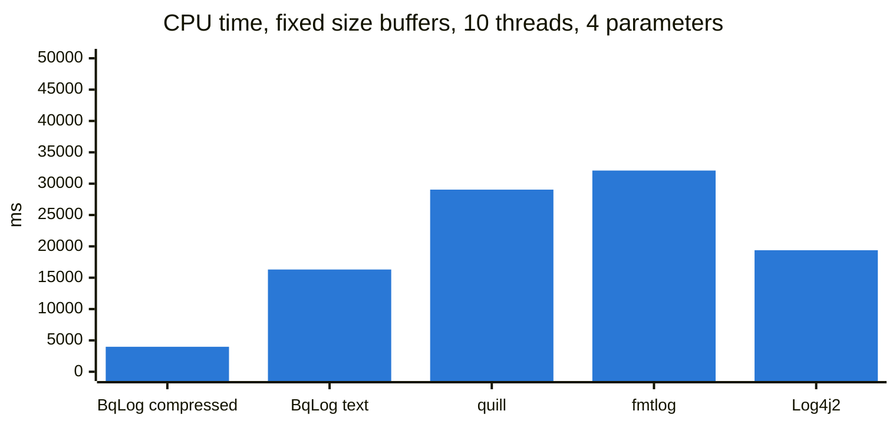
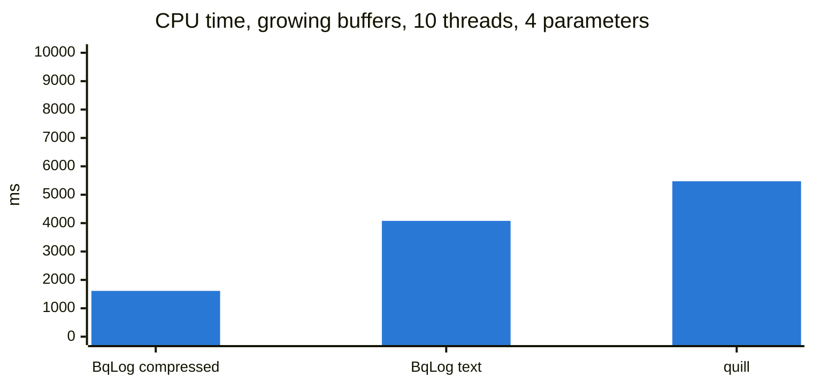
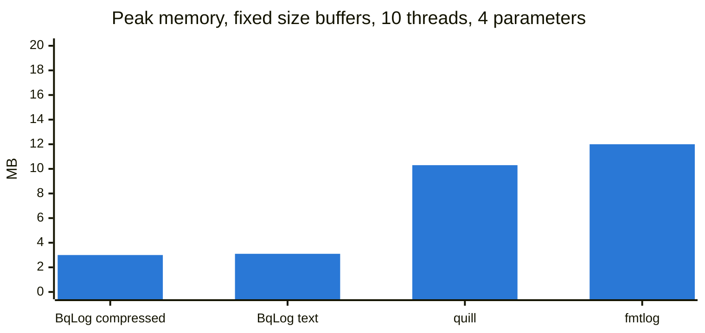
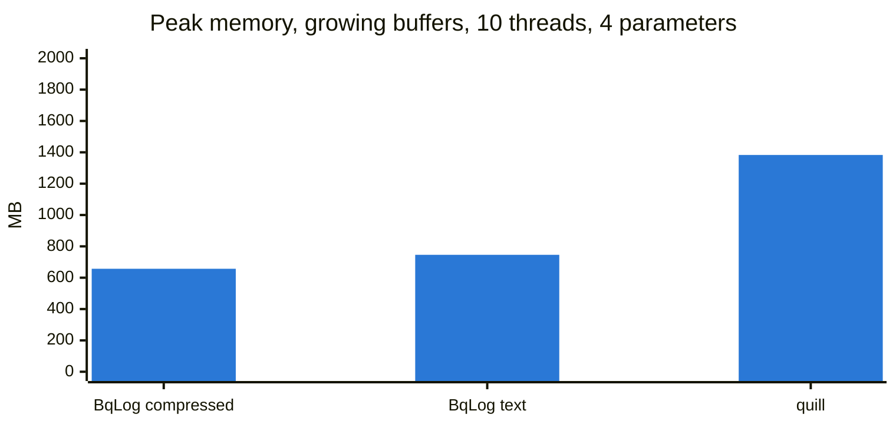
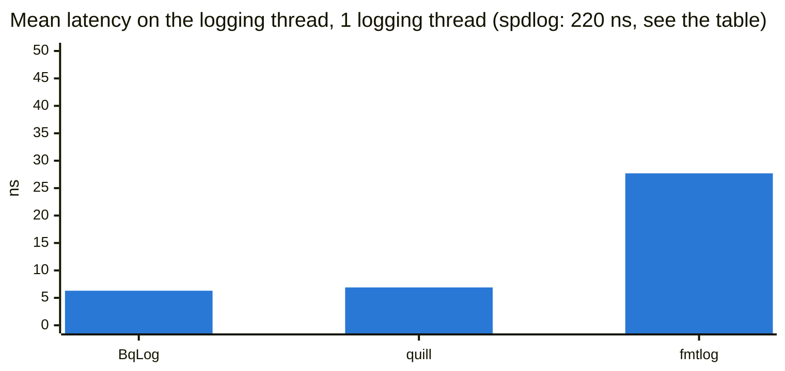

# Benchmark

[← Back to home](../README.md) | [简体中文](./BENCHMARK_CHS.md)

BqLog is built for real workloads: logs go to real files on disk; buffers have a fixed size by default and block when full, so nothing is lost; they can be set to grow when needed, and the memory is given back after a burst; crash recovery is supported; and the consumer thread sleeps when idle by default to save CPU, with no tuning needed.

Logging is not the core of an application. A logger whose calls are fast but which takes a lot of CPU for it, or lets its memory grow without bound, is not good enough. So every result below comes with its CPU cost and memory.

- **Part 1: throughput.** Total time and CPU cost until every thread is done and every entry is on disk: the real load logging puts on the machine.
- **Part 2: latency on the logging thread.** How long one log call takes on the application thread.

BqLog's C++ numbers all use fast mode (the `BQ_LOG_FAST_INFO` family of macros); section 4 compares it with normal mode.

## 1. Environment

| | |
|---|---|
| Machine | MacBook Pro, Apple M4 Pro (10 performance + 4 efficiency cores), 48 GB |
| OS | macOS 15.6.1 |
| Compiler | Apple clang 17, Release, arm64 |
| Date | 2026-10-05 |

Libraries (latest releases as of October 2026): BqLog 2.6.0, quill 13.0.0, fmtlog 2.3.0, spdlog 1.17.0, glog 0.7.1, Log4j2 2.26.0 + Disruptor 4.0.0.

## 2. Part 1: throughput

### Test case

- 1, 2, 4, 6, 8 and 10 threads write at the same time, 2,000,000 entries per thread, timed from the first call until everything is flushed to disk; every library blocks instead of dropping entries.
- Two lines: `"idx:{}, num:{}, This test, {}, {}", t, i, 2.4232f, true` (4 parameters) and `"Empty Log, No Param"` (no parameter).
- **Fixed size buffers**: BqLog's default (64 KiB per thread, blocks when full); quill with `BoundedBlocking`, 64 KiB per thread; fmtlog with `FMTLOG_BLOCK=1`; spdlog async, 8192 slots, blocking; glog synchronous; Log4j2 AsyncLogger.
- **Growing buffers**: BqLog `log.buffer_policy_when_full=expand`; quill's default `UnboundedBlocking` queue. The other libraries have no growing queue and are not in this group.
- Consumer thread: BqLog uses its default policy with nothing set; the other libraries are set up as their own benchmarks or documentation recommend, quill's being a zero-wait busy spin (`sleep_duration=0`; no real application would run like that).
- BqLog is measured with compressed and with text output. Compressed+encrypted output is almost the same as unencrypted (2% to 15% more time and CPU, within 5% with several threads), so it is left out of the tables to keep them readable.
- CPU cost is given as **CPU time**: the CPU time of every thread in the process added up, that is, how much CPU the work took in total. Every library does the same amount of work here, so CPU times compare directly; a "CPU usage" figure (CPU time / total time) would be misleading, since the library that finishes sooner would show the higher usage. In part 2 the logging threads write at a fixed pace and every library runs for the same time, so there the consumer's CPU usage is given.
- Peak memory is the high-water mark of the process's physical memory (macOS `phys_footprint`); every BqLog configuration runs in its own process.
- BqLog, quill and fmtlog: median of 3 rounds; spdlog, glog and Log4j2: 1 round (spdlog and glog up to 6 threads).

### At 10 threads (4 parameters)

### Total time, 4 parameters (ms, lower is better)

| | 1 Thread | 2 Threads | 4 Threads | 6 Threads | 8 Threads | 10 Threads |
|---|---:|---:|---:|---:|---:|---:|
| BqLog, compressed | 39 | 74 | 148 | 223 | 299 | 375 |
| BqLog, text | 152 | 312 | 617 | 935 | 1236 | 1548 |
| quill | 331 | 706 | 1517 | 2328 | 3350 | 4338 |
| fmtlog | 254 | 508 | 1089 | 1577 | 2097 | 2982 |
| spdlog (async) | 535 | 1762 | 6758 | 25056 | - | - |
| glog (synchronous) | 2322 | 4033 | 9929 | 21544 | - | - |
| Log4j2 (Java) | 665 | 954 | 1872 | 2388 | 3424 | 3754 |
| BqLog, compressed, expand | 43 | 91 | 196 | 302 | 392 | 504 |
| BqLog, text, expand | 161 | 327 | 667 | 1017 | 1368 | 1718 |
| quill, default queue (grows) | 348 | 690 | 1433 | 2212 | 2952 | 3751 |

### CPU time, 4 parameters (ms, all threads, lower is better)

| | 1 Thread | 2 Threads | 4 Threads | 6 Threads | 8 Threads | 10 Threads |
|---|---:|---:|---:|---:|---:|---:|
| BqLog, compressed | 76 | 219 | 734 | 1506 | 2427 | 3984 |
| BqLog, text | 303 | 784 | 3047 | 6453 | 10992 | 16307 |
| quill | 493 | 1350 | 4697 | 9621 | 18139 | 29048 |
| fmtlog | 475 | 1461 | 5310 | 10809 | 18490 | 32093 |
| spdlog (async) | 966 | 3675 | 20142 | 85372 | - | - |
| glog (synchronous) | 2318 | 7342 | 30661 | 92488 | - | - |
| Log4j2 (Java) | 2810 | 4386 | 9206 | 12036 | 17525 | 19383 |
| BqLog, compressed, expand | 85 | 195 | 461 | 804 | 1161 | 1613 |
| BqLog, text, expand | 322 | 670 | 1404 | 2218 | 3095 | 4079 |
| quill, default queue (grows) | 487 | 968 | 2032 | 3194 | 4287 | 5475 |

### Peak memory, 4 parameters (MB)

| | 1 Thread | 2 Threads | 4 Threads | 6 Threads | 8 Threads | 10 Threads |
|---|---:|---:|---:|---:|---:|---:|
| BqLog, compressed | 2.3 | 2.5 | 2.6 | 2.8 | 3.0 | 3.0 |
| BqLog, text | 2.3 | 2.4 | 2.5 | 2.7 | 3.0 | 3.1 |
| quill | 5.4 | 7.3 | 5.4 | 7.2 | 8.9 | 10.3 |
| fmtlog | 2.3 | 3.3 | 5.5 | 7.7 | 9.9 | 12.0 |
| spdlog (async) | 4.5 | 4.5 | 4.6 | 4.7 | - | - |
| glog (synchronous) | 1.1 | 1.3 | 1.4 | 1.5 | - | - |
| BqLog, compressed, expand | 62.0 | 136.7 | 278.2 | 408.1 | 532.2 | 657.3 |
| BqLog, text, expand | 75.0 | 150.6 | 303.3 | 451.3 | 598.3 | 745.6 |
| quill, default queue (grows) | 142.9 | 278.1 | 552.0 | 835.2 | 1111.7 | 1383.4 |

### Total time, no parameter (ms, lower is better)

| | 1 Thread | 2 Threads | 4 Threads | 6 Threads | 8 Threads | 10 Threads |
|---|---:|---:|---:|---:|---:|---:|
| BqLog, compressed | 42 | 68 | 123 | 171 | 228 | 287 |
| BqLog, text | 71 | 145 | 288 | 435 | 568 | 715 |
| quill | 211 | 437 | 977 | 1542 | 2242 | 2905 |
| fmtlog | 158 | 311 | 671 | 1017 | 1333 | 1797 |
| spdlog (async) | 509 | 1521 | 5956 | 24097 | - | - |
| glog (synchronous) | 1730 | 3012 | 7203 | 19185 | - | - |
| BqLog, compressed, expand | 48 | 56 | 116 | 198 | 250 | 324 |
| BqLog, text, expand | 73 | 149 | 303 | 463 | 608 | 771 |
| quill, default queue (grows) | 222 | 448 | 910 | 1439 | 1935 | 2520 |

### CPU time, no parameter (ms, all threads, lower is better)

| | 1 Thread | 2 Threads | 4 Threads | 6 Threads | 8 Threads | 10 Threads |
|---|---:|---:|---:|---:|---:|---:|
| BqLog, compressed | 84 | 198 | 612 | 1170 | 2006 | 3080 |
| BqLog, text | 141 | 363 | 1214 | 2717 | 4837 | 7291 |
| quill | 328 | 885 | 3100 | 6585 | 12403 | 19828 |
| fmtlog | 285 | 879 | 3205 | 6843 | 11597 | 19095 |
| spdlog (async) | 839 | 2988 | 17195 | 79658 | - | - |
| glog (synchronous) | 1726 | 5401 | 21206 | 74055 | - | - |
| BqLog, compressed, expand | 96 | 159 | 420 | 721 | 971 | 1170 |
| BqLog, text, expand | 146 | 356 | 811 | 1269 | 1712 | 2072 |
| quill, default queue (grows) | 373 | 801 | 1666 | 2611 | 3507 | 4380 |

### Output file size (1 thread, 2,000,000 entries of each line)

| | Format | Size | Bytes per entry |
|---|---|---:|---:|
| BqLog, compressed | binary | 47 MB | 12 |
| BqLog, compressed+encrypted | binary, encrypted | 47 MB | 12 |
| BqLog, text | text | 317 MB | 79 |
| quill | text | 267 MB | 67 |
| fmtlog | text | 299 MB | 75 |
| spdlog (async) | text | 307 MB | 77 |
| glog | text | 349 MB | 87 |

### Conclusions

- **Fixed size buffers (the default)**: at every thread count and for both lines, BqLog has the lowest total time and CPU time of all libraries. With 4 parameters, against the best other library at each thread count: BqLog compressed is 6.5 to 8 times faster with 1/4.9 to 1/7.2 of the CPU time; BqLog text is 1.6 to 1.9 times faster with 16% to 42% less CPU time. BqLog's peak memory stays within 3.1 MB.
- **Growing buffers**: against a queue that grows as well, BqLog compressed is 7 to 8 times faster with 1/3.4 to 1/5.7 of the CPU time; BqLog text is about 2 times faster with 25% to 34% less CPU time; peak memory is about half.
- The compressed format is about 1/7 the size of text.

## 3. Part 2: latency on the logging thread

### Test case

One source and one timing method for every library:

- every logging thread writes batches of 20 calls with a random 2000-2200 us busy wait between batches, 5,000 batches per thread
- a serialized hardware counter is read before and after each batch (arm64: `isb; mrs cntvct_el0; isb`), latency per call = batch time / 20
- the log call is a lambda inlined into the timed loop, like a call site in user code
- every library uses a fixed size queue that blocks when full (64 KiB per thread); every consumer sleeps 1 ms when idle (BqLog `log.worker_interval_ms=1`, quill `sleep_duration=1ms`, fmtlog polling every 1 ms)
- columns: **p50** (a typical call), **p99 / p99.9** (the slowest 1% / 0.1%), **mean** (total time in log calls / number of calls: how much of the application thread logging takes), next to the consumer CPU (average CPU usage of every thread but the logging threads, as a percentage of one core) and peak memory
- median of 5 interleaved rounds. The hardware counter on this machine ticks about every 41.7 ns, so spread over a batch of 20 the resolution is about 2 ns per call.

### 1 logging thread

| | p50 (ns) | p99 (ns) | p99.9 (ns) | mean (ns) | consumer CPU | peak memory (MB) |
|---|---:|---:|---:|---:|---:|---:|
| BqLog | 4 | 29 | 77 | 6.3 | 0.5% | 1.9 |
| quill | 4 | 29 | 154 | 6.9 | 0.5% | 1.9 |
| fmtlog | 16 | 166 | 227 | 27.7 | 0.5% | 2.4 |
| spdlog (async) | 177 | 458 | 907 | 220.2 | 0.4% | 4.7 |

### 4 logging threads

| | p50 (ns) | p99 (ns) | p99.9 (ns) | mean (ns) | consumer CPU | peak memory (MB) |
|---|---:|---:|---:|---:|---:|---:|
| BqLog | 6 | 166 | 250 | 19.2 | 1.1% | 2.5 |
| quill | 6 | 168 | 252 | 18.4 | 1.2% | 2.9 |
| fmtlog | 18 | 175 | 294 | 34.3 | 0.9% | 5.7 |
| spdlog (async) | 193 | 573 | 1175 | 228.4 | 1.5% | 5.0 |

### Conclusions

- BqLog's cost on the logging thread is in the lowest tier of the libraries measured: with 1 thread p50 4 ns, p99 29 ns, p99.9 77 ns, none above any other library; with 4 threads it matches the best other library (the means differ by 0.8 ns, within the timer resolution).
- Against fmtlog and spdlog, BqLog's p50 is 3 to 40 times lower, and its p99 and p99.9 are lower too.
- Every library's consumer CPU stays within 1.5%.

## 4. Fast mode and normal mode

BqLog's C++ API has two ways to write a log, with exactly the same output:

- **Normal mode**: `log.info("idx:{}", i)`, available in every language wrapper, with the best IDE completion.
- **Fast mode**: `BQ_LOG_FAST_INFO(log, "idx:{}", i)`, C++ only. Each call site binds the log object and format string of its first call ([details](API_REFERENCE.md#fast-mode)).

| | Fast mode | Normal mode |
|---|---|---|
| Throughput, fixed size buffers, 4 parameters (total time and CPU time) | within ±8% of normal mode | baseline |
| Throughput, fixed size buffers, no parameter (total time and CPU time) | text about the same; compressed 62% more at 1 thread, 28% to 45% more at 2 threads, 3% to 17% more from 4 threads up | baseline |
| Logging thread, 1 thread (p50 / p99 / mean, ns) | 4 / 29 / 6.3 | 12 / 60 / 16.2 |
| Logging thread, 4 threads (p50 / p99 / mean, ns) | 6 / 166 / 19.2 | 16 / 181 / 26.9 |

The two modes reach about the same throughput: what fast mode saves on the logging thread is not moved onto the consumer thread (the exception is compressed output with no parameter, where fast mode is a little slower with few threads). The difference is mainly on the logging thread, where a fast mode call is about 8 to 10 nanoseconds quicker - negligible in real applications.

With growing buffers fast mode has clearly better throughput (with several threads normal mode takes 1.5 to 3.7 times as long), so use fast mode where buffers need to grow.

## 5. Features

| Feature | BqLog | spdlog | glog | fmtlog | quill | Log4j2 |
|------|-------|--------|------|--------|-------|--------|
| Asynchronous | ✅ | ✅ | ❌ | ✅ | ✅ | ✅ |
| Real-time compression | ✅ | ❌ | ❌ | ❌ | ❌ | ❌ (gzip on roll) |
| Encryption | ✅ (RSA+AES hybrid) | ❌ | ❌ | ❌ | ❌ | ❌ |
| Crash recovery | ✅ (Recovery) | ❌ | ✅ (signal handler) | ❌ | ✅ (signal handler) | ❌ |
| Languages | ✅ (C++/Java/C#/Python/TypeScript/ArkTS/Go) | ❌ (C++ only) | ❌ (C++ only) | ❌ (C++ only) | ❌ (C++ only) | Java only |
| Platforms | ✅ (Win/Mac/Linux/iOS/Android/HarmonyOS) | ✅ (Win/Mac/Linux) | ✅ (Win/Mac/Linux) | ✅ (Win/Mac/Linux) | ✅ (Win/Mac/Linux) | JVM |
| `{fmt}` formatting | ✅ | ✅ | ❌ (streams) | ✅ | ✅ | ✅ (similar) |
| Game engine plugins | ✅ (Unity/Unreal) | ❌ | ❌ | ❌ | ❌ | ❌ |

## 6. Source code

The complete project for this version (2.6.0) is at [`benchmark_2.6.0`](https://github.com/Tencent/BqLog/tree/benchmark_2.6.0/benchmark/cross): CMake + FetchContent, one executable per library, the runner scripts, the raw data, and `make_tables.py`, which produces these tables and charts. Benchmarks of other versions: see the [index on the `benchmark` branch](https://github.com/Tencent/BqLog/tree/benchmark).

- throughput: `bench_<lib>.cpp`, `run_benchmark.sh` (`bench_bqlog <threads> <block|expand> [config]`, `bench_quill <threads> <block|expand>`)
- latency on the logging thread: `bench_latency.cpp` (one source, built once per library), `run_latency.sh`
- reading CPU and memory: `bench_sys.h`
