# Benchmark

[← 返回首页](../README_CHS.md) | [English](./BENCHMARK.md)

BqLog 按真实业务的用法来测：日志写到磁盘文件，缓冲区默认固定大小、写满阻塞，一条不丢；消费线程空闲时休眠，不白占 CPU；用户不用调任何参数。

日志不是业务的核心。一个日志库不能为了调用快而占用大量 CPU，或者让内存无限增长，所以每项结果都同时给出耗时、CPU 和内存。

## 结论速览

- **吞吐**：macOS 和 Windows 上，BqLog 在所有线程数下的总耗时都是所有库里最短的，压缩格式比其他库中最快的快 4～12 倍，文本格式快 1.5～4.6 倍；压缩格式的 CPU 时间也最低。
- **日志线程延迟**：BqLog、quill、fmtlog 在同一档，spdlog 慢一个数量级。
- **内存**：固定缓冲区下，BqLog 的峰值内存在最低一档，线程多了也基本不增长；开启扩容后约为 quill 的一半甚至更少。
- **文件大小**：压缩格式约为文本的 1/7。

BqLog 的 C++ 数据都使用快速模式（`BQ_LOG_FAST_INFO` 等宏），和普通模式的区别见第 4 节。

## 1. 环境

| | macOS | Windows | Linux（仅延迟） |
|---|---|---|---|
| 机器 | MacBook Pro，Apple M4 Pro（10 个性能核 + 4 个能效核），48 GB | 台式机，AMD Ryzen 9 9950X（16 核 32 线程），96 GB | 同一台台式机，WSL2，分配全部 32 个逻辑处理器，62 GB |
| 系统 | macOS 15.6.1 | Windows 11 专业版 24H2（10.0.26100） | Ubuntu 24.04（Linux 6.6，WSL2） |
| 编译器 | Apple clang 17，Release，arm64 | MSVC 19.51（Visual Studio 2026），Release，x64 | clang 18.1.3，Release，x64 |
| 日期 | 2026-10-05 | 2026-10-06 | 2026-10-07 |

对比的库（2026 年 10 月最新正式版）：BqLog 2.6.0、quill 13.0.0、fmtlog 2.3.0、spdlog 1.17.0、glog 0.7.1、Log4j2 2.26.0 + Disruptor 4.0.0。

## 2. 吞吐

所有线程写完、全部落盘为止的总耗时和 CPU 消耗，也就是日志给整台机器带来的真实负载。

### 测试方法

- **场景**：1～10 个线程同时写，每线程 200 万条，从第一条开始计时，到全部写到磁盘为止。两条日志：`"idx:{}, num:{}, This test, {}, {}", t, i, 2.4232f, true`（4 个参数）和 `"Empty Log, No Param"`（无参数）。
- **固定缓冲区**（默认用法）：所有库都用固定大小、写满阻塞的队列，不丢日志。BqLog 默认配置（每线程 64 KB）；quill `BoundedBlocking`，每线程 64 KB；fmtlog `FMTLOG_BLOCK=1`；spdlog 异步，8192 槽；glog 同步；Log4j2 AsyncLogger。
- **可扩容**：BqLog `log.buffer_policy_when_full=expand`，quill 默认的 `UnboundedBlocking` 队列。其他库不支持扩容，不参加这一组。
- **消费线程**：BqLog 用默认配置；其他库按各自官方推荐的方式配置，其中 quill 是不休眠的忙等（`sleep_duration=0`），对 quill 最有利。Windows 上 quill 队列满时的重试间隔设为 0，因为默认的 800 ns 在 Windows 上会变成 `Sleep(1)`，即 1 ms。
- **输出**：BqLog 测了压缩和文本两种格式；压缩+加密和不加密差别很小，没有单独列出。
- **指标**：
  - CPU 时间：整个进程所有线程的 CPU 时间之和。各库做的工作量相同，可以直接比较（不用 CPU 占用率，是因为越快做完的库占用率反而越高）。
  - 峰值内存：进程物理内存的最高水位（macOS `phys_footprint`，Windows `PeakWorkingSetSize`，Linux `VmHWM`）。
- BqLog、quill、fmtlog 跑 3 轮取中位数；spdlog、glog、Log4j2 较慢，跑 1 轮，其中 spdlog、glog 只跑到 6 线程。

### macOS（Apple M4 Pro）

#### 10 线程一览（4 个参数）

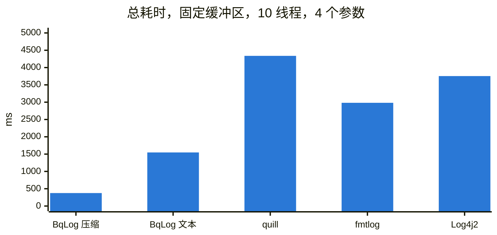

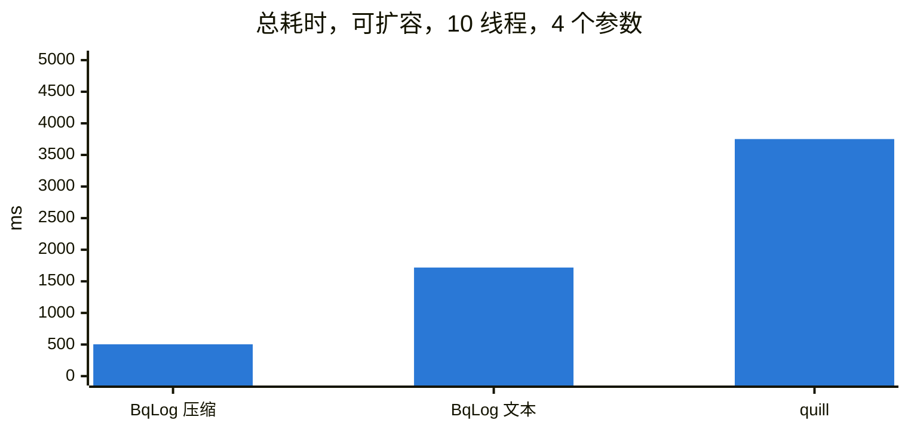

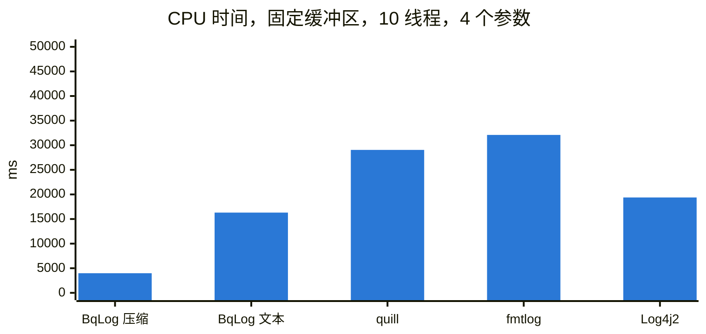

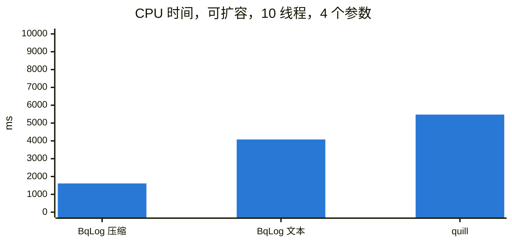

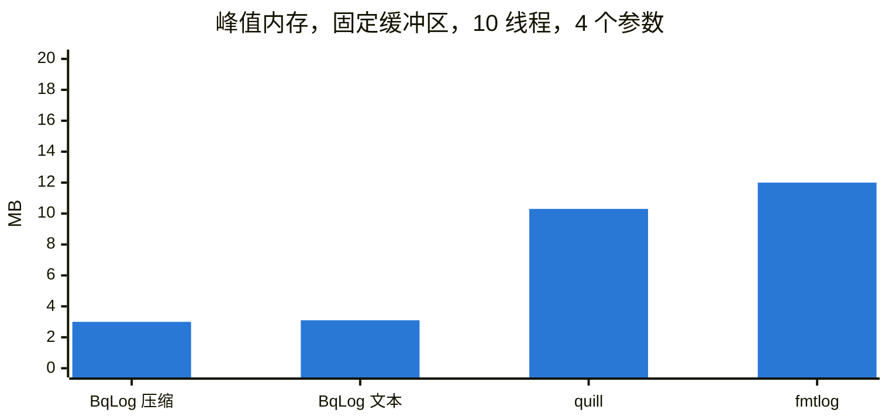

#### 总耗时，4 个参数（毫秒，越小越好）

| | 1 线程 | 2 线程 | 4 线程 | 6 线程 | 8 线程 | 10 线程 |
|---|---:|---:|---:|---:|---:|---:|
| BqLog，压缩 | 39 | 74 | 148 | 223 | 299 | 375 |
| BqLog，文本 | 152 | 312 | 617 | 935 | 1236 | 1548 |
| quill | 331 | 706 | 1517 | 2328 | 3350 | 4338 |
| fmtlog | 254 | 508 | 1089 | 1577 | 2097 | 2982 |
| spdlog（异步） | 535 | 1762 | 6758 | 25056 | - | - |
| glog（同步） | 2322 | 4033 | 9929 | 21544 | - | - |
| Log4j2（Java） | 665 | 954 | 1872 | 2388 | 3424 | 3754 |
| BqLog，压缩，扩容 | 43 | 91 | 196 | 302 | 392 | 504 |
| BqLog，文本，扩容 | 161 | 327 | 667 | 1017 | 1368 | 1718 |
| quill，默认队列（扩容） | 348 | 690 | 1433 | 2212 | 2952 | 3751 |

#### CPU 时间，4 个参数（毫秒，所有线程合计，越小越好）

| | 1 线程 | 2 线程 | 4 线程 | 6 线程 | 8 线程 | 10 线程 |
|---|---:|---:|---:|---:|---:|---:|
| BqLog，压缩 | 76 | 219 | 734 | 1506 | 2427 | 3984 |
| BqLog，文本 | 303 | 784 | 3047 | 6453 | 10992 | 16307 |
| quill | 493 | 1350 | 4697 | 9621 | 18139 | 29048 |
| fmtlog | 475 | 1461 | 5310 | 10809 | 18490 | 32093 |
| spdlog（异步） | 966 | 3675 | 20142 | 85372 | - | - |
| glog（同步） | 2318 | 7342 | 30661 | 92488 | - | - |
| Log4j2（Java） | 2810 | 4386 | 9206 | 12036 | 17525 | 19383 |
| BqLog，压缩，扩容 | 85 | 195 | 461 | 804 | 1161 | 1613 |
| BqLog，文本，扩容 | 322 | 670 | 1404 | 2218 | 3095 | 4079 |
| quill，默认队列（扩容） | 487 | 968 | 2032 | 3194 | 4287 | 5475 |

#### 峰值内存，4 个参数（MB）

| | 1 线程 | 2 线程 | 4 线程 | 6 线程 | 8 线程 | 10 线程 |
|---|---:|---:|---:|---:|---:|---:|
| BqLog，压缩 | 2.3 | 2.5 | 2.6 | 2.8 | 3.0 | 3.0 |
| BqLog，文本 | 2.3 | 2.4 | 2.5 | 2.7 | 3.0 | 3.1 |
| quill | 5.4 | 7.3 | 5.4 | 7.2 | 8.9 | 10.3 |
| fmtlog | 2.3 | 3.3 | 5.5 | 7.7 | 9.9 | 12.0 |
| spdlog（异步） | 4.5 | 4.5 | 4.6 | 4.7 | - | - |
| glog（同步） | 1.1 | 1.3 | 1.4 | 1.5 | - | - |
| BqLog，压缩，扩容 | 62.0 | 136.7 | 278.2 | 408.1 | 532.2 | 657.3 |
| BqLog，文本，扩容 | 75.0 | 150.6 | 303.3 | 451.3 | 598.3 | 745.6 |
| quill，默认队列（扩容） | 142.9 | 278.1 | 552.0 | 835.2 | 1111.7 | 1383.4 |

#### 总耗时，无参数（毫秒，越小越好）

| | 1 线程 | 2 线程 | 4 线程 | 6 线程 | 8 线程 | 10 线程 |
|---|---:|---:|---:|---:|---:|---:|
| BqLog，压缩 | 42 | 68 | 123 | 171 | 228 | 287 |
| BqLog，文本 | 71 | 145 | 288 | 435 | 568 | 715 |
| quill | 211 | 437 | 977 | 1542 | 2242 | 2905 |
| fmtlog | 158 | 311 | 671 | 1017 | 1333 | 1797 |
| spdlog（异步） | 509 | 1521 | 5956 | 24097 | - | - |
| glog（同步） | 1730 | 3012 | 7203 | 19185 | - | - |
| BqLog，压缩，扩容 | 48 | 56 | 116 | 198 | 250 | 324 |
| BqLog，文本，扩容 | 73 | 149 | 303 | 463 | 608 | 771 |
| quill，默认队列（扩容） | 222 | 448 | 910 | 1439 | 1935 | 2520 |

#### CPU 时间，无参数（毫秒，所有线程合计，越小越好）

| | 1 线程 | 2 线程 | 4 线程 | 6 线程 | 8 线程 | 10 线程 |
|---|---:|---:|---:|---:|---:|---:|
| BqLog，压缩 | 84 | 198 | 612 | 1170 | 2006 | 3080 |
| BqLog，文本 | 141 | 363 | 1214 | 2717 | 4837 | 7291 |
| quill | 328 | 885 | 3100 | 6585 | 12403 | 19828 |
| fmtlog | 285 | 879 | 3205 | 6843 | 11597 | 19095 |
| spdlog（异步） | 839 | 2988 | 17195 | 79658 | - | - |
| glog（同步） | 1726 | 5401 | 21206 | 74055 | - | - |
| BqLog，压缩，扩容 | 96 | 159 | 420 | 721 | 971 | 1170 |
| BqLog，文本，扩容 | 146 | 356 | 811 | 1269 | 1712 | 2072 |
| quill，默认队列（扩容） | 373 | 801 | 1666 | 2611 | 3507 | 4380 |

#### 输出文件大小（1 线程，4 个参数和无参数各 200 万条）

| | 格式 | 大小 | 每条字节数 |
|---|---|---:|---:|
| BqLog，压缩 | 二进制 | 47 MB | 12 |
| BqLog，压缩+加密 | 二进制，加密 | 47 MB | 12 |
| BqLog，文本 | 文本 | 317 MB | 79 |
| quill | 文本 | 267 MB | 67 |
| fmtlog | 文本 | 299 MB | 75 |
| spdlog（异步） | 文本 | 307 MB | 77 |
| glog | 文本 | 349 MB | 87 |

#### 结论

- **固定缓冲区（默认配置）**：在所有线程数、两种日志下，BqLog 的总耗时和 CPU 时间都是所有库里最低的。4 个参数时，与每个线程数下表现最好的其他库相比：BqLog 压缩快 6.5～8 倍，CPU 时间少到 1/4.9～1/7.2；BqLog 文本快 1.6～1.9 倍，CPU 时间少 16%～42%。BqLog 的峰值内存不超过 3.1 MB。
- **可扩容**：与同样可以扩容的队列相比，BqLog 压缩快 7～8 倍，CPU 时间只有 1/3.4～1/5.7；BqLog 文本快约 2 倍，CPU 时间少 25%～34%；峰值内存约为一半。
- 压缩格式约为文本的 1/7。

### Windows（AMD Ryzen 9 9950X）

#### 10 线程一览（4 个参数）

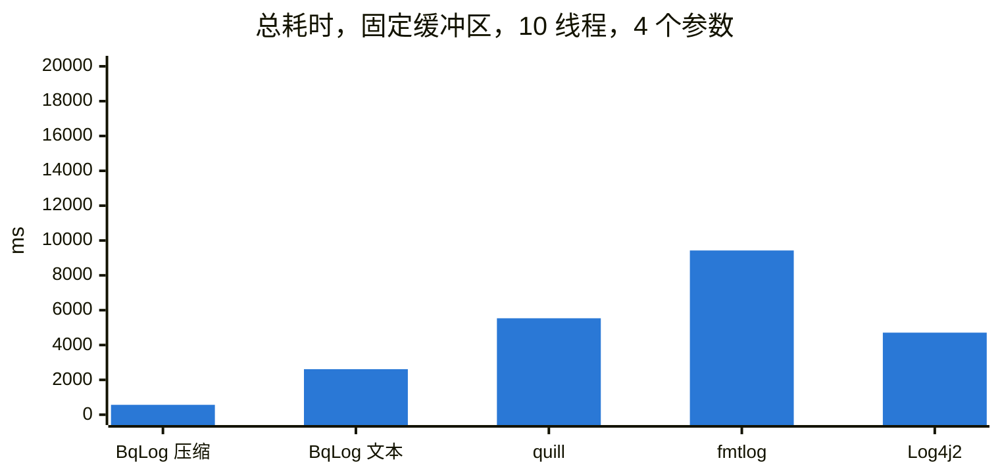

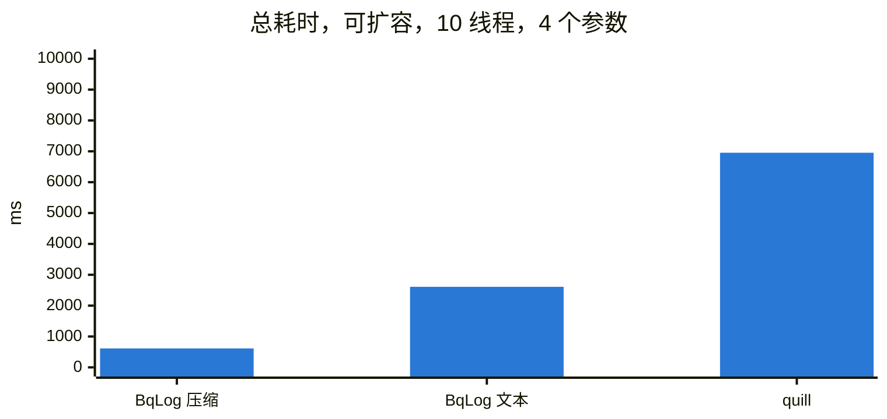

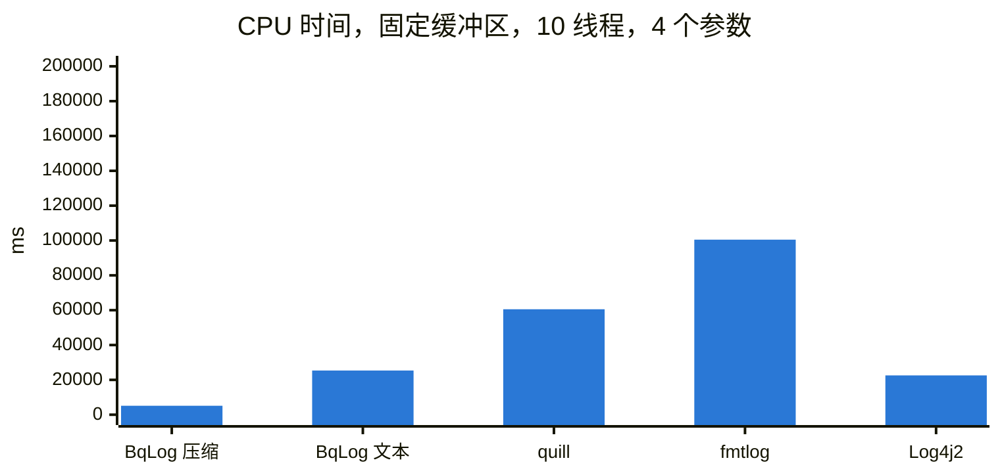

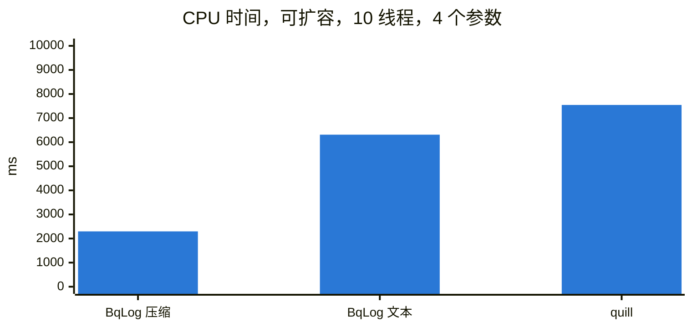

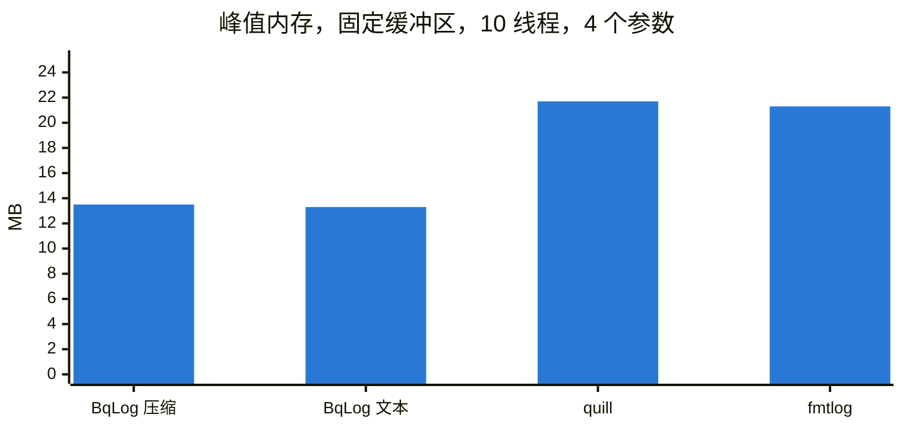

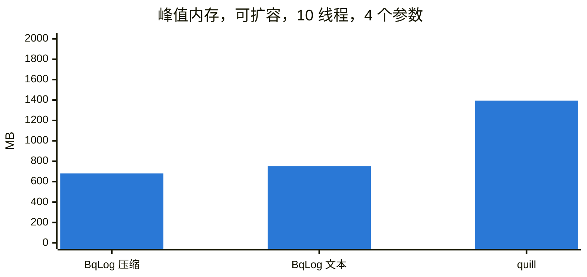

#### 总耗时，4 个参数（毫秒，越小越好）

| | 1 线程 | 2 线程 | 4 线程 | 6 线程 | 8 线程 | 10 线程 |
|---|---:|---:|---:|---:|---:|---:|
| BqLog，压缩 | 67 | 113 | 214 | 335 | 428 | 567 |
| BqLog，文本 | 252 | 487 | 984 | 1501 | 2036 | 2613 |
| quill | 405 | 731 | 1525 | 2366 | 3598 | 5536 |
| fmtlog | 722 | 1292 | 2717 | 4655 | 6951 | 9428 |
| spdlog（异步） | 600 | 1682 | 9931 | 26107 | - | - |
| glog（同步） | 5284 | 11662 | 36176 | 59615 | - | - |
| Log4j2（Java） | 494 | 946 | 1753 | 2556 | 3365 | 4711 |
| BqLog，压缩，扩容 | 97 | 119 | 225 | 341 | 475 | 614 |
| BqLog，文本，扩容 | 249 | 508 | 966 | 1476 | 2043 | 2610 |
| quill，默认队列（扩容） | 464 | 1023 | 2331 | 3756 | 5367 | 6954 |

#### CPU 时间，4 个参数（毫秒，所有线程合计，越小越好）

| | 1 线程 | 2 线程 | 4 线程 | 6 线程 | 8 线程 | 10 线程 |
|---|---:|---:|---:|---:|---:|---:|
| BqLog，压缩 | 109 | 328 | 906 | 2062 | 3703 | 5140 |
| BqLog，文本 | 562 | 1234 | 4531 | 8703 | 17078 | 25359 |
| quill | 812 | 2093 | 7578 | 16515 | 32109 | 60531 |
| fmtlog | 1156 | 3390 | 12609 | 30984 | 60046 | 100484 |
| spdlog（异步） | 1140 | 4390 | 35046 | 87703 | - | - |
| glog（同步） | 5296 | 22484 | 136281 | 332281 | - | - |
| Log4j2（Java） | 2875 | 4859 | 7468 | 12640 | 15562 | 22562 |
| BqLog，压缩，扩容 | 187 | 328 | 640 | 1093 | 1687 | 2296 |
| BqLog，文本，扩容 | 515 | 1015 | 2109 | 3375 | 4625 | 6312 |
| quill，默认队列（扩容） | 484 | 1093 | 2390 | 3968 | 5562 | 7546 |

#### 峰值内存，4 个参数（MB）

| | 1 线程 | 2 线程 | 4 线程 | 6 线程 | 8 线程 | 10 线程 |
|---|---:|---:|---:|---:|---:|---:|
| BqLog，压缩 | 12.5 | 12.6 | 12.9 | 13.0 | 13.2 | 13.5 |
| BqLog，文本 | 12.5 | 12.7 | 12.9 | 13.0 | 13.2 | 13.3 |
| quill | 15.4 | 17.3 | 16.4 | 17.5 | 19.4 | 21.7 |
| fmtlog | 12.1 | 13.1 | 15.2 | 17.2 | 19.3 | 21.3 |
| spdlog（异步） | 14.4 | 14.4 | 14.5 | 14.5 | - | - |
| glog（同步） | 11.9 | 12.0 | 12.1 | 12.3 | - | - |
| BqLog，压缩，扩容 | 86.6 | 121.2 | 256.8 | 405.0 | 524.7 | 681.3 |
| BqLog，文本，扩容 | 78.9 | 152.7 | 304.3 | 455.8 | 605.8 | 751.3 |
| quill，默认队列（扩容） | 152.2 | 289.3 | 564.3 | 844.4 | 1118.4 | 1394.3 |

#### 总耗时，无参数（毫秒，越小越好）

| | 1 线程 | 2 线程 | 4 线程 | 6 线程 | 8 线程 | 10 线程 |
|---|---:|---:|---:|---:|---:|---:|
| BqLog，压缩 | 36 | 68 | 145 | 216 | 297 | 376 |
| BqLog，文本 | 88 | 176 | 356 | 537 | 742 | 1056 |
| quill | 224 | 441 | 910 | 2142 | 3399 | 4505 |
| fmtlog | 505 | 926 | 1608 | 2589 | 4148 | 6592 |
| spdlog（异步） | 489 | 1723 | 13153 | 27474 | - | - |
| glog（同步） | 4386 | 8959 | 27110 | 43173 | - | - |
| BqLog，压缩，扩容 | 34 | 71 | 148 | 225 | 316 | 395 |
| BqLog，文本，扩容 | 90 | 178 | 413 | 551 | 795 | 1173 |
| quill，默认队列（扩容） | 245 | 632 | 2092 | 3618 | 5004 | 6287 |

#### CPU 时间，无参数（毫秒，所有线程合计，越小越好）

| | 1 线程 | 2 线程 | 4 线程 | 6 线程 | 8 线程 | 10 线程 |
|---|---:|---:|---:|---:|---:|---:|
| BqLog，压缩 | 62 | 156 | 625 | 1343 | 2359 | 3593 |
| BqLog，文本 | 187 | 437 | 1562 | 3015 | 5812 | 11390 |
| quill | 437 | 1281 | 4484 | 14796 | 30234 | 49171 |
| fmtlog | 718 | 2265 | 7171 | 16609 | 34750 | 69109 |
| spdlog（异步） | 906 | 4468 | 43593 | 87671 | - | - |
| glog（同步） | 4375 | 17031 | 101203 | 238156 | - | - |
| BqLog，压缩，扩容 | 62 | 171 | 328 | 515 | 718 | 953 |
| BqLog，文本，扩容 | 187 | 390 | 796 | 1156 | 1656 | 2531 |
| quill，默认队列（扩容） | 265 | 703 | 2156 | 3703 | 5250 | 6562 |

#### 输出文件大小（1 线程，4 个参数和无参数各 200 万条）

| | 格式 | 大小 | 每条字节数 |
|---|---|---:|---:|
| BqLog，压缩 | 二进制 | 47 MB | 12 |
| BqLog，压缩+加密 | 二进制，加密 | 47 MB | 12 |
| BqLog，文本 | 文本 | 297 MB | 74 |
| quill | 文本 | 255 MB | 64 |
| fmtlog | 文本 | 285 MB | 71 |
| spdlog（异步） | 文本 | 301 MB | 75 |
| glog | 文本 | 329 MB | 82 |

#### 结论

- **固定缓冲区（默认配置）**：BqLog 压缩在所有线程数下总耗时和 CPU 时间都最低，比其他库快 6～8 倍；BqLog 文本也比其他库快 1.5 倍以上。
- **可扩容**：与 quill 的默认队列相比，BqLog 压缩快 5～11 倍，CPU 时间约为 1/3，峰值内存约为一半。

### Linux

Linux 的吞吐数据没有列出：我们没有找到稳定的测试环境。试过的两种虚拟机（云虚拟机和 WSL2）上，虚拟机的磁盘调度都不可控，同一个测试各轮之间的结果最多相差 2 倍。benchmark 分支 [`benchmarks/2.6.0`](https://github.com/Tencent/BqLog/tree/benchmarks/2.6.0/benchmark/cross) 里有 Linux 的吞吐测试用例和运行脚本（`run_benchmark.sh`），有 Linux 物理机的开发者可以自行测试对比。

## 3. 日志线程延迟

业务线程调用一次日志要花多久。

### 测试方法

- **场景**：每个日志线程连写 20 条，再随机忙等约 2 ms，模拟业务里零散的日志调用；每线程 5,000 批。
- **计时**：每批前后各读一次 CPU 硬件计数器（arm64 `cntvct_el0`，x86-64 `rdtsc`），每条延迟 = 批耗时 ÷ 20。Mac 的计数器精度约 41.7 ns，平摊到 20 条后每条约 2 ns；x86 的 TSC 精度远小于 1 ns。
- **配置**：所有库用同一份测试源码，都用固定大小、写满阻塞的队列（每线程 64 KB），消费线程空闲时都休眠 1 ms（BqLog `log.worker_interval_ms=1`，quill `sleep_duration=1ms`，fmtlog 轮询间隔 1 ms）。
- **指标**：p50 是典型的一次调用，p99 / p99.9 是最慢的 1% / 0.1%，平均值反映日志一共占了业务线程多少时间；另外给出消费端 CPU 占用（占一个核的百分比）和峰值内存。
- 交替跑 5 轮取中位数。

### macOS（Apple M4 Pro）

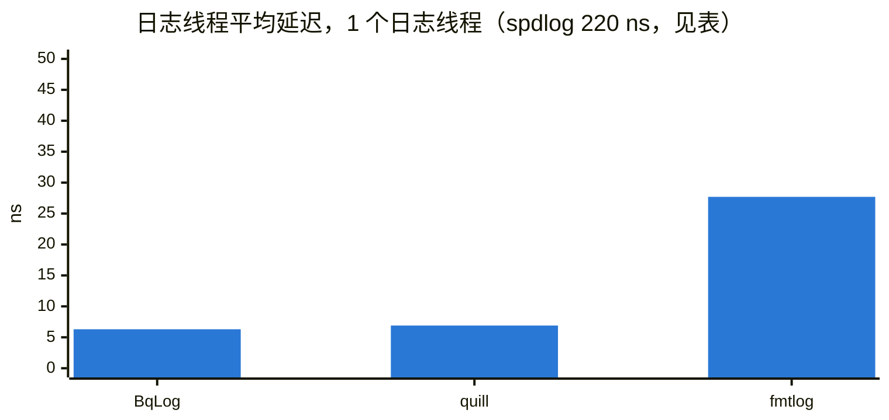

#### 1 个日志线程

| | p50（ns） | p99（ns） | p99.9（ns） | 平均（ns） | 消费端 CPU | 峰值内存（MB） |
|---|---:|---:|---:|---:|---:|---:|
| BqLog | 4 | 29 | 77 | 6.3 | 0.5% | 1.9 |
| quill | 4 | 29 | 154 | 6.9 | 0.5% | 1.9 |
| fmtlog | 16 | 166 | 227 | 27.7 | 0.5% | 2.4 |
| spdlog（异步） | 177 | 458 | 907 | 220.2 | 0.4% | 4.7 |

#### 4 个日志线程

| | p50（ns） | p99（ns） | p99.9（ns） | 平均（ns） | 消费端 CPU | 峰值内存（MB） |
|---|---:|---:|---:|---:|---:|---:|
| BqLog | 6 | 166 | 250 | 19.2 | 1.1% | 2.5 |
| quill | 6 | 168 | 252 | 18.4 | 1.2% | 2.9 |
| fmtlog | 18 | 175 | 294 | 34.3 | 0.9% | 5.7 |
| spdlog（异步） | 193 | 573 | 1175 | 228.4 | 1.5% | 5.0 |

#### 结论

- BqLog 的日志线程开销是所测库中最低的一档：1 线程时 p50 4 ns、p99 29 ns、p99.9 77 ns，各项都不高于其他库；4 线程时与表现最好的其他库持平（平均值相差 0.8 ns，在计时分辨率以内）。
- 与 fmtlog、spdlog 相比，BqLog 的 p50 低 3～40 倍，p99 和 p99.9 也都更低。
- 所有库的消费端 CPU 都在 1.5% 以内。

### Windows（AMD Ryzen 9 9950X）

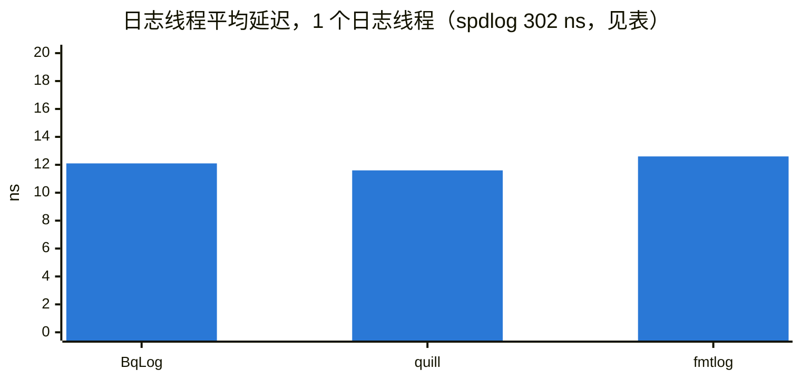

#### 1 个日志线程

| | p50（ns） | p99（ns） | p99.9（ns） | 平均（ns） | 消费端 CPU | 峰值内存（MB） |
|---|---:|---:|---:|---:|---:|---:|
| BqLog | 8 | 53 | 104 | 12.1 | 0.4% | 12.1 |
| quill | 8 | 44 | 73 | 11.6 | 0.4% | 11.7 |
| fmtlog | 8 | 53 | 94 | 12.6 | 1.0% | 12.1 |
| spdlog（异步） | 254 | 1006 | 1784 | 301.7 | 0.7% | 14.4 |

#### 4 个日志线程

| | p50（ns） | p99（ns） | p99.9（ns） | 平均（ns） | 消费端 CPU | 峰值内存（MB） |
|---|---:|---:|---:|---:|---:|---:|
| BqLog | 9 | 46 | 85 | 12.8 | 1.0% | 12.5 |
| quill | 8 | 43 | 69 | 12.4 | 1.9% | 12.7 |
| fmtlog | 9 | 53 | 74 | 14.6 | 2.2% | 15.3 |
| spdlog（异步） | 292 | 1079 | 1993 | 340.8 | 3.4% | 14.5 |

#### 结论

- BqLog、quill、fmtlog 在同一档，平均都在 11～15 ns；spdlog 慢一个数量级。

### Linux（AMD Ryzen 9 9950X，WSL2）

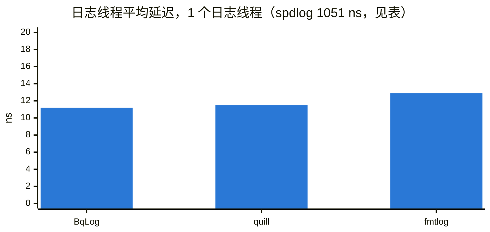

#### 1 个日志线程

| | p50（ns） | p99（ns） | p99.9（ns） | 平均（ns） | 消费端 CPU | 峰值内存（MB） |
|---|---:|---:|---:|---:|---:|---:|
| BqLog | 9 | 33 | 66 | 11.2 | 1.5% | 4.2 |
| quill | 9 | 34 | 63 | 11.5 | 1.4% | 4.2 |
| fmtlog | 11 | 41 | 83 | 12.9 | 1.2% | 4.5 |
| spdlog（异步） | 990 | 2476 | 5634 | 1051.4 | 0.9% | 6.8 |

#### 4 个日志线程

| | p50（ns） | p99（ns） | p99.9（ns） | 平均（ns） | 消费端 CPU | 峰值内存（MB） |
|---|---:|---:|---:|---:|---:|---:|
| BqLog | 10 | 32 | 51 | 11.5 | 2.0% | 4.2 |
| quill | 11 | 35 | 64 | 12.6 | 2.0% | 4.8 |
| fmtlog | 11 | 44 | 71 | 13.6 | 1.8% | 7.5 |
| spdlog（异步） | 1030 | 2420 | 6375 | 1069.6 | 3.0% | 6.8 |

#### 结论

- BqLog、quill、fmtlog 在同一档，平均都在 11～14 ns；4 线程时 BqLog 的 p50、p99 和平均都最低。
- spdlog 慢约两个数量级。

## 4. 快速模式与普通模式

BqLog 的 C++ 有两种写日志的方式，输出完全一样：

- **普通模式**：`log.info("idx:{}", i)`，所有语言的 wrapper 都支持，IDE 代码提示最好。
- **快速模式**：`BQ_LOG_FAST_INFO(log, "idx:{}", i)`，只有 C++ 版本才有。每个调用点绑定第一次调用时的 log 对象和格式串（[详见这里](API_REFERENCE_CHS.md#fast-mode)）。

快速模式把业务线程上的工作压到最少。以 macOS、1 个日志线程为例，每次调用平均 6.3 ns，普通模式是 16.2 ns；其他平台的变化也是这个量级。

对整体吞吐基本没有影响：日志系统的瓶颈在消费线程（格式化、压缩、写文件），业务线程上省下的这几纳秒不会改变总耗时。只有开启扩容时快速模式的吞吐明显更好，需要扩容的场景建议用快速模式。

## 5. 功能对比

| 特性 | BqLog | spdlog | glog | fmtlog | quill | Log4j2 |
|------|-------|--------|------|--------|-------|--------|
| 异步写入 | ✅ | ✅ | ❌ | ✅ | ✅ | ✅ |
| 实时压缩 | ✅ | ❌ | ❌ | ❌ | ❌ | ❌（滚动 gzip） |
| 日志加密 | ✅（RSA+AES 混合） | ❌ | ❌ | ❌ | ❌ | ❌ |
| 崩溃恢复 | ✅（Recovery） | ❌ | ✅（信号处理） | ❌ | ✅（信号处理） | ❌ |
| 多语言支持 | ✅（C++/Java/C#/Python/TypeScript/ArkTS/Go） | ❌（仅 C++） | ❌（仅 C++） | ❌（仅 C++） | ❌（仅 C++） | 仅 Java |
| 跨平台 | ✅（Win/Mac/Linux/iOS/Android/鸿蒙） | ✅（Win/Mac/Linux） | ✅（Win/Mac/Linux） | ✅（Win/Mac/Linux） | ✅（Win/Mac/Linux） | JVM |
| `{fmt}` 格式化 | ✅ | ✅ | ❌（流式） | ✅ | ✅ | ✅（类似） |
| 游戏引擎插件 | ✅（Unity/Unreal） | ❌ | ❌ | ❌ | ❌ | ❌ |

## 6. 源代码

本版本（2.6.0）的完整工程在 [`benchmarks/2.6.0`](https://github.com/Tencent/BqLog/tree/benchmarks/2.6.0/benchmark/cross)：CMake + FetchContent，每个库一个可执行文件，运行脚本、原始数据，以及生成这些表格和图表的 `make_tables.py`。其他版本的 benchmark 见 [`benchmark` 分支的索引](https://github.com/Tencent/BqLog/tree/benchmark)。

- 吞吐：`bench_<lib>.cpp`，`run_benchmark.sh`（`bench_bqlog <线程数> <block|expand> [配置]`，`bench_quill <线程数> <block|expand>`）
- 日志线程延迟：`bench_latency.cpp`（一份源码，每个库编一次），`run_latency.sh`
- CPU 和内存的读取：`bench_sys.h`
