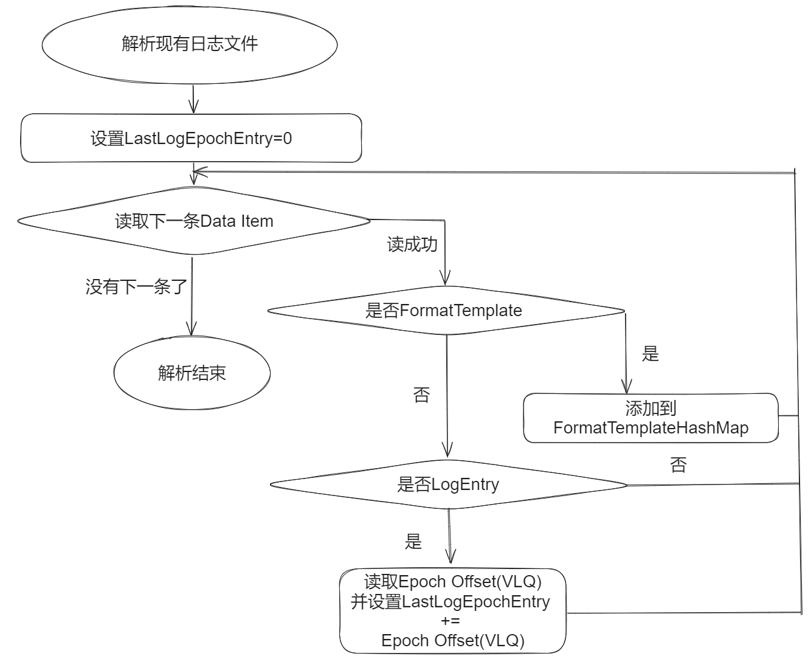
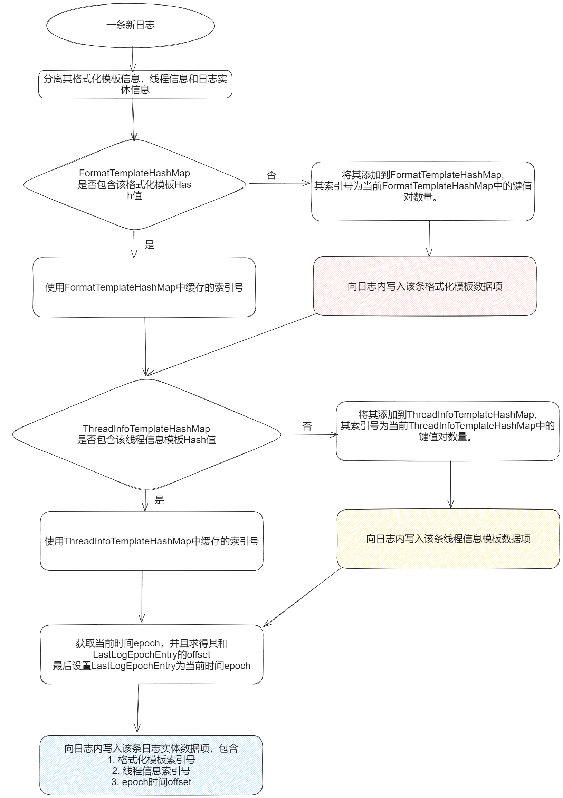
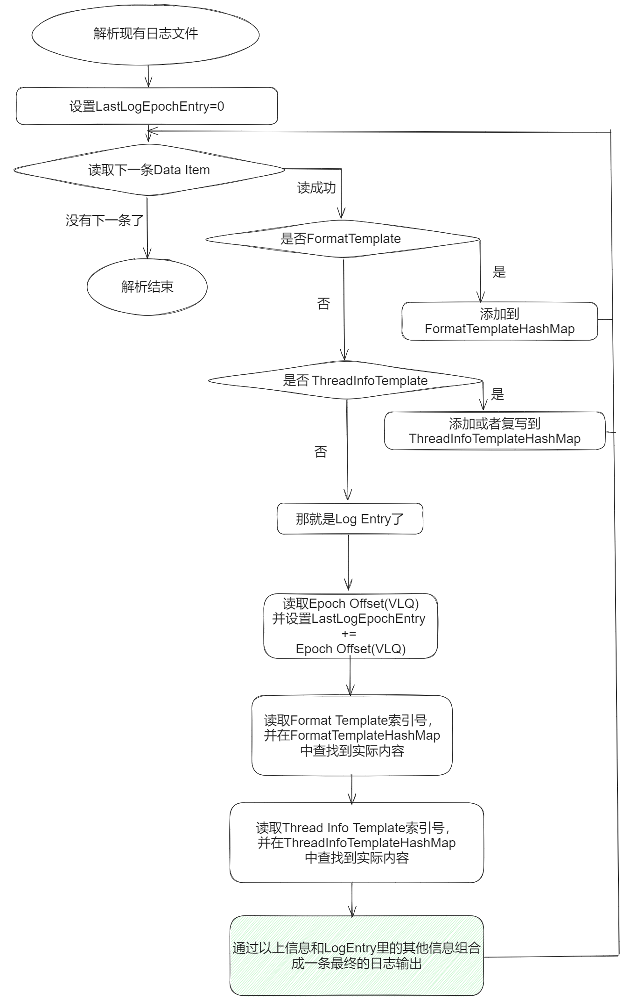

## 1. 为什么需要压缩格式

在很多的日志系统，比如[Log4j2](https://github.com/apache/logging-log4j2)等都提供了压缩日志，但是他们的方案都是采取写完日志之后，进行一次传统压缩算法的压缩，这样对性能来说是非常不友好的。而BqLog提出了一种压缩日志算法，这种算法是写入实时的，没有后处理。不仅性能远高于文本格式日志，而且存储空间和传统压缩算法也相差无几。该格式已经申请了专利。

### 2. 文本日志格式的问题在哪里

现有的日志系统一般会将日志保存成文本文件。每一条日志一般是以下信息组成：

```c
    时间|日志等级|额外信息|日志内容
    Time| LogLevel|ExtraData|LogContent
```

在实际应用场景中，有大量的日志都是参数化的记录信息。比如一条订单日志，里面会有订单号，订单价格，订单下单人的名字。类似如下：

```c
2024-05-29 13:23:56.932 [Info] [Shop.Order] [Tid-2025 Thread Worker25] New order, order ID:32422144, price:324.42, username:张三

2024-05-29 13:23:56.972 [Info] [Shop.Order] [Tid-2027 Thread Worker27] New order, order ID:32422145, price:174.45, username:李四
```

上面两条日志是某个订单系统的日志中的两行，Info是日志等级(LogLevel)，一般有`Verbose`， `Debug`， `Info`， `Warning`， `Error`，`Fatal`等，代表本条日志的重要程度。Shop.Order 就是额外信息(ExtraData)，这里的额外信息是这条日志的类型，Tid-2027 Thread Worker27代表的额外信息(ExtraData)，这里包含了线程名，后面的是日志正文，描述了一条订单信息，包含订单号，价格和下单人的名字。

这里可以看到，两条日志大部分的内容都是相同的，只有时间不同，还有后面的订单号，价格和下单人名字不同。

这就带来了两个问题。

1. 性能问题：每一条日志都进行了字符串的拼接或者格式化，拼接是指日志正文是把“New Order, order ID:”，订单号，“,price:”，价格，“,username:”，下单人名字，这6个字符串拼接起来。格式化是指可能是用了编程中常见的格式化方法，把字符串“New order, order ID:{}, price:{}, username:{}”中的“{}”分别替换成了三个参数，其中“{}”在不同的环境下可能有不同的表示，可能是%s，也可能是其他的特殊符号。总之，都代表这里是一个参数。这就带来了性能上的消耗。
2. 存储空间问题：每一条日志都存储了完整的字符串，结果就是里面充斥了大量的重复的“Shop.Order New order, order”字符串，浪费了很多的空间。

### 3. BqLog压缩方案详细解析

#### 3.1 数据项（Data Item）

本日志格式文件是由一条一条的数据项（Data Item）紧凑组成，大概图示如下：


_**图1 压缩日志文件格式结构**_	

如图1所示每一条数据项（Data Item）是紧凑排列的，图中的换行只是为了示意，每一项之间没有任何换行符，空格一类的空隙。

其中每一项数据的结构如下：


_**图2 数据项(Data Item)数据结构**_	

前面2-9字节为数据项(Data Item)的头部段（Data Section），记录的是数据段(Data Section)的类型和实际长度（Data Section Length）（单位字节）。这里用了一个本发明的特别数据压缩技巧。

其中数据类型（Type）只用了第一个比特位，0代表这是一个日志模板(Log Template)数据项，1代表这是一个日志实体(Log Entry)数据项。具体介绍见后文，这里附上两种情况的简单示意图，图3。


_**图3 数据项(Data Item)的两种类型**_	

头部除开这一个类型（Type）的比特位，剩下的头部段（Data Section）数据都是存储后面的数据的实际长度。本发明的正整数编码应用的是VLQ算法的双射计数法。其特点是：

1字节 1XXXXXXX  表示值范围[0, 2^7^)

2 字节 01XXXXXX XXXXXXXX 表示值范围[2^7^, 2^7^ + 2^14^)

3 字节 001XXXXX XXXXXXXX XXXXXXXX 表示值范围[2^7^ +2^14^, 2^7^ + 2^14^ +2^21^)

其中01XXXXXX代表一个字节用比特01开头，后面位的X代表0或者1。

当数据实际长度小于128，在[0, 2^7^)的时候，VLQ编码的第一位是必须要用1来表示的，这就和我们的第一Bit位用作表示数据类型冲突，所以这种情况我们就把第一个字节除开表示类型的第一位类型（Type）标志位之外全置0，把数字编码到第二个字节。

其他情况，VLQ编码的第一个字节的第一位都是0，所以我们就可以用它来存放表示类型的Bit位，然后从第一个字节第二位开始做实际的VLQ编码。这样的话当长度大于等于2^7^编码存储空间大于一个字节的时候，我们就可以有效利用最前面冗余的比特位来存储数据项(Data Item)的类型标志。

在读取解码的时候，按照以下流程（伪码）：

```c
If(首字节后7位为0)

{

    代表VLQ编码之后只有一个字节，值在[0, 2^7^)范围，存储在第二个字节，直接VLQ解码第二字节得到数据项(Data Item)长度。

}else{

    数据类型 type = 首字节第一个比特。

    将首字节第一个比特置0

    从首字节开始解VLQ编码得到数据项(Data Item)长度。

}
```

对比常规的思路，第一个字节放类型，从第二个字节开始做VLQ编码。本发明当数据长度大于等于2^7^的时候，可以节省一个字节。

当头部段（Data Section）编码完毕之后，剩下就是直接把后面的数据段(Data Section)接着存储即可。

同样读取的时候，当头部段（Data Section）解码完毕之后，就按照解码出来的长度读取后面的数据段(Data Section)作为该数据项(Data Item)的实际数据部分。

####3.2 日志模板（Log Template）

当数据项(Data Item)的首比特为0的时候，其数据段(Data Section)叫做日志模板。顾名思义，日志模板就是把一些日志里频繁出现的不变的数据抽离出来，只保存一份，用于节约空间。比如前面日志中的“New order, order ID:{}, price:{}, username:{}”这样的信息。日志模板分为两类，数据结构大致如下：


_**图4 格式化模板（Format Template）**_


_**图5 线程信息模板（Thread Info Template）**_

我们称数据段(Data Section)首字节的值为模板类型（Template Type），根据它的不同把DataSection分成了两种类型，模板类型（Template Type）为0，则剩下的数据段(Data Section)数据叫做格式化模板（Format Template），为1，则剩下的数据叫做线程信息模板（Thread Info Template）。

其中格式化模板（Format Template）保存的是格式化信息，也是日志中最常见的重复出现部分。对应前文出现的两条日志：

```c
2024-05-29 13:23:56.932 [Info] [Shop.Order] [Tid-2025 Thread Worker25] New order, order ID:32422144, price:324.42, username:张三

2024-05-29 13:23:56.972 [Info] [Shop.Order] [Tid-2027 Thread Worker27] New order, order ID:32422145, price:174.45, username:李四
```

他们的格式化模板是一样的，都是：

_**Info New order, order ID:{}, price:{}, username:{}**_

其中Info代日志等级（Log Level）, Shop.Order是额外信息(Extra Data)，剩下的是格式化字符串(Format String)

三种信息用图4的形式进行保存，其中日志等级（LogLevel）用一个字节表示，分别为：

1. `Verbose` （最低日志等级，可能是大量杂乱无意义的冗余输出）
2. `Debug` （调试日志等级，一般都是调试信息）
3. `Info` （日常日志信息）
4. `Warning` （警告日志信息，要引起重视）
5. `Error` （错误日志信息，不能忽略）
6. `Fatal` （致命错误日志信息）

接着是额外信息（Extra Data），用两个部分存储，第一部分是VLQ编码的额外信息长度（Extra Data Size），再来是实际的额外信息长度。最后跟着的是（格式化字符串）Format String，占满数据段（Data Section）剩余的存储空间。

在日常使用情况中，这三种信息往往是匹配出现的，所以把他们存储到一起，可以方便后面日志重复使用这些信息的时候直接引用，而不是进行冗余存储。引用他们的方式就是通过格式化模板（Format Template）的索引号，而索引号就是格式化模板（Format Template）在日志文件中出现的顺序号，第一个格式化模板（Format Template）的索引号是0，后面则是1，2，3递增。后续日志实体(Log Entry)可以通过索引号来引用具体的格式化模板（Format Template）。详情见后文。

再来看图5的线程信息模板（Thread Info Template），记录的是调用日志的线程信息，Tid-2025 Thread Worker25这种线程信息中，2025是线程ID，后面的ThreadWorker25是线程名。线程信息模板分成三个部分，分别是线程信息索引（Thread Info Index），线程ID(Thread ID)和线程名(Thread Name Text)。其中前两者都是数字，用VLQ编码节约空间。

线程信息索引（Thread Info Template Index）是一个从0开始的自增数列，如果一个进程多次重启，但是日志都写到同一个文件内，则每次重启之后，线程索引信息重新从0开始自增。比如说第一次遇到线程A，会写入一条线程信息模板，它的线程信息索引（Thread Info Index）就是0，接着第一次遇到线程B，又会写入一条关于线程B的信息模板，它的线程信息索引（Thread Info Index）就是1。和格式化模板（Format Template）不同，线程信息索引（Thread Info Index）在每次进程重启之后就全变了，所以前文记录的线程信息对于后续的日志就没有意义了，因此需要重新置0。后续日志实体(Log Entry)可以通过线程信息索引（Thread Info Index）来引用具体的线程信息。

#### 3.3 日志实体（Log Entry)

日志实体（Log Entry）记录的是每一条日志，除开格式化模板（Format Template）和线程信息模板（Thread Info Template）这种复用的模板信息外的，每一条日志自有的数据，以及引用的格式化模板（Format Template）和线程信息模板（Thread Info Template）的索引号。比如前文的日志：

```c
2024-05-29 13:23:56.932 [Info] [Shop.Order] [Tid-2025 Thread Worker25] New order, order ID:32422144, price:324.42, username:张三
```

它的日志实体（Log Entry）包含了一个时间戳(TimeStamp)，还有对Info New order, order ID:{}, price:{}, username:{}这个格式化模板（Format Template）的引用，对Tid-2025 Thread Worker25这个线程信息模板（Thread Info Template）的引用，最后是三个格式化的参数: 32422144, 324.42, 张三。


***图6 日志实体（Log Entry)***

日志实体（Log Entry）如图六所示，首先是第一个字段是时间。传统方法一般是记录Epoch时间，如果单位是毫秒，则Epoch时间是一个64位正整数，使用8字节存储，如果是秒，则是一个32位正整数，用4字节存储。本发明在这里记录的是Epoch时间的偏移(Epoch Offset)并用VLQ编码。举例来说，一个日志文件的第一条日志实体的Epoch时间是T，则直接对T进行VLQ编码后存储。第二条日志的Epoch时间是T1，则记录(T1 – T2)的VLQ编码，第三条日志的Epoch时间是T2，则记录（T2 – T1）的VLQ编码。这里会有一个巨大的好处，因为日志的时间是从小到大递增的，而且频繁日志之间的时间间隔往往很小，这样的话除了第一条日志实体（Log Entry），后续的日志记录的时间字段的值都很小，根据VLQ的特性，他们使用的存储空间也很小，往往都只有一个字节。

第二个字段和第三个字段是两种类型的日志模板（Log Template）的索引号，每一条日志实体（Log Entry）一定会对应一条格式化模板（Format Template）和一条线程信息模板（Thread Info Template）。这里记录的就是其对应的索引号，用VLQ编码，索引号都是从0开始记录的，所以大部分情况下这里使用存储空间都很小。

第四个字段是可选的，根据参数的数量，会有多个参数的数据，如果没有参数，则不存在第四个字段。其每一个参数的具体结构如图7所示：


_**图7 日志实体参数（Log Entry Param）**_

不同参数类型下，数据的格式和尺寸如下（示例，可以根据实际情况任意定制）

| ​ | ​ | ​ | ​ |
|:---:|:---:|:---:|:---:|
| **Param Type\*\***值\*\* | **说明** | **存储方式** | **Param Data\*\***尺寸（字节）\*\* |
| **1** | 空指针 | 无数据 | 0 |
| **2** | 指针地址 | 8字节存储 | 8 |
| **3** | 布尔值 | 1字节（0或者1） | 1 |
| **4** | 字符类型 | 1字节 | 1 |
| **5** | 宽字符类型 | 2字节 | 2 |
| **6** | 整数类型 | VLQ便阿门 | 1-9字节 |
| **7** | 单精度浮点数 | 直接存储 | 4字节 |
| **8** | 双精度浮点数 | 直接存储 | 8字节 |
| **9** | Utf8类型字符串 | Vlq长度+内容 | 内容+vlq存储空间 |
| **10** | Utf16类型字符串 | Vlq长度+内容 | 内容+vlq存储空间 |
| **……** | …… | …… | …… |


#### 3.4 写日志流程

在开始写日志之前，我们先定义几个变量：

- `FormatTemplateHashMap<HashCode, FormatTemplateIndex>`: 格式化模板（Format Template）的Hash表，Key是格式化模板内容的Hash值，Value是这条格式化模板（Format Template）对应的索引号。
- `ThreadInfoTemplateHashMap<ThreadId, ThreadInfoTemplateIndex>`： 线程信息模板(Thread Info Template)的Hash表，key是线程ID，Value是这条线程信息模板(Thread Info Template)对应的索引号
- `LastLogEntryEpoch`: 最后一条日志实体（LogEntry）的Epoch时间。

在开始写日志之前，我们可能是接着上一次的日志文件在后面添加新的日志，所以需要对前面的内容进行一个解析，因为我们需要知道一些关键信息：

- 之前已经记录了哪些线程信息模板 (Thread Info Template) 了，这些都是我们需要复用的。
- 最后一条日志实体(Log Entry)对应的Epoch时间是多少，我们后续的日志记录的时间都是前一条的增量。

具体流程如图8：



_**图8 写日之前的现有日志文件解析流程**_

接下来的图9是新来一条日志之后的实际写日志流程。



_**图9 一条新日志的写入流程**_

在生成的日志文件，假如我们忽略最外层包装的数据项(Data Item)，单纯看每一条数据项的类型，可能是如图10的结构：


_**图10 日志结构示意图**_

#### 3.5 读日志方案

在开始解码日志之前，我们先定义几个变量：

- `FormatTemplateHashMap<Index, FormatTemplateContent>`: 格式化模板（Format Template）的Hash表，Key是这条格式化模板（Format Template）的索引号，Value是对应的实际内容。
- `ThreadInfoTemplateHashMap<Index, ThreadInfoTemplateContent>`： 线程信息模板(Thread Info Template)的Hash表，key是这条线程信息模板(Thread Info Template)的索引号，Value是对应的实际内容
- `LastLogEntryEpoch`: 最后一条日志实体（LogEntry）的Epoch时间。



_**图11 日志文件的解析流程**_

### 4. 总结

理论上最后应该上一下压缩比的评测，但是实际上各位看过该格式的实现之后应该知道，在不同的日志内容环境下，该格式的压缩比会有很大的浮动。在服务器，网络这种有大量重复日志的场景，其文件尺寸只有原始文本日志的10%左右，根据HOK的外网经验，游戏客户端日志一般也只有原始文本日志尺寸的20%左右。

在写入性能方面，可以参考Github中的benchmark，其性能是文本格式的3-4倍左右。