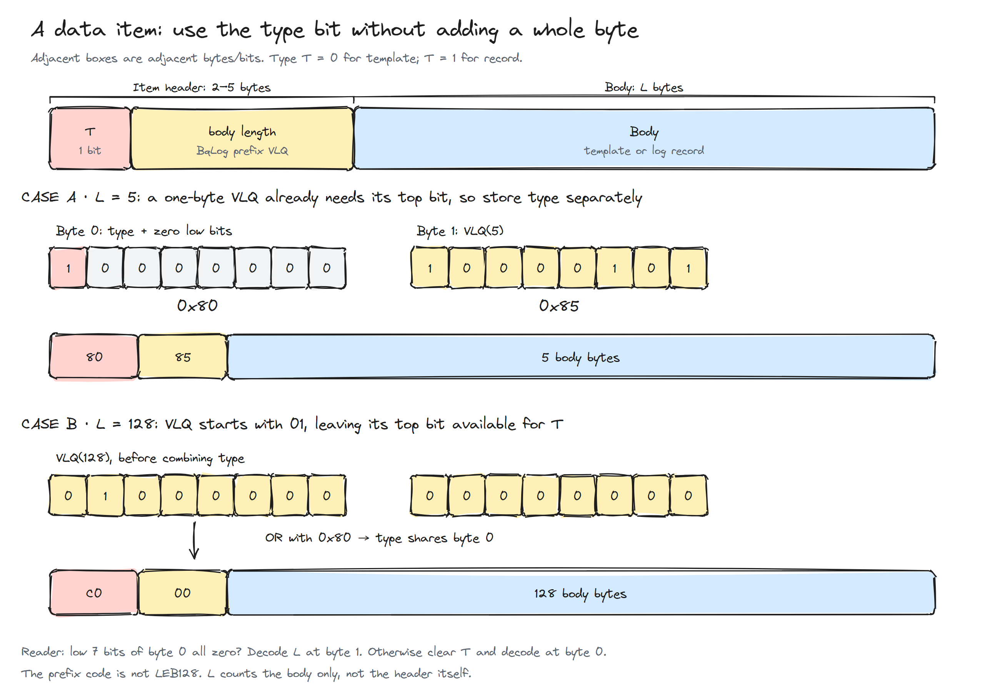
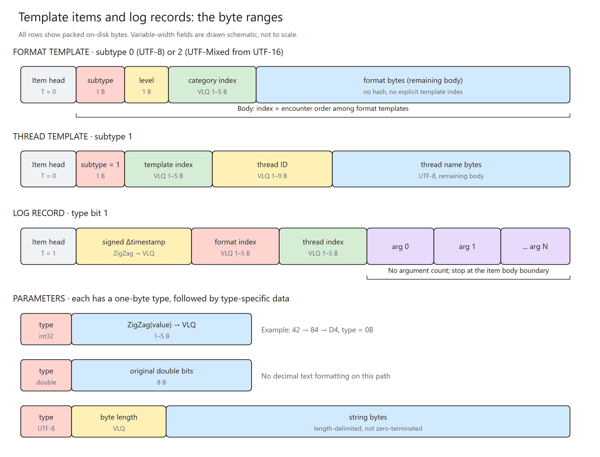
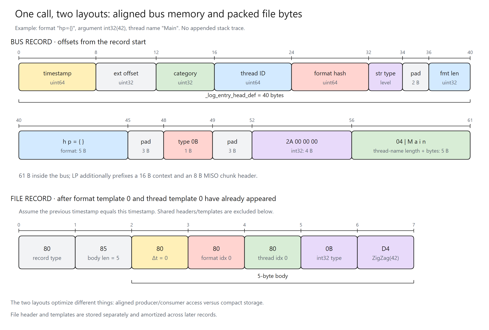
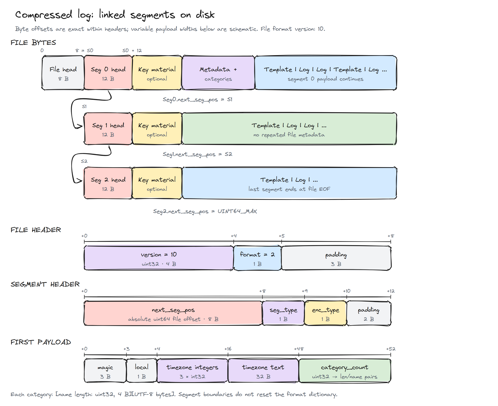
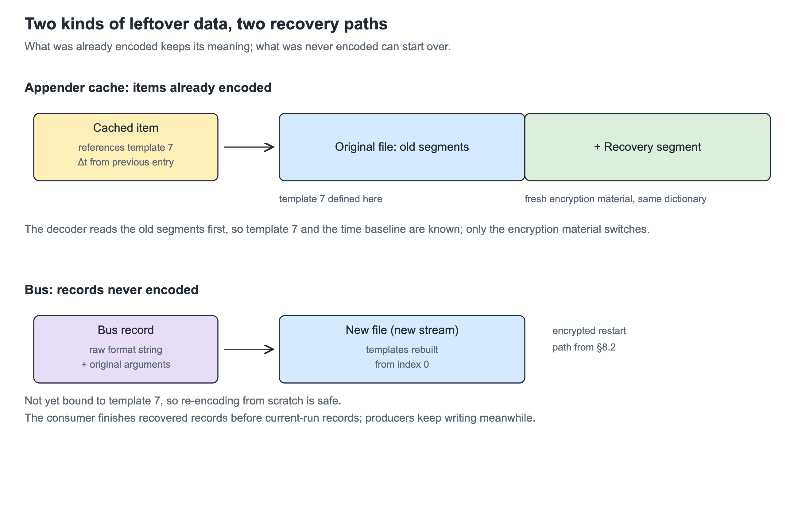

# 为何 BqLog 如此快之一：从一行文本推导出压缩日志格式

[English](<Article 1_Why is BqLog so fast - High Performance Realtime Compressed Log Format.MD>) · [系列目录](PERFORMANCE_DESIGN_CHS.md) · [下一篇：数据总线](<文章2_为何BqLog如此快 - 从环形队列到自适应数据总线.MD>)

线上日志要留够排查问题的信息，但写入不能拖慢业务，文件也不能无限增长。移动设备上，这几个要求尤其容易冲突。

一种常见办法是先写文本，关闭文件后再压缩。这能节省归档空间，却省不了写入时的格式化、拷贝和首次写盘。BqLog 选择在写入之前利用日志本身的结构，减少这些工作。

先看一行普通日志如何产生，再拆开其中重复的部分。后面会沿着同一条思路讲文件布局、续写和加密。

本文参照 BqLog 2.5.0 编写。

## 1. 一行文本日志的写入成本

以一个订单系统为例，业务代码可能是：

```cpp
log.info("New order, order ID:{}, price:{}, username:{}",
         32422144, 324.42, "张三");
```

最后落到文件里的是这样一行：

```text
2026-09-25 12:00:00.001 [Info] [Shop.Order] [Tid-2025 Worker25]
New order, order ID:32422144, price:324.42, username:张三
```

方括号里依次是级别、分类和线程标识，正文由格式字符串和参数拼成。写出这行文本，需要把时间戳、整数和浮点数转成字符串，与固定文本拼接，再写入文件。编码不同时还要转换字符集。即使把格式化交给后台线程，这些工作也仍要做。

紧接着又来了一条订单：

```text
2026-09-25 12:00:00.002 [Info] [Shop.Order] [Tid-2025 Worker25]
New order, order ID:32422145, price:174.45, username:李四
```

两条记录只在时间和三个参数上不同，固定文本却被重新拼接、重新写入。

若一天有一千万条这样的日志，每条重复 50 字节固定内容，仅重复部分就约 500 MB。这些字节还会经过拷贝和 I/O。

业务代码其实已经给出了边界：**格式字符串固定，参数变化。**文件可以直接保存这个边界，不必每次都保存完整句子。

## 2. 用模板和参数代替完整句子

第一次见到格式字符串时存下它，并分配编号。此后同一格式只写编号和参数：

```text
模板 0: New order, order ID:{}, price:{}, username:{}

日志 A: 模板 0, 32422144, 324.42, 张三
日志 B: 模板 0, 32422145, 174.45, 李四
```

这样做把格式化移到了读取时。很多诊断日志最终并不会被打开，对它们而言，写入时就省掉了格式化。真正需要读取时，再按模板还原文本。

读取工作还可以放到研发机器或分析环境，减少业务设备上的开销。

日志级别、分类、线程 ID 和线程名也会重复。不过，同一条业务格式可能由多个线程输出。若把所有字段放进一个模板，换一个线程就要再存一份格式字符串。

所以 BqLog 把稳定信息拆成两种模板：

- **格式化模板**：日志级别、分类索引、格式字符串。
- **线程信息模板**：线程 ID 与线程名。

每条日志分别引用这两个模板。线程换了，格式照样复用；业务格式换了，线程信息也照样复用。

分类列表在创建 Log 对象（一个日志器实例）时已经确定，可以放在文件开头；格式模板只保存分类索引。这样，分类表、格式模板、线程模板和日志记录按各自的更新频率分开保存。

## 3. 模板和日志混在一起，读取时怎么分辨

文件里现在有格式模板、线程模板和日志记录。新线程或新格式随时可能出现，所以这三类数据会交错写入。

若分别存到几个文件，就要维护文件间的对应关系。放进同一个文件，读取时怎么知道每一项到哪里结束？格式字符串和参数个数都不固定，没法预设宽度；靠结束符一路扫到尾也不可靠，二进制参数里什么字节都可能有，结束符还得转义。直接的办法是开头写明长度：读完头部就知道这一项的范围，也知道下一项从哪开始。

BqLog 把它们写成连续的 **Data Item**：每项先写类型和长度，再写内容。



<p align="center"><em>图 1：一个 item 的头部和 body，以及两种长度情况下的具体 bit 布局。横向相邻的框在文件中也相邻。</em></p>

固定用 4 字节表示长度很简单，但多数日志很短，长度字段本身就会占去不少空间。这里改用变长整数编码。

### 3.1 小数字用少量字节

BqLog 用的是带前缀的 VLQ 编码。为了看清楚，先只考虑无符号整数：

```text
1 字节: 1xxxxxxx
2 字节: 01xxxxxx xxxxxxxx
3 字节: 001xxxxx xxxxxxxx xxxxxxxx
...
9 字节: 00000000 + 8 个数据字节
```

前缀里第一个 1 出现在第几位，就告诉 decoder（解码器）这个数总共占几个字节。编码变长之后，不再重复表示前一个长度已经覆盖的数字，而是直接从新区间的起点开始计数：

| 字节数 | 起点 | 可表示的区间 |
|---|---:|---|
| 1 | 0 | 0–127 |
| 2 | 128 | 128–16511 |
| 3 | 16512 | 16512–2113663 |

比如 128 不会再在两字节里原样编码成 128，而是表示“第二个区间的第 0 个数”，编码结果是 `40 00`；16512 是第三个区间的第 0 个数，结果是 `20 00 00`。

这里的 VLQ 不是常见的 LEB128（那种编码每字节存 7 位、最高位作延续标志）。BqLog 的前缀布局保证多字节编码的首 bit 恒为 0——这个空位在 3.2 节还有别的用途。区间起点、前缀和字节顺序以 [log_utils.h](../src/bq_log/utils/log_utils.h) 为准。

### 3.2 类型位复用长度前缀

Data Item 顶层只区分“模板”和“日志”，模板内部再分格式、线程，所以顶层类型只要一位：0 为模板，1 为日志。

如果类型单独占一字节，短记录的头部比例又会增加。观察 VLQ 前缀：编码长度超过一字节时，首 bit 一定为 0，可以用它保存类型。

比如长度 128 的编码是 `40 00`。如果它是一条日志，把首 bit 置 1，变成 `C0 00`，类型和长度加起来还是只占两字节。

长度 5 的 VLQ 是 `85`，首 bit 已经被长度前缀占了，借不了。这时候才额外写一个字节：日志类型 `80`，长度 `85`，合起来 `80 85`。

decoder 先从首 bit 读类型，再检查低 7 位。若全零，就从下一字节解长度；否则清掉类型位，从当前字节开始解。这样，长度至少为 128 的 body 可以复用首字节，短 body 则显式保存类型。

当前 body 长度是 uint32，所以 item 头实际占 2–5 字节。注意长度不包括头本身，这一点在回填和解码时都得保持一致。

## 4. 再把模板里的每一项拆开



<p align="center"><em>图 2：从模板到单个参数逐层展开。颜色对应内容种类，字段中的字节数对应实际编码。</em></p>

格式模板的 body 依次是：

```text
subtype (1 B) | level (1 B) | category_index (VLQ) | format bytes
```

subtype=0 表示格式来自 UTF-8，subtype=2 表示来自 UTF-16，后者在文件里用 UTF-Mixed 表示（[第 6 节](#6-utf-16性能与体积之间再做一次取舍)细讲）。格式字符串占满 body 剩下的空间，所以不必再存一个字符串长度，也不需要结尾零字符。

格式模板不需要显式索引：文件中第一次出现的是 0 号，第二次是 1 号，以此类推。writer（写入端）和 decoder 按相同顺序编号。decoder 因而可以用数组下标访问模板。

线程模板稍有不同：

```text
subtype=1 (1 B) | thread_template_index (VLQ) | thread_id (VLQ) | thread_name
```

这里显式写索引，是因为线程信息可能在新的运行里被重新定义。一个明文文件可能被同一个程序多次打开续写，但上一次的线程 ID、线程名对应关系不能直接套到这一次。新的线程模板可以覆盖某个索引的定义，decoder 按文件顺序更新映射，后面的日志引用新信息。

**文件索引和内存缓存槽位是两回事。**writer 的模板缓存可以淘汰条目；被淘汰的格式再次出现时，文件会再写一份模板并分配新索引。已有记录仍指向旧索引，缓存淘汰只影响之后的复用率和文件大小。

格式哈希只供 writer 查找模板。decoder 使用文件索引，因此磁盘记录不保存这个哈希。

## 5. 每条日志真正变化的内容，还能继续压缩

模板抽走之后，日志记录的 body 只剩下：

```text
时间差 | 格式模板索引 | 线程模板索引 | 参数0 | 参数1 | ...
```

格式和线程索引通常从小数字开始，适合用 VLQ。时间戳和参数还有各自的编码方式。

### 5.1 时间戳很大，时间差很小

毫秒级 Epoch 时间戳（从 1970 年起算的毫秒数）要 64 位表示，逐条存就是 8 字节。可连续两条日志的间隔往往只有几毫秒，甚至同一毫秒里好几条。既然上一条时间已知，下一条只记差值就够了。

比如三条日志的时间分别是 1000、1002、1001 ms，差值就是 1000、2、-1。第一条以 0 为基准，后面每条以前一条为基准。

第三条比第二条早，是怎么发生的？多线程交错写入时，记录被消费的顺序本来就可能不同于取时间戳的顺序（这是第二篇的主题）。消费端在编码前会把时间戳钳成非递减，挡掉这类回退——代价是乱序那几条的时间被改写成上一个值；同一运行内，文件里的差值不会出现负数。但有一种情况钳制帮不上忙：明文文件续写时，时间基准是从旧文件里恢复出来的，新运行的记录若赶上系统时钟回拨，就会比基准还早。格式必须允许负差存在，又不能让它占空间。

ZigZag 正好解决小负数的问题：

```text
原值:     0  -1   1  -2   2  -3   3
映射后:   0   1   2   3   4   5   6
```

把有符号值映射成无符号，再做 VLQ。这样 +1 和 -1 都很小，不会因为负数补码的高位全是 1，被迫占满 8 或 9 个字节。

### 5.2 整数不必转成字符，浮点也不必提前格式化

参数前面存一个类型字节，告诉 decoder 后面该读几字节、要不要解 VLQ：

| 参数 | 去掉类型字节后的内容 |
|---|---|
| null | 不需要内容 |
| pointer | 统一 8 字节 |
| bool、char、int8、uint8 | 1 字节 |
| char16、char32、uint16、uint32、uint64 | 无符号 VLQ |
| int16、int32、int64 | ZigZag + VLQ |
| float / double | 原始 4 / 8 字节 |
| UTF-8 字符串 | 字节长度 VLQ + 内容 |
| UTF-16 字符串 | 转成 UTF-Mixed 后保存长度与内容 |

浮点数直接保存 4 或 8 字节二进制值。它的位模式和数值范围不同于整数，文本输出还涉及精度格式；在写入端先转成十进制字符串没有必要。

`bool`、`int8` 等类型本身只有一字节，再做变长编码也不会更省。

每条记录也不再单独存参数个数。按类型读完一个参数，看看是否到了 item 末尾，就知道了。

## 6. UTF-16：性能与体积之间再做一次取舍

C#、Java、Unreal 经常用 UTF-16。对 ASCII 字符来说，每个字符的高字节都是 0，两字节存一个英文字母确实浪费。但把 UTF-16 无条件转成 UTF-8，遇到中文、代理对和混合文本时判定会变多，而且有些字符的 UTF-8 表示反而更长。

UTF-Mixed 先把前面的 ASCII 收窄为一字节。遇到不适合继续快速处理的内容，就写一个 `FF` 标记，后面的 UTF-16 作为整体拷贝。


<p align="center"><em>图 3：以标量切分为例，<code>abc中x</code> 的 10 个 UTF-16 字节变成 8 字节。末尾 x 仍留在 UTF-16 后缀里。</em></p>

注意这里的“剩余”包括后面再出现的英文字符——不会为了省一个字节反复切回来。SIMD（单指令多数据的并行指令）路径还可能在包含非 ASCII 的块之前停手，所以相同内容的合法切分不必完全一致。

图中的字符串完整转成 UTF-8 只需 7 字节，UTF-Mixed 却用了 8 字节。这里选的是更少的编码工作，而非最小的单条输出：后缀可以直接批量拷贝，无需逐字符转换。

decoder 在已知长度里找 `FF`，前缀直接拷贝，后缀转 UTF-8。这里的 FF 不是字符串结束符，而是明确的编码切换标志。至于前面那段收窄怎么用 SIMD 跑，第三篇再讲。

## 7. 同一条日志，在内存和文件里为什么完全不同

到这里为止，我们一直在看文件格式。现在把它放回整条处理路径：BqLog 是异步日志，业务线程（生产者）不直接写文件，而是把记录放进内存队列（总线）；后台线程（消费者）取出记录，交给负责具体输出的组件（Appender）编码、写盘。这条总线是第二篇的主题。

文件格式已经很紧凑，生产者为什么不直接生成它？

文件模板索引由 Appender 分配，不同输出的模板集合也可能不同。如果生产者直接编码文件记录，就要访问这些共享字典。文件里的变长字段还会让内存中定位参数更费事。

所以 BqLog 的总线记录保留固定头部和适当对齐，消费端再转成紧凑的文件表示。用一条很小的日志看得最清楚：

```cpp
log.info("hp={}", int32_t(42));
```



<p align="center"><em>图 4：格式为 hp={}，线程名为 Main。图上方是总线内的记录，下方是模板已存在且时间差为 0 时的文件记录。</em></p>

内存头有 40 字节：完整时间戳、分类、线程 ID、格式哈希和长度都在里面。5 字节的格式内容按 4 字节边界对齐成 8 字节，int32 参数占类型区和数值区，最后还有线程扩展信息。这个例子的内部记录共 61 字节，走 LP 路径还会加上 context 和 ring 的块头（LP 是第二篇里的低频路径；context 和块头正是那里的主角）。

文件里则可以只有：

```text
80 85 | 80 | 80 | 80 | 0B D4
类型/长5  Δt=0 fmt0 thread0 int32(42)
```

`0B` 表示 int32；42 经 ZigZag 得到 84，编码为 `D4`，整项共 7 字节。文件头和模板由多条记录共用。内存布局方便生产者写入和消费者读取，文件布局尽量缩小记录。

## 8. 一条数据流之外，为什么还需要多段结构

前面的例子默认程序持续运行，模板表和加密状态一直在内存中。程序重启后，这些状态需要重新建立。不支持续写的话，加密日志崩溃一次就只能丢掉没写完的部分，或者重开时把旧文件整个解密重写一遍——比起分段结构多付的那点成本，这两种做法贵得多。

**续写压缩日志必须知道已有的模板编号和时间基线。**只把文件指针移到末尾，还不足以生成后续记录。

### 8.1 续写要恢复的，不只是文件位置

假设旧文件里已经有三条格式模板，编号 0、1、2。新日志又用到其中一种格式，我们得找到它原来的编号；来了新格式，也得知道下一个编号从 3 开始。日志存的是时间差，所以最后一条日志的时间戳也得恢复。

如果不读取旧文件就从 0 重新编号，decoder 会把新记录的编号按旧字典解释，参数可能被代入错误的格式。

对明文压缩文件，解决办法很直接：打开时扫描一遍已有 item，恢复格式模板表、下一个模板编号和最后的时间戳，然后接着写。线程信息按本次运行重新建立。UTF-16 格式在文件里是以 UTF-Mixed 存的，扫描时还要恢复它原始表示的哈希，后面才能继续查找和复用。

### 8.2 加密文件的问题：写入端手里没有私钥

加密模式下，客户端只配置公钥，私钥既不随客户端分发，也不存在日志文件里。公钥能用来保护新生成的加密材料，却解不开旧文件的内容。

只有公钥的客户端无法读取旧模板、最后一个时间戳和旧加密材料，也就不能按明文文件的方式恢复状态。

旧状态既然拿不回来，那就重建一套：模板从头记，时间基线重新开始，加密材料重新生成，再写新的 payload。写入端不需要持有私钥，更不需要为了追加几条日志，把整个旧文件解密重写一遍。

文件因此用 Segment 区分不同的数据范围，每段有自己的头部和可选加密材料。段头记录这一段怎样解密；模板索引则由压缩数据流解释。例如，后一段仍然可以引用前一段定义的模板 7，只换一套加密材料。

同一文件内的段可以复用前面写下的模板；加密重启则是另一个场景：在 2.5.0 的流程里，新压缩数据流会放到新编号的文件里，模板表和时间戳随之重置。已有文件内的多段结构负责把恢复数据和新数据接起来，下面接着看它的布局。



<p align="center"><em>图 5：第一条横条接着第二、第三条，换行只是为了展示。S0、S1、S2 是绝对文件偏移，不是内存指针。</em></p>

外层 File Header 固定 8 字节：版本 4 字节、文件格式 1 字节、padding 3 字节。压缩格式当前是 version=10、format=2。

每段先写 12 字节 Segment Header：

```text
next_seg_pos: 8 B | seg_type: 1 B | enc_type: 1 B | padding: 2 B
```

`next_seg_pos` 指向下一段在文件里的绝对偏移，最后一段用 UINT64_MAX。这样 decoder 不必扫描当前段里的全部 item，就能知道本段在哪结束；按当前段范围读缓存，也防止一次读取跨过段头、误用下一段的加密状态。

`seg_type` 区分普通数据、Appender 缓存恢复、总线恢复。它不是在每条日志头里重复加来源字段，而是在整个阶段变化时记一次。首段 payload 还保存 52 字节元数据和分类定义，后面的段不用再重复这些文件级信息。

段头既不重复存文件级分类表，也不会自动清空模板字典。这样恢复时可以给一批数据换上新的加密材料，同时让它继续用前面已经写下的模板。

### 8.3 先追加新段，再把前段指向它

在文件尾追加一段时，当前实现先检查段链是否有效，再写新段头和必要的加密材料，最后修改旧末段的 `next_seg_pos`。主体日志数据没有被搬来搬去，动的只是链接关系。

这很像单向链表的尾部连接，只不过节点用文件偏移表示。用绝对偏移，关掉程序重新打开还能继续解释，也不依赖这次映射到了哪个虚拟地址。

追加段要检查段链、写头和密钥材料，还要做相应 I/O。这份成本放在文件创建、恢复和状态切换时付一次，后面大量日志共同摊薄它，不用逐条重复。

### 8.4 为什么恢复数据还需要单独的段

异常退出时，日志可能停在不同阶段：一部分还在数据总线里没编码；另一部分已经变成压缩 item，留在 Appender 的写缓存里没写完文件。这份缓存由内存映射文件（mmap）支撑，进程崩溃后内容仍可检查——第二篇 [§7.3](<文章2_为何BqLog如此快 - 从环形队列到自适应数据总线.MD#73-场景三崩溃了怎么复盘) 会用到这个性质。

假设旧文件已经定义了格式模板 7，Appender 缓存里还有一条引用模板 7 的记录没有写完。它的时间差也以上一条日志为基准。这批字节属于旧数据流，恢复时必须保留这些含义。

做法是在经过校验的原文件后面追加恢复段，生成新的加密材料，再写入缓存中完整的 item。decoder 持有私钥，读过旧段后已经知道模板 7 和时间基线；进入新段时只需切换加密材料，就能继续解码。写入端不用解密旧文件，也不用重新编码这批记录。

总线里还没编码的记录保留着原始格式和参数。例如同样一条订单日志，在这里仍然是格式字符串和三个参数，还没有绑定文件里的模板 7。在加密重启场景中，它可以进入新文件，重新建立模板，从索引 0 开始编码。消费者处理完这些恢复记录，再处理本次运行产生的新记录。



<p align="center"><em>图 6：Appender 缓存里的模板 7 必须接回旧文件；总线里的原始记录可以在新文件中重新编码为模板 0。</em></p>

分段让已经编码的工作得以保留。恢复时沿用哪一份模板状态，取决于日志停在了总线还是 Appender 缓存中。

## 9. 加密怎么放，才不会把省下的时间又花回去

加密开销取决于操作发生的频率。若每条日志都做一次公钥运算，固定成本会随日志条数增长；若先复制完整缓冲再加密，还要额外读写一次内存。

当前实现把加密分成两层：

1. 段创建时生成 AES-256 密钥和 IV（初始向量），用 RSA-2048 保护 AES 密钥，再用 AES-CBC 加密一个 32 KiB 的掩码块。
2. 持续写入时，payload 在 Appender 的批量缓存里，按文件位置与掩码块循环异或。


<p align="center"><em>图 7：上半部分是每段的一次性准备，下半部分是 payload 的常规处理。注意两部分的执行频率完全不同。</em></p>

加密材料占 33048 字节：公钥指纹 8 字节、RSA 密文 256 字节、IV 16 字节、掩码密文 32768 字节。假设一段只有 1 KiB 内容，这份固定材料比正文还大；一段有几十 MiB，它才被摊薄。所以评价加密格式不能只看每字节处理速度，还得看段创建频率和数据规模。

payload 路径按文件偏移算：

```text
mask_index = file_offset & (32768 - 1)
data[i] ^= mask[(file_offset + i) & (32768 - 1)]
```

32768 是 2 的幂，取模可以用位与。不同批次从自己的绝对文件位置出发，不用把“上次处理到掩码哪里”这种隐式状态串起来。按块处理时可以用 SSE、AVX2 或 NEON，循环里载入数据和掩码，异或，写回。

Appender 还会调整缓存 padding，让数据地址和掩码位置满足相对对齐关系，减少非对齐处理的麻烦。写出不完整时，缓存里没写完的部分要恢复成可继续处理的状态——不能让下一次 flush 把已经变换过的内容又当明文处理一遍。

逐批处理的主要工作是循环异或。这里也把保护强度说清楚：这是防止日志被直接阅读的混淆层——payload 不是逐批走 AES，而是与 AES 保护的掩码异或；掩码每 32 KiB 重复一次，已知明文可以推出掩码段。格式没有 AEAD（带认证的加密）认证标签，不防篡改，也挡不住有动机的攻击者；需要这些保证时要再加机制。

## 10. 写入和读取，分别把成本放在哪里

把前面的步骤串起来，一条新日志到达压缩 Appender 时，大致经历：

```text
取格式哈希、级别、分类
  → 查格式模板；未命中则写新模板
  → 查线程模板；未命中则写线程定义
  → 时间差 ZigZag / VLQ
  → 编码模板索引与参数
  → 回填 item 长度
  → 标记本条记录已完整写入缓存
```

UTF-Mixed 和变长整数的最终长度在编码后才确定。Appender 先预留空间，写完 body 再回填长度，避免为精确测量先遍历一遍。第三篇会展开这一步。

读取则反过来：打开容器，恢复段状态，加载分类表；遇到格式模板就追加到数组，遇到线程模板就更新映射；遇到记录就还原时间和参数，再调用公共 layout 生成文本。格式化挪到了这里，频繁写入的那一端不再逐条生成完整文本。

当然，代价也跟着挪到了读取端：二进制内容没法直接用文本工具看，从文件中间开始读也不一定有字典和时间基线。writer 的模板缓存有上限、会淘汰条目，文件里的模板编号却可能越积越多；decoder 要容纳这份完整的历史，不能套用 writer 的上限。文件轮转既控制磁盘，也影响打开和解码的成本。

回头看，这个格式做的是同一件事：找出每条日志都躲不掉的重复工作，把它挪到不常发生的位置——格式化挪到读取时，加密准备挪到段创建时，状态重建挪到打开文件时。

## 11. 看结果时，要把完整文件和完整流程算进去

公开 README 的 400 万条体积用例里，BqLog 文本为 302 MB，压缩为 45 MB，不到前者的六分之一。这是那组内容测出来的结果，不是格式承诺的固定比例。如果每条日志的模板都不一样，或者参数本身就是高熵的大块数据，模板复用的收益自然会变。

同样，写入 benchmark 也要看完整：多少线程、最后是否 flush、加密段初始化算不算进去、比较的是文本还是压缩。设计的价值在于减少了重复工作，具体少多少，得让实际内容和测量来回答。写入路径省下的时间有多少，第二篇开头的跑分表会给出一组实测。

下一篇回到内存中的数据总线：多个生产者怎样向同一个消费者提交日志。

## 对照源码继续看

- [appender_file_compressed.cpp](../src/bq_log/log/appender/appender_file_compressed.cpp)：模板、时间差、参数编码和 item 回填。
- [appender_file_binary.h](../src/bq_log/log/appender/appender_file_binary.h)、[appender_file_binary.cpp](../src/bq_log/log/appender/appender_file_binary.cpp)：文件头、段、加密材料和恢复。
- [appender_decoder_compressed.cpp](../src/bq_log/log/decoder/appender_decoder_compressed.cpp)、[appender_decoder_base.cpp](../src/bq_log/log/decoder/appender_decoder_base.cpp)：对应解码过程。
- [log_utils.h](../src/bq_log/utils/log_utils.h)、[util.cpp](../src/bq_common/utils/util.cpp)：VLQ、ZigZag 与 UTF-Mixed。
- [test_log_appender.h](../test/cpp/test_log_appender.h)、[test_compressed_cache.h](../test/cpp/test_compressed_cache.h)：分段、恢复和模板缓存相关测试。
