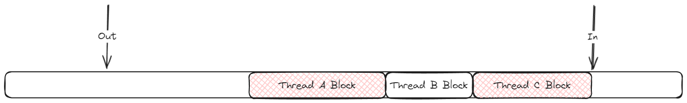
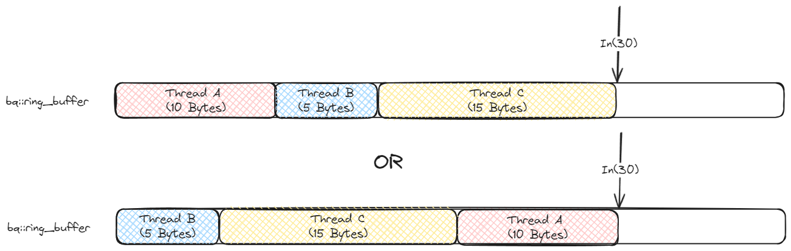
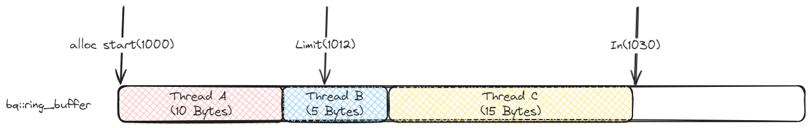
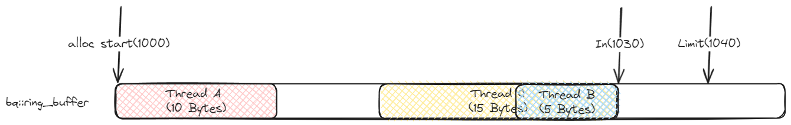

# HOK日志组件BqLog为什么这么快之2——高并发环形队列

在追求极致性能的系统中，减少一切不必要的计算是优化的核心。以手游为例，帧率和流畅度是其基础体验的关键，而游戏的发行版本往往被一个“不可能三角”所困扰：

1. 性能足够好（日志少写）
2. 方便追述问题（日志应写尽写）
3. 节约存储空间（日志最好就别写）

由于面向全球的软件会面临发行背景，面临时差、语言和隐私观念等问题，在遇到疑难杂症时很难直接与用户沟通。这种时候我们就需要一种产品，能帮助我们“既要又要”，打破这个不可能三角。BqLog就是在这样的背景下诞生的。


## 前言：关于BqLog的性能

现在业界内常见的以性能著称的日志组件一般有以下选手：

#### Java
- [Log4j2](https://github.com/apache/logging-log4j2)
- [Logback](https://github.com/qos-ch/logback)
#### C#
- [NLog](https://github.com/NLog/NLog)
- log4net
#### C++
- [SpdLog](https://github.com/gabime/spdlog)
#### 多语言
- [mars-xlog](https://github.com/Tencent/mars)

英雄不问出身，不管日志组件是用什么写的，我们都使用相同的场景和测试用例进行性能对比，每种组件均选取性能最高的模式（如异步模式）。最终，Log4j2以绝对的性能优势胜出。那么，如果BqLog与Log4j2的异步模式进行对比呢？下图展示了一个直观的对比结果：：
#### 每条日志带4个参数的总耗时（单位毫秒）

|                         | 1线程 | 2线程 | 3线程 | 4线程 | 5线程 | 6线程 | 7线程 | 8线程 | 9线程 | 10线程 |
|-------------------------|-------|-------|-------|-------|-------|-------|-------|-------|-------|--------|
| BqLog Compress(C++)     | 155   | 250   | 310   | 406   | 515   | 622   | 761   | 885   | 972   | 1007   |
| BqLog Text(C++)         | 384   | 768   | 1136  | 1716  | 2020  | 2783  | 3578  | 3883  | 4032  | 4383   |
| BqLog Compress(Java)    | 664   | 782   | 931   | 911   | 989   | 1055  | 1107  | 1229  | 1288  | 1336   |
| BqLog Text(Java)        | 706   | 993   | 1165  | 1582  | 1912  | 2572  | 2779  | 3275  | 4249  | 4591   |
| Log4J2 Text             | 1065  | 2583  | 4249  | 4843  | 5068  | 6195  | 6424  | 7943  | 8794  | 9254   |

  

从结果可以看出，在每个线程写入200万条日志（每条日志包含4个格式化参数，且附带日志级别、时间戳和线程信息）的情况下，C++版本的`BqLog`性能是`Log4j2`的***9倍***左右，Java版本的`BqLog`也达到了Log4j2的***7倍***左右。测试用例和双方的代码配置请参见此链接： [Benchmark](https://github.com/Tencent/BqLog/blob/main/README_CHS.md#5-benchmark%E7%BB%93%E6%9E%9C)  

那么，`BqLog`的性能提升背后的关键是什么呢？

### BqLog的性能提升关键措施
- 1. 缓存行隔离，避免`False Sharing`
- 2. 内存模型(`Memory Order`)的高效使用，利用AMD uProf一类的专业CPU Profiler工具找到memory access中的瓶颈所在
- 3. IO操作合并
- 4. 避免运行时format
- 5. 提高CPU Cache命中率
- 6. 其他优化……

`BqLog`的性能优化已经达到一个阶段性极限——大部分开销集中在操作系统的IO操作上。甚至容器函数是否内联都会对最终性能产生显著影响。  
要详述其中的每个性能优化点，可能还需要很多篇文章，对于各位大牛来说，这些技术细节或许并无新意，而对于萌新，网上也有丰富的资料可供参考，即便是直接看`BqLog`的源码，也有很多注释和说明。所以就不再浪费篇幅。本文聚焦`BqLog`自实现的高并发队列的创新点，探讨其如何抛弃传统并发队列中的`CAS (Compare And Swap)`操作，以实现更高效的并发处理。此方案已在`BqLog`开源前申请了专利。

## 前置知识：消息队列

- 1. ***本章针对初学者，主要介绍Linux的`kFifo`和`LMAX Disruptor`方案，已经了解的同学可以直接跳到[BqLog Ring Buffer](#3-bqlog-ring-buffer)***
- 2. ***本文专注于`CAS (Compare And Swap)`的替代，所以关于内存屏障`Memory Barrier`，内存模型`Memory Order`等的相关内容都会刻意一笔带过，有需要的同学可以去网上搜索相关文章***


### 1. Linux kFifo

`kFifo`是Linux内核提供的一种循环队列（FIFO）的实现，广泛用于内核模块、驱动开发和设备间的高效通信。它通过环形队列（`ring buffer`）来管理数据，确保生产者与消费者的高效交互，并且能够在多线程场景下保证数据安全。 ***经典的kFifo只适用于一个线程读，一个线程写***，不能支持更多的并发。

#### 工作原理
  
`kFifo`基于环形队列（`ring buffer`）的设计，利用`in`和`out`两个指针管理数据的写入和读取。数据写入时，`in`指针向前推进，读取数据时，`out`指针前进。当指针达到缓冲区末尾时，循环回到缓冲区的开头，从而实现数据的“环形”流动。  

其伪码如下：
```c
/// <summary>
/// 写线程调用
/// </summary>
/// <param name="fifo">fifo对象，提前创建好的</param>
/// <param name="buf">需要写入的数据源头</param>
/// <param name="len">需要写入的数据大小</param>
/// <returns>实际写入的数据大小</returns>
unsigned int kfifo_in(struct kfifo *fifo, const void *buf, unsigned int len)
{
    unsigned int l;

    l = min(len, fifo->size - fifo->in + fifo->out);  //先看看还剩多少空间能够写入
    memcpy(fifo->buffer + (fifo->in & (fifo->size - 1)), buf, l);  //写入
    memory_barrier();  // 内存屏障，确保读线程读到最新的fifo->in的时候，他前面的数据已经成功写入了，可以开始读取了
    fifo->in += l; //更新fifo->in，这样读线程知道最新的数据已经写到这里了
    return l;  //实际写入成功的数据长度
}

/// <summary>
/// 读线程调用
/// </summary>
/// <param name="fifo">fifo对象，提前创建好的</param>
/// <param name="buf">需要需要读入的数据拷贝目标缓存</param>
/// <param name="len">需要读入的数据大小</param>
/// <returns>实际读入的数据大小</returns>
unsigned int kfifo_out(struct kfifo *fifo, void *buf, unsigned int len)
{
    unsigned int l;

    l = min(len, fifo->in - fifo->out); //先看看队列里到底还有多少数据
    memcpy(buf, fifo->buffer + (fifo->out & (fifo->size - 1)), l);  //读入
    memory_barrier();  // 内存屏障，确保写线程读到最新的fifo->out的时候，他前面的数据已经都被读走了，可以作为空白区域写入新的数据了
    fifo->out += l;  //更新fifo->out，这样写线程知道这之前的数据都已经被读走了，可以覆盖了
    return l;  //实际读到的数据长度
}
```
#### kFifo分析

`kFifo` 通过环形队列（`ring buffer`）设计和简洁的指针管理实现高效读写操作。生产者（写线程）通过推进`in`指针将数据写入缓冲区，消费者（读线程）则通过移动`out`指针读取数据。当`in`和`out`指针到达缓冲区末尾时，它们自动回绕至起始位置，形成环形结构。此设计的核心优势在于简化了读写操作：写线程仅更新`in`指针以指示写入位置，读线程仅更新`out`指针以指示读取位置，从而实现生产者和消费者之间的有效协作。

这样的极简设计避免了两者同时操作同一变量而引发的竞态条件。在多线程场景下，`kFifo`依赖的同步机制非常轻量，仅通过内存屏障保证顺序性，而不需要复杂的锁或`CAS (Compare And Swap)`操作。这种简洁的同步方式，正是`kFifo`性能高效的原因之一。  

##### 内存屏障(Memory Barrier)

在多核系统中，指令的执行顺序可能与编程顺序不同。为保证数据的正确性，内存屏障用于确保读写操作的顺序符合预期。虽然内存屏障是确保数据一致性的关键，但其本身是一个较为底层的概念，`kFifo`的逻辑并不依赖复杂的同步机制。除了内存屏障之外，所有的操作都相当简单。  

##### 局限性

`kFifo`的这种“你追我赶”模式虽然高效，但也有其局限性。它最适合于单个生产者和单个消费者的场景。在这种情况下，生产者只需关注自己的`in`指针，消费者只需关注自己的`out`指针。然而，如果有多个生产者或多个消费者参与竞争，这种简化的设计就不再适用了。在高并发的场景下，`kFifo`并不能很好地扩展。

举个例子，有两个线程在同时进行写操作，看代码:

```c
unsigned int kfifo_in(struct kfifo *fifo, const void *buf, unsigned int len)
{
    unsigned int l;

    l = min(len, fifo->size - fifo->in + fifo->out);  
    memcpy(fifo->buffer + (fifo->in & (fifo->size - 1)), buf, l);  //问题所在，如果两个线程同时在写入，两个线程可能会对同一个地址进行memcpy 
    memory_barrier();  
    fifo->in += l; 
    return l; 
}
```


### 2. LMAX Disruptor

`LMAX Disruptor`是近年来备受推崇的高性能并发框架之一，由英国LMAX交易所开发，解决了在金融交易系统中处理高吞吐量、低延迟场景的挑战。其优异的性能表现使得它在多并发环境中脱颖而出，成为许多高并发系统的首选框架。也是Log4j2的默认消息队列实现。其代码和文档都已经在Github开源：[LMAX-Exchange-disruptor](https://github.com/LMAX-Exchange/disruptor)。

#### 为什么`Disruptor`如此优秀？

在处理数百万条消息的场景下，`Disruptor`展示出极低的延迟和极高的吞吐量。传统的队列在多生产者和多消费者的场景下，通常会因为锁竞争、内存分配和同步机制导致性能下降。而`Disruptor`通过无锁并发模型解决了这些问题，极大提升了性能。  
在并发环境中，`Disruptor`通过两大核心机制实现了高效的多生产者并发：`CAS（Compare-And-Swap）`操作和内存标记机制。这两者紧密结合，实现了无锁的高并发，保证了在高并发环境中数据的正确性和安全性。


#### A. CAS操作（Compare-And-Swap）保证并发写入
`CAS` 是一种无锁的同步原语，用于解决并发编程中的共享数据更新问题。它通过比较和交换的机制，确保只有一个线程能够成功地更新变量，避免了多个线程在同一时刻对同一数据进行修改。

`CAS`的基本操作如下：
1. **比较**：检查某个内存地址中的当前值是否等于预期值。
2. **交换**：如果相等，则将这个地址的值更新为新的值；如果不相等，说明其他线程已经修改了这个值，当前线程的操作失败，需要重试。

CAS操作具有原子性，这意味着它要么完全成功更新，要么完全失败，不会出现中间状态。这种无锁的方式非常适合多线程并发场景下的变量更新，尤其是用于解决“竞争条件”（race condition）问题。  

让我们回到之前kFifo的例子，我们尝试改一下`kfifo_in`函数让它可以支持并发写入。  

假设我们希望将`kFifo_in`函数修改为支持多线程并发写入，那么需要解决的问题是：如何让多个线程安全地申请缓冲区中的空间，而不互相覆盖。

在单线程的情况下，`in`指针可以直接增加来表示写入的区域，但是在多线程环境中，多个线程可能会同时尝试修改这个指针，导致数据冲突。我们可以使用`CAS`操作来解决这个问题，每个线程在写入数据之前通过`CAS`申请空间，确保指针的正确更新。

下面是将`kFifo_in`修改为支持并发写入的示例代码：

```c
unsigned int kfifo_in_concurrent(struct kfifo *fifo, const void *buf, unsigned int len)
{
    unsigned int old_in, new_in, free_space;

    do {
        // 1. 获取当前的in指针位置
        old_in = fifo->in;

        // 2. 计算ring_buffer剩余的可用空间
        free_space = fifo->size - (fifo->in - fifo->out);
        if (len > free_space) {
            return 0;  // 如果空间不足，写入失败
        }

        // 3. 计算新的in指针位置
        new_in = old_in + len;

        // 4. 尝试通过CAS更新in指针
        // 如果当前的in值还是old_in，那么成功更新为new_in，否则需要重试
    } while (!__sync_bool_compare_and_swap(&fifo->in, old_in, new_in));

    // 5. 现在已经安全地申请到空间，开始写入数据，从fifo->in开始的len个字节已经被当前线程占有
    write_data_to(fifo->in/*to*/, buf/*from*/, len/*size*/);

    return len;
}
```

##### 为什么CAS能够解决并发写入问题？

在多线程并发写入的场景中，多个线程可能会同时尝试修改`in`指针，导致写入冲突。`CAS`通过对比和交换机制，确保只有一个线程能够成功更新指针，并且失败的线程可以通过重试机制重新申请空闲空间。

这种设计保证了并发写入时，生产者不会写入相同的内存区域。每个生产者通过`CAS`操作确保它有一个独立的空间可以安全地写入数据。相较于传统的加锁机制，`CAS`避免了锁的竞争和开销，极大地提升了并发性能。


#### B. 内存标记保证正确读取
在`Disruptor`中，生产者首先通过`CAS`操作申请一个内存位置，然后再进行数据的写入。这与`kFifo`中“先写入再申请”的设计不同。

这种设计的优势在于，生产者在写入前已经确保了它拥有独立的内存区域可以写入，避免了多生产者写入时数据被覆盖的风险。而且在并发场景下，`CAS`能够有效地减少竞争，避免传统锁机制带来的性能损耗。

但是这样也带来了一些问题，在`kFifo`中，由于是先写内存，再更新索引，所以`in`可以代表数据最新写到的位置，但是现在的`Disruptor`采取的是跟上面一样的先申请内存空间，再写入数据的方式，`in`就不再具备这个功能了，具体可以看下图。
  

图示为`Disruptor`的消息队列内存，其中`out`代表已经读完的位置，而`in`的情况就变了。我们可以看到三个线程ThreadA, ThreadB和ThreadC分别在消息队列上申请了3块空间。其中ThreadA和ThreadC已经成功将数据刷进了消息队列中，而ThreadB还没完成这个操作。这种情况下如果我们依然用`in`作为读取的最终位置，无疑是错误的。`in`现在唯一的作用就是标记下一次生产者写入的起始位置。所以我们需要一种新的机制去知道当前消费者线程能够读到哪里。

为了解决这个问题，`Disruptor`新开辟了一块内存，用于按顺序标记每块内存（`Slot`）是否写入完成，读取的时候每读一块内存，就需要去验证一下对应的标记是否填入。由于Java的对象都是引用，所以每一个标记正好对应一个指针数据大小，这种方案是可行的。换成直接把数据拷贝在消息队列上的编程环境，方案则需要做一些修改。当然了，这个话题不是本文重点，有兴趣的同学可以去看`Disruptor`的源码和文档。


### 3. BqLog Ring Buffer

`Disruptor`的`CAS`操作其实已经成为了并发编程中的标配，尤其在高并发场景下，带来了性能提升，但它并非完美的解决方案，在一些关键场景中，它依然存在问题。

#### 为什么`CAS`没有想象中那么好？

高并发设计的核心是避免线程因锁的争用而阻塞，借助`CAS`等原子操作，多个线程可以自由竞争更新共享数据。这种方式的确减少了传统锁带来的上下文切换和锁竞争问题，因此在高并发环境下表现出色。

然而，这并不意味着所有线程都能以相同的效率完成操作。因为`CAS`操作依赖竞争，失败的线程需要重新尝试，这会带来潜在的延迟和不确定性。特别是在高度竞争的情况下，线程可能不断地进行失败的`CAS`操作，所以不能保证每个线程都能在有限的时间内完成其任务，导致整体性能下降。

举个例子，在一个高度并发的环境中，某个线程可能一直在竞争中失败，导致它永远无法完成更新。这种情况下，虽然系统不会完全陷入死锁，但部分线程的进度会受到极大的阻碍。最终，系统的整体吞吐量和延迟表现可能并不如预期。

#### BqLog的优化实现

`BqLog`的消息队列`bq::miso_ring_buffer`通过自创的一种算法实现了固定开销实现内存分配，该算法用`fetch_add`替代`CAS`，并且设计了一个空间不足时候的回滚算法，确保在高并发的情况下，生产者和消费者都能够在固定的步骤内完成日志的写入和读取。其代码实现可以参考  
[https://github.com/Tencent/BqLog/blob/main/src/bq_log/types/miso_ring_buffer.h](https://github.com/Tencent/BqLog/blob/main/src/bq_log/types/miso_ring_buffer.h)  
[https://github.com/Tencent/BqLog/blob/main/src/bq_log/types/miso_ring_buffer.cpp](https://github.com/Tencent/BqLog/blob/main/src/bq_log/types/miso_ring_buffer.cpp)  

#### `fetch_add`和优势

`fetch_add` 是另外一种无锁的原子操作，它在并发编程中非常重要。它通过两个步骤完成操作：

1. **获取当前值**：获取变量操作前的旧值。
2. **执行加法**：将指定值加到变量上，并原子地更新该值。
3. **返回之前的值**：返回执行add前该变量实际的值。

`fetch_add` 保证了每次操作不会失败，因此即使多个线程同时操作，也能确保每个线程安全地更新变量，而不需要重试或等待。

与`CAS`不同，`fetch_add`没有重试机制，因为它不会失败。每个线程都会获取一个唯一的值，然后直接执行加法并更新变量。这意味着每个线程的操作都能在固定步骤内完成，不会因为竞争而被阻塞。

让我们看看用`fetch_add`改写的`kfifo_in_concurrent`函数

```c
unsigned int kfifo_in_concurrent(struct kfifo *fifo, const void *buf, unsigned int len)
{
    // 1. 计算ring_buffer剩余的可用空间
    unsigned int free_space = fifo->size - (fifo->in - fifo->out);
    if (len > free_space) {
        return 0;  // 如果空间不足，写入失败
    }

    // 2. 申请内存，最后申请到的内存就是从from开始的len长度内存
    unsigned int from = __sync_fetch_add(fifo->in, len);
    
    // 3. 现在已经安全地申请到空间，开始写入数据，从fifo->in开始的len个字节已经被当前线程占有
    write_data_to(from/*to*/, buf/*from*/, len/*size*/);
}


unsigned int allocated_A = kfifo_in_concurrent(&fifo, buf, 10);//从线程A调用
unsigned int allocated_B = kfifo_in_concurrent(&fifo, buf, 5);//从线程B调用
unsigned int allocated_C = kfifo_in_concurrent(&fifo, buf, 15);//从线程C调用
```

假设fifo->in的初始值是0，三个线程同时执行后，它们分别对应的内存开始位置可能是：

- **线程A**：0。
- **线程B**：10。
- **线程C**：15。
- **fifo->in**:30

也可能是：
- **线程A**：20。
- **线程B**：0。
- **线程C**：5。
- **fifo->in**:30

可以看下图表示：

  

这样，三个线程在并发情况下分别获取了它们独占的内存段，每个线程都申请到了一块不同的内存区间，并且这些操作是无锁的，无需等待或重试。

通过`fetch_add`，每个线程都能够原子地申请到一个唯一的位置，不用阻塞判断是否成功。

#### `fetch_add`的不足和回滚方案
既然`fetch_add`如此方便就实现了更好的性能，那为什么几乎所有的消息队列都用`CAS`呢？因为前者有一个致命缺陷。依然看刚才的例子。假如说buffer最大的空间只有25。而ABC三个线程同时执行`kfifo_in_concurrent`，大家一起做了剩余空间判断，都发现剩余空间还有25，足够自己写入。但是到了最后执行`fetch_add`的时候，三个线程都以为自己成功申请到了内存。而实际上，排在最后那个线程申请到的内存是无效的。

反观`CAS`就不会有这个问题，因为每一次最后申请的时候，必须是没有其他线程申请过内存，`in`的值和之前判断剩余空间时完全一致，才算申请成功。

为了解决这个问题，既要固定步骤完成内存分配，又要结果正确，`bq::miso_ring_buffer`发明了一种回滚机制，当发生空间不足的时候，可以做一次Rollback。然后返回空间不足的错误。其内存申请的伪码如下：

```c
void* bq::miso_ring_buffer::alloc(size_t len)
{
    // 1. 计算ring_buffer剩余的可用空间
    size_t free_space = this->size_ - (this->in_ - this->out_);
    if (len > free_space) {
        return nullptr;  // 如果空间不足，写入失败
    }

    // 2. 申请内存，最后申请到的内存就是从from开始的len长度内存
    size_t from = __sync_fetch_add(this->in_, len);

    // 3. check一下，申请到的这个内存是否真的有效
    while(from + len > this->out_ + this->size_)
    {
        // 4. 已经空间不足了，只能做回滚Rollback了
        size_t expected_in = from + len;
        if(__sync_bool_compare_and_swap(expected_in, this->in_, from))//如果in_的值等于from + len，就把他回滚成from，否则就自旋继续重新尝试回滚
        {
            //回滚成功
            return nullptr;  //返回空间不足
        }
        yield(); //让出时间片，不要大家疯狂浪费计算资源
    }
    
    // 5. 内存有效，直接返回(可能是申请的时候就有效，也可能是尝试回滚过程中，消费者腾出新的空间，导致这块内存又可用了)
    return to_addr(from);
}

```

这段代码不仅演示了`bq::miso_ring_buffer`是如何做到用`fetch_add`分配内存的，还演示了当空间不足时候的回滚算法。可能大家会有质疑，觉得这个回滚算法性能好像很差。但是我们需要知道，当回滚逻辑发生的时候，说明消息队列的空间已经不足了，这个时候系统的性能瓶颈将变成业务需要对消息队列扩容，或者阻塞等待消费者线程取走数据，腾出空间。这种时候，这个`CAS`性能消耗反而变得无足轻重了。

接下来重点说一下回滚算法的思路。为什么回滚算法需要是`CAS`的，而不是直接fetch_add(this->in_, -len)这样把自己加上去的数值减掉。我们要知道回退的难度在于当`in`在`fetch_add`超标之后，每个生产者线程都不知道应该将`in`回退到多少最合适，会不会回退过多，会不会回退过少。

举例来说看下图的案例：

  

这一轮分配之前，`in`的值为1000，剩余数据12字节，也就是说可以分配到1012，但是由于ABC三个线程都同时在申请，导致最终`in`被撑到了1030，其中B和C两个线程发现自己拿到的数据段是超标的，准备分别自行回滚。假如说我们采取直接对`in`减去自己分配的长度。如果线程B先执行，可能会发生下面的一系列事故：
- 1. 线程B先执行fetch_add(this->in_, -5)把`in`减小到1025。
- 2. 消费者线程D忽然消化了一大截数据，剩余空间可以允许我们把in分配到1040了。
- 3. 线程B马上再次尝试分配5字节，就获取到了1025到1030的数据段，于是开始拷贝数据进去，这个时候`in`变成了1030
- 4. 线程C进入回滚流程，忽然发现自己拿的1015到1030的数据段其实没有超标，就直接开始写入数据
最终的车祸现场如下图：

  

可以见到，线程B和线程C分配的数据发生了冲突。

那么基于`CAS`的回滚算法的核心原理就是：让`in`从后往前，一个一个回退，每个线程一直在那里等着负责回退自己分配的那一段。如果回退过程中发现空间足够了，就不用再回退了。

#### 方案总结
`BqLog`的`fetch_add` + `rollback`方案事实上完成了一个比常见高性能队列更好的并发队列模型。从最终benchmark的数据来看，单说吞吐量和延迟，在多并发情况下已经超越了`LMAX Disruptor`。虽然在客户端应用上，该优化实际作用不大，但是在server或者其他高并发环境，该思路是有其正面价值的。


