# 为何 BqLog 如此快之二：从环形队列到自适应数据总线

[English](<Article 2_Why is BqLog so fast - High Concurrency Ring Buffer.MD>) · [系列目录](PERFORMANCE_DESIGN_CHS.md) · [上一篇：压缩文件](<文章1_为何BqLog如此快 - 高性能实时压缩日志格式.MD>) · [下一篇：执行路径优化](<文章3_为何BqLog如此快 - 压缩日志执行路径优化.MD>)

上一篇我们把日志从文本变成了模板加参数，格式化和存储的开销省下来了。但这些数据怎么从业务线程送到日志线程，同样决定性能。打个比方：压缩一条日志只需要几纳秒，结果几十个线程全堵在同一把锁前面排队，那前面省下的钱就全赔在这儿了。

这一篇就讲这条路怎么修。我们会从最简单的环形队列出发，一步一步把多线程、变长数据、线程动态增删这些真实需求加进去，最后得到 BqLog 现在这套自适应数据总线（`log_buffer`）。它不是把某一条原子指令换掉就完事，而是给不同脾气的线程修了不同的路。

> 本文对应 BqLog 2.5.0。MISO、SISO 是项目里的命名习惯：MISO 表示多生产者单消费者（Multi In, Single Out，也就是常说的 MPSC），SISO 表示单生产者单消费者（Single In, Single Out，即 SPSC）。代码里的对齐常量 `BQ_CACHE_LINE_SIZE` 是 128 字节，下文简称 C。它是库自己选的布局单位，不代表所有 CPU 的硬件缓存行都是 128 字节。

## 1. 出发前：先看一眼成绩单

在讲原理之前，先给没读过旧文的同学补个背景。业界以性能著称的日志组件不少：

#### Java
- [Log4j2](https://github.com/apache/logging-log4j2)
- [Logback](https://github.com/qos-ch/logback)
#### C#
- [NLog](https://github.com/NLog/NLog)
- log4net
#### C++
- [SpdLog](https://github.com/gabime/spdlog)
#### 多语言
- [mars-xlog](https://github.com/Tencent/mars)

英雄不问出身，不管什么语言写的，我们都用相同的场景和测试用例对比，每种组件都选它性能最高的模式（比如异步模式）。综合下来 Log4j2 是最能打的那个。那 BqLog 跟 Log4j2 比呢？（测试：1–10 线程，每线程写 200 万条日志，每条带 4 个格式化参数；环境：MacBook Pro，Apple M4 Pro，48 GB）

#### 每条日志带4个参数的总耗时（单位毫秒）

|                              | 1线程 | 2线程 | 3线程 | 4线程 | 5线程 | 6线程 | 7线程 | 8线程 | 9线程 | 10线程 |
|------------------------------|-------|-------|-------|-------|-------|-------|-------|-------|-------|--------|
| BqLog Compress(C++)          | 79    | 99    | 115   | 170   | 222   | 311   | 324   | 372   | 484   | 759    |
| BqLog Compress+Encrypt(C++)  | 83    | 106   | 134   | 189   | 223   | 328   | 337   | 390   | 532   | 995    |
| BqLog Text(C++)              | 202   | 417   | 648   | 910   | 1167  | 1425  | 1718  | 1969  | 2281  | 2718   |
| spdlog                       | 434   | 1366  | 3133  | 4779  | 6228  | 9241  | 10829 | 11348 | 11197 | 12003  |
| Log4j2 (Java)                | 946   | 1841  | 2422  | 3685  | 5542  | 5245  | 5775  | 5786  | 8048  | 8752   |

10 线程时，BqLog 压缩模式总耗时 759 毫秒，Log4j2 是 8752 毫秒——**11 倍多**的差距。注意加密那一行：全程开着加密，居然也只比不加密慢了不到三分之一，这套加密怎么设计的，第一篇已经讲过了。测试用例和双方配置见 [Benchmark](https://github.com/Tencent/BqLog/blob/main/README_CHS.md#-benchmark-%E7%BB%93%E6%9E%9C)。

这背后有一堆措施在起作用：

- 1. 缓存行隔离，避免 `False Sharing`
- 2. 内存模型（`Memory Order`）的高效使用，用 AMD uProf 这类专业 CPU Profiler 找 memory access 的瓶颈
- 3. IO 操作合并
- 4. 避免运行时 format
- 5. 提高 CPU Cache 命中率
- 6. 其他优化……

要把每一点都讲透，得再写好几篇。本文只聚焦其中最有料的一块：BqLog 自研的高并发数据通道。先看它是怎么把传统并发队列里的 `CAS (Compare And Swap)` 从热路径上请下去的，再看它怎么更进一步，让高频线程连原子操作的抢都不用抢。此方案已在 BqLog 开源前申请了专利。

## 2. 前置知识：环形队列

- ***这一节主要给初学者介绍 Linux 的 `kFifo` 和 `LMAX Disruptor`，已经了解的同学可以直接跳到 [第 3 节](#3-bqlog-的第一板斧miso-队列)***
- ***本文专注于并发控制本身，内存屏障（`Memory Barrier`）、内存模型（`Memory Order`）这些内容会刻意一笔带过，有需要的同学可以自行搜索***

### 2.1 Linux kFifo：一人一杆枪，谁也不抢

`kFifo` 是 Linux 内核提供的循环队列（FIFO）实现，广泛用于内核模块、驱动开发和设备间通信。注意，**经典的 kFifo 只适用于一个线程读、一个线程写**，不支持更多并发。

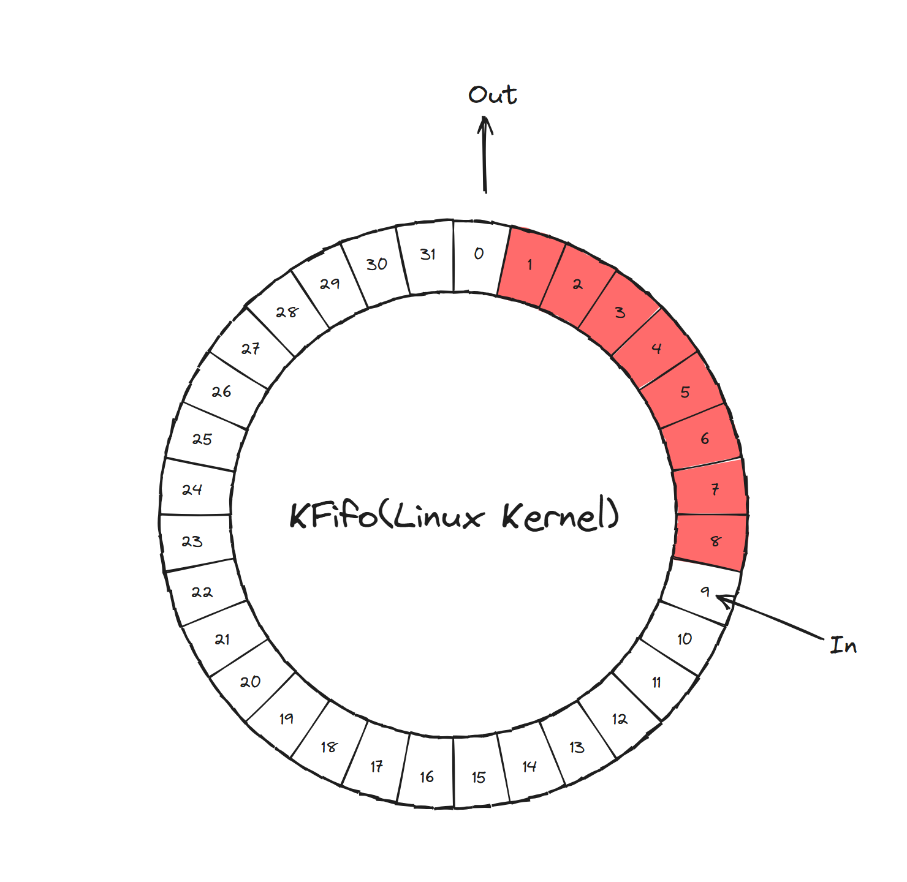

<p align="center"><em>图 1：kFifo 的环形结构——<code>In</code>、<code>Out</code> 两个游标各只有一个主人。</em></p>

它基于环形队列（ring buffer），用 `in` 和 `out` 两个指针管理写入和读取：写数据时 `in` 往前推，读数据时 `out` 往前推，指针到了缓冲区末尾就绕回开头，形成一个“环”。上图里红色的 1 到 8 号格子是已经写入、还没被读走的数据，`Out` 指着最老的一条，`In` 指着下一个空位。

伪码如下：

```c
/// 写线程调用
unsigned int kfifo_in(struct kfifo *fifo, const void *buf, unsigned int len)
{
    unsigned int l;

    l = min(len, fifo->size - fifo->in + fifo->out);  //先看看还剩多少空间能够写入
    memcpy(fifo->buffer + (fifo->in & (fifo->size - 1)), buf, l);  //写入
    memory_barrier();  // 内存屏障，确保读线程读到最新的fifo->in的时候，前面的数据已经成功写入了
    fifo->in += l; //更新fifo->in，读线程知道最新数据写到了这里
    return l;
}

/// 读线程调用
unsigned int kfifo_out(struct kfifo *fifo, void *buf, unsigned int len)
{
    unsigned int l;

    l = min(len, fifo->in - fifo->out); //先看看队列里还有多少数据
    memcpy(buf, fifo->buffer + (fifo->out & (fifo->size - 1)), l);  //读入
    memory_barrier();  // 内存屏障，确保写线程读到最新的fifo->out的时候，前面的数据都已被读走
    fifo->out += l;  //更新fifo->out，写线程知道这之前的区域可以覆盖了
    return l;
}
```

这个设计的精髓在于：**`in` 只有写线程碰，`out` 只有读线程碰**。两个变量各有各的唯一主人，从根上避免了两个人同时改一个变量的竞态。同步只靠内存屏障保证顺序，不需要锁，也不需要 CAS。这就是它快的原因。

但“你追我赶”的美好画面，在多生产者面前就碎了。看 `kfifo_in` 里的 `memcpy`：如果两个线程同时写入，它们读到的 `in` 是同一个值，就会朝同一个地址拷数据，直接撞车。

### 2.2 LMAX Disruptor：用 CAS 抢号

`LMAX Disruptor` 是近年最受推崇的高性能并发框架之一，出自英国 LMAX 交易所，也是 Log4j2 的默认消息队列实现，代码和文档都在 Github 开源：[LMAX-Exchange/disruptor](https://github.com/LMAX-Exchange/disruptor)。

它的主体也是一个环，但每个槽位（Slot）里放的不是数据本身，而是一个 `Log Entry` 对象的引用，对象后面还拖着一串它引用的东西：

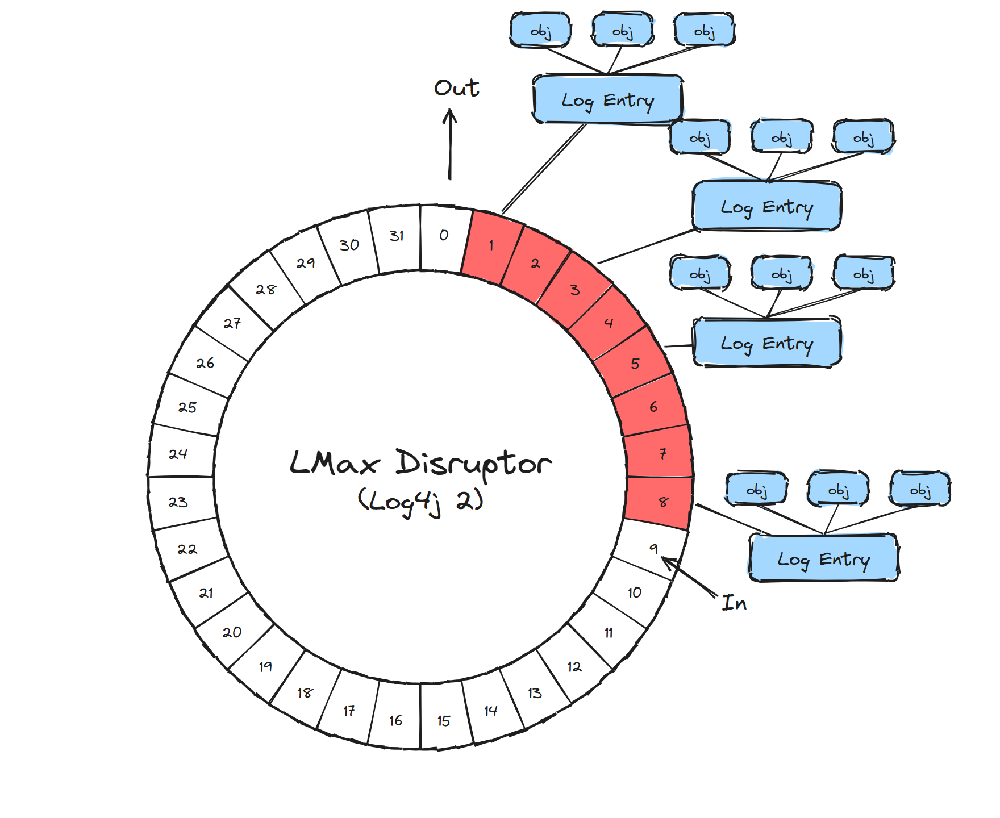

<p align="center"><em>图 2：Disruptor 的环——槽位里放的是 <code>Log Entry</code> 引用，不是数据本身。</em></p>

它解决多生产者写入的办法是 `CAS（Compare-And-Swap）`。CAS 的逻辑就三步：比较某个内存地址的当前值是否等于预期值；相等就更新成新值；不等就说明别的线程抢先了，本次失败，重来。

我们试着用 CAS 改造 `kfifo_in`，让它支持并发写入：

```c
unsigned int kfifo_in_concurrent(struct kfifo *fifo, const void *buf, unsigned int len)
{
    unsigned int old_in, new_in, free_space;

    do {
        // 1. 获取当前的in指针位置
        old_in = fifo->in;

        // 2. 计算ring_buffer剩余的可用空间
        free_space = fifo->size - (fifo->in - fifo->out);
        if (len > free_space) {
            return 0;  // 如果空间不足，写入失败
        }

        // 3. 计算新的in指针位置
        new_in = old_in + len;

        // 4. 尝试通过CAS更新in指针
        // 如果当前的in值还是old_in，那么成功更新为new_in，否则需要重试
    } while (!__sync_bool_compare_and_swap(&fifo->in, old_in, new_in));

    // 5. 现在已经安全地申请到空间，开始写入数据
    write_data_to(fifo->in/*to*/, buf/*from*/, len/*size*/);

    return len;
}
```

CAS 保证了同一时刻只有一个线程能把 `in` 从旧值改成新值，失败的线程重读游标再来一遍。相比加锁，它免掉了锁竞争和上下文切换，并发性能大幅提升。

但这样又带来一个新问题。kFifo 是“先写数据，再更新 `in`”，所以 `in` 天然代表数据的最新写入位置；Disruptor 改成了“先申请空间，再写数据”，`in` 就失去了这个含义。看下图：

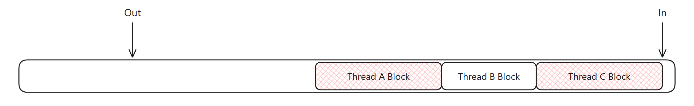

<p align="center"><em>图 3：先申请后写入的麻烦：A 和 C 的块已经写完（阴影），B 还没写完，<code>In</code> 不再能当可读边界。</em></p>

ThreadA、ThreadB、ThreadC 各自申请了一块空间，A 和 C 已经把数据写进去了，B 还没写完。这时候拿 `in` 当可读边界就是错的。所以 Disruptor 额外开了一块内存，按顺序标记每个槽位（Slot）是否写完，消费者每读一块都要验证一下对应的标记。在 Java 里对象都是引用，一个标记正好对应一个指针大小，这个方案很自然；换成直接把数据拷进队列的语言环境，就得另想办法了。

## 3. BqLog 的第一板斧：MISO 队列

### 3.1 CAS 没有想象中那么好

CAS 已经是并发编程的标配，但它有个绕不开的问题：**它靠竞争取胜，就必然有人失败**。失败的线程要重读、重算、重试。竞争激烈时，某个线程可能连着好几次都抢不过别人，虽然系统不会死锁，但它的进度被严重拖住，整体吞吐和延迟都会打折扣。

那有没有一种原子操作，人人都能一把成功、永远不用重试？有，`fetch_add`。

### 3.2 fetch_add：先抢号，后验票

`fetch_add` 做的事情非常简单：把变量加上一个值，然后返回**加之前**的旧值，全程原子。它没有“失败”这个概念，多少线程一起来，每个线程都拿到一个只属于自己的结果。

用它改写并发写入，代码短得让人不习惯：

```c
unsigned int kfifo_in_concurrent(struct kfifo *fifo, const void *buf, unsigned int len)
{
    // 1. 直接申请内存，申请到的就是[from, from+len)这一段
    unsigned int from = __sync_fetch_add(&fifo->in, len);

    // 2. 这段内存已经归当前线程独占，直接写
    write_data_to(from/*to*/, buf/*from*/, len/*size*/);
    return len;
}
```

假设 `in` 初始值是 0，三个线程 A、B、C 同时申请 10、5、15 字节，执行完后它们拿到的起始位置可能是：

- **线程A**：0，**线程B**：10，**线程C**：15，`in` 最终是 30

也可能是：

- **线程B**：0，**线程C**：5，**线程A**：20，`in` 最终还是 30

看下图：

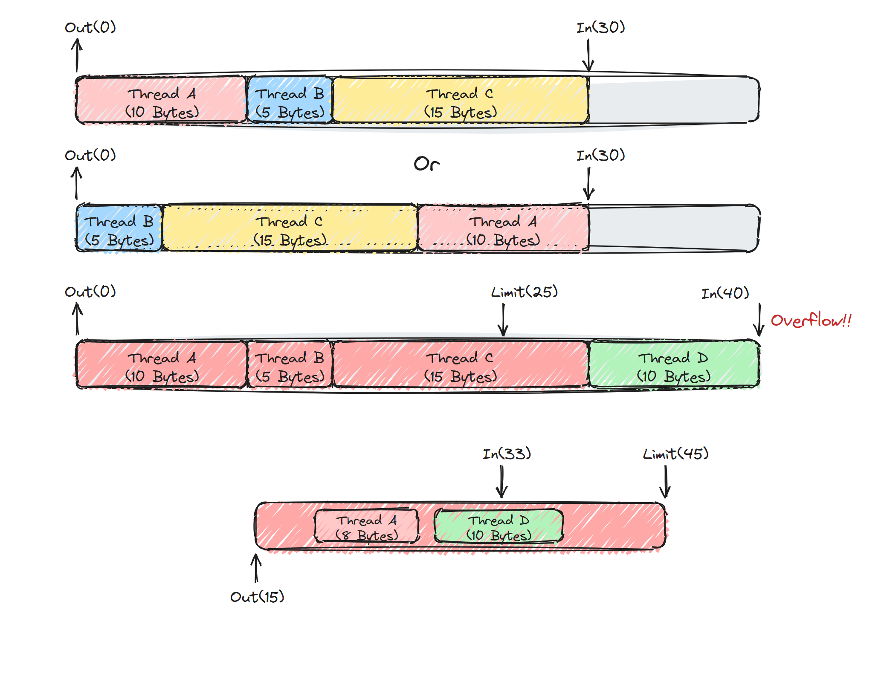

<p align="center"><em>图 4：fetch_add 的分配结果：顺序不确定，但每个线程都拿到独占的一段。中段的 <code>Overflow!!</code> 和底部会动的上限，是下一节的主角。</em></p>

顺序不确定，但每个人都拿到了独占的一段，没有人需要重试。（这张图的中段和底部先不用管，那是下一节“越界”和“回滚”要讲的。）对比一下两种思路的气质：CAS 是“先看清楚有没有人抢，确认安全了再动手，动手失败就重来”；fetch_add 是“先动手把号抢了再说，有问题事后补救”。BqLog 选的就是后者——**正常路径上不要那么多判断，先直接 `fetch_add`，真写不下了再回滚**。

### 3.3 fetch_add 的致命伤，和回滚算法

既然 fetch_add 又简单又公平，为什么市面上的消息队列还在用 CAS？因为它有个致命缺陷：它只保证分配动作是原子的，**不保证容量够**。

还看刚才那张图，这次盯中段：上限 `Limit` 在 25，可四个线程都觉得自己能写，一起 `fetch_add`，`In` 直接飙到 40——从 25 往后（C 的尾巴加上整个 D）全是越界，图上那个红色的 `Overflow!!` 就是事故现场。排最后的线程申请到的内存其实根本不存在。

图的底部是另一种情形：消费者把 `Out` 推进到 15，上限跟着挪到 45，这时候 `In`(33) 就落在合法范围里了。记住这个“上限会动”的细节，回滚的时候要用。

CAS 不会有这个问题，因为最后一次更新时必须确认 `in` 和当初判断时一模一样，中间有人动过就失败重来。

为了既保留 fetch_add 的固定开销、又保证结果正确，`bq::miso_ring_buffer` 设计了一套回滚（Rollback）机制，内存申请的伪码如下：

```c
void* bq::miso_ring_buffer::alloc(size_t len)
{
    // 1. 计算ring_buffer剩余的可用空间（用的是本线程缓存的out，多半不用真的去读共享变量）
    size_t free_space = this->size_ - (this->in_ - this->out_cache_);
    if (len > free_space) {
        return nullptr;  // 如果空间明显不足，直接失败
    }

    // 2. 先抢号：申请内存，申请到的就是从from开始的len长度
    size_t from = __sync_fetch_add(&this->in_, len);

    // 3. 后验票：check一下，申请到的这段内存是否真的有效
    while (from + len > this->out_ + this->size_)
    {
        // 4. 确实越界了，只能回滚Rollback
        size_t expected_in = from + len;
        if (__sync_bool_compare_and_swap(&this->in_, expected_in, from))
        {
            // 如果in_的值等于from + len，就把它回滚成from，否则自旋继续尝试回滚
            return nullptr;  // 回滚成功，返回空间不足
        }
        yield(); // 让出时间片，别疯狂浪费计算资源
    }

    // 5. 内存有效，直接返回（可能申请时就有效，也可能是等待回滚期间消费者腾出了新空间）
    return to_addr(from);
}
```

眼尖的同学可能质疑：这个回滚里不还是用了 CAS 吗？性能岂不是很差？要注意回滚发生的前提——消息队列已经满了。这时候系统的瓶颈本来就已经变成“等业务扩容或者等消费者腾地方”，回滚那点 CAS 开销反而无足轻重。**好钢用在刀刃上：热路径用 fetch_add 一次到位，冷路径才允许自旋。**

再重点讲一下，为什么回滚必须用 CAS，而不能直接 `fetch_add(&this->in_, -len)` 把自己加上的数减掉。难点在于：`in` 被顶超标之后，每个生产者都不知道该把它回退到多少才合适，谁减谁不减，减多了还是减少了？

举个例子，看下图的案例：

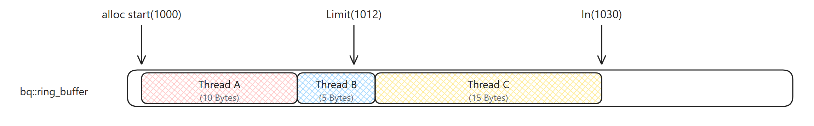

<p align="center"><em>图 5：A、B、C 抢号完毕，B 和 C 拿到的区间越过了上限。</em></p>

这一轮分配之前，`in` 是 1000，剩余空间只允许写到 1012。A、B、C 同时申请，把 `in` 撑到了 1030，B 和 C 发现自己拿到的数据段超标了，准备各自回滚。假如采取“直接减掉自己的长度”这个朴素方案，线程 B 先动手，就可能引发下面一连串事故：

- 1. 线程 B 执行 `fetch_add(&in, -5)`，把 `in` 减到 1025；
- 2. 消费者线程 D 忽然消化了一大截数据，空间允许写到 1040 了；
- 3. 线程 B 马上再次尝试分配 5 字节，拿到了 1025–1030 这段，开始往里拷数据，此时 `in` 变成 1030；
- 4. 线程 C 进入回滚流程，忽然发现自己拿的 1015–1030 其实不超标了，就直接开始写数据。

最终的车祸现场如下图：

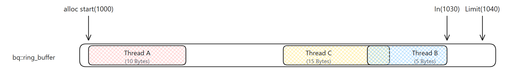

<p align="center"><em>图 6：朴素回滚的车祸现场：B 减掉自己的长度后再次申请，数据最终和 C 的撞在一起。</em></p>

线程 B 和线程 C 的数据撞在一起了。

所以正确的回滚姿势是：**让 `in` 从后往前一个一个地退，每个线程只负责回退自己分配的那一段，而且必须确认自己手里就是当前的队尾**（CAS 检查 `in == from + len`），不是队尾就等着。如果等着等着发现空间够了，就不用退了，直接写。这样 C 先把 1030 退回 1015，B 再把 1015 退回 1010，井然有序。

对应的真实实现可以看这里：  
[miso_ring_buffer.h](https://github.com/Tencent/BqLog/blob/main/src/bq_log/types/buffer/miso_ring_buffer.h)  
[miso_ring_buffer.cpp](https://github.com/Tencent/BqLog/blob/main/src/bq_log/types/buffer/miso_ring_buffer.cpp)

### 3.4 抢到位置不等于写完数据：块状态

回到 2.2 节 Disruptor 遇到的那个问题：先申请后写入，`in` 就不能代表“数据写到哪里了”。A 先抢到位置却被操作系统调度出去了，B 后抢到位置已经写完，这时候消费者要是只看 `in`，就会读到 A 还没填的半成品。

Disruptor 的办法是给每个槽位配一个完成标记。BqLog 的 MISO 也差不多，但粒度更粗、更省：整个环形内存按 **128 字节（C）一个 block** 划分，每条数据（chunk）的第一个 block 里有一个 8 字节头部：

```text
block_num: 3 B | status: 1 B | data_size: 4 B | payload ...
```

`status` 就三个状态：`unused`（没数据）、`used`（写完了，可读）、`invalid`（这段作废，跳过）。生产者申请时先把 `block_num` 写好，数据拷完后用 release 语义把状态置成 `used`；消费者 acquire 读到 `used` 才动 payload，读到 `unused` 就说明后面还没货。用来抢位置的 `fetch_add` 本身可以用最弱的 relaxed 序，因为数据发布这件事由状态位单独扛。

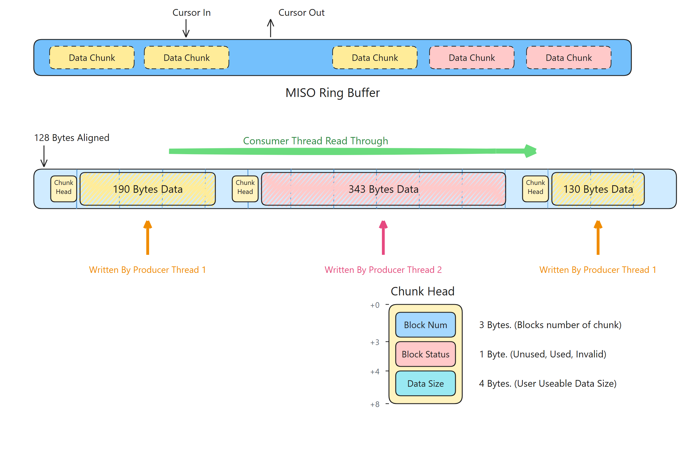

<p align="center"><em>图 7：最上面是整条 MISO 环和 <code>Cursor In</code>/<code>Cursor Out</code> 两个游标；中间把环展开——内存按 128 字节对齐切成 block，数据是一条条 chunk 首尾相接，消费者顺着读过去；右下角是 chunk 头的特写，三个字段加起来 8 字节。</em></p>

`invalid` 是给环尾准备的。一条 chunk 的数据在内存里必须连续，如果环尾剩下的空间放不下整条数据，就把尾部那段标记成 `invalid`，消费者遇到就跳过，数据从环的开头重新放。这样上层永远拿到一块连续内存，不用处理“一条数据拆两半”的破事。

为什么分配粒度非得是 128 字节？一条 61 字节的内部日志，加上 LP 路径 16 字节的 context（后面会讲）和 8 字节块头，总共 85 字节，也得占满一个 128 字节的 block，剩下的空间确实浪费了。但换来的是：**不同生产者写的永远是不同的缓存行**。你写你的，我写我的，大家的缓存行互不踩踏。这个买卖是划算的，至于为什么划算，下一节马上讲。

最后还有两个减负手段：

- 写线程把读游标缓存一份在线程本地（TLS），平时用缓存值判断容量，不够了才去读真正的共享 `read_cursor_`。缓存值只会偏旧，偏旧只会低估可用空间，顶多白刷一次，绝不会因此覆盖没消费的数据。
- 消费者也不是每读一条就发布一次 `read_cursor_`，而是攒够四分之一环或者读空了，才批量把状态置 `unused`、发布读游标。同步成本被摊薄到一大批数据上。

把 kFifo 和 MISO 的同步动作摆在一起对比，就知道多生产者多花的钱在哪了：

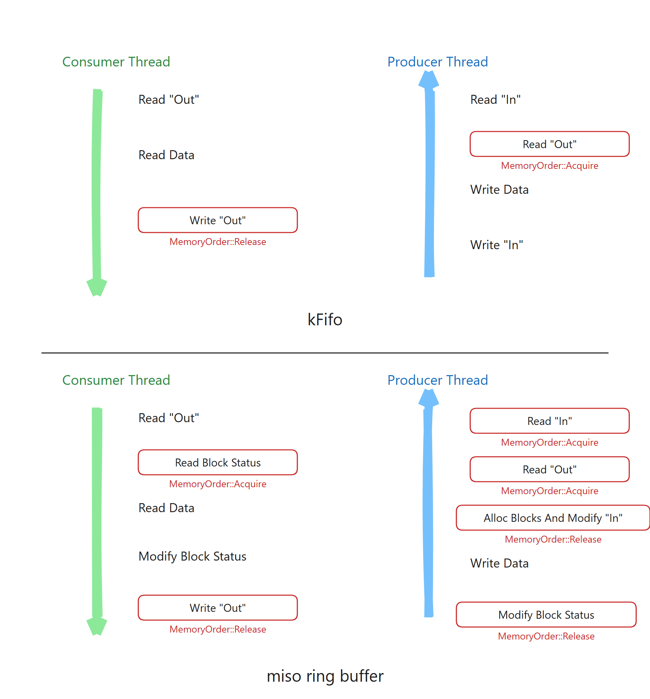

<p align="center"><em>图 8：kFifo 与 MISO 的同步动作对比。MISO 多出来的同步全在「申请」和「归还」上，拷贝数据本身一行同步代码都没有。</em></p>

kFifo 一辈子只有两次发布：写线程 release 写 `In`，读线程 release 写 `Out`。MISO 因为要支持多人同时写，多出几个动作：申请前要先 acquire 读一下 `Out`（拿到真实容量），`fetch_add` 抢号后 release 发布 `In`，写完数据还要再 release 一次块状态；消费者那边对应着 acquire 读块状态，读完一批再统一改状态、发 `Out`。看出规律了吗？**所有同步都发生在“申请”和“归还”这两个动作上，拷贝数据本身一行同步代码都没有。**

到这里，MISO 已经甩开传统队列一条街了。但它还不是终点。

## 4. 第二板斧的动机：CPU 间的数据风暴

MISO 把锁和 CAS 重试都干掉了，可压测到几十线程的时候，性能曲线还是会往下掉。瓶颈不在代码逻辑，而在 CPU 的硬件结构里。

现在的多核 CPU，每个核都有自己的一级缓存，数据以缓存行（cache line）为单位在核之间流动。为了保证大家看到的内存是一致的，CPU 之间要跑一套缓存一致性协议（比如 MESI）。协议的细节不展开，只需要记住一个后果：**当多个核同时修改同一个缓存行里的数据时，这个缓存行的“写权限”会在核之间疯狂转让**，你抢过来我抢过去，每一次转让都是几十上百个时钟周期的延迟。早期 CPU 用环形总线（Ring Bus）传这些消息，核多了以后又演进成 2D-Mesh 这类片上网络（NoC），但不管怎么演进，核间搬缓存行的成本始终在那里。

这个现象有个形象的名字：**数据风暴**。Linux 内核的 MCS SpinLock 就是专门治它的——让每个等锁的 CPU 各自等在自己的内存上，而不是所有人盯着同一个锁变量猛刷。

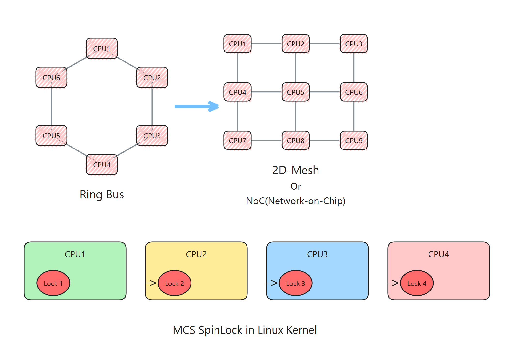

<p align="center"><em>图 9：从 Ring Bus 到 2D-Mesh/NoC，核间互联结构一直在演进，但「缓存行在核之间搬运」的开销始终都在；下面的 MCS SpinLock 让每个 CPU 守着各自的锁变量排队，是缓解数据风暴的经典做法。</em></p>

回到 MISO：不管多少个生产者，它们 `fetch_add` 的都是**同一个** `write_cursor_`。这条缓存行就是全场唯一的兵家必争之地，多少线程写日志，它就在核之间被抢多少次。`fetch_add` 只是让上层不用重试，底层的缓存行争夺战一次都没少打。

有人会说，那把游标们分开布局不就行了？确实，MISO 已经把 `write_cursor_` 和 `read_cursor_` 放进了不同的缓存行（这叫避免 False Sharing——两个不相干的变量恰好挤在同一条缓存行里互相拖累）。但假共享能隔开，**真共享隔不开**：`write_cursor_` 本来就是所有生产者共同修改的同一个数据，再怎么 padding 也还是同一个东西。

要想再进一步，只剩一个方向：**让高频的生产者压根不要去改同一个位置。**

## 5. 一人一条 SISO，但得精打细算

### 5.1 SISO 是什么

既然竞争的根源是大家共用一个写游标，那就给每个高频线程配一条专属的队列：`siso_ring_buffer`，单生产者单消费者（Single In, Single Out）。写游标只有它自己改，读游标只有消费者改，普通写入连一次原子竞争都没有。

SISO 的内存布局也把“隔离”做到了极致。它的头部有四个 C 字节的区域：

1. 消费者本地状态：缓存的读位置、已知写位置和容量；
2. 生产者本地状态：本地写位置、缓存的读位置；
3. 共享读游标；
4. 共享写游标。

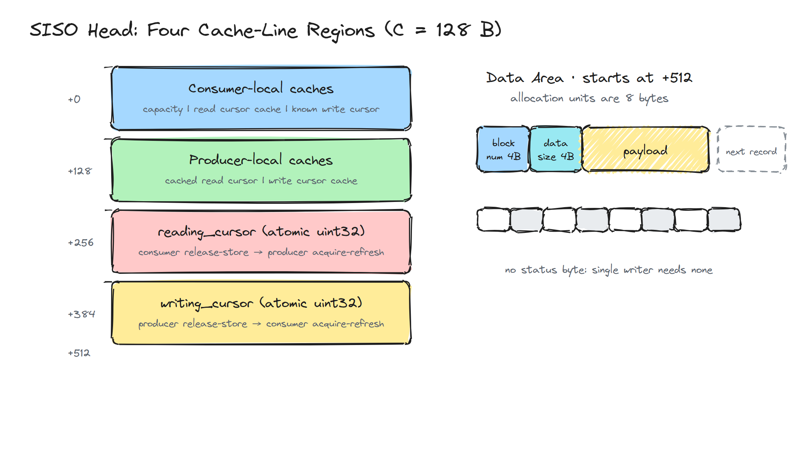

<p align="center"><em>图 10：SISO 头部按四个 C 字节区分开读写状态，后面的数据区按 8 字节单位使用。</em></p>

两边平时各玩各的本地缓存，只有“没空间了”或“没数据了”的时候，才去读一下对方的共享游标。因为只有一个写入者，SISO 也不需要 MISO 那样的状态位，chunk 头只要 8 字节（`block_num` 和 `data_size` 各 4 字节），分配粒度也从 128 字节缩到 8 字节——自己一个人写，不用防着邻居，自然不用那么大的隔离带。

消费端读 SISO 是按批次（batch）的：拿到批次开始时的写游标作为终点，一口气把这个范围内的数据读完，统一归还，再去轮询别的队列。这样既摊薄了同步开销，也让消费者有自然的“换一家看看”的机会——不会某一个高频线程写得欢，消费者就一直围着它转，别的线程的日志没人收。

### 5.2 但内存账算不过来

那干脆给所有线程都配一条 SISO？算笔账就知道了：1000 个线程，每个配 64 KiB，光数据区就要 62.5 MiB，管理结构还没算。而现实中大量线程十天半个月才写一两条日志，给它们一人配一块专属缓冲，纯属浪费。

所以 BqLog 的实际结构是混合双打：

```text
低频线程：大家共用一个 MISO（叫 LP，Low Performance 路径——其实只是相对 HP 低，它本身仍是高性能队列）
高频线程：每个“线程 × Log”领一块自己的 SISO（叫 HP，High Performance 路径）
```

谁来判定高低频？每个线程的 TLS 里都记着自己对每个 Log 的写入频率，默认每秒写够 1000 条就升级成 HP，掉下去就退回 LP。这个判定故意做得很粗糙——一秒钟数一数调用次数就行，它只需要回答“值不值得给这个生产者发一块独立缓冲”，不需要精确。

## 6. 为什么不直接用一个 SISO 数组

好，现在需求明确了：高频线程一人一块 SISO。最朴素的实现是搞一个大数组，线程来了就占一个槽位。BqLog 没这么做，而是搞出了 Group 和 Free/Stage/Used 三条链表这套看起来复杂得多的结构。为什么？

先想象数组方案的两个死穴：

1. **线程是动态增删的。**游戏跑着跑着，随时有新线程开始写日志，也随时有线程退出。数组里插入、删除一个槽位，消费者线程正在遍历这个数组呢，怎么办？只能整体加锁——每来一个新线程，所有人都停一下。线程变动越频繁，这个停顿越荒唐。
2. **内存不能整体预分配。**数组要扩容就得 realloc 或者搬数据，正在写的生产者手里还攥着旧地址呢。

再看一个更深层的约束：**复盘（崩溃恢复）**。BqLog 支持用内存映射文件（mmap）把缓冲区的数据留到磁盘上，程序崩溃重启后把没来得及消费的日志捞回来。要复盘，就得能校验“这块内存是不是上次那个 Log 留下的”、坏了的部分能不能单独扔掉。一个所有线程混在一起的巨型数组，校验和回收都无从下手。

BqLog 的答案是把这几件事拆开：**以 Group 为单位组织内存，以链表为单位管理归属。**

### 6.1 Group：一整块 mmap 内存

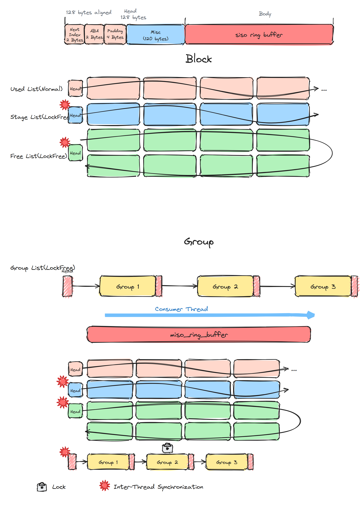

<p align="center"><em>图 11：自上而下逐层展开——每个 block 开头是 128 字节的管理区（Next 索引、ABA 标记、misc），后面原地放着一个 SISO；一个 Group 装 N 个 block，内部分 Used/Stage/Free 三条链；Group 与 Group 串成链表，唯一的消费者线程顺着链巡场。下半张图是同步点总览：爆炸记号标记了所有会发生线程间同步的位置——Free/Stage 头部的 CAS，加上 Group 节点上的 RW 锁。顺带一提：CAS 也算无锁——没有人等待、没有人持锁，输了立刻重来；它真正的代价是缓存行在核之间来回乒乓（MESI 一致性协议），这正是爆炸记号想标的成本。除此之外，没有锁。</em></p>

一个 Group 就是一整块连续内存（通常就是一个 mmap 文件），里面固定装着 N 个 block——桌面平台 16 个，移动平台 2 个。每个 block 开头是一个 C 字节的管理区（链表指针、所属链表类型、misc 数据），后面原地放着一个 SISO 对象和它的数据区。一个 block 就是一个高频线程的专属队列。

整块一次分配的好处立竿见影：

- 16 个 SISO 一次 mmap 到位，不用每个线程各自向系统要内存；
- 每个 Group 对应一个独立的 mmap 文件，头部存着 Log 配置算出来的校验和。复盘时逐 Group 校验：这个文件是不是我留下的？是，就把里面的数据捡起来；不是或者坏了，单独扔掉这个文件，别的好 Group 不受影响。数组方案做不到这种“坏哪扔哪”。

Group 和 Group 之间再串成一条链表。遍历用的是 **Hand-over-Hand（手递手）的读写自旋锁**：每个节点上挂一把 RW 锁，走到哪个节点才锁哪个节点，看完就走。新增 Group 只会被插到链表头部，只需要锁住头指针那一小块——**正在链表中段遍历的消费者完全无感**。删除 Group 时锁的也只是前驱节点。这就实现了“增删一批线程的资源，不用让全场暂停”。

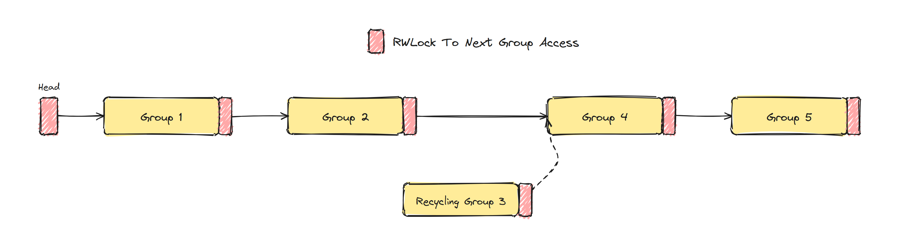

<p align="center"><em>图 12：每个 Group 节点带一把看守「下一个节点」的 RW 锁。图中 Group 3 正在被回收摘链：只需要锁住它的前驱，链表其他位置上的读遍历照常进行。</em></p>

整个 Group 空闲下来后也不会马上 free，而是先进对象池歇着，超过 1 秒没人用才真正删除——线程突发高峰过去了又回来，还能直接领回现成的内存。

### 6.2 三条链表：Free、Stage、Used

Group 内部，16 个 block 用三条链表来管。注意，链表节点不需要额外分配内存：block 是连续排列的，每个 block 的管理区里存一个 **16 位的索引**指向下一个 block，FFFF 表示空。用索引而不用指针，除了省空间，还有一个为复盘准备的好处：mmap 重新映射后基址会变，指针全废，索引却照样有效。

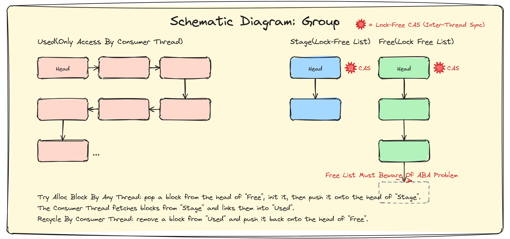

<p align="center"><em>图 13：Used 只有消费者一个线程碰；Stage 和 Free 都是无锁栈。任何线程领块：从 Free 头部摘一个，初始化后推上 Stage；消费者巡场时把 Stage 里的新块收走、接到 Used 上；块退役时再推回 Free 头部。注意右下角那句备注：Free 链必须小心 ABA 问题。</em></p>

三条链的分工是：

- **Free（空闲链）**：没主的 block。生产者要升级成 HP 时，从这里领一个。多线程并发领取，是一条无锁栈，CAS 在头部完成。
- **Stage（交接链）**：生产者领到 block、初始化好之后，把它推到这里“上架”。同样是头部 CAS 的无锁栈。
- **Used（使用链）**：消费者正在轮询的 block。**这条链只有消费者一个线程碰**，所以它就是一条普普通通的链表，连一个原子操作都不用。

为什么不砍掉 Stage，让生产者直接把 block 插进 Used？因为消费者正在 Used 上遍历啊。生产者往里面插节点，消费者同时在走，这条链的连接关系就需要非常复杂的协调才能保证不出事。有了 Stage 这个交接区，关系就理顺了：**生产者只负责“上架”，消费者巡场的时候自己把 Stage 里的新块整批取走，按自己的节奏接到 Used 上。**一个只写，一个只搬，谁也不打扰谁。

这就是这套结构最妙的地方，回过头看线程的生命周期：

- **新线程来了**：从 Free 头部 CAS 摘一个 block，初始化，CAS 推到 Stage 头部。全程没碰消费者正在遍历的任何东西，一把锁都没有。
- **线程退出或降频**：生产者给自己的 block 做个标记，下次消费者巡场时读到标记，把剩余数据消费完，再把 block 从 Used 上摘下来推回 Free。删除同样不需要锁住全场。

当然，无锁栈有个经典陷阱叫 ABA：头部从 A 变成 B 又变回 A，CAS 一看值没变就放行，其实中间链已经被别人动过了。这里的解法是把这个 32 位原子值拆成两半：低 16 位存 block 索引，高 16 位存一个每次操作都递增的 ABA 标记。值变回去没关系，标记变了就能识破。

### 6.3 别误会：领完 block 之后，热路径上什么都没有

值得强调一句：上面这些链表操作，只发生在线程升级、降级、退出、回收这些**低频时刻**。一个已经领到 block 的高频线程，日常写日志走的就是自己那条 SISO，既不会碰 Free/Stage/Used，也不会碰任何共享游标之外的东西。管理的复杂度全部摊到了 buffer 的生命周期上，而不是每条日志上。这就是“看起来复杂”和“跑起来快”可以兼得的原因。

## 7. 三个典型场景走一遍

结构讲完了，光说不练假把式。下面挑三个最容易犯迷糊的场景，从头走一遍：新线程怎么进来，老线程在高低频之间来回切换会发生什么，崩溃了怎么复盘。走完这三遍，前面那些零件就全串成一台机器了。

### 7.1 场景一：一个新的高频线程加入

某业务线程写日志写得很勤，它 TLS 里的计数器发现这一秒写够了阈值（`high_frequency_threshold_per_second`，默认 1000 条），于是要给它从 LP 升级成 HP，发一块专属 SISO。整个过程如下：

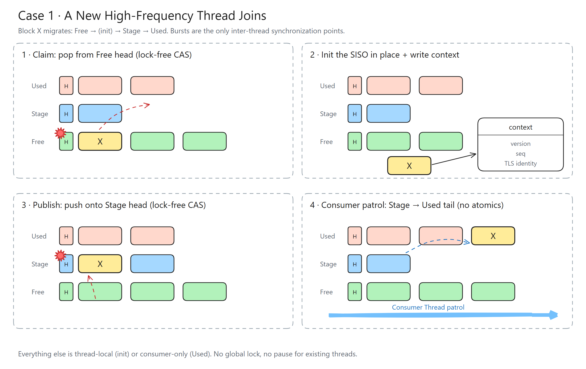

<p align="center"><em>图 14：新高频线程领块全程：从 Free 摘块、初始化、推上 Stage 上架，消费者巡场时收编进 Used。</em></p>

生产者这边就四步：

- 1. **从某个 Group 的 Free 链摘一个 block**。Free 是无锁栈，头部一次 CAS 完成。找 Group 的过程中要在 Group 链表上走一遭，带的是手递手的读锁——读锁大家共享，基本不竞争；只有所有 Group 的 block 全被领光、必须新建 Group 插到链表头部时，才在头指针上拿一下写锁，正在链表中段干活的消费者毫无知觉。
- 2. **初始化**。把 block 里的 SISO 就地建好，往管理区的 misc 里写下这份队列的 context：版本号、序号、TLS 身份。这个 16 字节的小东西是下一个场景的主角，先记住它。
- 3. **推到 Stage 链上架**。还是头部一次 CAS。
- 4. 完事，回去接着写日志。

消费者那边更懒，什么都不用做。它照常巡场，逛到这个 Group 时顺手从 Stage 摘一个块下来，核验一下 context，接到 Used 链尾部——Used 是它一个人的链表，普普通通的链表操作，连一条原子指令都用不上。

看明白 Stage 存在的意义了吧：它就是生产者和消费者之间的交接窗台。生产者只往上放，消费者只往下拿，两条链各自只有一个写入者，所以谁也不用等谁。

### 7.2 场景二：一个线程在高低频之间来回切换

这个场景藏着整套设计里最容易被忽略的坑：**顺序**。

看这个线程的一天：它先在低频期往公共 MISO 写了日志 A；然后变勤奋了，升级 HP，领块写了 B、C；后来闲下来降级，又回 LP 写了 D。

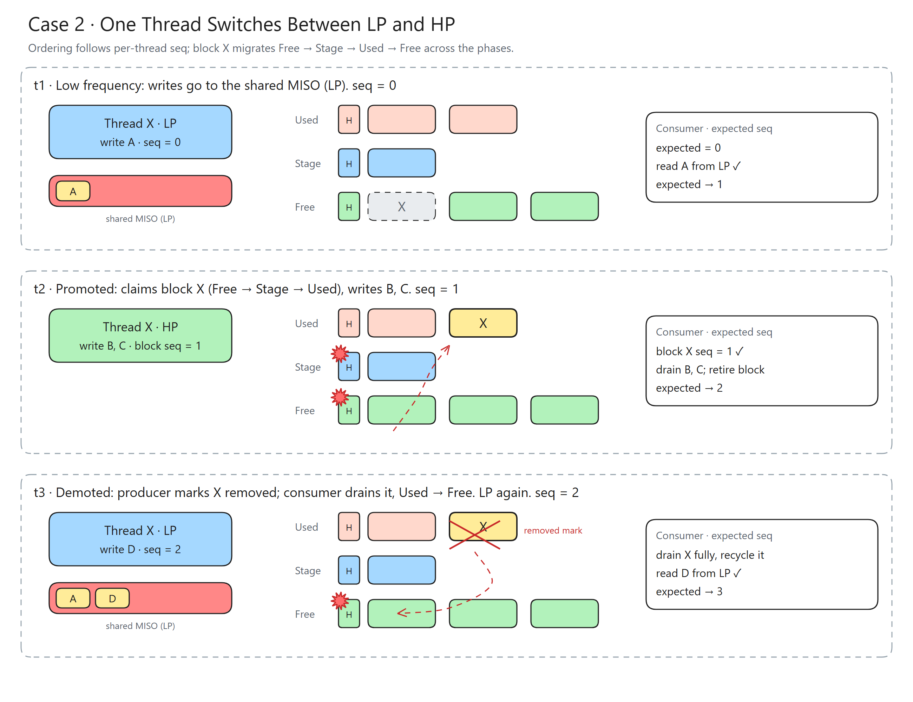

<p align="center"><em>图 15：同一个线程跨 LP/HP/LP 写下 A、B、C、D：每条队列内部有序，跨队列的顺序靠 context 序号接回来。</em></p>

每条队列内部都是有序的，但跨队列没人自动管。消费者要是先逛到 HP 的块，B、C 就跑到 A 前面去了；要是先处理公共队列，D 又可能插到 B、C 前头。日志一旦乱序，排查问题时能要人命。

加锁串行化？那等于把刚修好的路又拆了。BqLog 的办法是给每个“阶段”发一个户口——16 字节的 context：

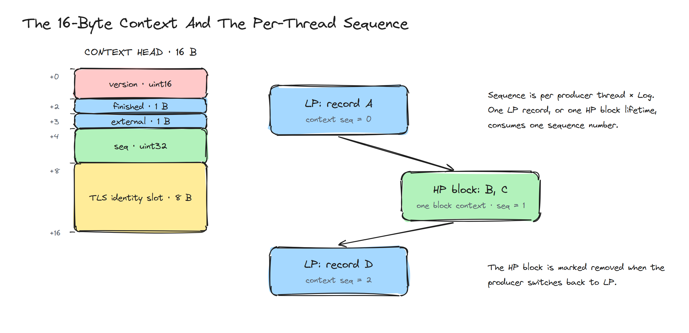

<p align="center"><em>图 16：16 字节 context 的逐字节结构；同一个生产者的每个阶段各带一个序号。</em></p>

context 里有版本号、线程结束标记、外部引用标记、序号 seq 和 TLS 身份。LP 路径上每条记录带一份；HP 路径上每个 block 存一份，块内所有消息共用。

为什么序号只记“同一个线程、同一个 Log”的阶段，而不发全局序号？全局序号意味着所有线程又去抢同一个原子变量——那不又绕回数据风暴的老路了吗。局部序号已经够用，因为消费者只需要回答一个问题：**这个线程的下一阶段数据到了没有。**

消费者为每个线程（TLS）记一个“期望序号”，规则就一条：序号对不上就先放一放。先逛到 seq=1 的 HP 块而期望还是 0？搁着，先去别处找 seq=0；消费完 A，期望变 1，回头再收这个块；块里的消息可以陆续读，但只有当生产者彻底放弃这个块、消费者把它读空，seq=1 才算翻篇，D 才轮得到上场。

这里有个微妙的地方必须分清：**“暂时读空了”和“生产者再也不会写了”是两回事。**消费者某一刻读空了 B、C 所在的块，不代表这个块这辈子读空了——生产者可能正往里写第三条。所以降级和退出都不是“拔网线”，而是留纸条：生产者给自己的块打上“已移除”标记，线程退出时往 context 里写“结束”标记；消费者巡场时读到标记，把剩余数据收干净，再把块从 Used 摘下来推回 Free。升降级全程没有锁，只有标记和约定。消费者需要的不是一个空队列，而是一个明确的交代。

对了，这也顺带解释了第一篇的一个细节：为什么日志的时间差要用 ZigZag 编码允许负数——不同线程的数据是交错进文件的，时间戳本来就不是严格递增的。

### 7.3 场景三：崩溃了，怎么复盘

最后一个场景，是 Group 这套结构真正的“大考”。BqLog 支持把缓冲区放进内存映射文件（mmap），程序崩溃后，没来得及写盘的日志还躺在文件里。重启之后怎么把它们捞回来，还要保证顺序？

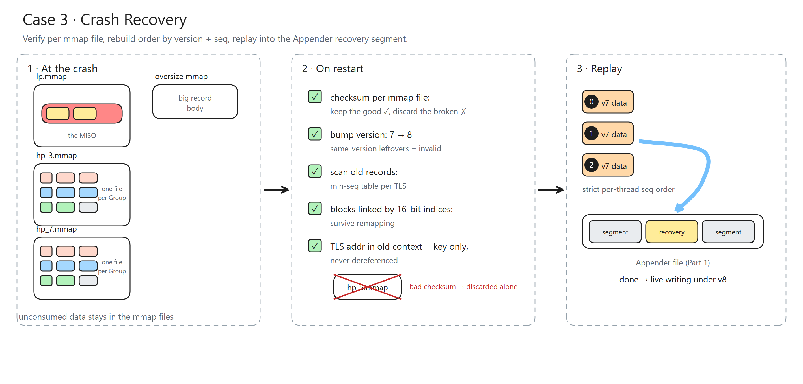

<p align="center"><em>图 17：崩溃复盘三幕：现场留在 mmap 文件里，重启后逐文件校验、作废半成品，再按 seq 严格重放。</em></p>

分三幕。

**崩溃那一刻。**公共 MISO 是一个 mmap 文件，每个 Group 各自是一个 mmap 文件，超大日志也有自己的文件。内存里的 Used/Stage/Free 链、context、没消费的数据，全部原样留在文件里。

**重启之后。**先对每个 mmap 文件算校验和：对得上，说明这是上一个自己留下的；对不上或者文件坏了，单独扔掉这一个文件，别的不受影响——这就是按 Group 分文件的红利，坏哪扔哪。接着把自己的版本号加一（比如 7 变 8），然后扫描旧数据：为每个 TLS 户口建一张最小 seq 表，同版本（也就是崩溃瞬间）留下的半成品直接作废。（能往回认的版本代数是有限的，`MAX_RECOVERY_VERSION_RANGE` 当前为 2，更久远的残余直接不认亲。）有个细节很见功力：块与块之间是用 16 位索引而不是指针连的，因为重新映射后基址变了，指针全是野指针，索引却照样有效；context 里存的 TLS 地址也一样，只当“这是哪条数据流”的 key 用，绝不真的去解引用。

**重放。**按每个线程的 seq 严格依序消费旧数据，交给 Appender 的恢复段写盘——就是第一篇讲的那个段式文件结构，恢复出来的数据走独立的段，和新日志互不干扰。旧账清完，版本 8 的实时写入正式开始。

现在回头看，Group 为什么不是一个简单数组？因为数组回答不了这些问题：哪个文件坏了、哪条数据流是谁的、崩溃时写了一半的怎么办。三条链加 context 户口，复盘才能把断掉的流水线重新接起来。

## 8. 两个补遗：超大日志和满了怎么办

### 8.1 超大日志走旁路，但顺序不走旁路

偶尔来一条比普通 ring 还大的日志（比如 dump 一大段内存），没必要为它把所有常驻缓冲都加大。BqLog 有专门的 oversize buffer 存真正的载荷，LP 里只放一条带 external-ref 标记的父记录，照样参与上面的序号排队。

提交时先提交外部载荷，再发布父记录。消费者看到父记录，按版本、TLS 身份和序号找到载荷，校验后再读。如果外部载荷申请失败了，已预留的父位置必须改成“可跳过”，序号也要修正——否则这个洞会让后面的消息一直傻等一个永远不会出现的前驱。

### 8.2 消费者追不上的时候

生产速度持续大于消费速度，任何有限的缓冲最后都会满，这不是原子技巧能绕过的，是容量守恒。这时候只有三种选择：

- `discard`：新消息直接写失败，丢掉；
- `block`：唤醒消费者，生产者等着重试；
- `expand`：LP 紧张了转 HP，HP 紧张了加 block，用更多空间换时间。

注意 expand 不是原地 realloc 正在使用的 ring——读写双方手里的地址不会突然失效，扩容扩的是“线程可以换条路走”。所以配置项 `log.buffer_size` 只是整个结构里的一块，不是进程日志系统的内存上限；HP 数量、Group 粒度、大日志、Appender 缓存和 mmap 都要单独算。

另外消费者也不是每来一条消息就被踹一脚醒一次。生产者只在空间不足或偏低时才请求唤醒，`awake_flag` 会把重复请求合并掉；后台线程有活就干，没活才等通知或超时。

## 9. 总结

从一个环形数组走到现在，这套数据总线真正省下的东西，可以对应到具体的位置：

- 连续 ring：省掉了逐条 new 节点的分配；
- 游标缓存和批量归还：省掉了大部分共享变量访问；
- MISO 的 fetch_add + 回滚：热路径上省掉了 CAS 重试，固定步骤完成分配；
- HP SISO：让高频线程连同一个写游标都不用抢，直接消灭了数据风暴的根源；
- Group + Free/Stage/Used：让线程的无锁增删和崩溃复盘同时成立；
- context 序号：用局部顺序接通各条路径，不强求全局序号；
- oversize：把少见的大记录从常驻容量里摘出去。

这些设计也不是免费的午餐：LP 的 128 字节对齐会浪费小记录的空间，HP 会多占线程本地内存，Group 的管理路径上仍有锁，背压时线程会等待。划不划算，要看你的日志频率、线程分布和消息尺寸。但在我们面对的场景里——几十上百个线程、每秒千万级日志——这套结构是目前为止交出的最好答卷。

下一篇换个视角：一条日志进入总线之后，拷贝、哈希、查表、编码、I/O 这条流水线上还有哪些重复发生的浪费，又是怎么被一点点挤掉的。

## 对照源码继续看

- [log_buffer.h](../src/bq_log/types/buffer/log_buffer.h)、[log_buffer.cpp](../src/bq_log/types/buffer/log_buffer.cpp)：TLS、context、切换顺序、大日志与回收。
- [miso_ring_buffer.cpp](../src/bq_log/types/buffer/miso_ring_buffer.cpp)、[siso_ring_buffer.h](../src/bq_log/types/buffer/siso_ring_buffer.h)、[siso_ring_buffer.cpp](../src/bq_log/types/buffer/siso_ring_buffer.cpp)：预留、发布、环尾、批读。
- [group_list.cpp](../src/bq_log/types/buffer/group_list.cpp)、[block_list.h](../src/bq_log/types/buffer/block_list.h)：连续分配和索引链。
- [bq_log_api.cpp](../src/bq_log/api/bq_log_api.cpp)、[log_worker.cpp](../src/bq_log/log/log_worker.cpp)：背压和唤醒。
- [test_log_buffer.h](../test/cpp/test_log_buffer.h)、[test_miso_ring_buffer.h](../test/cpp/test_miso_ring_buffer.h)、[test_siso_ring_buffer.h](../test/cpp/test_siso_ring_buffer.h)：现有对应测试。
