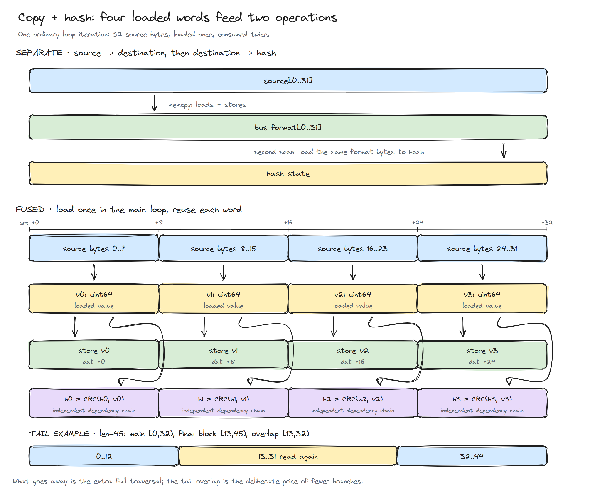
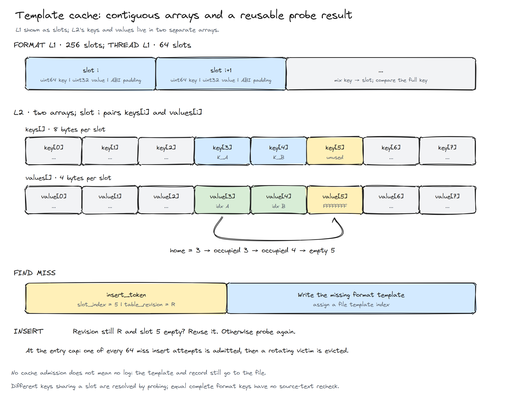
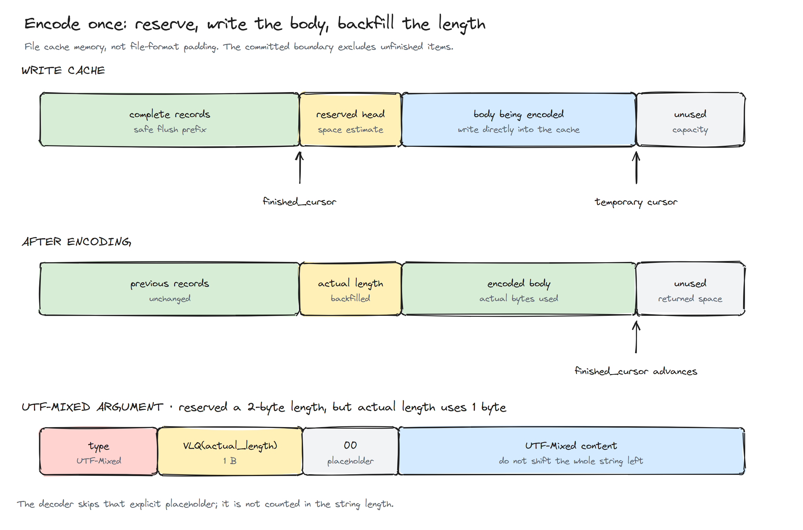

# 为何 BqLog 如此快之三：一次内存读取，能顺便做多少事情

[English](<Article 3_Why is BqLog so fast - Optimizing the Compressed Log Pipeline.MD>) · [系列目录](PERFORMANCE_DESIGN_CHS.md) · [上一篇：数据总线](<文章2_为何BqLog如此快 - 高并发环形队列.MD>)

前两篇解决了两个大问题：文件里少存重复内容，生产者高效地把消息交给消费者。做到这一步，压缩日志就够快了吗？

真跑起来才发现，很多时间花在更不起眼的地方：同一段格式字符串被从头到尾扫了三遍；哈希表查找失败后，插入又从头探了一遍；编码完发现长度字段多留了一字节，只好把后面整段字符串搬一次家；每个生产者写完一条消息，都习惯性地去通知一个明明正在干活的后台线程。

单看每一步，好像都很便宜，几十纳秒而已。可日志有个特点：**高频重复**。几十纳秒放进千万次调用里，就成了必须认真对待的开销。这一篇不发明新的文件结构，就沿着当前实现的流水线，把这些重复发生的浪费一个一个揪出来。

> 本文对应 BqLog 2.5.0。文中的简化伪码用于解释思路，实际分支以文末列出的源码为准。

## 1. 先给一条日志列一张“工作账单”

假设业务执行：

```cpp
log.info("player {} enters level {}", player_id, level_id);
```

在当前异步压缩路径上，它大致要经历：

```text
判断级别和分类是否启用
计算格式与参数所需空间
向总线申请内存
复制格式和参数
提交记录
消费端查找格式模板和线程模板
编码时间差、索引和参数
进入文件写缓存
按批次处理并输出
```

每一步看起来都少不了。但注意，**“必须得到这个结果”不等于“必须单独遍历一次去算它”**。

比如我们要把格式字符串复制进总线，也要算它的哈希。拷贝的时候字符都已经读进寄存器了，能不能顺手用同一份值把哈希也算了，而不是等会儿再把同一段内存读一遍？

再比如第一次查表没找到模板，探测过程其实已经发现了一个可以插入的空槽。为什么写完模板之后，还要从头再探一次？

这一篇的优化全是这种路数。想找到它们，光盯着总耗时没用，得沿着“数据从哪来、被谁读、读完用来干什么”一路追下去。下面就按这个顺序来。

## 2. 最便宜的日志，是序列化之前就知道不用写的那条

如果这条日志的级别或分类被过滤掉了，先拼好字符串、算完长度、申请完缓冲，再决定不输出——前面的活全白干了。

所以 C++ wrapper 在进入序列化之前，先查级别 bitmap 和分类 mask。这个判断的数据量很小，和后面的变长内容比起来，几乎不要钱，越早做越赚。尤其是一个 Log 挂了多个 Appender 的时候，可以先用合并后的启用信息粗判一次，明显没人要输出的日志直接挡在门外，各 Appender 再做自己的精确过滤。

不过这里有个调用语义要说清楚。参数表达式是在进入函数**之前**求值的：

```cpp
log.debug("state={}", build_expensive_state_string());
```

就算 debug 最后被过滤，`build_expensive_state_string()` 也已经执行完了。日志库内部的提前过滤，没法替调用方撤销这个表达式的成本。如果构造参数本身就很贵，得在调用方那边先做启用判断。

这跟后面很多优化是一个道理：**先把“活到底在哪一刻发生”搞清楚，才知道某个“零开销”到底覆盖了哪一段。**

## 3. 长度和布局，能确定一次就别算第二次

固定大小的参数很好对付：int32、double、bool 占多少字节，类型一确定就知道了，运行时不用再看内容。

字符串就麻烦了：有的对象自带 size，有的只给一根零结尾指针，有的是编译器能认出来的字面量。把它们一股脑全退化成 strlen，等于把已有的信息全扔了。

当前 wrapper 的字符串辅助层按类型分路：能识别出字面量的，编译器可能直接把长度折叠成常量；已有 size 的对象，直接取长度；只有那种除了一根指针啥都没有的字符串，才真的去扫。

参数布局也是同样的思路：`size_seq` 把编译期能确定的部分和必须运行时确定的部分放在一起，一次得到各参数尺寸和总尺寸，然后直接在目标记录里按顺序序列化。

假设参数是 int32、double 和一个长度为 n 的字符串，我们要算的只是：固定头部 + 几个固定参数区 + n + 对齐成本。一次搞定。**不需要为每个参数先建一条临时对象链或临时字节数组，最后再拼成总线消息。**

这类优化画不出什么“惊人算法”的图，但它减少了常见调用要穿过的层数。核心思想就一句话：**已知长度和已知类型要尽量一路传到最终写入位置，别中途弄丢了，再在下一层重新猜一遍。**

## 4. 拷贝的时候顺手把哈希算了

异步日志必须保证：原格式字符串失效以后，数据还能用。所以数据得拷进总线。压缩 Appender 又要识别相同格式，所以需要哈希。

最直观的写法是：

```cpp
memcpy(destination, source, length);
hash = hash_bytes(destination, length);
```

或者把后一步挪到消费者线程去做。挪线程只是换了个人干活，第二遍读取一遍都没少。

当前 `__api_log_write_begin` 对有直接地址的 UTF-8／UTF-16 格式字符串，用的是融合函数：

```cpp
head->format_hash = bq::util::bq_memcpy_with_hash(
    handle.format_data_addr, format_str_data, format_str_bytes_len);
```

要判断它是不是真融合了，不能停在函数名上，得进循环里看。



<p align="center"><em>图 1：32 字节普通循环一次得到四个 64 位值，同一份值既写进目标内存，也用于更新 CRC。下方还画出了长度 45 时的尾部重叠。</em></p>

它的主体可以简化成这样：

```cpp
// 示意：生产实现包含长度分支、硬件选择和尾部处理
load_8_bytes(v0, source + 0);
load_8_bytes(v1, source + 8);
load_8_bytes(v2, source + 16);
load_8_bytes(v3, source + 24);

store_8_bytes(destination + 0, v0);
store_8_bytes(destination + 8, v1);
store_8_bytes(destination + 16, v2);
store_8_bytes(destination + 24, v3);

h0 = crc_update(h0, v0);
h1 = crc_update(h1, v1);
h2 = crc_update(h2, v2);
h3 = crc_update(h3, v3);
```

关键不在“hash 和 memcpy 写在相邻两行”，而在于它们**真的用的是同一批 v0..v3**。编译器把这些值留在寄存器里，哈希部分就不用再对同一段字符串发出一整轮加载。一趟内存读取，两份产出。

另外，固定 8 字节的 memcpy 并不等于调用一个复杂的库函数，编译器一般会把它降成目标平台上几条简单的载入、存储指令，还顺便避开了源码直接做不对齐指针访问的麻烦。

### 4.1 为什么不用一个 CRC 累加器从头算到尾

如果所有 64 位字都更新同一个状态：

```text
h = crc(h, v0)
h = crc(h, v1)
h = crc(h, v2)
h = crc(h, v3)
```

后一次依赖前一次的结果，处理器就算有能力并行执行别的指令，这一条依赖链也只能干等。所以这里用了四个独立状态，让四条依赖链交错着跑，最后再混合成一个 64 位结果。

这不是“一条向量 CRC 指令同时处理所有字节”，而是指令级并行：同一个循环里，有些状态更新可以在别的状态还没算完时就准备执行。硬件 CRC 和软件回退各自实现，融合拷贝和纯哈希共用同一套核心逻辑。

### 4.2 为了少几个尾部分支，允许少量重读

长度不是 32 的倍数怎么办？一种办法是循环结束后再判断剩余 16、8、4、2、1 字节，一层一层处理，分支一大堆。另一种办法干脆利落：从整个字符串的末尾向前取最后 32 字节。

长度 45 时，主循环处理 [0,32)，尾部处理 [13,45)，中间 [13,32) 被重读了一次。拷贝到相同的目标偏移，结果不变；哈希算法也把这种重叠当作定义的一部分。几个字节的重读，换掉一串分支，值。

所以这项优化的准确说法是：**取消额外的一次全长遍历，复用每个处理块已经载入的值。**不是说任何长度下每个字节恰好只读一次，更不是内存总线流量必然减半——原来那第二遍很可能本来就命中 L1。但它实打实减少了加载指令、循环控制和访问压力，至于赚多少，测了才知道。

### 4.3 算好的哈希必须跟着消息一起走

生产者这边算好了，消费者不知道，那就白算了——它会自己再算一遍。所以 40 字节的日志头里专门留了一个 `format_hash` 字段，随记录一起发布。

消费端看到这个字段非零就直接用；为零就回到普通的纯哈希路径。毕竟拼接调用栈、wrapper 自己填格式、某些编码转换这些路径，未必能在 begin 阶段提供直接地址，后备计算还是有存在的意义。

各个语言 wrapper 的覆盖程度也不一样：Go 的融合 native 接口会把格式地址交给 begin；JNI、NAPI 这些路径要按各自的数据取得方式单独看。另外，真正的零值哈希也会落进重算路径，别误会成“这条日志没了”。

最后说一句这个哈希的成色：它是多条 CRC 状态组合出来的 64 位运行时 key，不是密码学摘要，也不能光凭名字当成标准 CRC64，不同架构的 CRC 指令路径得分别核对。它不写入文件——读文件这件事，不依赖当初那台机器算出来的哈希值。

## 5. 模板查找：先想清楚访问模式，再决定哈希表长什么样

格式哈希算完，下一步是找模板索引。最省事的写法是掏一个通用 hash map：查询，没找到就插入。

通用容器能解决很多问题，但日志模板有自己的脾气：**少量热点反复出现，连续多条记录往往来自同一个线程，value 只是个整数索引。**没必要每次都从通用容器最完整的那条路径走起。

所以当前 Appender 用了两级结构：先过很小的 L1，再过有界的 L2。格式 L1 有 256 个槽，线程 L1 有 64 个槽。L1 是直接映射：key 混合一下选槽位，比对完整 key，命中就拿到索引；不同的 key 撞在同一个槽，回 L2 查完再顺手更新 L1。绝大多数热点查找，一步就到。

线程那边还有一个比 L1 更偷懒的判断：**这次线程 ID 跟上次是不是同一个？**是，就直接用上次的线程模板索引。第二篇讲过的 SISO batch 恰好容易带来一长串同线程的记录，这个检查就有了实打实的意义。

格式 key 是把字符串哈希、分类和级别组合起来的：

```cpp
key = format_hash ^ ((uint64_t(category_index) << 32) | level);
```

同一个字符串用在不同分类或级别，必须得到不同模板。这是模板的逻辑组成，不能只按字符串内容查。



<p align="center"><em>图 2：L2 的 keys 和 values 是两个连续数组；查找走过的空槽位置，可以交给后续插入复用。</em></p>

## 6. 少一次指针跳转，少一遍重复探测

### 6.1 为什么 keys 和 values 要分开存

L2 用开放寻址加线性探测，key 是 uint64，value 是 uint32。写成普通的 struct 数组，对齐一补齐，每项就要占 16 字节；拆成 `keys[]` 和 `values[]` 两个数组后，主体是每槽 12 字节。

拆开还有个好处：不用为每条记录单独 new 节点，探测时访问的是相邻槽位，局部性保住了。代价是同一槽的 key 和 value 分处两个数组，到底快不快要看实际访问和缓存情况，但至少内存账是明明白白的。

这笔账其实不小：默认格式上限 100000 条、约 50% 装载率，数组容量向 2 的幂扩展后可能达到 262144 槽，主体约 3 MiB。这还只是这一张 L2 表，没算 L1、allocator、扩容时新旧两份表并存、以及其他 Log 的缓存。拿“每项 12 字节”直接乘条目数，是会低估内存的。

### 6.2 查找已经走到了空槽，插入凭什么再走一遍

假设 key 的家在 3 号槽：

```text
slot 3: 被别的 key 占了
slot 4: 被别的 key 占了
slot 5: 空
```

查询失败时，我们已经亲眼看到 5 是空的。可普通接口只有 `find(key)` 和 `insert(key, value)`，等 Appender 把模板写进文件再回来插入，刚才那段探测就得原样再来一遍。

当前的 `find` 会返回一个 `insert_token`：槽位号加上 `table_revision`。只要这期间表没扩容、没删除、没别的修改，槽还是空的，`insert` 就直接用这个 token 落位；revision 对不上，就老老实实重新查。

看起来只是多带了两个小整数，但在稳定的 miss 路径上，它消掉了一整遍重复探测。这种优化不需要突破什么理论极限，**只需要让上一步得到的信息别白白丢掉。**

### 6.3 为什么槽位 hash 还要再搅一遍

格式内容的哈希和最终选槽位的哈希不是一回事。输入可能是对齐过的线程 ID，也可能把分类值放在高位——直接拿低位去 mask，某些输入会成片地挤在同一小片区域里。

当前选槽前先过一遍 Murmur3 的 fmix64 finalizer，再取混合后的高位。目的很朴素：把输入每一位的信息都搅进槽位计算里，减少这类结构化 key 的聚集。它不承诺“任意敌对输入都构造不出长探测链”，防攻击不是这里的课题。

还要区分两件事：“不同 key 撞同一个槽”和“不同格式算出完全相同的 64 位 key”。前者靠比较和探测就能正确处理；后者目前不会再用原始格式字符串二次核对。这是实现里的一个哈希假设，不能拿“64 位很大”来顶替严格的碰撞证明。把它放在性能优化里讲，是因为省掉字符串比较本身就是这笔交易的一部分。

## 7. 缓存满了以后，有时候不该立刻收下新条目

想象缓存能放 100 个模板，但日志按顺序循环访问 101 个。如果每次 miss 都立刻淘汰一个旧条目，一圈转下来，马上要用的那条恰好又被换掉了——缓存全程白忙。另一个常见场景更狠：一次扫描涌进来几万个只出现一次的动态格式，原来天天用的热点被全挤走了。

缓存又不是文件的唯一真相，没必要保证每个新模板都必须常驻。当前 L2 满了以后，**每 64 次新插入尝试才接纳一次**，淘汰谁用轮转位置决定。这样一轮扫描冲进来，热点集合最多被换掉零星的几个。

这里说的“不接纳”只是**不留进 L2**：格式模板和日志照样写进文件，L1 也可能留着最近的映射。下次再遇到被忘掉的格式，最多重新写一份模板，文件大一点点，日志一条不丢。

这又是一笔三方交易：内存上限、CPU 成本、文件大小。全收会抖动，不收会重复，采样接纳让两头之间有个可控的挡位。它不是 LRU，也不吹自己对每种热点迁移都最优，但对这个场景，够用了。

扩容的姿势也值得一提：先申请新数组、迁移已有项、再释放旧数组；申请失败就保留旧内容继续用。缓存分配失败不该演变成“已有索引状态丢失”的事故。当然，迁移瞬间新旧两份并存的内存峰值，也得算进预算里。

## 8. UTF-16 优化：别把每个字符都当成最复杂的那种

第一篇讲过 UTF-Mixed 的格式：先把 ASCII 收窄，遇到不适合快速处理的内容，就存 UTF-16 后缀。这一节看它具体怎么跑。

标量版本一次把四个 UTF-16 字符读进一个 64 位值，用掩码检查各字符的高字节和第 7 位：

```text
v & 0xFF80FF80FF80FF80
```

结果是零，说明四个字符全在 ASCII 范围，直接把低字节抽出来打包。一次载入，既做了判定，又做了打包——还是那个“读进来以后多做一点”的思路。

SIMD 把同样的思路扩展到更多字符：一次载入多个向量，合并判断含不含非 ASCII，大概率路径直接窄化存储；真有复杂字符的块，再退到一般处理。SSE、AVX2、NEON 的指令各不相同，但目的是同一个。


<p align="center"><em>图 3：值不值得完整转码，要同时看结果字节数和当下的转换工作量，不能只盯压缩率。</em></p>

日志格式串通常有很长的英文固定前缀，快速路径很容易赚到。中文或其他非 ASCII 字符出现得很早时，UTF-Mixed 可能留下较长的 UTF-16 后缀——这不是 bug，这正是“选择少做转换”的题中之义。

还有一层收益别漏掉：模板命中之后，同一格式不用每条日志都重新转一次。但参数字符串是每次都在变的，照样要处理，模板复用的效果可不能套到参数头上。

续写旧文件时还有个冷知识：为了恢复原始 UTF-16 格式的哈希，需要把 UTF-Mixed 还原到临时缓冲再算 hash。这里确实有额外读取，但它发生在文件打开和扫描的冷路径上。**把冷路径和每条记录的热路径混为一谈，优化讨论就没法进行了。**

## 9. 变长编码还能少走一遍：先写正文，最后填长度

第一篇讲过，item 前面要写 body 长度。直觉做法是先算出最终长度，写头，再写 body。可最终长度受整数 VLQ、字符串编码影响，想事先精确知道它，常常得把所有参数先遍历一遍。

如果遍历完再真正编码，同一套判断就做了两遍。

当前 Appender 的做法是：先保守估计一段空间，从写缓存里申请下来，**留出头的位置，直接写 body**。编码结束时指针停在哪儿，真实长度就是多少，回头把长度字段填上。



<p align="center"><em>图 4：绿色是已经完整写完的记录，蓝色是正在编码的正文。finished_cursor 只推进到完整记录的结束处。</em></p>

这里还会冒出一个有趣的小问题：估计的长度 VLQ 需要两字节，真正编码完发现一字节就够了，怎么办？

最耿直的办法是把后面整个 body 左移一字节。可是为了省一个字节，把整段字符串再读写一遍，怎么算都亏。所以 UTF-Mixed 参数路径允许留下一个 `00` 占位，decoder 知道这里有这条规矩，读到就跳过。

注意这不是哪儿都能随便插 `00`，也不能跟字符串里合法的空字符混淆。它只发生在特定的预留长度差异处，由对应的 decoder 明确处理。

格式模板的估算要是不满足头部长度条件，也可能撤销本次预留重来。所以不能吹“整个编码过程永远只过一遍”，准确的说法是：**常见情况下，不需要先精确测量、再完整重写。**

`mark_write_finished()` 负责把另一对容易混淆的东西分开：“当前写到哪儿”和“已有多少完整数据可以刷出去”。恢复或 flush 的时候，绝不能把刚写了半个的 item 当成完整日志处理。

## 10. 缓存对齐与批量 I/O：把最后一段开销摊薄

一条日志几十字节，逐条调文件写入接口，固定成本会非常扎眼。Appender 的写缓存把很多条记录连续编码在一起，攒成批次再输出。

`write_cache_size` 可以调目标缓存，当前范围 64 KiB–4 MiB，按 2 的幂规整。更大的缓存能减少写调用次数，但也更占内存，还意味着更多“还没刷出去”的数据——不能只追吞吐，对这些影响装看不见。

一条特别大的记录仍然可能让临时分配超过目标值，所以这个配置也不是绝对的内存硬上限。它和第二篇里总线的 LP/HP 容量是两个层次的东西，调一个不会自动带上另一个。

对齐在这里也有实在的用处。加密 payload 按块循环异或，源数据和掩码按对应偏移读取：两者相对对齐一致，就容易走整块 SIMD 循环；不一致，就得多一堆头尾处理。Appender 会根据文件偏移调整写缓存的 padding，而不是天真地假设“缓冲首地址对齐了就永远没事”。

当然，调 padding 本身可能触发 memmove。所以要让这类操作发生在必要的边界上，而不是每条记录都来回调。性能来自整条路径减少重复，不是代码里一个 memcpy、memmove 都见不到。

## 11. 加密为什么看起来便宜：贵的活发生在什么频率上

当前实现既不是每条日志做一次 RSA，也不是把 payload 逐条喂给 AES。第一篇画了分段结构，这里把它当成一个成本模型来读：

```text
总成本 ≈ 段数 × 每段初始化成本
       + payload 字节数 × 稳定变换成本
       + 批次数 × I/O 固定成本
```

段初始化包括 RSA 包装 AES 密钥、AES 处理 32 KiB 掩码；后续 payload 在原地按批循环 XOR。段足够长、消息足够多，初始化就被摊薄了；频繁创建短段，就未必。


<p align="center"><em>图 5：把算法名称换成「执行次数 × 每次工作量」，就能看出为什么分段粒度和批次大小会影响结果。</em></p>

公开的单线程用例里，压缩 79 ms，加密压缩 83 ms；10 线程用例则是 759 ms 对 995 ms。只拿前一组数字出来说“加密近乎零开销”，是以偏概全——并发、缓存、消费速度、数据规模和一次性工作，都会改变各项的占比。

安全性质也得说准确：这是自定义的 RSA/AES/循环掩码方案，没有 AEAD 认证标签，掩码复用更不是一次一密。热路径便宜，不等于顺手拿到了认证加密的全部保证；要防篡改，得另外加机制。

## 12. 唤醒一个线程，也是要花时间的

还有一项经常被忽略的开销：生产者写完数据，习惯性地 notify 一下消费者。单线程低频时看不出问题，多线程高频时，几十个生产者可能反复争抢同一个通知状态和 mutex——而消费者本来就在干活，根本用不着你喊。

当前 API 只在空间不足或剩余空间偏低时才请求唤醒，`awake_flag` 负责把重复请求合并掉。后台线程有活就继续消费，空闲了才等通知或超时。于是逐条 commit 不再各自对应一次系统通知。

这里同样有吞吐和时延的取舍：低频消息不一定立刻进文件，后台的空闲等待和 Appender 的刷新间隔要放在一起看。从“通知更少”推导不出“更实时”，更不能把某个等待参数当成尾延迟的保证书。

顺带一提，线程 ID、线程名也会通过 TLS 缓存，避免每条日志都去调系统接口；消费者那边“上一次线程”的快捷索引，则进一步吃到了批读的局部性红利。小状态的复用，贯穿了整条流水线。

## 13. 怎么知道优化是真有效，而不是只看起来聪明

看到融合拷贝就说“肯定快两倍”，看到 SIMD 就说“向量宽一倍就快一倍”，看到 hash map 命中就说“常数时间等于不要钱”——这些判断都太草率了。

靠谱的做法是把对照实验缩小到“能回答一个问题”的范围：

| 想验证的变化 | 对照方式 | 同时检查 |
|---|---|---|
| 融合拷贝哈希 | 同一哈希算法，融合 vs 拷贝后独立 hash | 数据相同、长度、对齐、冷热缓存 |
| 四条 CRC 链 | 相同输入的单链与多链实现 | 指令生成、结果定义、处理器差异 |
| 缓存布局 | 相同容量与输入，L1/L2 路径 | CPU、命中率、内存和模板重复 |
| token 复用 | 相同 miss 序列，是否复用探测位置 | 扩容和修改后是否正确失效 |
| UTF-Mixed | 英文、中文、混合内容 | 耗时、体积与解码正确性 |
| 批量写出 | 相同输出和丢弃策略，调整缓存大小 | I/O、RSS、调用时延与 flush 时间 |

整体压测还要统计最后真正解码出了多少条日志。一个队列默认满了就丢，另一个默认阻塞，直接比“产生调用的速度”，很可能把“少写了内容”误当成“实现更快”。

test_utils.h 已经包含不同长度和偏移下拷贝／hash 的一致性检查，test_bounded_hash_cache.h 覆盖了 token 失效、容量和分配失败，test_compressed_cache.h 把缓存行为和实际可解码输出连了起来。它们帮我们确认优化没有改变结果——但要每个改动各自的性能贡献，还得靠上面那种对照实验。

## 14. 收尾：这条主线其实很朴素

回看整篇，没有哪一步要求把工作量变成零。

格式串还是要存，哈希还是要算，模板还是要查，文件还是要写。变化的只有一件事：**尽量不为同一个结果付两次钱。**

长度已经知道，就不再扫一遍；数据已经载入，就顺手把拷贝和哈希一起做了；查找已经走到空槽，就把这个位置带给插入；模板已存在，就不再转换重写；数据要落盘，就攒成合适的批次；消费者正在干活，就不反复踹它。

真正有意义的性能优化，往往不是把某个函数孤立地写到极致，而是让相邻的步骤共享彼此已有的结果。BqLog 的格式、数据总线和执行路径要放在一起看，才能明白这些收益是怎么一层一层叠起来的。

## 对照源码继续看

- [bq_log_impl.h](../include/bq_log/misc/bq_log_impl.h)、[bq_log_wrapper_tools.h](../include/bq_log/misc/bq_log_wrapper_tools.h)：提前过滤、长度与参数布局。
- [util.cpp](../src/bq_common/utils/util.cpp)：融合拷贝哈希、CRC 多链与 UTF-Mixed。
- [bq_log_api.cpp](../src/bq_log/api/bq_log_api.cpp)、[bq_log_go.cpp](../src/bq_log/api/bq_log_go.cpp)：format_hash、native 调用与总线提交。
- [appender_file_compressed.cpp](../src/bq_log/log/appender/appender_file_compressed.cpp)、[bounded_hash_cache.h](../src/bq_log/types/bounded_hash_cache.h)：缓存、token、编码和回填。
- [appender_file_base.cpp](../src/bq_log/log/appender/appender_file_base.cpp)、[appender_file_binary.cpp](../src/bq_log/log/appender/appender_file_binary.cpp)：写缓存、相对对齐、分段与加密。
- [test_utils.h](../test/cpp/bq_common_test/test_utils.h)、[test_bounded_hash_cache.h](../test/cpp/test_bounded_hash_cache.h)、[test_compressed_cache.h](../test/cpp/test_compressed_cache.h)：对应正确性检查。
